# 🎬 L'IA d'Apple en Chine, Grok 4.6 et 1 MILLIARD d'utilisateurs pour Google : GROSSE ACTU IA

> **Chaîne** : [Pursuing AI](https://www.youtube.com/@PursuingAi)  
> **Titre original** : `Apple’s China AI, Grok 4.6 & Google’s 1 BILLION Users — HUGE AI NEWS`  
> **Lien YouTube** : [https://www.youtube.com/watch?v=SCodVNW0vtw](https://www.youtube.com/watch?v=SCodVNW0vtw)  
> **Date de publication** : 2026-08-17  
> **Durée** : 03m 58s (`238s`)  
> **Identifiant vidéo** : `SCodVNW0vtw`  
> **Fiche Web Interactive** : [2026-08-17_YT-SCodVNW0vtw_L'IA d'Apple en Chine, Grok 4.6 et 1 MILLIARD d'utilisateurs pour Google GROSSE _by-whisper-v3-large-turbo+gemini-3.5-flash-lite.html](2026-08-17_YT-SCodVNW0vtw_L'IA d'Apple en Chine, Grok 4.6 et 1 MILLIARD d'utilisateurs pour Google GROSSE _by-whisper-v3-large-turbo+gemini-3.5-flash-lite.html)  
> **Captures de démonstration clés** : `24 captures réelles (anti-talking-head)`  
> **Modèles utilisés** : Audio: `large-v3-turbo` (Faster-Whisper int8 VPS) | Vision: `gemini-3.5-flash-lite` (Google AI Studio API)  

---

## 📌 Synthèse Exécutive & Outils

### 📌 Résumé

Le paysage de l'intelligence artificielle générative franchit un nouveau cap stratégique, marqué par une expansion géopolitique complexe, une conformité réglementaire accrue et une course effrénée vers l'autonomie des agents. Dans cette vidéo, Pursuing AI décrypte l'actualité bouillante du secteur, révélant comment les géants de la tech redéfinissent leurs priorités entre adaptation locale, exigences légales européennes et industrialisation de masse. L'analyse met en lumière la nécessité pour Apple de s'associer localement pour exister en Chine, la réponse d'Anthropic aux contraintes de l'UE sur la traçabilité des contenus, ainsi que le virage majeur pris par xAI et Google vers des agents conversationnels capables de planifier et d'exécuter des flux de travail complexes et multi-étapes.

Pour les créateurs de contenu vidéo, cette mutation technologique offre des perspectives inédites en matière d'automatisation et de productivité. L'essor de modèles hautement spécialisés, comme le codage agentique abordable et la génération visuelle à grande échelle, permet d'envisager la création de workflows de production entièrement automatisés. En s'appuyant sur des outils d'IA capables non seulement de répondre mais d'agir — de l'écriture de scripts à la manipulation de bases de code —, les créateurs peuvent optimiser leurs processus créatifs, réduire leurs coûts opérationnels et industrialiser la diffusion de contenus adaptés à des audiences mondiales.

### 🛠️ Outils, Modèles & Logiciels Présentés

*   **Claude (Anthropic)** : Modèle d'intelligence artificielle textuelle intégrant désormais un filigrane (watermark) pour se conformer à la loi européenne sur l'IA (EU AI Act) et garantir la traçabilité des contenus générés.
*   **Modèle Chine d'Apple** : Modèle d'IA développé sur mesure par Apple avec l'aide d'Alibaba pour s'intégrer à Apple Intelligence et contourner les restrictions d'accès aux chatbots occidentaux en Chine continentale.
*   **Grok 4.6 (xAI)** : Modèle avancé axé sur les agents IA à longue durée d'exécution, capable d'effectuer des recherches complexes, du codage de bout en bout et de transformer des idées en applications visuelles.
*   **Gemini 3.7 Flash (Google)** : Modèle ultra-rapide et économique optimisé pour le codage, le débogage et l'exécution de tâches autonomes en plusieurs étapes, proposé à tarif réduit pour les entreprises.
*   **Application Gemini (Google)** : Écosystème grand public multi-modal ayant dépassé le milliard d'utilisateurs actifs mensuels, intégrant de la génération d'images à grande échelle et une forte utilisation vocale.
*   **Flux** : Outil ou composant technologique mentionné dans l'écosystème de production, servant à structurer l'enchaînement des tâches et des flux de travail automatisés.

### 🔑 Points Clés & Enseignements Stratégiques

*   **Adaptation géopolitique incontournable** : Apple démontre qu'une stratégie d'IA globale nécessite des adaptations locales strictes, illustrée par son partenariat avec Alibaba pour pénétrer le marché fermé de la Chine continentale.
*   **Conformité réglementaire proactive** : L'intégration d'un filigrane par Anthropic sur Claude anticipe les exigences strictes de l'EU AI Act, prouvant que la régulation européenne redéfinit les standards mondiaux du développement de l'IA.
*   **Transition du chatbot vers l'agent autonome** : Avec Grok 4.6, xAI marque un tournant où l'IA ne se contente plus de répondre instantanément, mais exécute des tâches complexes et interactives en plusieurs étapes sur la durée.
*   **Performance des benchmarks agentiques** : Les nouveaux modèles se distinguent par leur capacité à rivaliser au sommet des indices de travail intellectuel et de codage, s'alignant sur les performances des meilleurs standards du marché comme GPT 5.6 Sol.
*   **Démocratisation des modèles économiques** : Google casse les prix avec Gemini 3.7 Flash, facturé à moitié prix (0,75 $ par million de jetons d'entrée), rendant l'IA agentique hautement accessible pour le développement d'applications d'entreprise.
*   **Puissance de frappe par l'échelle** : Atteindre un milliard d'utilisateurs actifs mensuels permet à Google de collecter un volume de données inestimable et de propulser des usages massifs (150 millions d'images générées par jour).
*   **Omniprésence des interactions vocales** : L'adoption de Gemini montre que 63 % des utilisateurs privilégient la voix, soulignant l'importance pour les créateurs de concevoir des contenus et des interfaces adaptés à l'audio.
*   **Industrialisation des flux de travail** : Les créateurs de vidéo doivent intégrer l'idée que l'IA devient un opérateur autonome capable de gérer des bases de code et des processus de production entiers, réduisant drastiquement le temps de fabrication.
*   **Stratégie de tarification agressive** : La cadence de sortie rapide de Google (trois semaines entre la version 3.6 et 3.7 Flash) illustre une guerre des prix agressive visant à verrouiller le marché des développeurs et des entreprises.
*   **Évolution de la proposition de valeur** : La course à l'IA ne se résume plus à posséder le modèle le plus intelligent, mais à celui qui sait l'injecter massivement entre les mains du plus grand nombre pour accomplir des tâches réelles et utiles.

---

## ⏱️ Chronologie & Transcription Complète Audio & Visuelle (Mot pour Mot)

### ⏱️ `[00:00:00 - 00:00:18]` | Segment #01

**🔊 Audio (Transcription Intégrale Mot pour Mot en Français) :**
> Apple construit un nouveau modèle d'IA spécifiquement pour la Chine, Anthropic ajoute un filigrane (watermark) à Claude, et Google vient d'atteindre 1 milliard d'utilisateurs de Gemini. Et ce n'est même pas la plus grande nouvelle. C'est Pursuing AI, et vous regardez le rapport de recherche. Entrons dans les plus grandes actualités sur l'IA que vous devez connaître. Commençons par Apple.

**👁️ Analyse Visuelle d'Écran (gemini-3.5-flash-lite) :**
**Interface & Outils** : Interface mobile iOS affichant une application de vocabulaire, puis publication sur le réseau social X (anciennement Twitter).

**Contenu textuel & Code** : Texte à l'écran : "Learn Vocab", caractères chinois "叶子" (leaf), et tweet de Sundar Pichai (@sundarpichai) mentionnant que @Geminiapp a atteint 1 milliard d'utilisateurs mensuels.

**Action / Démonstration** : Présentation visuelle de captures d'écran illustrant les actualités sur l'intelligence artificielle (Apple et Google Gemini).

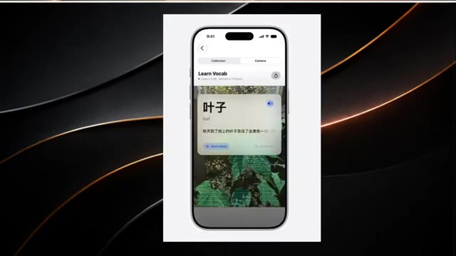
*Maquette d'un écran d'iPhone affichant une application de vocabulaire avec du texte en chinois (« 叶子 ») et sa traduction (« leaf »).*

*Capture d'écran d'un tweet de Sundar Pichai (CEO de Google) annonçant que plus d'un milliard de personnes utilisent @GeminiApp chaque mois.*

---

### ⏱️ `[00:00:18 - 00:00:39]` | Segment #02

**🔊 Audio (Transcription Intégrale Mot pour Mot en Français) :**
> Apple aurait entraîné un modèle d'IA spécial pour la Chine avec l'aide d'Alibaba. Le modèle pourrait faire partie d'Apple Intelligence, fonctionnant aux côtés des modèles QIN d'Alibaba. Et il y a une raison simple pour laquelle Apple a besoin de cela. ChatGPT et Claude ne sont pas disponibles en Chine continentale, donc Apple a besoin de sa propre stratégie d'IA pour le marché chinois.

**👁️ Analyse Visuelle d'Écran (gemini-3.5-flash-lite) :**
**Interface & Outils** : Navigateur web affichant un article d'actualité technologique sur un fond sombre.

**Contenu textuel & Code** : Titres et texte d'article de presse expliquant que l'intelligence artificielle d'Apple s'associe à Alibaba pour le marché chinois en raison de l'indisponibilité de ChatGPT et Claude en Chine continentale. On y lit également des sections "Recent Headlines".

**Action / Démonstration** : Le créateur affiche les articles de presse à l'écran pour illustrer la collaboration entre Apple et Alibaba en matière d'intelligence artificielle.

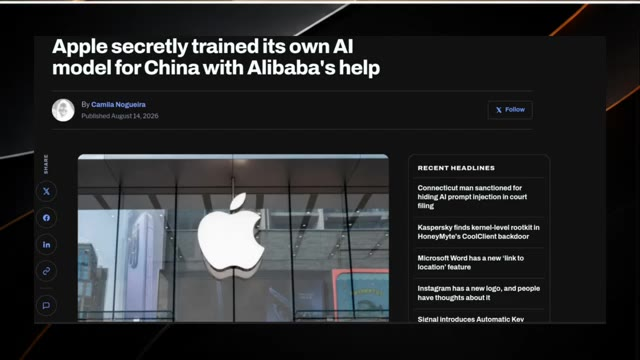
*Capture d'écran d'un article d'actualité en ligne intitulé « Apple a secrètement entraîné son propre modèle d'IA pour la Chine avec l'aide d'Alibaba » écrit par Camila Nogueira.*

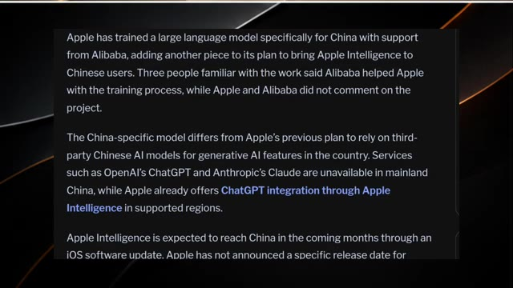
*Capture d'écran du corps d'un article détaillant l'entraînement d'un grand modèle de langage par Apple pour la Chine avec le soutien d'Alibaba.*

---

### ⏱️ `[00:00:39 - 00:00:58]` | Segment #03

**🔊 Audio (Transcription Intégrale Mot pour Mot en Français) :**
> Apple Intelligence devrait arriver en Chine via une prochaine mise à jour d'iOS, bien qu'il n'y ait toujours pas de date de lancement confirmée. Mais alors qu'Apple développe une IA pour la Chine, Anthropic fait quelque chose de complètement différent avec Claude. Limerga prévoit de filigraner le texte généré par l'IA de Claude. La raison principale ? La loi européenne sur l'intelligence artificielle (EU AI Act).

**👁️ Analyse Visuelle d'Écran (gemini-3.5-flash-lite) :**
**Interface & Outils** : Articles web, interface de navigateur web (onglets, barre d'adresse) et page de démonstration interactive sur le filigrane de texte.

**Contenu textuel & Code** : Texte sur Apple Intelligence en Chine, administration du cyberespace chinoise, modèles Qwen d'Alibaba. Puis, interface web avec des onglets de navigateur et des menus. Enfin, section intitulée "The watermark only swaps the dice" avec des options interactives ("Creative prose", "Factual recall", "Code"), un champ de prompt ("What is Isaac Newton's most important book?") et deux blocs de comparaison ("ordinary dice" vs "watermark key").

**Action / Démonstration** : Affichage d'un article textuel, mouvement de curseur sur une interface de navigateur web, puis présentation d'un schéma interactif comparant des textes générés avec ou sans filigrane.

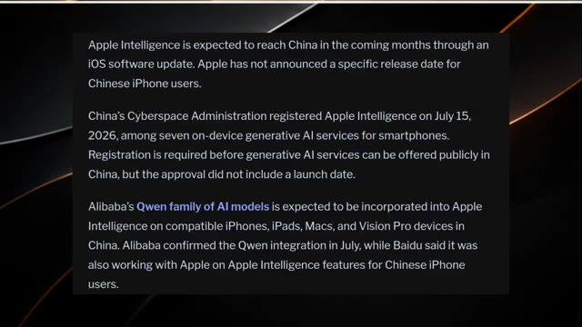
*Article d'actualité détaillant l'arrivée d'Apple Intelligence en Chine et l'intégration des modèles Qwen d'Alibaba.*

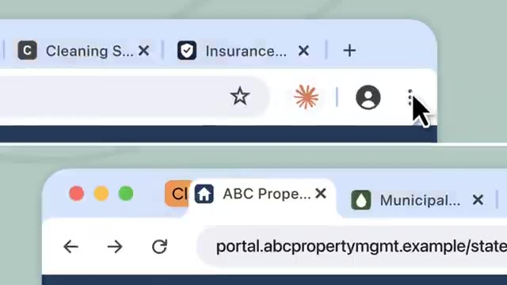
*Interface de navigateur web montrant des onglets et un curseur interagissant avec le menu contextuel.*

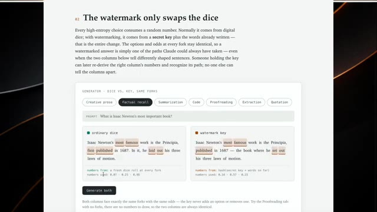
*Page web interactive illustrant le fonctionnement du filigrane textuel de Claude avec comparaison entre dés ordinaires et clé de filigrane.*

---

### ⏱️ `[00:00:58 - 00:01:22]` | Segment #04

**🔊 Audio (Transcription Intégrale Mot pour Mot en Français) :**
> Après que les utilisateurs ont commencé à remettre en question cette décision, Anthropic a publié une explication sur le fonctionnement de la technologie, incluant ses limites. Et Anthropic affirme qu'elle ne sera pas seule. D'autres grandes entreprises d'IA pourraient faire face à des exigences similaires en vertu des réglementations européennes. Mais c'est là que les choses deviennent intéressantes. Alors qu'Anthropic se concentre sur l'identification de contenus générés par l'IA, XAI essaie de faire en sorte que les agents IA effectuent davantage de travail pour vous.

**👁️ Analyse Visuelle d'Écran (gemini-3.5-flash-lite) :**
**Interface & Outils** : Page web interactive d'explication technique d'Anthropic et interface de démonstration visuelle.

**Contenu textuel & Code** : Texte sur le tatouage numérique ("The watermark only swaps the dice", "secret key"), interface de générateur avec des onglets (Creative prose, Factual recall, Summarization, Code, etc.) et comparaison entre "Ordinary dice" et "Watermark key". Sur la seconde image : "Mount Epoch", "Gradient Ridge", "Overfit Arête", "Divergence Slab".

**Action / Démonstration** : Navigation et présentation de captures d'écran illustrant les explications techniques d'Anthropic sur le filigrane textuel et les réglementations européennes.

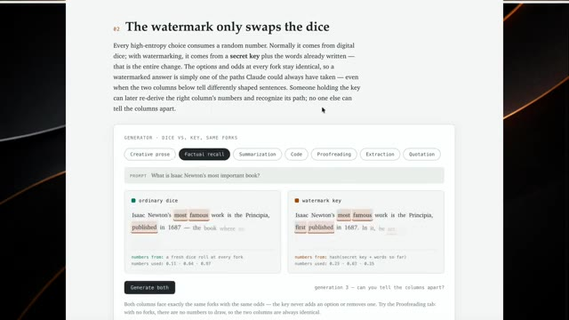
*Article explicatif d'Anthropic sur le fonctionnement du tatouage numérique avec un outil interactif de comparaison de texte.*

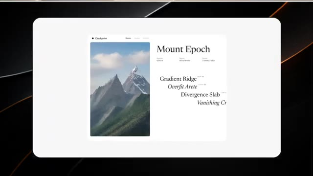
*Interface de démonstration ou de présentation montrant une image de montagne ("Mount Epoch") et des options de paramétrage.*

---

### ⏱️ `[00:01:22 - 00:01:45]` | Segment #05

**🔊 Audio (Transcription Intégrale Mot pour Mot en Français) :**
> XAI vient de sortir Grok 4.6, et il ne s'agit pas seulement de répondre à des questions. Il est construit sur Grok 4.5, mais se concentre fortement sur les agents IA à longue durée d'exécution et sur des tâches plus ambitieuses, interactives et visuelles. Grok peut travailler en plusieurs étapes, en effectuant des recherches sur un sujet, en analysant des informations, en travaillant sur l'ensemble d'une base de code, ou même en transformant une idée en une application soignée.

**👁️ Analyse Visuelle d'Écran (gemini-3.5-flash-lite) :**
**Interface & Outils** : Diapositive de présentation minimaliste aux couleurs sombres et dorées en arrière-plan, avec une carte centrale blanche.

**Contenu textuel & Code** : Le texte visible au centre de l'écran est : « The most intelligence per token ».

**Action / Démonstration** : Affichage d'une diapositive textuelle mettant en avant les performances et l'efficacité du nouveau modèle Grok.

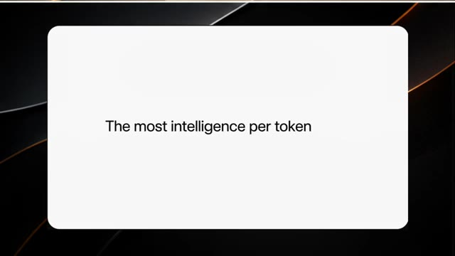
*Diapositive officielle de présentation affichant le texte « The most intelligence per token » sur fond blanc.*

---

### ⏱️ `[00:01:45 - 00:02:09]` | Segment #06

**🔊 Audio (Transcription Intégrale Mot pour Mot en Français) :**
> En gros, au lieu de vous répondre et de s'arrêter, Grok 4.6 est conçu pour continuer à travailler jusqu'à ce que le travail soit fait. Et les benchmarks sont intéressants aussi. Grok 4.6 atteint des performances de pointe sur plusieurs benchmarks de codage agentique et de travail intellectuel. Il égale également GPT 5.6 Sol sur l'indice d'intelligence Artificial Analysis, qui combine neuf benchmarks différents.

**👁️ Analyse Visuelle d'Écran (gemini-3.5-flash-lite) :**
**Interface & Outils** : Présentation visuelle de données, graphiques et tableaux de benchmarks sur fond sombre avec cadre blanc arrondi.

**Contenu textuel & Code** : Textes et listes de compétences (« Separate Refactor From Feature », « Git LFS Cache ») ainsi qu'un tableau complet de performances chiffrées comparant Grok 4.6 à d'autres modèles (Grok 4.5, GPT-5.6 Sol, Fable 5).

**Action / Démonstration** : Affichage successif des interfaces graphiques de présentation des compétences de l'agent et du tableau comparatif des benchmarks de performance.

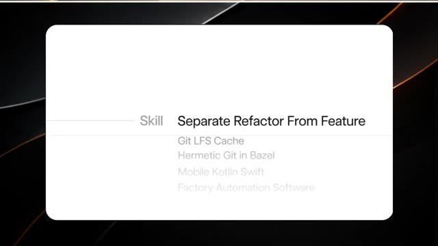
*Capture d'écran montrant une liste de compétences (Skill) incluant Separate Refactor From Feature, Git LFS Cache, Hermetic Git in Bazel, Mobile Kotlin Swift, et Factory Automation Software.*

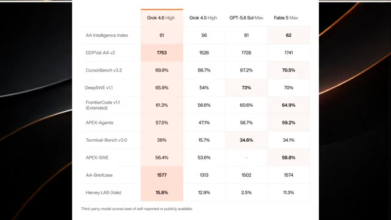
*Tableau de comparaison des benchmarks montrant les scores de Grok 4.6 High, Grok 4.5 High, GPT-5.6 Sol Max et Fable 5 Max sur différents indices comme l'AA Intelligence Index, GDPVal-AA v2, CursorBench v3.2, DeepSWE v1.1, etc.*

---

### ⏱️ `[00:02:09 - 00:02:32]` | Segment #07

**🔊 Audio (Transcription Intégrale Mot pour Mot en Français) :**
> Donc XAI n'essaie pas seulement de construire un meilleur chatbot, il essaie de construire une IA qui peut réellement faire le travail. Et Google ne veut clairement pas se faire distancer. Google vient de lancer Gemini 3.7 Flash, avec un accent majeur sur le codage et les agents IA autonomes. Google le positionne comme une option moins chère pour les entreprises qui construisent des systèmes d'IA capables de planifier des tâches, d'utiliser des outils et de compléter des flux de travail en plusieurs étapes.

**👁️ Analyse Visuelle d'Écran (gemini-3.5-flash-lite) :**
**Interface & Outils** : Tableau de benchmarks et interfaces web de démonstration de projets/applications web.

**Contenu textuel & Code** : Noms des modèles d'IA (Grok 4.6 High, Grok 4.5 High, GPT-5.6 Sol Max, Fable 5 Max), scores de benchmarks, texte « Gemini 3.7 Flash can train a robotics model », et interfaces de sites web géographiques et environnementaux.

**Action / Démonstration** : Présentation de graphiques de performance et de cas d'usage démontrant les capacités de Gemini 3.7 Flash et des agents autonomes.

*Tableau de performance comparant Grok 4.6 High, Grok 4.5 High, GPT-5.6 Sol Max et Fable 5 Max sur divers indices (AA Intelligence Index, GDPVal-AA v2, CursorBench v3.2, etc.).*

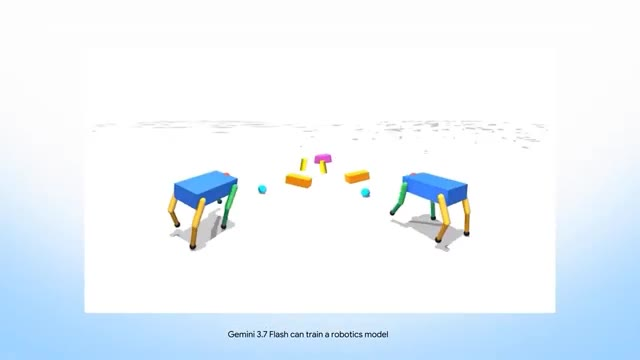
*Animation 3D montrant deux petits robots quadrupèdes (type chien robotique) évoluant dans un espace virtuel avec la mention « Gemini 3.7 Flash can train a robotics model ».*

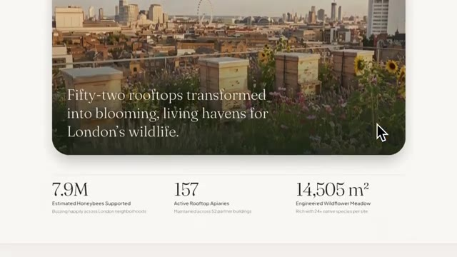
*Capture d'écran d'un site web montrant un paysage urbain de toits à Londres avec le texte « Fifty-two rooftops transformed into blooming, living havens for London's wildlife » et des statistiques clés (7.9M, 157, 14,505 m²).*

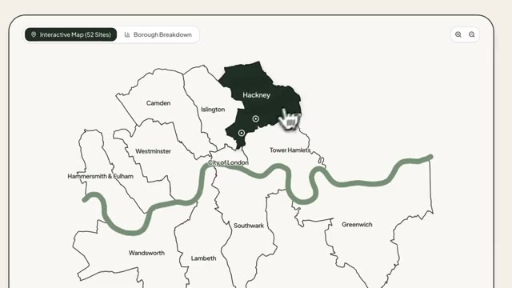
*Interface web affichant une carte interactive de Londres découpée par arrondissements (Hackney, Islington, Camden, Westminster, etc.) avec une rivière stylisée.*

---

### ⏱️ `[00:02:32 - 00:02:53]` | Segment #08

**🔊 Audio (Transcription Intégrale Mot pour Mot en Français) :**
> Et il est arrivé juste trois semaines après Gemini 3.6 Flash. Google affirme que le nouveau modèle s'améliore en matière de débogage, de correction des problèmes et de génération de code prêt pour la production. Mais voici la partie folle. Google le propose pour seulement 0,75 dollar par million de jetons d'entrée et 3,75 dollars par million de jetons de sortie jusqu'à la fin de l'année.

**👁️ Analyse Visuelle d'Écran (gemini-3.5-flash-lite) :**
**Interface & Outils** : Navigateur web et interfaces logicielles (page web de résilience climatique, interface de messagerie Gmail et documentation Google).

**Contenu textuel & Code** : Texte sur l'article "Urban sponge roofs absorb stormwater before it overwhelms London", pop-up de confirmation Gmail "Confirmation Required" avec les détails du message et boutons "Cancel" / "Send", et texte officiel Google "Better developer experience and price" mentionnant Gemini 3.7 Flash et la tarification de 0,75 $/1M pour les jetons d'entrée et 3,75 $/1M pour les jetons de sortie.

**Action / Démonstration** : Navigation à travers une page web, affichage d'une fenêtre de confirmation d'e-mail avec un curseur de souris pointant sur le bouton d'envoi, puis présentation textuelle de la tarification et des caractéristiques de Gemini 3.7 Flash.

*Page web affichant un article ou un visuel sur l'absorption des eaux de pluie à Londres (Climate Resilience).*

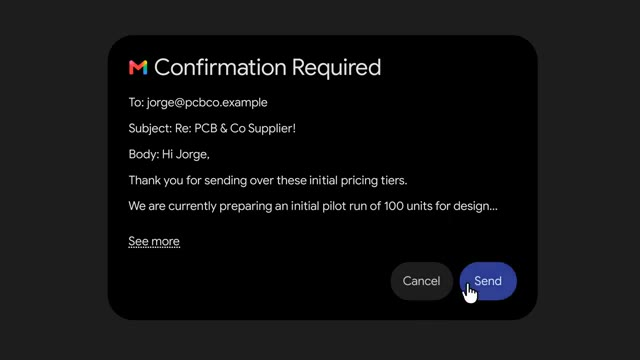
*Interface de confirmation Gmail avec le logo Google, affichant un e-mail à destination de jorge@pcbco.example et un bouton "Send".*

*Page de documentation officielle Google détaillant les performances de Gemini 3.7 Flash et sa tarification promotionnelle à 0,75 $ par million de jetons d'entrée et 3,75 $ par million de jetons de sortie.*

---

### ⏱️ `[00:02:53 - 00:03:12]` | Segment #09

**🔊 Audio (Transcription Intégrale Mot pour Mot en Français) :**
> C'est la moitié du prix d'origine de Gemini 3.6 Flash. Et Google n'a toujours pas révélé quand son modèle phare Pro arrivera. Mais Google possède quelque chose avec lequel les autres entreprises ne peuvent pas facilement rivaliser : une échelle massive. L'application Gemini a maintenant dépassé le milliard d'utilisateurs actifs mensuels. Cela en fait le produit de Google qui a connu la croissance la plus rapide de tous les temps.

**👁️ Analyse Visuelle d'Écran (gemini-3.5-flash-lite) :**
**Interface & Outils** : Navigateur web affichant une page d'annonce officielle Google et un tweet de Sundar Pichai.

**Contenu textuel & Code** : Texte de la page web : "Better developer experience and price", "Gemini 3.7 Flash delivers a noticeably improved developer experience over 3.6 Flash...", "3.7 Flash is available through the end of the year at an introductory price of $0.75/1M input tokens and $3.75/1M output tokens." Tweet de Sundar Pichai (@sundarpichai) : "1B+ people are now using @Geminiapp every month... Kudos to @JoshWoodward & the entire Gemini team...".

**Action / Démonstration** : Affichage successif des captures d'écran illustrant la tarification du modèle et l'annonce du cap d'un milliard d'utilisateurs.

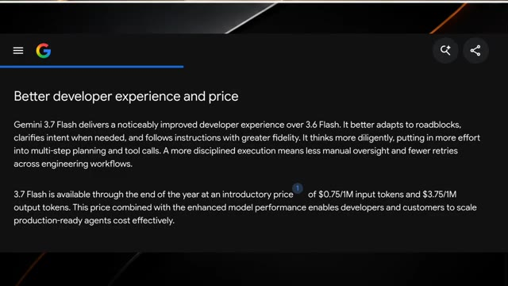
*Page web de Google présentant la tarification et les performances de Gemini 3.7 Flash pour les développeurs.*

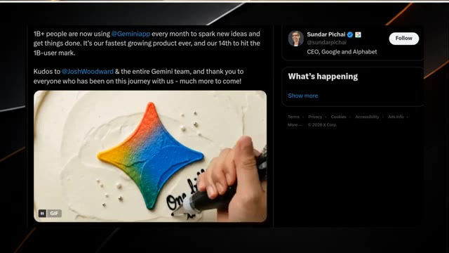
*Publication sur le réseau social X de Sundar Pichai annonçant que l'application Gemini a dépassé le milliard d'utilisateurs actifs mensuels.*

---

### ⏱️ `[00:03:12 - 00:03:32]` | Segment #10

**🔊 Audio (Transcription Intégrale Mot pour Mot en Français) :**
> Et les chiffres d'utilisation sont fous. Gemini génère plus de 150 millions d'images chaque jour, tandis que 63 % des utilisateurs interagissent avec lui par la voix. Ainsi, alors que xAI pousse les agents IA, Google montre qu'il bénéficie déjà d'une adoption massive par les consommateurs. Et c'est pourquoi la course à l'IA devient si intéressante.

**👁️ Analyse Visuelle d'Écran (gemini-3.5-flash-lite) :**
**Interface & Outils** : Capture d'écran du réseau social X (anciennement Twitter) affichant un tweet officiel du compte de Sundar Pichai.

**Contenu textuel & Code** : Texte du tweet de Sundar Pichai : '1B+ people are now using @Geminiapp every month to spark new ideas and get things done. It's our fastest growing product ever, and our 14th to hit the 1B-user mark. Kudos to @JoshWoodward & the entire Gemini team, and thank you to everyone who has been on this journey with us - much more to come!'. Illustration animée (GIF) montrant un gâteau avec le logo coloré de Gemini et le texte 'One billion thank yous!'.

**Action / Démonstration** : Affichage à l'écran de la publication officielle sur les réseaux sociaux pour illustrer le succès et l'adoption massive de Gemini par les utilisateurs.

*Capture d'écran d'un tweet de Sundar Pichai (CEO de Google et Alphabet) annonçant que plus d'un milliard de personnes utilisent l'application Gemini chaque mois, accompagné d'une image de gâteau décoré du logo Gemini avec l'inscription 'One billion thank yous!'.*

---

### ⏱️ `[00:03:32 - 00:03:52]` | Segment #11

**🔊 Audio (Transcription Intégrale Mot pour Mot en Français) :**
> Une entreprise se concentre sur les agents, une autre sur la sécurité et la régulation de l'IA, Apple élabore une stratégie spécifique pour la Chine, et Google essaie de dominer à la fois les modèles d'IA et le marché grand public. La course à l'IA ne se résume plus seulement à savoir qui a le modèle le plus intelligent. Il s'agit de savoir qui peut mettre l'IA entre les mains du plus grand nombre de personnes et lui faire réellement accomplir un travail utile.

**👁️ Analyse Visuelle d'Écran (gemini-3.5-flash-lite) :**
**Interface & Outils** : Schéma et document textuel explicatifs affichés à l'écran.

**Contenu textuel & Code** : Image 1 : Texte "Orchestrateur Agent" dans un encadré et légende "An Orchestrator Agent that runs evolutionary strategy optimizations". Image 2 : Titres et paragraphes techniques dont "Evaluator Recommendations for Advanced Obstacle Traversal" et l'analyse par Gemini 3.7 Flash.

**Action / Démonstration** : Affichage de schémas explicatifs et de documents techniques illustrant le fonctionnement des agents et des évaluations d'IA.

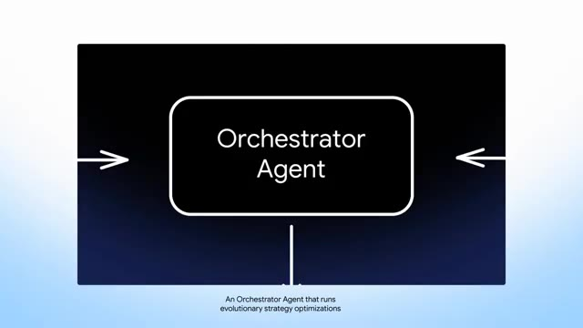
*Schéma animé présentant le concept d'agent orchestrateur avec du texte explicatif.*

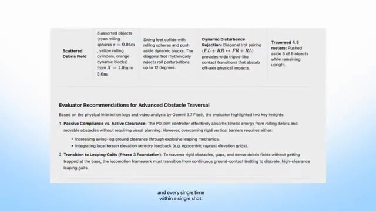
*Document textuel détaillé présentant des recommandations d'évaluation pour le franchissement d'obstacles.*

---

### ⏱️ `[00:03:53 - 00:03:58]` | Segment #12

**🔊 Audio (Transcription Intégrale Mot pour Mot en Français) :**
> Et honnêtement, nous ne faisons que commencer. Abonnez-vous si vous aimez ce rapport de recherche.

**👁️ Analyse Visuelle d'Écran (gemini-3.5-flash-lite) :**
**Interface & Outils** : Écran de fin de vidéo avec animation graphique sans interface logicielle active.

**Contenu textuel & Code** : Illustration graphique d'un cerveau cyborg entouré d'un cercle lumineux bleu sur la gauche, et un bouton interactif de type pouce levé / cloche de notification sur fond noir à droite.

**Action / Démonstration** : Animation graphique de fin de vidéo incitant à s'abonner.

---
