# 🎬 Les robots commencent à surpasser les humains

> **Chaîne** : [Pursuing AI](https://www.youtube.com/@PursuingAi)  
> **Titre original** : `Robots Are Starting to Beat Humans`  
> **Lien YouTube** : [https://www.youtube.com/watch?v=XuCDf4afPVg](https://www.youtube.com/watch?v=XuCDf4afPVg)  
> **Date de publication** : 2026-08-19  
> **Durée** : 07m 33s (`453s`)  
> **Identifiant vidéo** : `XuCDf4afPVg`  
> **Fiche Web Interactive** : [2026-08-19_YT-XuCDf4afPVg_Les robots commencent à surpasser les humains_by-whisper-v3-large-turbo+gemini-3.5-flash-lite.html](2026-08-19_YT-XuCDf4afPVg_Les robots commencent à surpasser les humains_by-whisper-v3-large-turbo+gemini-3.5-flash-lite.html)  
> **Captures de démonstration clés** : `46 captures réelles (anti-talking-head)`  
> **Modèles utilisés** : Audio: `large-v3-turbo` (Faster-Whisper int8 VPS) | Vision: `gemini-3.5-flash-lite` (Google AI Studio API)  

---

## 📌 Synthèse Exécutive & Outils

### 📌 Résumé
La vidéo de *Pursuing AI* explore les convergences spectaculaires entre la robotique humanoïde de pointe et les avancées imminentes des grands modèles de langage, dressant le portrait d'une ère où l'intelligence artificielle commence à surpasser les performances physiques et cognitives humaines. Le sujet central s'articule autour des records d'athlétisme battus par les derniers robots humanoïdes – notamment ceux d'Unitree – et des fuites industrielles concernant de futurs modèles majeurs comme le mystérieux *Astra* d'OpenAI et le *Gemini 3.8 Flash* de Google. L'analyse met en lumière la vitesse fulgurante des cycles de développement technologique et l'émergence d'une symbiose totale entre la perception visuelle et l'action physique en temps réel.

Sur le plan technique, les innovations présentées reposent sur des méthodes de pointe telles que le « contrôle corporel global contraint » et le « contrôle par perception directe » (DPC). Cette approche permet de fusionner la vision, les instructions, la posture et le retour d'information pour piloter directement les articulations des robots, comme le démontre la conduite de karts par apprentissage multisource (basé sur plus de 15 000 heures de données). Le créateur structure sa narration vidéo par une montée en puissance progressive : introduction des performances physiques brutes, décryptage technique des algorithmes de coordination, mise en perspective des compétitions à venir (Jeux mondiaux des robots humanoïdes à Pékin), avant de basculer vers l'écosystème numérique avec les rumeurs sur les architectures multi-agents et la compression des coûts des modèles d'IA.

Pour les créateurs de contenu vidéo et les analystes technologiques, ces enseignements démontrent l'importance cruciale de l'éditorialisation des flux d'actualités complexes. En croisant des illustrations visuelles générées ou augmentées par l'IA (grâce à des outils de pointe comme Seedance ou Kling) avec des données chiffrées précises et un rythme narratif haletant, le créateur maximise l'engagement de l'audience. Cette approche offre une grille de lecture indispensable pour capturer l'attention autour des mutations technologiques rapides, en transformant des communiqués de recherche austères en récits captivants dignes de science-fiction.

### 🛠️ Outils, Modèles & Logiciels Présentés
* **Seedance 2.5** : Outil de génération et d'amélioration vidéo par IA utilisé pour illustrer dynamiquement les séquences technologiques et robotiques.
* **Kling 3.0** : Solution de pointe en matière de génération de vidéo par IA, mobilisée pour simuler ou amplifier les visuels d'athlétisme robotique.
* **Midjourney** : Modèle de génération d'images par IA employé pour concevoir des vignettes et des illustrations conceptuelles percutantes.
* **Unitree (G1 & Superman)** : Plateforme matérielle et logicielle de robotique humanoïde servant de mètre étalon pour les performances de course et d'équilibre.
* **OpenAI Astra (MU4)** : Futur modèle de pointe en phase de test interne, caractérisé par des vitesses de niveau cérébral et des capacités multi-agents avancées.
* **Google Gemini 3.8 Flash** : Modèle linguistique compact et ultra-rapide conçu pour offrir des performances de haut niveau à coût réduit.

### 🔑 Points Clés & Enseignements Stratégiques
* **Hiérarchiser l'accroche narrative** : Commencer par des métriques choc (sauts de 2 mètres, vitesses supérieures aux records humains) pour capter immédiatement l'attention de l'audience dès les premières secondes.
* **Exploiter la technique du "Contrôle par Perception Directe" (DPC)** : Relier visuellement la perception de l'environnement directement aux actions articulaires pour fluidifier les mouvements complexes, un principe transposable à l'animation 3D et au contrôle d'avatars virtuels.
* **Intégrer la gestion des erreurs ("drift-to-still")** : Montrer que la résilience face à l'échec et la capacité à récupérer d'une trajectoire déviée renforcent la crédibilité et le réalisme des démonstrations techniques.
* **Miser sur la confrontation compétitive** : Structurer le récit autour de rivalités directes (ex: *Unitree Superman* contre *Honor Lightning* et *Mirror Me Bolt*) pour stimuler l'engagement et l'interactivité dans les commentaires.
* **Assumer les frictions du monde réel** : Ne pas masquer les imperfections (comme le robot percutant un boîtier électrique) pour prouver l'authenticité des tests en conditions réelles et humaniser le contenu technologique.
* **Synchroniser l'actualité physique et numérique** : Créer un pont thématique fluide entre les avancées de la robotique matérielle et les fuites logicielles des LLM pour offrir une vision macroscopique cohérente de l'écosystème IA.
* **Anticiper l'impact des architectures multi-agents** : Mettre en avant les capacités multi-agents des futurs modèles comme *Astra* pour sensibiliser le public aux ruptures méthodologiques imminentes dans l'automatisation des tâches complexes.
* **Analyser la démocratisation des performances** : Relayer l'émergence de modèles économiques agressifs (comme *Gemini 3.8 Flash*) pour illustrer la baisse drastique des coûts d'accès à l'intelligence de haut niveau.
* **Rythmer le montage par paliers thématiques** : Alterner habilement entre performances athlétiques, explications algorithmiques, échéances événementielles (Jeux mondiaux à Pékin) et rumeurs industrielles pour éviter la monotonie cognitive.
* **Maintenir un appel à l'action contextuel et fédérateur** : Inviter l'audience à s'abonner en capitalisant sur la rapidité d'évolution du secteur, transformant la chaîne en repère indispensable pour l' veille technologique.

---

## ⏱️ Chronologie & Transcription Complète Audio & Visuelle (Mot pour Mot)

### ⏱️ `[00:00:00 - 00:00:25]` | Segment #01

**🔊 Audio (Transcription Intégrale Mot pour Mot en Français) :**
> Les robots humanoïdes deviennent plus rapides, plus intelligents et, honnêtement, un peu effrayants. Un robot peut sauter de deux mètres verticalement. Un autre peut conduire un kart en coordonnant ses mains, ses pieds et tout son corps en temps réel. Nous voyons également des robots courir à des vitesses qui peuvent rivaliser avec, et dans certains cas dépasser, les records humains. Et pendant que tout cela se passe, certains des plus grands modèles d'IA pourraient recevoir des mises à jour majeures en coulisses.

**👁️ Analyse Visuelle d'Écran (gemini-3.5-flash-lite) :**
**Interface & Outils** : Extraits vidéo d'actualités sur la robotique et illustration graphique textuelle.

**Contenu textuel & Code** : Texte incrusté en bas à droite : "Real footage, not AI-generated". Logo en haut à droite : "Symbiosis Robotics - FROM HUMANOIDS TO HUMAN". Texte graphique central sur fond vert : "GPT-6 Astra".

**Action / Démonstration** : Démonstration visuelle de robots humanoïdes en mouvement (course, manipulation de drapeaux) et affichage d'un titre textuel conceptuel sur l'IA.

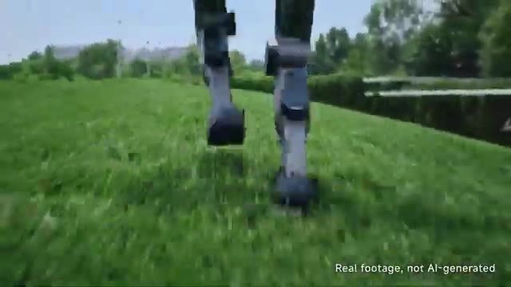
*Gros plan sur les jambes d'un robot humanoïde en train de courir sur de l'herbe verte.*

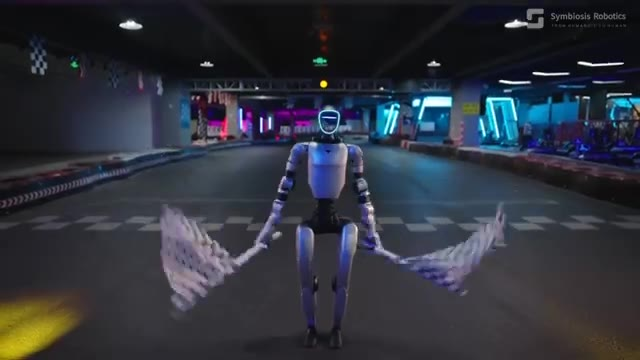
*Robot humanoïde debout sur une piste de karting intérieure, tenant des drapeaux à damier dans ses mains.*

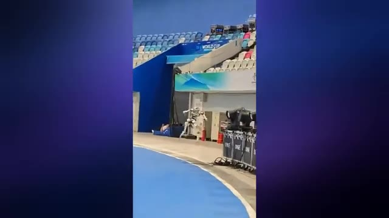
*Robot humanoïde se déplaçant rapidement à l'intérieur d'un grand stade ou d'une arène sportive.*

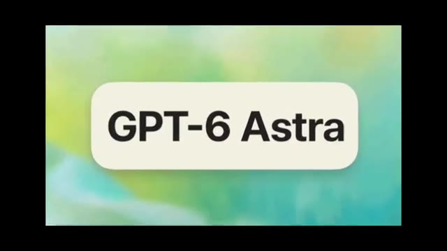
*Affichage graphique en gros plan du texte "GPT-6 Astra" sur fond pastel flou.*

---

### ⏱️ `[00:00:25 - 00:00:49]` | Segment #02

**🔊 Audio (Transcription Intégrale Mot pour Mot en Français) :**
> Donc aujourd'hui, analysons quelques-unes des plus grandes avancées en cours dans le domaine de l'IA en robotique humanoïde. Commençons par Unitree. Unitree vient de présenter son nouveau robot, et honnêtement, ce truc est assez dingue. Il peut déjà sauter à 2 mètres de haut en partant d'une position statique et atteindre une vitesse de pointe de 12,66 mètres par seconde, avec des jambes qui ne font que 0,85 mètre de long.

**👁️ Analyse Visuelle d'Écran (gemini-3.5-flash-lite) :**
**Interface & Outils** : Vidéo de démonstration technique des performances du robot Unitree.

**Contenu textuel & Code** : Texte affiché : "Real footage, not AI-generated", échelle graduée de 100cm à 200cm, affichage du chronomètre "0.00.79", et texte technique "Leg Length 0.85m, Maximum Speed 10/0.79=12.658m/s Humanity's Global Ultimate Speed 12.4m/s".

**Action / Démonstration** : Le robot humanoïde Unitree est montré en action (au sol sur l'herbe, sautant devant une règle graduée, courant sur une piste d'athlétisme bleue, et les données de chronométrage s'affichent).

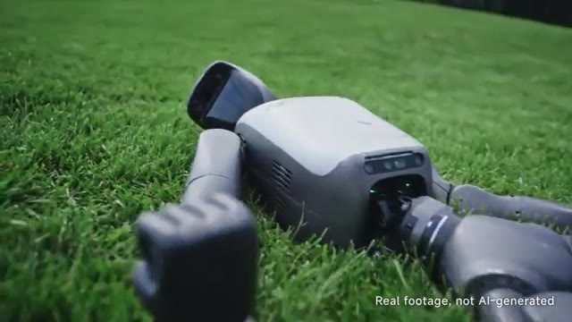
*Gros plan sur le robot humanoïde Unitree allongé sur de l'herbe verte avec le texte explicatif en bas à droite.*

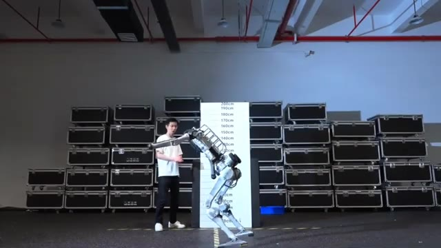
*Le robot Unitree effectuant un test de saut en hauteur devant une échelle graduée en intérieur.*

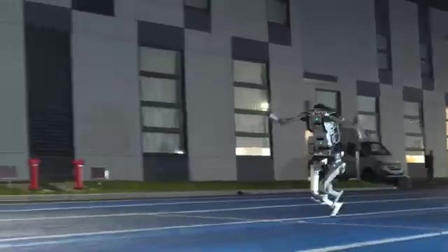
*Le robot Unitree en train de courir à pleine vitesse sur une piste extérieure bleue.*

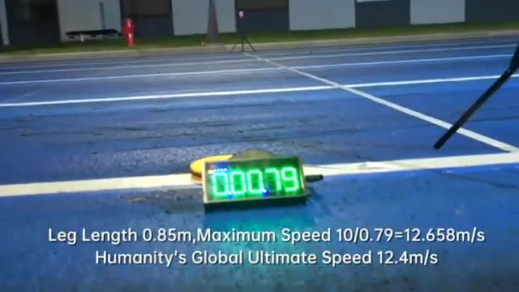
*Chronomètre numérique affichant le résultat du test de vitesse avec les statistiques textuelles superposées.*

---

### ⏱️ `[00:00:49 - 00:01:26]` | Segment #03

**🔊 Audio (Transcription Intégrale Mot pour Mot en Français) :**
> Cela place sa détente verticale et sa vitesse de course au-delà des records humains. Mais les chiffres ne sont même pas la partie la plus folle. Regardez simplement comment ce robot s'équilibre. Maintenant, regardez-le à nouveau au ralenti. Regardez la façon dont ses bras et ses jambes bougent pendant qu'il court. La coordination est vraiment impressionnante. On dirait presque un coureur humain. Et le plus fou ? Cette machine n'est en développement que depuis un peu plus de trois mois, il y a donc encore beaucoup de marge d'amélioration. Mais Unitree n'apprend pas seulement aux robots à courir, ils travaillent également sur la façon dont les robots peuvent réellement comprendre et contrôler tout leur corps. Et cette prochaine démonstration en est le parfait exemple. Le Unitree

**👁️ Analyse Visuelle d'Écran (gemini-3.5-flash-lite) :**
**Interface & Outils** : Vidéo de démonstration des capacités physiques et de course du robot humanoïde Unitree.

**Contenu textuel & Code** : Règle de mesure verticale graduée de 10cm à 200cm en arrière-plan, piste de course extérieure avec marquages au sol.

**Action / Démonstration** : Le robot humanoïde fléchit ses jambes pour effectuer un saut en hauteur ou se déplace en courant sur une piste.

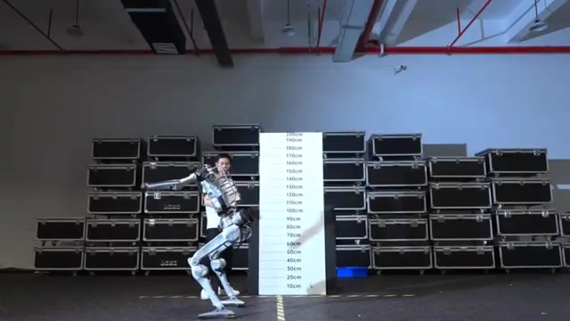
*Le robot bipède d'Unitree en position accroupie devant une règle de mesure verticale graduée.*

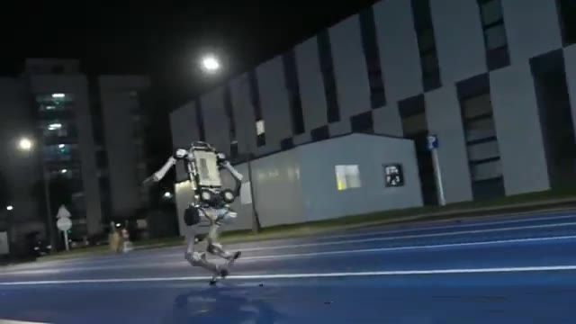
*Le robot d'Unitree en train de courir sur une piste extérieure bleue de nuit.*

*Le robot bipède d'Unitree en position accroupie devant la règle de mesure verticale (identique à l'image 1).*

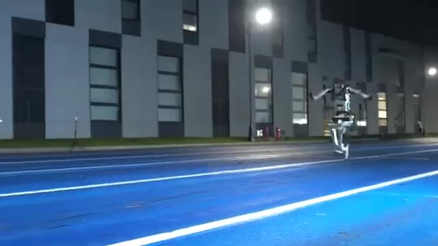
*Le robot d'Unitree filmé de face pendant qu'il court vers la caméra sur une piste extérieure.*

---

### ⏱️ `[00:01:26 - 00:01:53]` | Segment #04

**🔊 Audio (Transcription Intégrale Mot pour Mot en Français) :**
> G1 s'abaisse en fait dans ce minuscule cockpit de karting. Ses mains se posent sur le volant, ses pieds trouvent les pédales, et chaque partie de son corps doit rester coordonnée à l'intérieur de cet espace extrêmement exigu. Symbiosis appelle cela le contrôle corporel global contraint. Au lieu de planifier chaque mouvement séparément, le système est conçu pour relier ce que le robot voit directement à la façon dont il se déplace, et c'est là qu'intervient le contrôle par perception directe, ou DPC.

**👁️ Analyse Visuelle d'Écran (gemini-3.5-flash-lite) :**
**Interface & Outils** : Vidéo de démonstration technique (Symbiosis Robotics) montrant un robot humanoïde pilotant un kart.

**Contenu textuel & Code** : Logo "Symbiosis Robotics" visible en haut à droite avec la mention "Symbiosis to Human", et le robot G1 en action.

**Action / Démonstration** : Le robot s'installe dans le cockpit d'un kart, positionne ses mains et ses pieds, puis pilote le véhicule sur une piste.

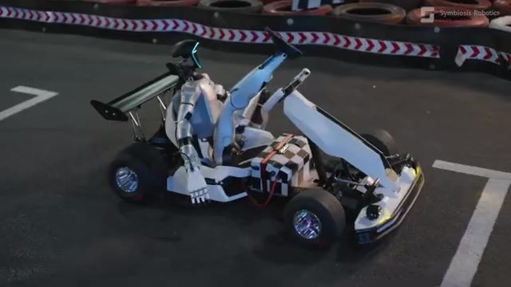
*Le robot humanoïde G1 s'installe dans le minuscule cockpit d'un karting, ses jambes se pliant pour entrer dans l'espace exigu.*

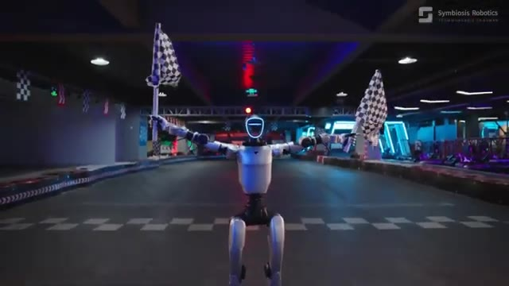
*Le robot G1 tient des drapeaux à damier dans une piste de karting couverte, affichant son système de contrôle.*

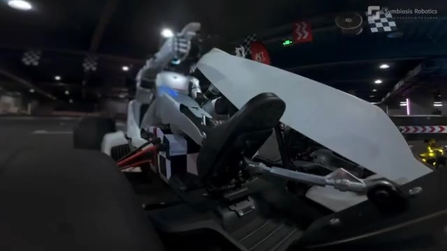
*Gros plan sur les pieds du robot G1 appuyant précisément sur les pédales du karting.*

---

### ⏱️ `[00:01:53 - 00:02:18]` | Segment #05

**🔊 Audio (Transcription Intégrale Mot pour Mot en Français) :**
> Le système combine ce que le robot voit, les instructions qu'il reçoit, sa position corporelle actuelle et un retour continu, et transforme tout cela directement en mouvements pour ses articulations et ses mains. Il y a une autre partie intéressante appelée l'Attention Symbiotique. L'idée est que la perception et le contrôle fonctionnent ensemble, de sorte que le robot ne se contente pas de comprendre ce qui se passe autour de lui, il doit également comprendre ce que son propre corps est réellement capable de faire.

**👁️ Analyse Visuelle d'Écran (gemini-3.5-flash-lite) :**
**Interface & Outils** : Vidéo de démonstration de robotique (Symbiosis Robotics) montrant un robot humanoïde en situation de conduite.

**Contenu textuel & Code** : Aucun texte textuel ou prompt, uniquement le logo "Symbiosis Robotics" dans le coin supérieur droit de la vidéo.

**Action / Démonstration** : Le robot humanoïde conduit, accélère et manœuvre un kart de course sur une piste intérieure en gérant ses mouvements corporels.

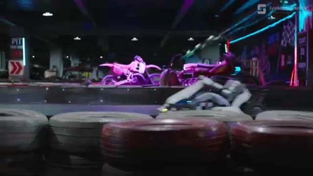
*Un robot humanoïde conduit un kart sur une piste intérieure, filmé de côté près des barrières de pneus.*

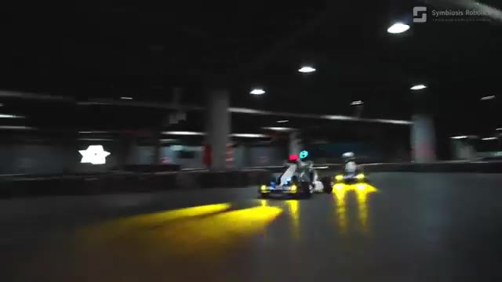
*Vue de face d'un robot humanoïde pilotant un kart sur une piste de course intérieure sombre avec des phares allumés.*

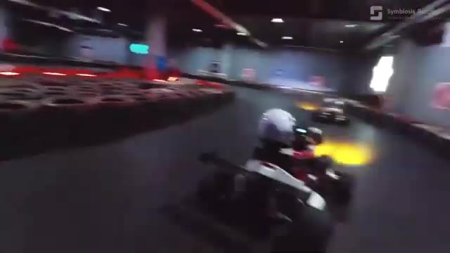
*Vue en contre-plongée dynamique d'un robot humanoïde au volant d'un kart dans un virage sur circuit intérieur.*

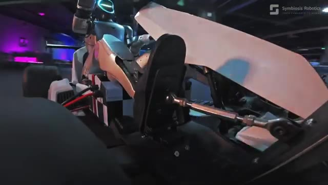
*Gros plan rapproché sur les jambes mécaniques et les pédales d'un robot humanoïde installé dans un kart.*

---

### ⏱️ `[00:02:18 - 00:02:38]` | Segment #06

**🔊 Audio (Transcription Intégrale Mot pour Mot en Français) :**
> Vous pouvez voir cela clairement ici. Le robot utilise son pied droit pour contrôler l'accélérateur tandis que ses mains dirigent le kart dans le virage. Sa vision, ses mouvements et sa synchronisation doivent tous fonctionner ensemble en temps réel. En gros, c'est une coordination œil-main-pied, mais pour un robot humanoïde. Et le système est également conçu pour gérer les erreurs.

**👁️ Analyse Visuelle d'Écran (gemini-3.5-flash-lite) :**
**Interface & Outils** : Vidéo de démonstration de robotique (Symbiosis Robotics) montrant un robot humanoïde conduisant un kart.

**Contenu textuel & Code** : Logo et texte de la marque "Symbiosis Robotics" affichés dans le coin supérieur droit.

**Action / Démonstration** : Le robot humanoïde pilote activement le kart, utilise l'accélérateur avec son pied et manœuvre le volant dans les virages.

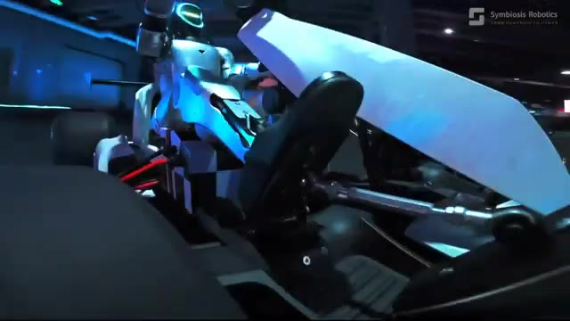
*Vue rapprochée d'un robot humanoïde assis dans un kart, utilisant son pied sur l'accélérateur et ses mains sur le volant.*

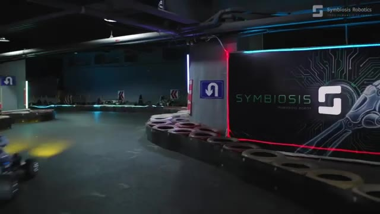
*Vue en plan d'un kart piloté par un robot humanoïde négociant un virage sur une piste de karting intérieure, avec le logo Symbiosis Robotics.*

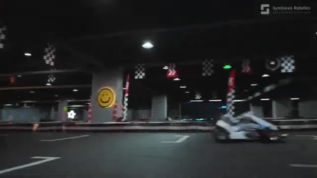
*Vue large du kart conduit par le robot humanoïde circulant sur la piste sous un éclairage tamisé avec des décorations murales.*

---

### ⏱️ `[00:02:38 - 00:02:59]` | Segment #07

**🔊 Audio (Transcription Intégrale Mot pour Mot en Français) :**
> Avec leur méthode de dérive vers l'arrêt (drift-to-still), le robot fait l'expérience de situations où son mouvement commence à s'écarter de la trajectoire idéale, puis apprend à récupérer de ces situations. Le modèle a été entraîné en utilisant 15 010 heures de données provenant d'humains, de robots à roues, de robots armés et de humanoïdes bipèdes, toutes converties en un format commun que le robot peut exécuter.

**👁️ Analyse Visuelle d'Écran (gemini-3.5-flash-lite) :**
**Interface & Outils** : Présentation face caméra sans partage d'écran

**Contenu textuel & Code** : Aucun texte, prompt ou interface logicielle visible.

**Action / Démonstration** : Vidéo d'illustration montrant un robot bipède pilotant un kart, puis descendant de son véhicule face à un humain dans un circuit de karting intérieur.

---

### ⏱️ `[00:02:59 - 00:03:19]` | Segment #08

**🔊 Audio (Transcription Intégrale Mot pour Mot en Français) :**
> L'objectif ici n'est donc pas simplement de construire un meilleur planificateur de mouvement. Il s'agit de construire un système où l'IA peut comprendre le monde, comprendre son propre corps et transformer directement cette compréhension en action physique. Et c'est ce que signifie la symbiosis en rendant l'intelligence physiquement exécutable. Mais Unitree n'est pas la seule entreprise à faire progresser les robots humanoïdes.

**👁️ Analyse Visuelle d'Écran (gemini-3.5-flash-lite) :**
**Interface & Outils** : Vidéo de démonstration de robotique humanoïde (Symbiosis Robotics) avec incrustation textuelle et logo en haut à droite.

**Contenu textuel & Code** : Texte affiché à l'écran : « FROM HUMANOID TO HUMAN » et logo de « Symbiosis Robotics ».

**Action / Démonstration** : Le robot humanoïde évolue dans un parcours d'obstacles intérieur puis marche en coordination étroite avec un humain.

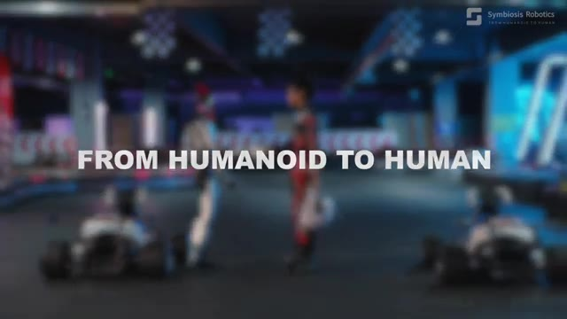
*Titre « FROM HUMANOID TO HUMAN » affiché sur une vidéo floue montrant un robot humanoïde et une personne dans un espace intérieur.*

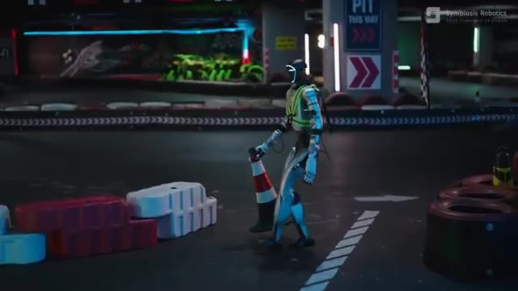
*Un robot humanoïde bipède se déplaçant dans un environnement intérieur avec des barrières et un panneau de signalisation.*

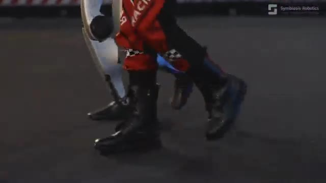
*Gros plan sur les jambes articulées d'un robot humanoïde et les jambes d'une personne marchant de concert.*

---

### ⏱️ `[00:03:19 - 00:03:40]` | Segment #09

**🔊 Audio (Transcription Intégrale Mot pour Mot en Français) :**
> La Chine s'apprête à placer ces machines sur une scène encore plus grande. Les seconds jeux mondiaux de robots humanoïdes se dérouleront à Pékin du 22 au 26 août, et les robots répètent déjà pour la cérémonie d'ouverture. Et honnêtement, regardez ça. Ils marchent tous au même rythme, se déplaçant ensemble comme une véritable force de robots humanoïdes.

**👁️ Analyse Visuelle d'Écran (gemini-3.5-flash-lite) :**
**Interface & Outils** : Navigateur web affichant une publication sur le réseau social X (Twitter).

**Contenu textuel & Code** : Texte du tweet : "China will host the 2nd World Humanoid Robot Games in Beijing from Aug 22 to 26 this weekend. Robots are now rehearsing for the opening ceremony." Nom du compte : XuZhenqing. Date : 12:02 PM - Aug 18, 2026. 16.5K vues.

**Action / Démonstration** : Défilement ou présentation d'un tweet et d'une vidéo montrant des robots humanoïdes répétant leur marche synchronisée dans un stade.

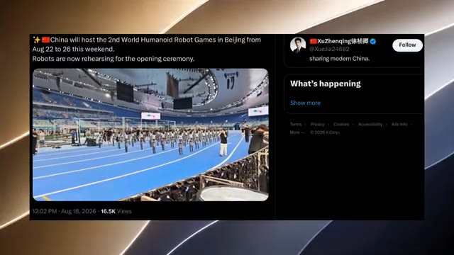
*Capture d'écran d'une publication sur X (anciennement Twitter) montrant une vidéo de robots répétant dans un stade, accompagnée de texte sur les World Humanoid Robot Games en Chine.*

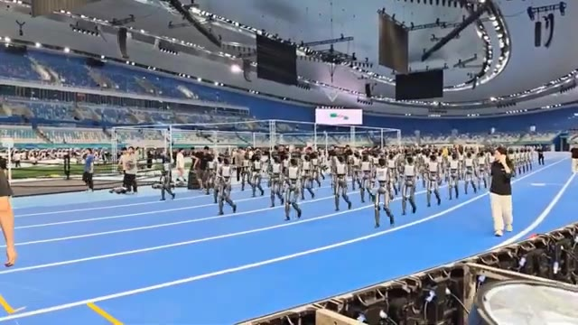
*Gros plan vidéo montrant une troupe de robots humanoïdes marchant en parfaite synchronisation sur la piste bleue d'un grand stade lors de répétitions.*

---

### ⏱️ `[00:03:40 - 00:04:02]` | Segment #10

**🔊 Audio (Transcription Intégrale Mot pour Mot en Français) :**
> Voir autant de robots bouger en synchronisation, c'est assez dingue. Et si les répétitions ressemblent déjà à ça, j'ai vraiment hâte de voir à quoi va ressembler la véritable cérémonie d'ouverture. Mais pendant que certains robots se concentrent sur la coordination, d'autres misent sur autre chose : la vitesse. La vitesse des robots humanoïdes devient ridicule. Nous avons désormais trois sérieux concurrents qui repoussent les limites de la vitesse à laquelle un robot humanoïde peut réellement courir.

**👁️ Analyse Visuelle d'Écran (gemini-3.5-flash-lite) :**
**Interface & Outils** : Capture d'écran d'une vidéo de démonstration comparative divisée en trois sections verticales affichant des tests de vitesse de robots.

**Contenu textuel & Code** : Texte à l'écran : "WHO'S FASTER, STRONGER, AND MORE LIKELY TO WIN?", "UNITREE - SUPERMAN", "TOP SPEED 12.66 m/s", "HONOR - LIGHTNING", "GAMES PREP", "IMPRESSIVE SPEED", "MIRRORME - BOLT", "PEAK SPEED 11m/s", "10 m/s".

**Action / Démonstration** : Les robots humanoïdes marchent en cadence sur la piste bleue dans les deux premières images, tandis que la troisième montre des clips vidéo de tests de vitesse avec des mesures de performance affichées.

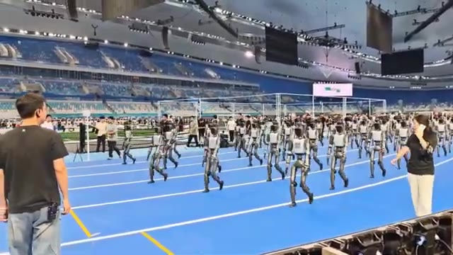
*Répétition de nombreux robots humanoïdes marchant en synchronisation sur la piste bleue d'un grand stade.*

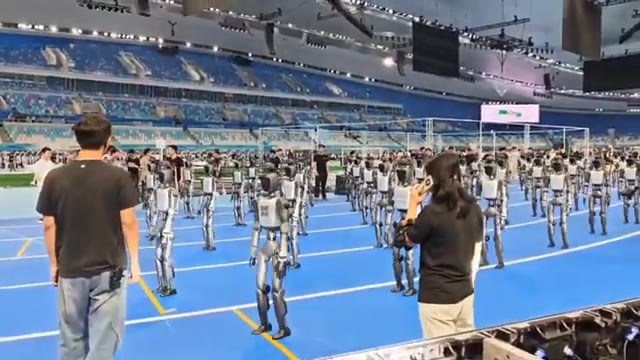
*Vue de face des robots humanoïdes évoluant en formation sur la piste d'athlétisme lors des préparatifs.*

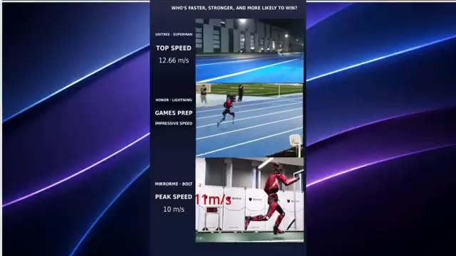
*Comparatif vidéo en trois parties présentant les performances de vitesse de différents robots humanoïdes avec des données chiffrées.*

---

### ⏱️ `[00:04:02 - 00:04:32]` | Segment #11

**🔊 Audio (Transcription Intégrale Mot pour Mot en Français) :**
> D'abord, il y a Unitree Superman, qui atteint une vitesse de pointe de 12,66 mètres par seconde. Ensuite, il y a Honor Lightning, un robot humanoïde conçu pour la course à grande vitesse qui a déjà été testé en compétition de longue distance. Et enfin, Mirror Me Bolt, dont Mirror Me affirme qu'il peut atteindre plus de 11 mètres par seconde en vitesse de pointe. Et avec les Jeux Mondiaux des Robots Humanoïdes et la Conférence Mondiale des Robots qui mettent l'athlétisme robotique sous le feu des projecteurs, cela devient vraiment intéressant. Parce que maintenant, je veux voir une seule chose. Une course complète de 100 mètres.

**👁️ Analyse Visuelle d'Écran (gemini-3.5-flash-lite) :**
**Interface & Outils** : Interface de montage vidéo avec habillage graphique comparatif.

**Contenu textuel & Code** : Texte en haut : "WHO'S FASTER, STRONGER, AND MORE LIKELY TO WIN?". Section supérieure : "UNITREE - SUPERMAN", "TOP SPEED: 12.66 m/s", extrait vidéo au ralenti ("4x SLOW MOTION"). Section médiane : "HONOR - LIGHTNING", "GAMES PREP", "IMPRESSIVE SPEED", extrait sur un terrain de sport. Section inférieure : "MIRRORME - BOLT", "PEAK SPEED: 10 m/s", encart "GROUND TEST / PEAK SPEED: 10 m/s" et vidéo d'un robot rouge courant sur une piste.

**Action / Démonstration** : Présentation comparative des performances de vitesse de pointe de différents robots humanoïdes coureurs.

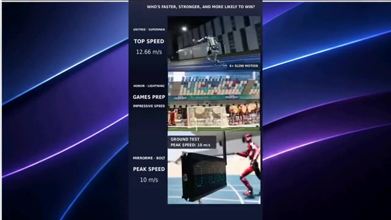
*Capture d'écran montrant une comparaison vidéo verticale de trois robots humanoïdes rapides : Unitree Superman, Honor Lightning et Mirror Me Bolt, avec leurs vitesses respectives.*

---

### ⏱️ `[00:04:32 - 00:05:08]` | Segment #12

**🔊 Audio (Transcription Intégrale Mot pour Mot en Français) :**
> Unitree Superman contre Honor Lightning contre Mirror Me Bolt. Selon vous, qui franchira la ligne d'arrivée en premier ? Et apparemment, courir aussi vite s'accompagne de quelques problèmes, car le robot humanoïde de Unitree dépasse les records de vitesse humains et parvient en quelque même temps à détruire un boîtier électrique. Regardez bien ceci. Il se déplace à une vitesse ridicule, puis boum, il percute le boîtier électrique assez violemment pour le casser. Donc oui, Unitree ne se contente pas de rendre ces robots plus rapides, ils les rendent tellement rapides qu'il vaut mieux probablement ne pas se mettre en travers de leur chemin. Et tandis que la robotique progresse aussi rapidement dans le monde physique, les modèles d'IA sont...

**👁️ Analyse Visuelle d'Écran (gemini-3.5-flash-lite) :**
**Interface & Outils** : Vidéo de démonstration comparative et extraits vidéo de tests de robots humanoïdes.

**Contenu textuel & Code** : Texte à l'écran : "WHO'S FASTER, STRONGER, AND MORE LIKELY TO WIN?", "UNITREE - SUPERMAN TOP SPEED 12.66 m/s", "HONOR - LIGHTNING GAMES PREP IMPRESSIVE SPEED", "MIRRORME - BOLT PEAK SPEED 10 m/s", "LEG LENGTH 0.85 m - TOP SPEED 10 / 0.79 = 12.658 m/s", "GLOBAL HUMAN PEAK SPEED: 12.4 m/s", et la mention "@NEXORAResearch".

**Action / Démonstration** : Le robot humanoïde accélère à une vitesse extrême sur une piste d'athlétisme avant de percuter violemment un boîtier électrique, puis on le voit s'entraîner dans un entrepôt.

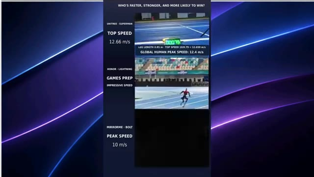
*Comparaison des vitesses entre les robots Unitree Superman, Honor Lightning et Mirror Me Bolt avec statistiques.*

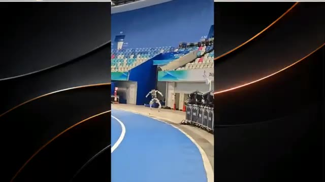
*Le robot humanoïde de Unitree en train de courir à pleine vitesse sur une piste d'athlétisme indoor.*

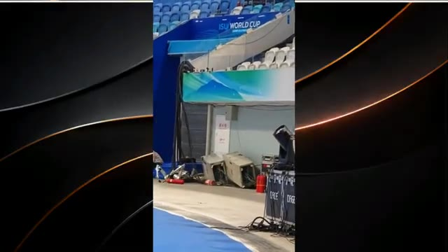
*Le robot humanoïde de Unitree après avoir percuté et endommagé des boîtiers électriques dans l'arène.*

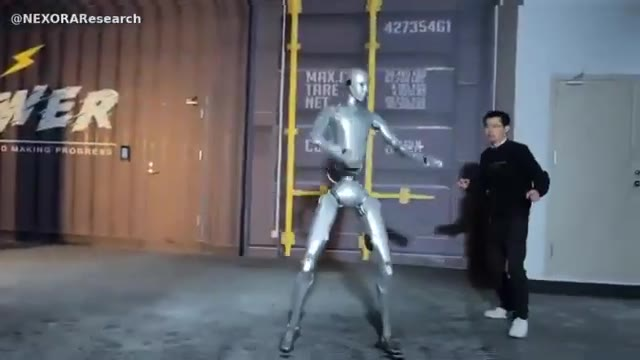
*Un robot humanoïde argenté en mouvement rapide dans un entrepôt avec un observateur à côté.*

---

### ⏱️ `[00:05:08 - 00:05:29]` | Segment #13

**🔊 Audio (Transcription Intégrale Mot pour Mot en Français) :**
> qui progresse tout aussi rapidement dans le monde numérique. Maintenant, parlons des fuites. Tout d'abord, OpenAI. OpenAI pourrait préparer l'une de ses plus grandes sorties depuis GPT-4.5, et cela s'appellerait apparemment Astra. Selon les derniers rapports, le lancement d'Astra pourrait être ciblé dès cette semaine. Et les rumeurs deviennent encore plus intéressantes.

**👁️ Analyse Visuelle d'Écran (gemini-3.5-flash-lite) :**
**Interface & Outils** : Navigateur web / Réseau social X (Twitter) et affichage vidéo.

**Contenu textuel & Code** : Texte du tweet : "GPT Astra Leak: Dropping This week", "OpenAI could be preparing its biggest release since GPT-4.5", listant des détails comme "Astra is reportedly targeting This week", "Built on OpenAI's largest pretraining run yet", "Latest internal release candidate reportedly codenamed 'Mewfour'", et une image avec le texte "GPT-6 Astra".

**Action / Démonstration** : Affichage successif d'une vidéo d'illustration avec un robot humanoïde puis d'un tweet sur les fuites concernant OpenAI Astra.

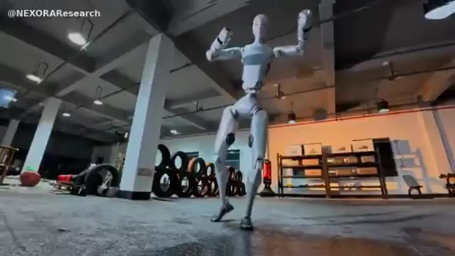
*Vidéo de démonstration montrant un robot humanoïde en train de danser dans un entrepôt.*

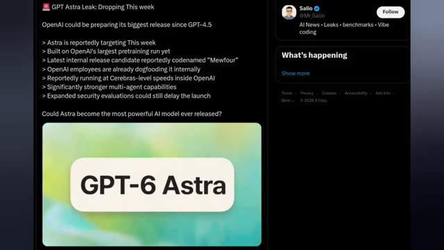
*Capture d'écran d'un tweet sur X (Twitter) détaillant les rumeurs de fuite concernant GPT-6 Astra d'OpenAI.*

---

### ⏱️ `[00:05:29 - 00:05:48]` | Segment #14

**🔊 Audio (Transcription Intégrale Mot pour Mot en Français) :**
> Il serait construit sur le plus grand entraînement préalable d'OpenAI à ce jour, tandis que la dernière version candidate interne porterait le nom de code MU4. Les employés d'OpenAI le testeraient déjà en interne, et certains rapports affirment qu'il fonctionne à des vitesses de niveau cérébral au sein de l'entreprise. Mais la vitesse n'est pas la seule chose.

**👁️ Analyse Visuelle d'Écran (gemini-3.5-flash-lite) :**
**Interface & Outils** : Navigateur web affichant un tweet sur la plateforme X (anciennement Twitter) de l'utilisateur Salio.

**Contenu textuel & Code** : Texte du tweet : "GPT Astra Leak: Dropping This week. OpenAI could be preparing its biggest release since GPT-4.5. > Astra is reportedly targeting This week > Built on OpenAI's largest pretraining run yet > Latest internal release candidate reportedly codenamed "Mewfour" > OpenAI employees are already dogfooding it internally > Reportedly running at Cerebras-level speeds inside OpenAI > Significantly stronger multi-agent capabilities > Expanded security evaluations could still delay the launch. Could Astra become the most powerful AI model ever released?" Une image incluse dans le tweet affiche le texte "GPT-6 Astra" sur fond vert et blanc.

**Action / Démonstration** : Affichage d'un article ou post issu des réseaux sociaux détaillant les rumeurs sur le modèle GPT-6 Astra d'OpenAI.

*Capture d'écran d'un tweet concernant la fuite de GPT Astra et ses spécificités techniques.*

---

### ⏱️ `[00:05:48 - 00:06:06]` | Segment #15

**🔊 Audio (Transcription Intégrale Mot pour Mot en Français) :**
> On dit aussi qu'Astra dispose de capacités multi-agents nettement plus puissantes, ce qui pourrait la rendre bien meilleure pour gérer des tâches complexes à travers de multiples agents IA. Il y a juste un gros point d'interrogation. OpenAI élargirait ses évaluations de sécurité, et ces tests pourraient encore retarder le lancement.

**👁️ Analyse Visuelle d'Écran (gemini-3.5-flash-lite) :**
**Interface & Outils** : Interface de la plateforme X (anciennement Twitter) affichant une publication (tweet) à gauche et les tendances/suggestions à droite.

**Contenu textuel & Code** : Texte du tweet : "GPT Astra Leak: Dropping This week. OpenAI could be preparing its biggest release since GPT-4.5. > Astra is reportedly targeting This week > Built on OpenAI's largest pretraining run yet > Latest internal release candidate reportedly codenamed "Mewfour" > OpenAI employees are already dogfooding it internally > Reportedly running at Cerebras-level speeds inside OpenAI > Significantly stronger multi-agent capabilities > Expanded security evaluations could still delay the launch. Could Astra become the most powerful AI model ever released?". Une image avec le texte "GPT-6 Astra" sur fond vert et blanc.

**Action / Démonstration** : Affichage à l'écran d'un message publié sur les réseaux sociaux (X) détaillant les caractéristiques et les rumeurs sur le lancement de GPT-6 Astra.

*Capture d'écran d'un tweet sur X (Twitter) du compte @Mr_Salio résumant les fuites et rumeurs concernant GPT-6 Astra, incluant une liste de points clés et une image avec le texte "GPT-6 Astra".*

---

### ⏱️ `[00:06:06 - 00:06:26]` | Segment #16

**🔊 Audio (Transcription Intégrale Mot pour Mot en Français) :**
> Alors, est-ce que GPT-Astra arrive vraiment cette semaine ? Nous devrons attendre pour voir. Mais si ces rapports sont exacts, OpenAI pourrait bien préparer quelque chose d'assez important. Et Google pourrait bien sortir un autre modèle plus tôt que prévu. Gemini 3.8 Flash viserait une sortie publique en septembre, et il semble déjà déployé en interne.

**👁️ Analyse Visuelle d'Écran (gemini-3.5-flash-lite) :**
**Interface & Outils** : Interface du réseau social X (Twitter) affichant des tweets d'actualité sur l'intelligence artificielle du compte @Mr_Salio.

**Contenu textuel & Code** : Sur l'image 1 : Tweet intitulé "GPT Astra Leak: Dropping This week", mentionnant "OpenAI could be preparing its biggest release since GPT-4.5" avec des points sur Astra (sortie cette semaine, entraînement massif, nom de code "Mewfour", tests internes, vitesse type Cerebras, capacités multi-agents accrues) et l'image "GPT-6 Astra". Sur l'image 2 : Tweet "Gemini 3.8 Flash Leak" avec les détails sur sa sortie en septembre, son déploiement interne et l'image du logo "Gemini 3.8 Flash".

**Action / Démonstration** : Affichage à l'écran de publications sur les réseaux sociaux résumant les fuites et rumeurs concernant les futurs modèles phares d'OpenAI (GPT-6 Astra) et de Google (Gemini 3.8 Flash).

*Publication X (Twitter) du compte @Mr_Salio détaillant les rumeurs autour du lancement imminent de GPT-6 Astra par OpenAI, incluant ses spécifications techniques et ses performances.*

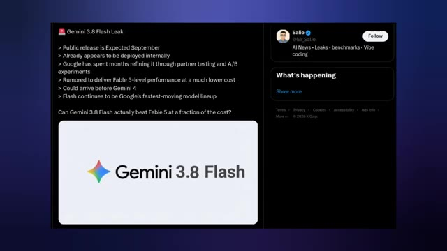
*Publication X (Twitter) du compte @Mr_Salio présentant les fuites d'informations sur Gemini 3.8 Flash de Google, sa sortie prévue en septembre et ses performances comparées.*

---

### ⏱️ `[00:06:26 - 00:06:45]` | Segment #17

**🔊 Audio (Transcription Intégrale Mot pour Mot en Français) :**
> Selon les fuites, Google a passé des mois à l'affiner grâce à des tests auprès de partenaires, et c'est là que les choses deviennent intéressantes. La rumeur veut que Gemini 3.8 Flash offre des performances du niveau de Fable 5 à un coût bien inférieur. Si c'est vrai, Google pourrait bien tenir un modèle extrêmement compétitif, surtout s'il arrive avant Gemini 4.

**👁️ Analyse Visuelle d'Écran (gemini-3.5-flash-lite) :**
**Interface & Outils** : Interface de la plateforme X (anciennement Twitter) affichant un tweet posté par le compte @Mr_Salio.

**Contenu textuel & Code** : Texte du tweet : "Gemini 3.8 Flash Leak" avec une liste de points (sortie publique prévue en septembre, déjà déployé en interne, Google a passé des mois à l'affiner, performances de niveau Fable 5, pourrait arriver avant Gemini 4) et une image intégrée affichant le logo coloré de Google et le texte "Gemini 3.8 Flash".

**Action / Démonstration** : Affichage d'une publication sur les réseaux sociaux (X) illustrant les informations et rumeurs concernant la fuite du modèle Gemini 3.8 Flash.

*Capture d'écran d'un tweet de Salio détaillant les fuites concernant Gemini 3.8 Flash avec ses spécifications et performances.*

---

### ⏱️ `[00:06:45 - 00:07:05]` | Segment #18

**🔊 Audio (Transcription Intégrale Mot pour Mot en Français) :**
> Et cela correspond également à la direction de la gamme Flash de Google : des modèles rapides, des coûts réduits et des améliorations rapides. La grande question est donc de savoir si Gemini 3.8 Flash peut réellement battre Fable 5 à une fraction du coût ? Si ces rapports sont exacts, septembre pourrait devenir très intéressant. Et c'est la vue d'ensemble en ce moment.

**👁️ Analyse Visuelle d'Écran (gemini-3.5-flash-lite) :**
**Interface & Outils** : Interface de démonstration logicielle avec des visualisations 3D et des schémas d'architecture d'IA.

**Contenu textuel & Code** : Texte visible : "Gemini 3.7 Flash can train a robotics model", "Main Agent", "Evolutionary Strategy Optimizer", "Neural Policy", "MuJoCo 3D simulation", "Reward", "Progress plateaus?".

**Action / Démonstration** : Démonstration visuelle de la simulation robotique et de schémas fonctionnels expliquant l'optimisation par stratégie évolutionniste.

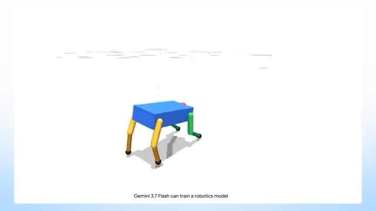
*Animation 3D d'un robot quadrupède (corps bleu, pattes jaunes et vertes) sur fond blanc, illustrant l'entraînement d'un modèle de robotique.*

*Interface sombre montrant un bouton de validation bleu avec une flèche blanche et une icône de microphone, ainsi que le texte "Main Agent".*

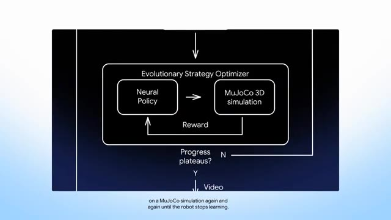
*Schéma d'architecture technique représentant un "Evolutionary Strategy Optimizer" avec une "Neural Policy" et une simulation "MuJoCo 3D".*

---

### ⏱️ `[00:07:05 - 00:07:29]` | Segment #19

**🔊 Audio (Transcription Intégrale Mot pour Mot en Français) :**
> Les robots humanoïdes apprennent à courir, sauter, garder l'équilibre, conduire et se relever après des erreurs. En même temps, les modèles d'IA deviennent plus rapides, plus performants et se concentrent de plus en plus sur la gestion de tâches complexes. Le plus fou, c'est que nous assistons encore au développement de cette technologie en temps réel. Donc, si vous voulez vous tenir au courant des dernières actualités sur l'IA et la robotique sans rater l'essentiel, abonnez-vous à Pursuing AI.

**👁️ Analyse Visuelle d'Écran (gemini-3.5-flash-lite) :**
**Interface & Outils** : Présentation face caméra et extraits vidéo d'illustration sans interface logicielle ni démonstration directe.

**Contenu textuel & Code** : Texte incrusté en bas à droite sur certaines images : "Real footage, not AI-generated" et un bouton rouge "Subscribe" sur l'image #4.

**Action / Démonstration** : Illustrations vidéo montrant des extraits de robots en mouvement (saut, course) et une animation de cerveau humain stylisé avec un anneau lumineux.

---

### ⏱️ `[00:07:29 - 00:07:32]` | Segment #20

**🔊 Audio (Transcription Intégrale Mot pour Mot en Français) :**
> Parce que ça bouge vite, et on se retrouve dans la prochaine.

**👁️ Analyse Visuelle d'Écran (gemini-3.5-flash-lite) :**
**Interface & Outils** : Écran de fin de YouTube / Animation de fin de vidéo.

**Contenu textuel & Code** : Texte "The Research Report", logo du cerveau connecté à une puce "PAI" entouré d'un cercle néon bleu, et boutons de pouce levé, d'abonnement ("Subscribed") et de cloche de notification.

**Action / Démonstration** : Affichage de l'écran de clôture de la vidéo avec le logo de la marque et les incitations à l'abonnement.

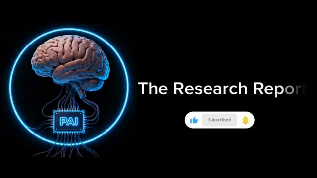
*Écran de fin de la vidéo affichant le logo de la chaîne PAI, le titre The Research Report et les boutons d'abonnement.*

---
