# 🎬 ChatGPT Image 2.5 est ARRIVÉ — Ça change tout !

> **Chaîne** : [Pursuing AI](https://www.youtube.com/@PursuingAi)  
> **Titre original** : `ChatGPT Image 2.5 Is HERE — This Changes Everything!`  
> **Lien YouTube** : [https://www.youtube.com/watch?v=xzrAGK7_5qY](https://www.youtube.com/watch?v=xzrAGK7_5qY)  
> **Date de publication** : 2026-08-22  
> **Durée** : 07m 08s (`428s`)  
> **Identifiant vidéo** : `xzrAGK7_5qY`  
> **Fiche Web Interactive** : [2026-08-22_YT-xzrAGK7_5qY_ChatGPT Image 2.5 est ARRIVÉ — Ça change tout !_by-whisper-v3-large-turbo+gemini-3.5-flash-lite.html](2026-08-22_YT-xzrAGK7_5qY_ChatGPT Image 2.5 est ARRIVÉ — Ça change tout !_by-whisper-v3-large-turbo+gemini-3.5-flash-lite.html)  
> **Captures de démonstration clés** : `33 captures réelles (anti-talking-head)`  
> **Modèles utilisés** : Audio: `large-v3-turbo` (Faster-Whisper int8 VPS) | Vision: `gemini-3.5-flash-lite` (Google AI Studio API)  

---

## 📌 Synthèse Exécutive & Outils

### 📌 Résumé
La vidéo de *Pursuing AI* offre une plongée fascinante et prospective au cœur des dernières avancées mondiales en matière de robotique humanoïde et d'intelligence artificielle générative. Le sujet central explore la transition rapide des prototypes de laboratoire vers des applications commerciales et industrielles concrètes, telles que démontrées lors de la Conférence mondiale sur les robots (WRC) à Pékin. Les créateurs et analystes y découvrent comment l'IA physique franchit un cap décisif, alliant des modèles d'action mondiaux, une conscience environnementale en temps réel et des interactions émotionnelles de plus en plus troublantes de réalisme. 

L'analyse détaille les méthodes et techniques novatrices déployées par des acteurs majeurs comme Galbot et UBtech. On y observe des robots capables d'apprendre par imitation directe, d'ajuster leur équilibre en temps réel grâce au retour tactile, ou encore d'interagir commercialement avec un public dans des environnements imprévisibles. Le workflow présenté met en lumière la symbiose croissante entre la vision par ordinateur, le contrôle à faible latence et l'apprentissage comportemental, tout en soulignant les défis techniques persistants, à l'instar des crashs spectaculaires lors des tests de vitesse. 

Pour les créateurs de contenu vidéo et les veilleurs technologiques, ces informations fournissent des clés stratégiques indispensables pour anticiper les tendances du marché. En parallèle, la vidéo aborde les fuites concernant les modèles de pointe — qu'il s'agisse des mystérieux points de contrôle d'image de type GPT (Luna Lisa Alpha) ou des rumeurs de déploiement autour des architectures d'Anthropic (Claude/Fable). Ces éléments permettent de saisir la temporalité tactique et la guerre des communiqués que se livrent les géants de la tech, offrant un panorama idéal pour comprendre l'impact de l'IA sur la création visuelle et l'automatisation de demain.

### 🛠️ Outils, Modèles & Logiciels Présentés
* **Claude** : Assistant conversationnel et modèle d'intelligence artificielle d'Anthropic, évoqué dans le cadre de rumeurs de tests en arrière-plan et de déploiements discrets de nouvelles versions.
* **Galbot ET1** : Robot humanoïde bipède doté d'un modèle d'action mondial, capable d'apprendre par imitation humaine directe et d'interagir dans des environnements commerciaux.
* **UBTech Walker S / Robots de soins** : Lumanoïdes sophistiqués intégrant le suivi des mouvements en temps réel, la répartition du poids et la reconnaissance émotionnelle pour un usage industriel et d'accompagnement.
* **GPT Image (Luna Lisa Alpha)** : Point de contrôle d'image mystérieux repéré dans Arena, caractérisé par une netteté accrue et une suppression du grain, pressenti comme une future version d'OpenAI.

### 🔑 Points Clés & Enseignements Stratégiques
1. **L'apprentissage par imitation directe** : Les modèles d'action mondiaux permettent aux robots d'observer un geste humain en direct, de le copier instantanément et d'exécuter le mouvement de manière fluide.
2. **L'autonomie décisionnelle contextuelle** : Les robots intègrent désormais des boucles de rétroaction qui analysent l'affluence en temps réel pour adapter leur comportement commercial (danser, attirer l'attention, orienter les clients).
3. **Le réalisme expressif et émotionnel** : Les entreprises misent sur des micro-mouvements (clignements des yeux, orientation du regard, inclinaison de la tête) pour rendre l'interaction homme-robot plus naturelle et moins rigide.
4. **La rentabilité comme juge de paix** : Au-delà de la prouesse technique, la viabilité de la robotique humanoïde se mesure désormais à sa capacité à s'intégrer dans la chaîne de valeur industrielle (ex. fabrication de VE) pour générer des profits.
5. **La gestion de l'équilibre dynamique** : Le contrôle à faible latence et l'utilisation du retour tactile sont indispensables pour permettre à un robot de danser ou de se mouvoir en synchronisation parfaite avec un partenaire humain.
6. **Le défi critique de la décélération** : Les tests de course démontrent que faire courir un humanoïde est une chose, mais maîtriser son arrêt d'urgence pour éviter les collisions destructrices reste un écueil technologique majeur.
7. **L'optimisation visuelle des modèles génératifs** : Les fuites de points de contrôle (comme Luna Lisa Alpha) montrent que la suppression des artefacts visuels (bruit, grain) constitue l'axe principal d'amélioration des IA de génération d'images.
8. **La guerre tactique des sorties de modèles** : Les lancements d'IA ne répondent plus seulement à un calendrier technique, mais s'inscrivent dans des stratégies d'alignement concurrentiel (observer la concurrence avant de libérer une mise à jour).
9. **Le déploiement en conditions réelles (Shadow Testing)** : Les indices de tests dits "gris" ou de bascules discrètes sur les interfaces web confirment que les entreprises testent leurs modèles à grande échelle sur de vrais utilisateurs avant une officialisation.
10. **La convergence des technologies multimodales** : L'intégration des modèles vision-langage dans la robotique mobile marque la fin des automates programmés au profit de machines capables de raisonner dans un espace imprévisible.

---

## ⏱️ Chronologie & Transcription Complète Audio & Visuelle (Mot pour Mot)

### ⏱️ `[00:00:00 - 00:00:32]` | Segment #01

**🔊 Audio (Transcription Intégrale Mot pour Mot en Français) :**
> Votre waifu IA est arrivée. Et apparemment, votre partenaire de danse robotique est arrivé aussi. Les robots humanoïdes deviennent sérieusement bizarres et sérieusement impressionnants. C'est Pursuing AI, et vous regardez le Research Report. Entrons dans le vif du sujet. Galbot vient de présenter son tout premier robot humanoïde sur scène au WRC 2026, et c'est un pas en avant assez important pour l'entreprise. Jusqu'à présent, Galbot construisait principalement des robots sur roues. Maintenant, ils dotent leur robot de deux jambes. C'est le ET1. Et oui, visuellement, vous pourriez le regarder et penser,

**👁️ Analyse Visuelle d'Écran (gemini-3.5-flash-lite) :**
**Interface & Outils** : Extrait vidéo promotionnel de l'entreprise Galbot (provenant de Bilibili) montrant ses technologies robotiques.

**Contenu textuel & Code** : Texte affiché à l'écran sur l'image 4 : Logo "GALBOT", "AstraBrain Agent 唤醒..." et "视觉识别：检测到人物靠近，执行召唤动作".

**Action / Démonstration** : Présentation du robot humanoïde ET1 de Galbot qui exécute des mouvements de danse et de reconnaissance visuelle.

*Un robot humanoïde féminin réaliste tenant un bouquet de fleurs.*

*Une animation visuelle représentant un cerveau humain dans un cercle lumineux sur fond noir.*

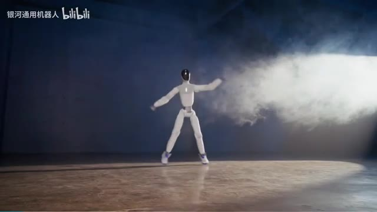
*Le robot humanoïde ET1 de Galbot effectuant une danse sur scène dans un décor enfumé.*

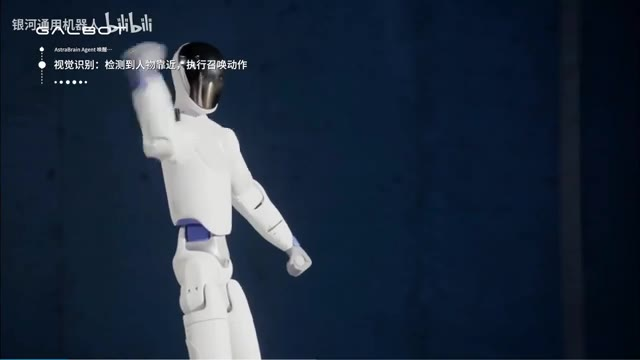
*Gros plan sur le robot humanoïde de Galbot avec des superpositions de texte en chinois et le logo GALBOT.*

---

### ⏱️ `[00:00:33 - 00:00:58]` | Segment #02

**🔊 Audio (Transcription Intégrale Mot pour Mot en Français) :**
> Attends, n'est-ce pas un Unitree R1 ? Mais le corps n'est pas vraiment la partie intéressante ici. C'est l'IA qui tourne à l'intérieur. Galbot a construit un modèle d'action mondial conçu pour contrôler différents types de robots, pas seulement des humanoïdes, mais aussi des robots à roues et même des machines à forte charge. Et on peut réellement voir le modèle apprendre. Un humain effectue un mouvement devant l'ET1, le robot regarde, le copie et commence à bouger tout seul.

**👁️ Analyse Visuelle d'Écran (gemini-3.5-flash-lite) :**
**Interface & Outils** : Démonstration vidéo de robotique (Galbot / Bilibili) montrant des interactions entre un humain et un robot humanoïde.

**Contenu textuel & Code** : Texte en chinois et en anglais à l'écran indiquant l'apprentissage par imitation des mouvements et l'exécution de stratégies de danse.

**Action / Démonstration** : Le robot humanoïde observe les mouvements d'un être humain puis les reproduit et les exécute de manière autonome.

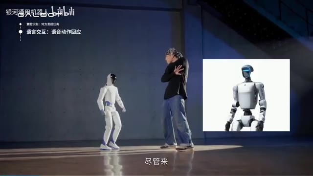
*Un robot humanoïde et un humain face à face dans un studio, avec une incrustation montrant un modèle 3D du robot.*

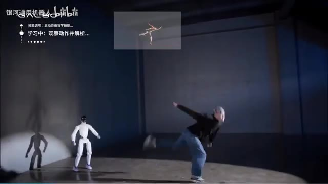
*Le robot humanoïde observe un humain effectuant une danse ou un mouvement dynamique, avec un schéma de capture de mouvement en haut.*

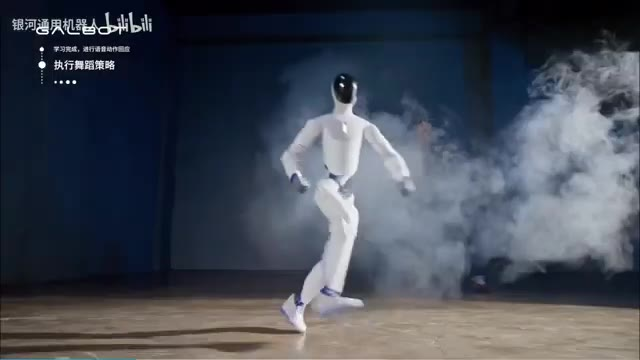
*Le robot humanoïde exécute seul une chorégraphie de danse au milieu de fumée artificielle.*

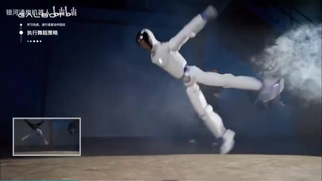
*Le robot humanoïde effectue une figure de danse complexe et aérienne avec un retour vidéo en incrustation.*

---

### ⏱️ `[00:00:58 - 00:01:17]` | Segment #03

**🔊 Audio (Transcription Intégrale Mot pour Mot en Français) :**
> Et honnêtement, le mouvement est assez impressionnant, surtout la façon dont il utilise ses hanches et ses cheville pour garder le mouvement fluide au lieu d'avoir l'air d'un robot rigide suivant des étapes préprogrammées. Mais ensuite, Galbat va encore plus loin. Ils mettent l'ET1 à l'extérieur et lui donnent un vrai travail. Le robot travaille à un stand de snacks.

**👁️ Analyse Visuelle d'Écran (gemini-3.5-flash-lite) :**
**Interface & Outils** : Vidéo de démonstration de robotique (source Bilibili / Galbot).

**Contenu textuel & Code** : Texte en haut à gauche en chinois (ex: "学习完成，进行语音动作回应", "执行舞蹈策略") et sous-titres en bas ("我来做你的卖货搭子吧").

**Action / Démonstration** : Le robot humanoïde démontre des capacités de danse avancées en intérieur, puis se retrouve en extérieur à travailler dans un stand de snacks.

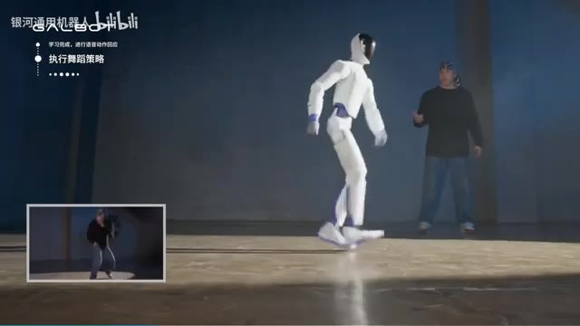
*Le robot humanoïde blanc ET1 effectue des mouvements de danse fluides dans un entrepôt, avec une incrustation vidéo montrant une personne effectuant la même danse en référence.*

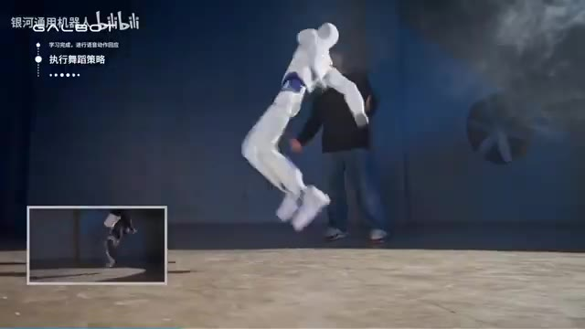
*Le robot humanoïde ET1 exécute un saut dynamique dans l'entrepôt, illustrant la souplesse de ses articulations.*

*Le robot humanoïde ET1 interagit en extérieur près d'un stand de snacks coloré tenu par une personne.*

---

### ⏱️ `[00:01:18 - 00:01:51]` | Segment #04

**🔊 Audio (Transcription Intégrale Mot pour Mot en Français) :**
> Son système surveille l'environnement en temps réel, calculant combien de personnes sont autour, ce qui se passe et ce qu'il devrait faire ensuite. Le système se dit en gros : l'affluence est faible. ET1 décide donc d'attirer un peu l'attention. Il commence à danser, puis il interagit avec les gens, les oriente vers les collations saines, parle aux enfants et aux adultes, et continue jusqu'à ce qu'il atteigne son objectif de vente. Et une fois l'objectif atteint, ouais, une autre danse. Fondé en 2023 par le professeur He Wang de l'Université de Pékin, Galbot construit à la fois les robots et l'IA derrière eux.

**👁️ Analyse Visuelle d'Écran (gemini-3.5-flash-lite) :**
**Interface & Outils** : Présentation face caméra sans partage d'écran

**Contenu textuel & Code** : Aucun écran de logiciel, code ou interface utilisateur de démonstration n'est visible dans ce segment vidéo.

**Action / Démonstration** : Le créateur montre une vidéo d'illustration en plein écran d'un robot humanoïde (Galbot ET1) interagissant avec des personnes et effectuant des actions dans un environnement extérieur.

---

### ⏱️ `[00:01:51 - 00:02:11]` | Segment #05

**🔊 Audio (Transcription Intégrale Mot pour Mot en Français) :**
> Et l'entreprise viserait désormais une introduction en bourse à Hong Kong pour une valorisation d'environ 4 milliards de dollars. Bon, votre waifu en IA vient de devenir réelle. Et honnêtement, ces robots ont l'air beaucoup trop réels. Regardez juste le visage, la peau, les yeux, les petits mouvements de tête, et même la façon dont ils clignent des yeux et déplacent leur attention.

**👁️ Analyse Visuelle d'Écran (gemini-3.5-flash-lite) :**
**Interface & Outils** : Interfaces de démonstration vidéo intégrant des incrustations graphiques de suivi (statistiques de capteurs en bas à gauche de l'image 1) et présentations de salon professionnel.

**Contenu textuel & Code** : Sur l'image 1, du texte en chinois en haut à gauche ("银河通用机器人", "高动感具身执行中...") et des icônes de menu d'état (Danse, Tâches, Vente interactive). Sur les images 2 et 3, le logo "UBTECH 9880.HK".

**Action / Démonstration** : Le robot humanoïde exécute un coup de pied dynamique sur l'image 1, tandis que les images 2 et 3 montrent un buste robotique féminin aux finitions extrêmement réalistes présenté en exposition.

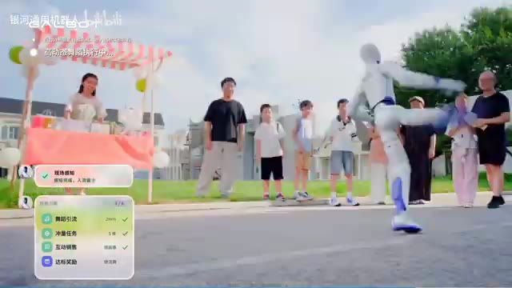
*Un robot humanoïde effectuant un mouvement de karaté ou d'arts martiaux en extérieur devant des spectateurs, avec une interface incrustée affichant des données de statut et des indicateurs de performance.*

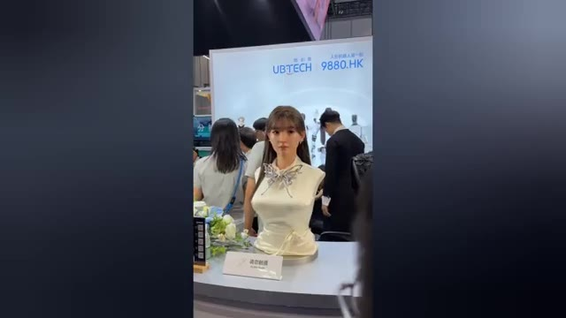
*Un buste de robot humanoïde hyperréaliste à l'apparence féminine, exposé sur un stand de salon avec le logo UBTECH 9880.HK en arrière-plan.*

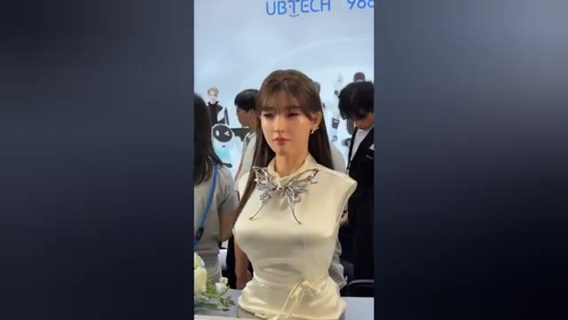
*Gros plan sur le visage et le buste ultra-réaliste d'un robot humanoïde féminin au salon UBTECH, montrant des traits faciaux très détaillés.*

---

### ⏱️ `[00:02:12 - 00:02:32]` | Segment #06

**🔊 Audio (Transcription Intégrale Mot pour Mot en Français) :**
> Ce sont ces petits détails qui vous font regarder à deux fois. UB Tech a présenté ces humanoïdes de soins émotionnels à la Conférence mondiale sur les robots à Pékin. Et ils n'essayent pas seulement de les rendre fonctionnels, ils essaient de les faire se sentir humains. Le robot peut suivre vos yeux, tourner sa tête vers vous, cligner des yeux, incliner sa tête et réagir à ce qui se passe autour de lui.

**👁️ Analyse Visuelle d'Écran (gemini-3.5-flash-lite) :**
**Interface & Outils** : Présentation face caméra / reportage vidéo sans partage d'écran logiciel.

**Contenu textuel & Code** : Séquence vidéo montrant des robots humanoïdes réalistes lors d'un salon technologique.

**Action / Démonstration** : Présentation visuelle de robots humanoïdes de soins émotionnels développés par UB Tech.

---

### ⏱️ `[00:02:32 - 00:03:05]` | Segment #07

**🔊 Audio (Transcription Intégrale Mot pour Mot en Français) :**
> Et d'une certaine manière, ces minuscules mouvements font une énorme différence. Parce qu'un robot qui ramasse une boîte, c'est une chose, mais quand il vous regarde directement comme s'il écoutait vraiment, ouais, ça fait une différence. Uptek cible ces robots pour la compagnie et les soins, avec des modèles individuels coûtant environ 24 000 $. Ce n'est vraiment pas bon marché. Mais avec plus de 300 entreprises qui présentent maintenant de la robotique à la conférence, nous allons clairement au-delà des robots qui se contentent de travailler. Ces entreprises essaient de construire des robots qui peuvent réellement interagir avec nous. Et honnêtement, je ne sais pas si c'est vraiment

**👁️ Analyse Visuelle d'Écran (gemini-3.5-flash-lite) :**
**Interface & Outils** : Présentation vidéo de démonstration des robots humanoïdes d'Uptek.

**Contenu textuel & Code** : Visuels de robots humanoïdes de compagnie dotés de mouvements et de traits réalistes.

**Action / Démonstration** : Les robots humanoïdes bougent subtilement et affichent des expressions interactives face caméra.

*Gros plan sur le visage détaillé d'un androïde humanoïde Uptek simulant des expressions faciales réalistes.*

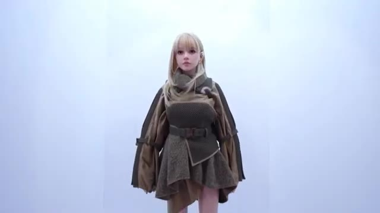
*Vue de plain-pied d'un robot humanoïde humanoïde Uptek habillé avec des vêtements de type stylisé.*

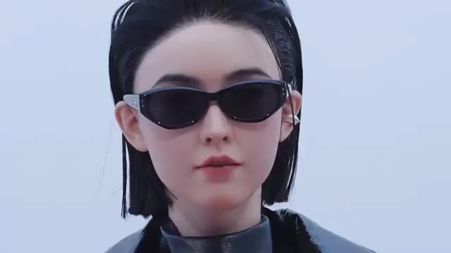
*Gros plan sur le visage d'un autre androïde humanoïde Uptek portant des lunettes de soleil.*

*Gros plan sur le bas du visage et les bijoux d'un androïde humanoïde Uptek montrant le niveau de détail esthétique.*

---

### ⏱️ `[00:03:05 - 00:03:41]` | Segment #08

**🔊 Audio (Transcription Intégrale Mot pour Mot en Français) :**
> cool ou légèrement terrifiant. Mais chaque robot ne passe pas une excellente journée. Et puis les choses tournent sérieusement mal. Ce robot humanoïde s'entraîne pour les Jeux mondiaux des robots humanoïdes 2026 à Pékin, et il file à toute allure sur la piste. Mais en s'approchant de la fin, il y a un problème, il ne s'arrête pas. Le robot s'écrase directement dans la barrière de sécurité à pleine vitesse. L'impact fait pencher son corps vers l'avant, des étincelles commencent à jaillir, et en quelques secondes, le tout s'effondre simplement sur la piste. Ouais, ça ne faisait définitivement pas partie du plan d'entraînement. Et c'est un très bon rappel

**👁️ Analyse Visuelle d'Écran (gemini-3.5-flash-lite) :**
**Interface & Outils** : Vidéo de démonstration sportive montrant un test de robot humanoïde en salle.

**Contenu textuel & Code** : Aucun texte ou code affiché, visionnage d'une séquence vidéo d'un robot courant sur une piste d'athlétisme couverte.

**Action / Démonstration** : Un robot humanoïde court sur une piste, ne s'arrête pas à la fin et s'écrase violemment contre la barrière de sécurité.

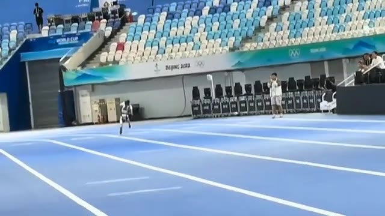
*Un robot humanoïde courant sur une piste d'athlétisme bleue dans un grand stade intérieur.*

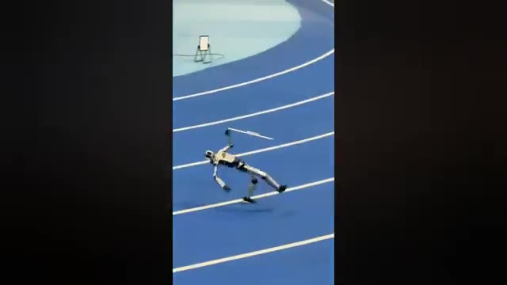
*Le robot humanoïde en train de chuter et de glisser sur la piste bleue.*

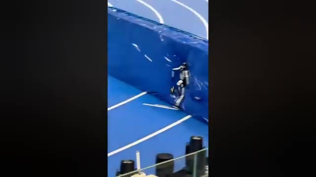
*Le robot humanoïde encastré dans la barrière de sécurité bleue à l'extrémité de la piste.*

---

### ⏱️ `[00:03:41 - 00:04:18]` | Segment #09

**🔊 Audio (Transcription Intégrale Mot pour Mot en Français) :**
> que faire courir vite un robot humanoïde est un défi. Le faire s'arrêter quand il est censé le faire en est un autre. Maintenant, nous avons une autre fuite intéressante concernant l'IA. Un nouveau point de contrôle d'image GPT a apparemment commencé à apparaître dans Arena, et celui-ci porte le nom de Luna Lisa Alpha. Maintenant, le nom en lui-même ne nous dit pas grand-chose, mais les images le font. Comparé au point de contrôle Mona Lisa précédent, cette version a l'air nettement plus propre et plus réaliste. Et l'un des plus grands changements, ce bruit et ce grain bizarres que nous avons vus auparavant, semble avoir complètement disparu. La partie intéressante est que

**👁️ Analyse Visuelle d'Écran (gemini-3.5-flash-lite) :**
**Interface & Outils** : Capture d'écran textuelle d'informations sur les modèles d'IA et exemples d'images générées

**Contenu textuel & Code** : Texte sur l'image 2 : "GPT-Image 2.5 Leaks: 'Luna-Lisa-Alpha'" listant les points clés des fuites et le logo "GPT Image 2.5". Texte sur l'image 4 : "Charlie Kirk is DEAD. Charlie Kirk, the conservative commentator and founder of Turning Point USA, has died."

**Action / Démonstration** : Démonstration visuelle illustrant les propos du narrateur sur la course des robots humanoïdes, les fuites de checkpoints d'IA et les exemples d'images générées plus réalistes.

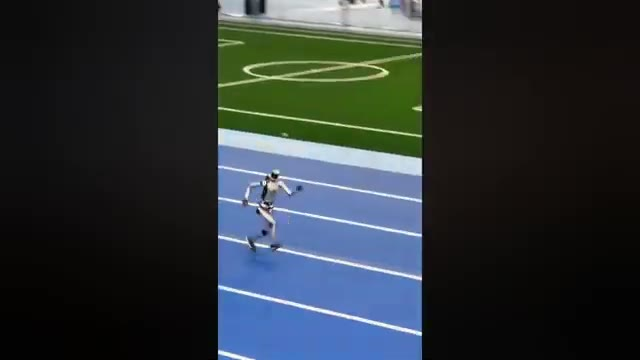
*Vidéo d'un robot humanoïde courant rapidement sur une piste d'athlétisme en intérieur*

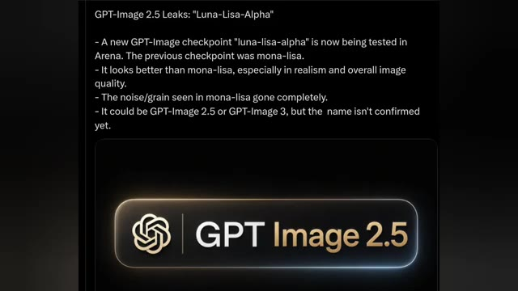
*Texte informatif détaillant les fuites sur le modèle GPT-Image 2.5 et le point de contrôle 'Luna-Lisa-Alpha'*

*Image générée par IA montrant un faux selfie ultra-réaliste de Will Smith mangeant des spaghettis*

*Image générée par IA d'un faux article de presse annonçant la mort de Charlie Kirk avec du texte superposé*

---

### ⏱️ `[00:04:18 - 00:04:51]` | Segment #10

**🔊 Audio (Transcription Intégrale Mot pour Mot en Français) :**
> Personne ne sait vraiment encore ce qu'est ce modèle. Cela pourrait être GPT Image 2.5, ou même GPT Image 3. Le nom n'a pas été confirmé, alors pour l'instant nous regardons essentiellement un point de contrôle mystère qui semble être une mise à niveau assez importante. Et s'il s'agit vraiment de la prochaine génération d'image GPT, les choses vont devenir très intéressantes. UBtech montre pourquoi la course des robots humanoïdes devient beaucoup plus sérieuse. Lors de la Conférence mondiale sur les robots, l'entreprise a démontré son Walker S faisant quelque chose qui a l'air simple au début, mais qui est en réalité incroyablement difficile pour un robot.

**👁️ Analyse Visuelle d'Écran (gemini-3.5-flash-lite) :**
**Interface & Outils** : Présentation vidéo d'actualités technologiques combinant des captures d'écran textuelles et des séquences vidéo de robots lors d'un salon professionnel (World Robot Conference).

**Contenu textuel & Code** : Texte à l'écran : "GPT-Image 2.5 Leaks: 'Luna-Lisa-Alpha'" listant les points clés d'un nouveau checkpoint testé dans Arena, comparant les améliorations de réalisme par rapport à "mona-lisa", et affichant le logo "GPT Image 2.5".

**Action / Démonstration** : Présentation d'informations textuelles sur les modèles d'IA générative d'images, suivie d'une séquence vidéo démontrant les capacités dynamiques d'un robot humanoïde (Walker S) en interaction physique fluide avec un humain.

*Capture d'écran montrant des informations textuelles sur les fuites de GPT-Image 2.5 ("Luna-Lisa-Alpha") et un logo stylisé de GPT Image 2.5.*

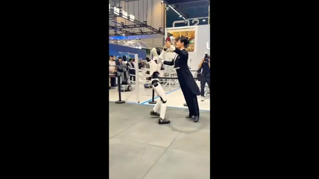
*Démonstration du robot humanoïde Walker S d'UBtech en train de danser avec un partenaire humain lors de la Conférence mondiale sur les robots.*

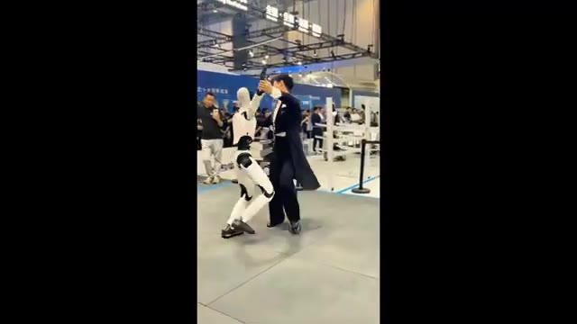
*Vue sous un autre angle du robot humanoïde Walker S d'UBtech effectuant des mouvements de danse complexes avec un partenaire humain.*

---

### ⏱️ `[00:04:52 - 00:05:14]` | Segment #11

**🔊 Audio (Transcription Intégrale Mot pour Mot en Français) :**
> Suivi des mouvements de tout le corps en temps réel. Le robot danse avec un partenaire humain et ajuste constamment son corps pour correspondre au mouvement. Et il ne se contente pas de copier ce qu'il voit. Walker S utilise le retour tactile et la répartition du poids pour effectuer de minuscules ajustements de son équilibre pendant que le mouvement se produit. Cela signifie que lorsque son partenaire bouge, le robot doit réagir presque instantanément.

**👁️ Analyse Visuelle d'Écran (gemini-3.5-flash-lite) :**
**Interface & Outils** : Présentation vidéo d'un robot humanoïde (aucun logiciel ou interface numérique affiché)

**Contenu textuel & Code** : Aucun texte, prompt ou paramètre technique visible à l'écran

**Action / Démonstration** : Le robot humanoïde Walker S danse avec un partenaire humain dans un espace d'exposition publique

---

### ⏱️ `[00:05:14 - 00:05:36]` | Segment #12

**🔊 Audio (Transcription Intégrale Mot pour Mot en Français) :**
> Et cela devient encore plus difficile lorsque vous réunissez un robot mobile, un humain et un environnement imprévisible. C'est là que des éléments tels que la détection spatiale, le contrôle à faible latence et les modèles d'action vision-langage deviennent vraiment importants. Mais UbiTech ne se contente pas de montrer cela sur une scène. L'entreprise pousse déjà ses robots humanoïdes dans des environnements industriels, notamment dans la fabrication de véhicules électriques.

**👁️ Analyse Visuelle d'Écran (gemini-3.5-flash-lite) :**
**Interface & Outils** : Vidéo de démonstration en direct / B-roll montrant un robot humanoïde interagissant avec un humain.

**Contenu textuel & Code** : Un robot humanoïde blanc et noir en train de danser en couple avec un partenaire humain habillé en costume sur une estrade. En arrière-plan, du public observe la scène dans un grand hall d'exposition.

**Action / Démonstration** : Le robot humanoïde effectue des mouvements de danse coordonnés avec un être humain, illustrant les capacités d'interaction physique et de contrôle en temps réel du robot.

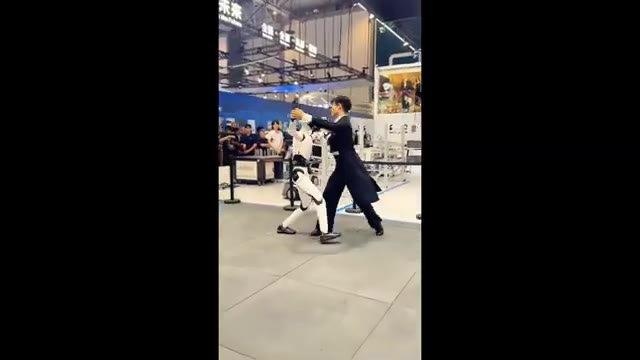
*Un robot humanoïde en train de danser avec un humain dans un environnement d'exposition ou de démonstration.*

---

### ⏱️ `[00:05:36 - 00:05:55]` | Segment #13

**🔊 Audio (Transcription Intégrale Mot pour Mot en Français) :**
> Alors que certaines entreprises montrent encore ce que leurs robots pourraient être capables de faire, UbiTech essaie de les mettre au travail. Et c'est la partie de la course aux robots humanoïdes que je surveille de plus près. Car la vraie question n'est pas : est-ce qu'un robot peut bouger comme un humain ? C'est : est-ce qu'il peut réellement gagner de l'argent en le faisant ? Il y a peut-être un autre modèle qui se profile juste au coin de la rue.

**👁️ Analyse Visuelle d'Écran (gemini-3.5-flash-lite) :**
**Interface & Outils** : Vidéo de démonstration ou reportage montrant le robot humanoïde d'UbiTech dans un espace d'exposition.

**Contenu textuel & Code** : Démonstration physique d'un robot humanoïde bipède interagissant sur scène ou dans un espace public devant un public.

**Action / Démonstration** : Le robot humanoïde exécute des mouvements aux côtés d'un humain dans un environnement de type salon professionnel ou exposition technologique.

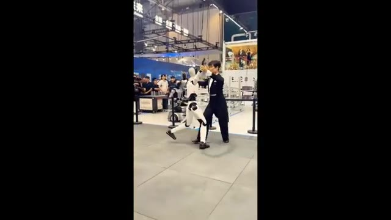
*Un robot humanoïde blanc en démonstration dans un salon, en train de danser ou d'interagir avec un humain.*

---

### ⏱️ `[00:05:55 - 00:06:14]` | Segment #14

**🔊 Audio (Transcription Intégrale Mot pour Mot en Français) :**
> Une nouvelle fuite prétend que Fable 5.1 pourrait arriver entre le 1er et le 14 septembre. Et apparemment, il est déjà en cours de test. Certains utilisateurs de Claude web affirment même que leurs comptes ont été basculés discrètement sur la version 5.1 lors de ce qui ressemble à un déploiement limité. Mais voici la partie qui rend cette rumeur intéressante.

**👁️ Analyse Visuelle d'Écran (gemini-3.5-flash-lite) :**
**Interface & Outils** : Navigateur web affichant un fil d'actualité ou un message provenant de la plateforme X (anciennement Twitter).

**Contenu textuel & Code** : Texte à l'écran : "FABLE 5.1 MAY BE WAITING FOR ASTRA" et plusieurs puces résumant les informations sur les tests en cours, le déploiement gris sur Claude Web, et la comparaison avec le lancement d'OpenAI Astra. Une image d'illustration avec des personnes et une main robotique est intégrée dans le tweet.

**Action / Démonstration** : Affichage à l'écran d'une publication textuelle sur les réseaux sociaux résumant les fuites et les théories concernant la sortie prochaine de Fable 5.1.

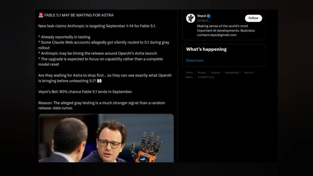
*Capture d'écran d'un tweet du compte Vepsi détaillant les rumeurs autour de la sortie de Fable 5.1 par Anthropic.*

---

### ⏱️ `[00:06:14 - 00:06:48]` | Segment #15

**🔊 Audio (Transcription Intégrale Mot pour Mot en Français) :**
> Des spéculations indiquent qu'Anthropic pourrait synchroniser le lancement autour d'Astra d'OpenAI. En gros, laisser OpenAI abattre ses cartes en premier, voir ce qu'Astra peut réellement faire, puis lâcher Fable 5.1. Si cela se produit vraiment, il pourrait s'agir moins d'une mise à jour de modèle normale que d'un mouvement stratégique dans la course aux armements de l'intelligence artificielle. La mise à jour elle-même devrait améliorer les capacités plutôt que de réinventer complètement le modèle. Et selon l'estimation de Vepsi, il y a 80 % de chances que Fable 5.1 arrive en septembre. Évidemment, rien de tout cela n'est confirmé.

**👁️ Analyse Visuelle d'Écran (gemini-3.5-flash-lite) :**
**Interface & Outils** : Interface du réseau social X (Twitter) affichant un fil de discussion et un profil utilisateur.

**Contenu textuel & Code** : Texte du tweet : "FABLE 5.1 MAY BE WAITING FOR ASTRA. New leak claims Anthropic is targeting September 1-14 for Fable 5.1. Already reportedly in testing, some Claude Web accounts allegedly got silently routed to 5.1 during gray rollout, Anthropic may be timing the release around OpenAI's Astra launch, The upgrade is expected to focus on capability rather than a complete model reset. Are they waiting for Astra to drop first... so they can see exactly what OpenAI is bringing before unleashing 5.1? Vepsi's Bet: 80% chance Fable 5.1 lands in September. Reason: The alleged gray testing is a much stronger signal than a random release-date rumor." Une image intégrée montre deux personnes, dont une avec une main robotique. Le panneau latéral montre le profil de Vepsi (@vepsi_).

**Action / Démonstration** : Affichage d'un article ou d'un post provenant de la plateforme X pour illustrer les rumeurs sur la sortie de Fable 5.1 et la stratégie d'Anthropic face à OpenAI Astra.

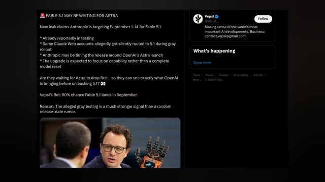
*Capture d'écran d'un tweet et d'un profil X (Twitter) du compte @vepsi_ discutant de la sortie potentielle de Fable 5.1 par rapport au lancement d'Astra par OpenAI.*

---

### ⏱️ `[00:06:48 - 00:07:04]` | Segment #16

**🔊 Audio (Transcription Intégrale Mot pour Mot en Français) :**
> Pourtant, mais ce test gris présumé, c'est ce qui rend cette rumeur intéressante à suivre. Parce qu'une rumeur de date de sortie aléatoire est une chose, mais des utilisateurs déjà redirigés vers le nouveau modèle, c'est un signal très différent. Et si ces fuites sont correctes, septembre pourrait devenir très intéressant.

**👁️ Analyse Visuelle d'Écran (gemini-3.5-flash-lite) :**
**Interface & Outils** : Navigateur web affichant un fil d'actualité ou un tweet sur la plateforme X (anciennement Twitter).

**Contenu textuel & Code** : Texte principal : « FABLE 5.1 MAY BE WAITING FOR ASTRA. New leak claims Anthropic is targeting September 1-14 for Fable 5.1. Already reportedly in testing. Some Claude Web accounts allegedly got silently routed to 5.1 during gray rollout. Anthropic may be timing the release around OpenAI's Astra launch. The upgrade is expected to focus on capability rather than a complete model reset. Are they waiting for Astra to drop first... so they can see exactly what OpenAI is bringing before unleashing 5.1? 👀 Vepsi's Bet: 80% chance Fable 5.1 lands in September. Reason: The alleged gray testing is a much stronger signal than a random release-date rumor. » Un profil utilisateur « Vepsi » est également visible avec sa biographie.

**Action / Démonstration** : Affichage à l'écran d'une publication textuelle sur les réseaux sociaux détaillant les fuites concernant Fable 5.1.

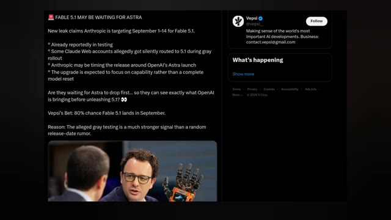
*Capture d'écran d'un tweet et d'un article détaillant les rumeurs sur le lancement imminent de Fable 5.1 par Anthropic.*

---
