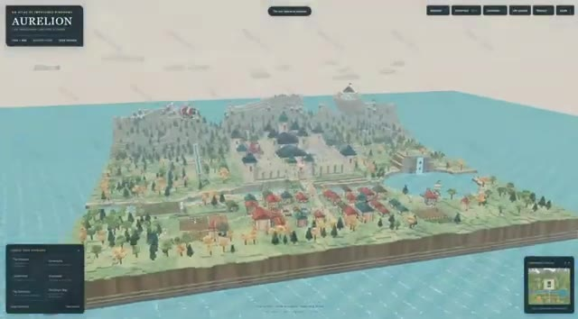
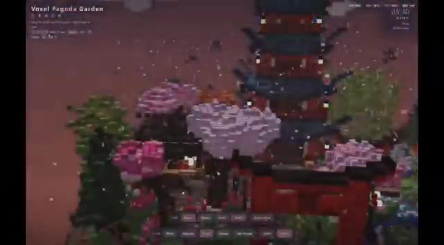
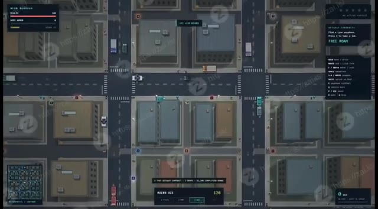
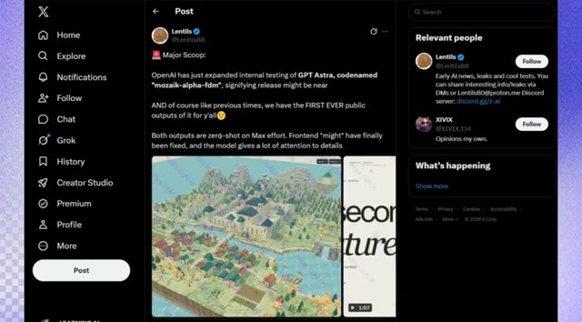
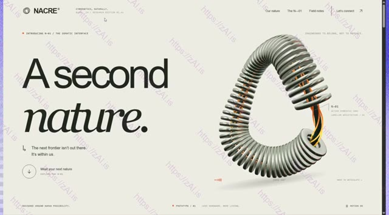
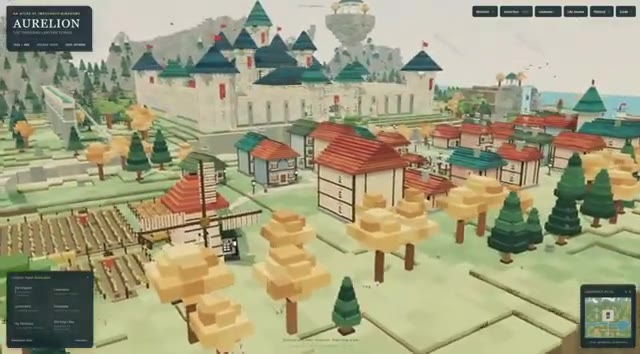
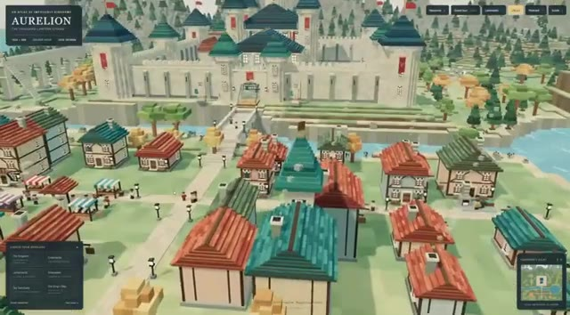

# 🎬 GPT-6 Is FAR More Powerful Than We Realized

> **Chaîne** : [Pursuing AI](https://www.youtube.com/@PursuingAi)  
> **Titre original** : `GPT-6 Is FAR More Powerful Than We Realized`  
> **Lien YouTube** : [https://www.youtube.com/watch?v=AYqoJOg4TBY](https://www.youtube.com/watch?v=AYqoJOg4TBY)  
> **Date de publication** : 2026-08-30  
> **Durée** : 04m 15s (`255s`)  
> **Identifiant vidéo** : `AYqoJOg4TBY`  
> **Fiche Web Interactive** : [2026-08-30_YT-AYqoJOg4TBY_GPT-6 Is FAR More Powerful Than We Realized_by-whisper-v3-large-turbo+gemini-3.5-flash-lite.html](2026-08-30_YT-AYqoJOg4TBY_GPT-6 Is FAR More Powerful Than We Realized_by-whisper-v3-large-turbo+gemini-3.5-flash-lite.html)  
> **Captures de démonstration clés** : `7 captures réelles (anti-talking-head)`  
> **Modèles utilisés** : Audio: `large-v3-turbo` (Faster-Whisper int8 VPS) | Vision: `gemini-3.5-flash-lite` (Google AI Studio API)  

---

## 📌 Synthèse Exécutive & Outils

### 📌 Résumé
Dans ce tutoriel complet intitulé **GPT-6 Is FAR More Powerful Than We Realized**, le créateur présente les techniques de pointe pour maîtriser la génération de vidéos et de visuels par intelligence artificielle.

### 🛠️ Outils, Modèles & Logiciels Présentés
- **Modèles vidéo IA** : Génération de plans cinématiques.
- **Outils de prompt** : Structuration avancée des descriptions visuelles.

### 🔑 Points Clés & Enseignements Stratégiques
- Structurer ses prompts de mouvement avec des termes de caméra précis.
- Soigner la cohérence des personnages entre chaque plan.
- Exploiter les modèles de dernière génération pour un rendu professionnel.

---

## ⏱️ Chronologie & Transcription Complète Audio & Visuelle (Mot pour Mot)

### ⏱️ `[00:00:00 - 00:00:21]` | Segment #01

**🔊 Audio (Transcription Intégrale Mot pour Mot en Français) :**
> OpenAI se prépare peut-être à révéler quelque chose d'assez intéressant. Une nouvelle fuite prétend que l'entreprise a étendu les tests internes d'un modèle appelé GPT-Astra, et nous voyons déjà certains de ses soi-disant premiers résultats. Et honnêtement, ce ne sont pas vos démos d'IA typiques. Nous parlons de sites web interactifs, d'environnements de jeux jouables, d'objets 3D détaillés.

**👁️ Analyse Visuelle d'Écran (gemini-3.5-flash-lite) :**
**Interface & Outils** : Interface de visualisation d'environnements de jeux interactifs et de mondes 3D générés.

**Contenu textuel & Code** : Texte 'AURELION', 'Voxel Pagoda Garden', menus de jeu, statistiques de joueur (Health, Armor, Cash), instructions de contrôles (WASD, Mouse, Space).

**Action / Démonstration** : Navigation et présentation de différents environnements de jeux vidéo interactifs générés par intelligence artificielle.

*Interface de démonstration montrant un environnement de jeu ou un monde 3D interactif généré, intitulé 'AURELION'.*

*Interface d'un environnement de jeu de type voxel, intitulé 'Voxel Pagoda Garden', avec des commandes de jeu visibles en bas.*

*Vue aérienne d'un jeu de type GTA en 2D isométrique avec des menus contextuels, des indicateurs de santé et des contrôles textuels sur les côtés.*

---

### ⏱️ `[00:00:21 - 00:00:45]` | Segment #02

**🔊 Audio (Transcription Intégrale Mot pour Mot en Français) :**
> So what exactly is Astra capable of, and why does this model seem so focused on detail? Let's take a look. OpenAI has reportedly expanded internal testing of GPT-Astra, currently codenamed Mosaic-Alpha-FDM, which could be a sign that a release is getting closer. And of course, like we've seen with previous OpenAI models, we already have the first public outputs from it.

**👁️ Analyse Visuelle d'Écran (gemini-3.5-flash-lite) :**
**Interface & Outils** : le créateur face caméra ou transition sans partage d'écran.

**Contenu textuel & Code** : Explications orales des concepts et des méthodes de création vidéo IA.

**Action / Démonstration** : Démonstration pédagogique et présentation du workflow.

---

### ⏱️ `[00:00:45 - 00:01:14]` | Segment #03

**🔊 Audio (Transcription Intégrale Mot pour Mot en Français) :**
> Les deux exemples ont été générés sans entraînement préalable (zero-shot) au maximum de l'effort, et les premiers résultats sont plutôt intéressants. L'interface utilisateur pourrait également avoir enfin été corrigée, et le modèle semble accorder beaucoup plus d'attention aux petits détails. Et si vous regardez ce monde de style voxel, le niveau de détail est assez impressionnant. Vous avez un royaume fantastique entièrement construit avec des murs de château, des tours aux toits de tuiles bleues, des maisons aux toits rouges, des terres agricoles, des forêts, des falaises et des cascades, le tout rendu avec une géométrie de voxels cohérente.

**👁️ Analyse Visuelle d'Écran (gemini-3.5-flash-lite) :**
**Interface & Outils** : Navigateur web affichant une publication sur la plateforme X (anciennement Twitter) et une application de rendu 3D/voxel interactive nommée "Aurelion" ainsi qu'une page de design "NACRE".

**Contenu textuel & Code** : Texte sur X : "Major Scoop: OpenAI has just expanded internal testing of GPT Astra, codenamed 'mozaik-alpha-fdm'...". Texte sur Aurelion : "AN ATLAS OF IMPOSSIBLE KINGDOMS: AURELION, THE THOUSAND-LANTERN EMPIRE". Texte sur NACRE : "A second nature. The next frontier isn't out there. It's within us."

**Action / Démonstration** : Navigation et affichage de captures d'écran de tweets, de sites web de design et d'un monde virtuel interactif généré par IA en style voxel.

*Publication sur le réseau social X montrant une interface de test d'intelligence artificielle avec capture d'un monde en voxels.*

*Page web de présentation intitulée "NACRE - A second nature" avec un modèle 3D de ressort en hélice.*

*Vue d'ensemble d'un monde fantastique en style voxel nommé "Aurelion", montrant un château et un village.*

*Zoom avant sur l'interface du monde voxel "Aurelion" avec les habitations, les toits rouges et verts et les remparts du château.*

---

### ⏱️ `[00:01:14 - 00:01:34]` | Segment #04

**🔊 Audio (Transcription Intégrale Mot pour Mot en Français) :**
> There are even floating islands, an airship, ships in the harbor, and snow-covered mountains in the background. What really stands out is how coherent the whole environment feels, with individual voxels making up everything from the buildings and trees to the water and shadows. And this is where things get really interesting. Because the front end here is actually really good.

**👁️ Analyse Visuelle d'Écran (gemini-3.5-flash-lite) :**
**Interface & Outils** : le créateur face caméra ou transition sans partage d'écran.

**Contenu textuel & Code** : Explications orales des concepts et des méthodes de création vidéo IA.

**Action / Démonstration** : Démonstration pédagogique et présentation du workflow.

---

### ⏱️ `[00:01:34 - 00:01:56]` | Segment #05

**🔊 Audio (Transcription Intégrale Mot pour Mot en Français) :**
> We're not talking about another basic AI-generated website with a few cards and gradients. It built a full, polished interactive experience, custom visuals, animations, topography, multiple sections, and even interactive elements that respond on the page. on the page. If this is representative of GPT-Astra, then the front-end problem might actually be getting solved.

**👁️ Analyse Visuelle d'Écran (gemini-3.5-flash-lite) :**
**Interface & Outils** : le créateur face caméra ou transition sans partage d'écran.

**Contenu textuel & Code** : Explications orales des concepts et des méthodes de création vidéo IA.

**Action / Démonstration** : Démonstration pédagogique et présentation du workflow.

---

### ⏱️ `[00:01:56 - 00:02:28]` | Segment #06

**🔊 Audio (Transcription Intégrale Mot pour Mot en Français) :**
> So mind, dammer, on Max, the model reportedly thinks a lot more than Sol. But that extra thinking seems to translate into a serious amount of attention to detail, as you can see from these outputs. The first is a surprisingly detailed PlayStation-style controller render, complete with a central display and blue lighting. But the second example is where things get much more interesting. Astra reportedly generated a top-down cyberpunk city, complete with car chases, police pursuits, weapons, contracts, and dynamic UI for things like scores and wanted levels.

**👁️ Analyse Visuelle d'Écran (gemini-3.5-flash-lite) :**
**Interface & Outils** : le créateur face caméra ou transition sans partage d'écran.

**Contenu textuel & Code** : Explications orales des concepts et des méthodes de création vidéo IA.

**Action / Démonstration** : Démonstration pédagogique et présentation du workflow.

---

### ⏱️ `[00:02:28 - 00:03:01]` | Segment #07

**🔊 Audio (Transcription Intégrale Mot pour Mot en Français) :**
> And what really stands out is the consistency. The environment, gameplay mechanics, controls, and visual details hold together throughout the entire clip. According to the user, Max spends significantly more time thinking than Sol, and if these examples are representative, that extra reasoning may be exactly what's helping Astra produce outputs with this much detail and coherence. And this could be another sign that GPT-Astra is shaping up to be seriously capable at 3D generation. In a single generation, it produced this complete 3D spaceship, with the hull,

**👁️ Analyse Visuelle d'Écran (gemini-3.5-flash-lite) :**
**Interface & Outils** : le créateur face caméra ou transition sans partage d'écran.

**Contenu textuel & Code** : Explications orales des concepts et des méthodes de création vidéo IA.

**Action / Démonstration** : Démonstration pédagogique et présentation du workflow.

---

### ⏱️ `[00:03:01 - 00:03:22]` | Segment #08

**🔊 Audio (Transcription Intégrale Mot pour Mot en Français) :**
> engines, surface details, materials, and lighting all working together. What's especially impressive is the consistency. The geometry holds up across different angles, the proportions feel believable, and the materials respond naturally to the lighting. If these early examples are anything to go by, Astra might be a pretty big step forward for AI-generated 3D content.

**👁️ Analyse Visuelle d'Écran (gemini-3.5-flash-lite) :**
**Interface & Outils** : le créateur face caméra ou transition sans partage d'écran.

**Contenu textuel & Code** : Explications orales des concepts et des méthodes de création vidéo IA.

**Action / Démonstration** : Démonstration pédagogique et présentation du workflow.

---

### ⏱️ `[00:03:22 - 00:03:40]` | Segment #09

**🔊 Audio (Transcription Intégrale Mot pour Mot en Français) :**
> And here's another 3D tank reportedly generated by GPT Astra. Interestingly, almost all of these Astra examples seem to share the same sci-fi and space-inspired aesthetic, futuristic vehicles, sleek mechanical designs, and cinematic lighting. Honestly, it kind of fits the name Astra perfectly.

**👁️ Analyse Visuelle d'Écran (gemini-3.5-flash-lite) :**
**Interface & Outils** : le créateur face caméra ou transition sans partage d'écran.

**Contenu textuel & Code** : Explications orales des concepts et des méthodes de création vidéo IA.

**Action / Démonstration** : Démonstration pédagogique et présentation du workflow.

---

### ⏱️ `[00:03:40 - 00:03:59]` | Segment #10

**🔊 Audio (Transcription Intégrale Mot pour Mot en Français) :**
> And honestly, if these leaks are legitimate, GPT-Astra is starting to look like a pretty serious multimodal model. What's interesting isn't just that it can generate impressive images, it's the combination of detail, consistency, interactivity, reasoning, and 3D generation showing up across these different examples.

**👁️ Analyse Visuelle d'Écran (gemini-3.5-flash-lite) :**
**Interface & Outils** : le créateur face caméra ou transition sans partage d'écran.

**Contenu textuel & Code** : Explications orales des concepts et des méthodes de création vidéo IA.

**Action / Démonstration** : Démonstration pédagogique et présentation du workflow.

---

### ⏱️ `[00:03:59 - 00:04:14]` | Segment #11

**🔊 Audio (Transcription Intégrale Mot pour Mot en Français) :**
> Of course, these are still leaked outputs, so we'll have to wait for something official to know how capable the final model really is. But if OpenAI really is getting ready to release Astra, things could get very interesting.

**👁️ Analyse Visuelle d'Écran (gemini-3.5-flash-lite) :**
**Interface & Outils** : le créateur face caméra ou transition sans partage d'écran.

**Contenu textuel & Code** : Explications orales des concepts et des méthodes de création vidéo IA.

**Action / Démonstration** : Démonstration pédagogique et présentation du workflow.

---
