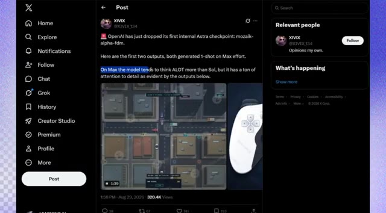
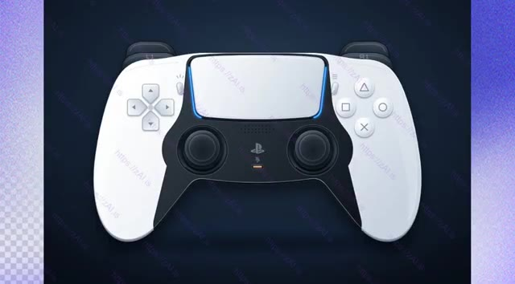
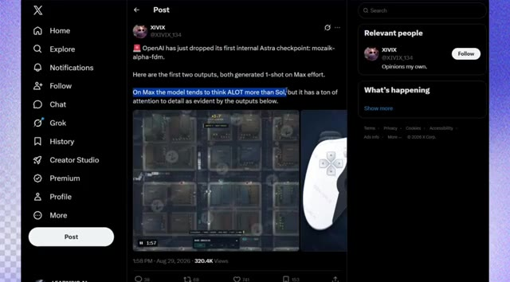
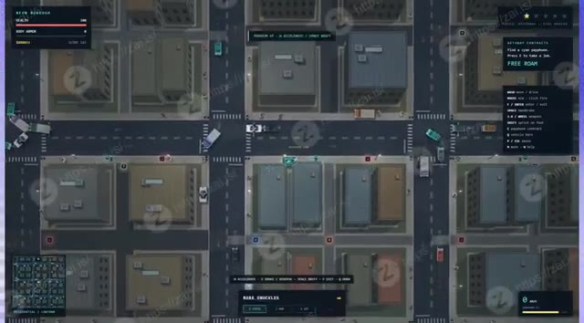
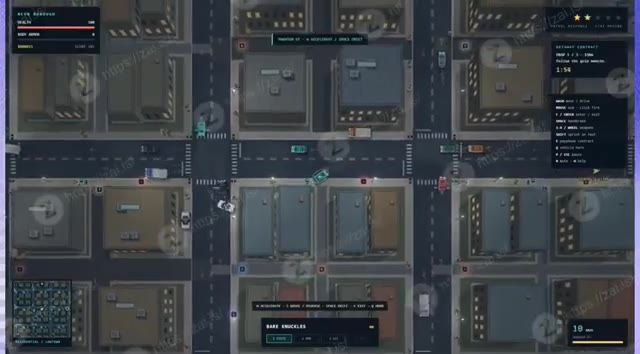
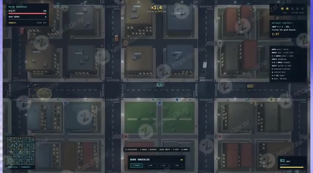
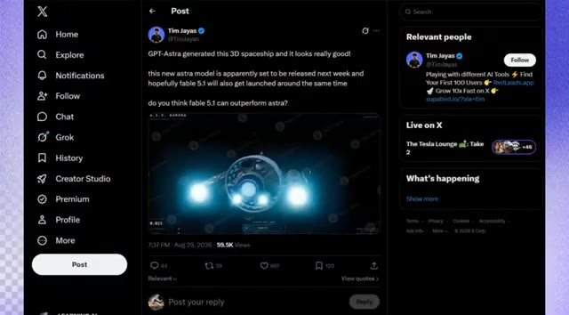
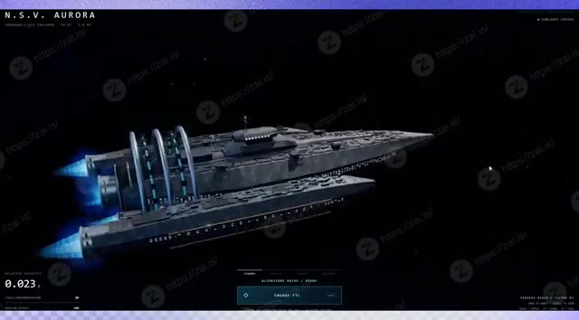

# 🎬 GPT-6 est TELLEMENT plus puissant que ce qu'on pensait

> **Chaîne** : [Pursuing AI](https://www.youtube.com/@PursuingAi)  
> **Titre original** : `GPT-6 Is FAR More Powerful Than We Realized`  
> **Lien YouTube** : [https://www.youtube.com/watch?v=AYqoJOg4TBY](https://www.youtube.com/watch?v=AYqoJOg4TBY)  
> **Date de publication** : 2026-08-30  
> **Durée** : 04m 15s (`255s`)  
> **Identifiant vidéo** : `AYqoJOg4TBY`  
> **Fiche Web Interactive** : [2026-08-30_YT-AYqoJOg4TBY_GPT-6 est TELLEMENT plus puissant que ce qu'on pensait_by-whisper-v3-large-turbo+gemini-3.5-flash-lite.html](2026-08-30_YT-AYqoJOg4TBY_GPT-6 est TELLEMENT plus puissant que ce qu'on pensait_by-whisper-v3-large-turbo+gemini-3.5-flash-lite.html)  
> **Captures de démonstration clés** : `17 captures réelles (anti-talking-head)`  
> **Modèles utilisés** : Audio: `large-v3-turbo` (Faster-Whisper int8 VPS) | Vision: `gemini-3.5-flash-lite` (Google AI Studio API)  

---

## 📌 Synthèse Exécutive & Outils

### 📌 Résumé
Dans ce tutoriel complet intitulé **GPT-6 est TELLEMENT plus puissant que ce qu'on pensait**, le créateur présente les techniques de pointe pour maîtriser la génération de vidéos et de visuels par intelligence artificielle.

### 🛠️ Outils, Modèles & Logiciels Présentés
- **Modèles vidéo IA** : Génération de plans cinématiques.
- **Outils de prompt** : Structuration avancée des descriptions visuelles.

### 🔑 Points Clés & Enseignements Stratégiques
- Structurer ses prompts de mouvement avec des termes de caméra précis.
- Soigner la cohérence des personnages entre chaque plan.
- Exploiter les modèles de dernière génération pour un rendu professionnel.

---

## ⏱️ Chronologie & Transcription Complète Audio & Visuelle (Mot pour Mot)

### ⏱️ `[00:00:00 - 00:00:21]` | Segment #01

**🔊 Audio (Transcription Intégrale Mot pour Mot en Français) :**
> OpenAI se prépare peut-être à révéler quelque chose d'assez intéressant. Une nouvelle fuite prétend que l'entreprise a étendu les tests internes d'un modèle appelé GPT-Astra, et nous voyons déjà certains de ses soi-disant premiers résultats. Et honnêtement, ce ne sont pas vos démos d'IA typiques. Nous parlons de sites Web interactifs, d'environnements de jeux jouables, d'objets 3D détaillés.

**👁️ Analyse Visuelle d'Écran (gemini-3.5-flash-lite) :**
**Interface & Outils** : Interface de navigation web affichant des environnements graphiques et interactifs générés par IA, sous forme de mondes virtuels et de mini-jeux.

**Contenu textuel & Code** : On peut lire des titres comme "Aurelion - An Atlas of Improvised Kingdoms", "Voxel Pagoda Garden", ainsi que divers panneaux d'interface de jeu (santé, mini-map, contrôles clavier).

**Action / Démonstration** : Démonstration visuelle des capacités du modèle GPT-Astra à générer des environnements virtuels interactifs et des jeux vidéo jouables en 3D et 2D isométrique.

*Interface d'un jeu vidéo ou monde virtuel 3D isométrique nommé "Aurelion", affichant un vaste archipel de îles flottantes avec des habitations et un château.*

*Scène en voxel représentant un jardin de pagode ("Voxel Pagoda Garden") sous une douce chute de neige, avec des arbres roses et un temple traditionnel.*

*Vue aérienne interactive d'un jeu de type GTA en 2D isométrique, montrant des rues urbaines avec des voitures, des bâtiments et des menus d'interface (santé, armure, contrats).*

---

### ⏱️ `[00:00:21 - 00:00:45]` | Segment #02

**🔊 Audio (Transcription Intégrale Mot pour Mot en Français) :**
> Alors, de quoi Astra est-elle exactement capable, et pourquoi ce modèle semble-t-il si axé sur les détails ? Jetons un coup d'œil. OpenAI aurait étendu les tests internes de GPT-Astra, actuellement nom de code Mosaic-Alpha-FDM, ce qui pourrait être le signe qu'une sortie approche. Et bien sûr, comme nous l'avons vu avec les précédents modèles d'OpenAI, nous avons déjà les toutes premières sorties publiques de celui-ci.

**👁️ Analyse Visuelle d'Écran (gemini-3.5-flash-lite) :**
**Interface & Outils** : Interface de jeu vidéo en vue du dessus (Image #1) et interface du réseau social X/Twitter en mode sombre (Image #2).

**Contenu textuel & Code** : Sur l'image #1, divers affichages de statut de jeu (santé, armure, contrats, mini-carte, armes). Sur l'image #2, un tweet du compte @Lentils80 disant : "Major Scoop: OpenAI has just expanded internal testing of GPT Astra, codenamed "mozaik-alpha-fdm", signifying release might be near..." avec une image de monde isométrique généré.

**Action / Démonstration** : Présentation visuelle de la sortie de test du modèle GPT-Astra via un post sur les réseaux sociaux et affichage d'un rendu de jeu vidéo en lien avec le sujet.

*Vue aérienne d'une démonstration de jeu vidéo montrant une ville quadrillée avec des véhicules et des interfaces de contrôle textuelles.*

*Publication sur le réseau social X (Twitter) du compte "Lentils" concernant les tests internes de GPT-Astra, avec une image et une vidéo intégrées.*

---

### ⏱️ `[00:00:45 - 00:01:14]` | Segment #03

**🔊 Audio (Transcription Intégrale Mot pour Mot en Français) :**
> Les deux exemples ont été générés zero-shot sur l'effort maximal, et les premiers résultats sont plutôt intéressants. L'interface frontale pourrait également avoir enfin été corrigée, et le modèle semble accorder beaucoup plus d'attention aux petits détails. Et si vous regardez ce monde de style voxel, le niveau de détail est assez impressionnant. Vous avez un royaume fantastique entièrement construit avec des murs de château, des tours à carreaux bleus, des maisons aux toits rouges, des terres agricoles, des forêts, des falaises et des cascades, le tout rendu avec une géométrie de voxel cohérente.

**👁️ Analyse Visuelle d'Écran (gemini-3.5-flash-lite) :**
**Interface & Outils** : Navigateur web affichant le réseau social X et une interface web de présentation de projet 3D interactif (Aurelion / Nacre).

**Contenu textuel & Code** : Texte du post sur X : "Major Scoop: OpenAI has just expanded internal testing of GPT Astra, codenamed "mozaik-alpha-fdm"... Both outputs are zero-shot on Max effort. Frontend "might" have finally been fixed...". Sur les autres images : interface web de style jeu de stratégie/monde virtuel "AURELION" avec menus de sélection et mini-carte, et site "NACRE" avec le titre "A second nature.".

**Action / Démonstration** : Navigation et présentation visuelle d'un monde virtuel généré en style voxel ainsi que d'interfaces web de démonstration de projets technologiques.

*Capture d'écran du réseau social X montrant un post de Lentils à propos des tests internes de GPT Astra et une image de monde voxel.*

*Interface Web minimaliste et futuriste de 'NACRE' présentant le projet 'N-01 / The Somatic Interface' avec un modèle 3D abstrait en spirale.*

*Vue panoramique d'un monde fantastique généré en style voxel nommé 'AURELION', montrant un château, des maisons aux toits rouges et des éléments naturels.*

*Gros plan de l'interface et du monde voxel 'AURELION' montrant les détails des bâtiments, des rues et des fortifications du château.*

---

### ⏱️ `[00:01:14 - 00:01:34]` | Segment #04

**🔊 Audio (Transcription Intégrale Mot pour Mot en Français) :**
> There are even floating islands, an airship, ships in the harbor, and snow-covered mountains in the background. What really stands out is how coherent the whole environment feels, with individual voxels making up everything from the buildings and trees to the water and shadows. And this is where things get really interesting. Because the front end here is actually really good.

**👁️ Analyse Visuelle d'Écran (gemini-3.5-flash-lite) :**
**Interface & Outils** : le créateur face caméra ou transition sans partage d'écran.

**Contenu textuel & Code** : Explications orales des concepts et des méthodes de création vidéo IA.

**Action / Démonstration** : Démonstration pédagogique et présentation du workflow.

---

### ⏱️ `[00:01:34 - 00:01:56]` | Segment #05

**🔊 Audio (Transcription Intégrale Mot pour Mot en Français) :**
> We're not talking about another basic AI-generated website with a few cards and gradients. It built a full, polished interactive experience, custom visuals, animations, topography, multiple sections, and even interactive elements that respond on the page. on the page. If this is representative of GPT-Astra, then the front-end problem might actually be getting solved.

**👁️ Analyse Visuelle d'Écran (gemini-3.5-flash-lite) :**
**Interface & Outils** : le créateur face caméra ou transition sans partage d'écran.

**Contenu textuel & Code** : Explications orales des concepts et des méthodes de création vidéo IA.

**Action / Démonstration** : Démonstration pédagogique et présentation du workflow.

---

### ⏱️ `[00:01:56 - 00:02:28]` | Segment #06

**🔊 Audio (Transcription Intégrale Mot pour Mot en Français) :**
> Donc l'esprit, dammer, sur Max, le modèle réfléchit apparemment beaucoup plus que Sol. Mais cette réflexion supplémentaire semble se traduire par un sérieux souci du détail, comme vous pouvez le voir à travers ces résultats. Le premier est un rendu de manette de style PlayStation étonnamment détaillé, avec un écran central et un éclairage bleu. Mais le deuxième exemple est là où les choses deviennent beaucoup plus intéressantes. Astra a apparemment généré une ville cyberpunk en vue du dessus, avec des courses-poursuites en voiture, des poursuites policières, des armes, des contrats et une interface utilisateur dynamique pour des éléments tels que les scores et les niveaux de recherche.

**👁️ Analyse Visuelle d'Écran (gemini-3.5-flash-lite) :**
**Interface & Outils** : Interface du réseau social X (anciennement Twitter) et interface d'un jeu ou d'une simulation interactive générée par IA (vue de dessus de type GTA 2, avec HUD de score, santé et mini-carte).

**Contenu textuel & Code** : Texte du post X : "OpenAI has just dropped its first internal Astra checkpoint: mozaik-alpha-fdm. Here are the first two outputs, both generated 1-shot on Max effort. On Max the model tends to think ALOT more than Sol, but it has a ton of attention to detail as evident by the outputs below." Éléments de l'interface du jeu cyberpunk : HEALTH (100), BODY ARMOR (0), GETAWAY CONTRACTS, commandes clavier (MOUSE AIM / CLICK FIRE, W/S/A/D, SPACE, etc.).

**Action / Démonstration** : Navigation et affichage de publications sur les réseaux sociaux présentant les capacités du modèle Astra, suivis de gros plans sur les rendus visuels détaillés générés par l'intelligence artificielle.

*Capture d'écran du réseau social X montrant un post sur OpenAI et les outputs d'Astra.*

*Rendu haute résolution d'une manette de type PlayStation blanche et noire avec éclairage LED bleu et écran central.*

*Capture d'écran du réseau social X montrant le même post avec la phrase sur le modèle Max et Sol mise en surbrillance.*

*Vue aérienne du jeu ou de la simulation de ville cyberpunk générée par Astra, avec interface utilisateur, barres de santé et contrôles affichés.*

---

### ⏱️ `[00:02:28 - 00:03:01]` | Segment #07

**🔊 Audio (Transcription Intégrale Mot pour Mot en Français) :**
> Et ce qui ressort vraiment, c'est la cohérence. L'environnement, les mécaniques de jeu, les contrôles et les détails visuels tiennent la route tout au long du clip. Selon l'utilisateur, Max passe nettement plus de temps à réfléchir que Sol, et si ces exemples sont représentatifs, ce temps de raisonnement supplémentaire est peut-être exactement ce qui aide Astra à produire des résultats avec autant de détails et de cohérence. Et cela pourrait être un autre signe que GPT-Astra est en train de devenir sérieusement performant en matière de génération 3D. En une seule génération, il a produit ce vaisseau spatial 3D complet, avec sa coque,

**👁️ Analyse Visuelle d'Écran (gemini-3.5-flash-lite) :**
**Interface & Outils** : Interface de jeu vidéo style GTA en vue top-down et interface du réseau social X (Twitter).

**Contenu textuel & Code** : Textes de jeu : 'NEIGHBOROUGH', 'HEALTH 100', 'GETAWAY CONTRACT', 'BARE KNUCKLES', '0.023c'. Post de Tim Jayas : 'GPT-Astra generated this 3D spaceship and it looks really good! this new astra model is apparently set to be released next week...'

**Action / Démonstration** : Démonstration du gameplay d'un jeu vidéo avec des véhicules circulant en ville, suivie de la présentation d'une publication sur X et d'un modèle 3D de vaisseau spatial.

*Vue du dessus d'un jeu de simulation urbaine en 2D montrant la grille de la ville, des bâtiments et des véhicules en déplacement.*

*Vue du dessus de la ville avec l'interface de jeu affichant un compteur de vitesse et des informations de mission.*

*Publication sur le réseau social X par Tim Jayas montrant le vaisseau spatial généré par l'IA GPT-Astra.*

*Rendu détaillé en 3D d'un grand vaisseau spatial futuriste nommé N.S.V. AURORA dans l'espace.*

---

### ⏱️ `[00:03:01 - 00:03:22]` | Segment #08

**🔊 Audio (Transcription Intégrale Mot pour Mot en Français) :**
> engines, surface details, materials, and lighting all working together. What's especially impressive is the consistency. The geometry holds up across different angles, the proportions feel believable, and the materials respond naturally to the lighting. If these early examples are anything to go by, Astra might be a pretty big step forward for AI-generated 3D content.

**👁️ Analyse Visuelle d'Écran (gemini-3.5-flash-lite) :**
**Interface & Outils** : le créateur face caméra ou transition sans partage d'écran.

**Contenu textuel & Code** : Explications orales des concepts et des méthodes de création vidéo IA.

**Action / Démonstration** : Démonstration pédagogique et présentation du workflow.

---

### ⏱️ `[00:03:22 - 00:03:40]` | Segment #09

**🔊 Audio (Transcription Intégrale Mot pour Mot en Français) :**
> And here's another 3D tank reportedly generated by GPT Astra. Interestingly, almost all of these Astra examples seem to share the same sci-fi and space-inspired aesthetic, futuristic vehicles, sleek mechanical designs, and cinematic lighting. Honestly, it kind of fits the name Astra perfectly.

**👁️ Analyse Visuelle d'Écran (gemini-3.5-flash-lite) :**
**Interface & Outils** : le créateur face caméra ou transition sans partage d'écran.

**Contenu textuel & Code** : Explications orales des concepts et des méthodes de création vidéo IA.

**Action / Démonstration** : Démonstration pédagogique et présentation du workflow.

---

### ⏱️ `[00:03:40 - 00:03:59]` | Segment #10

**🔊 Audio (Transcription Intégrale Mot pour Mot en Français) :**
> And honestly, if these leaks are legitimate, GPT-Astra is starting to look like a pretty serious multimodal model. What's interesting isn't just that it can generate impressive images, it's the combination of detail, consistency, interactivity, reasoning, and 3D generation showing up across these different examples.

**👁️ Analyse Visuelle d'Écran (gemini-3.5-flash-lite) :**
**Interface & Outils** : le créateur face caméra ou transition sans partage d'écran.

**Contenu textuel & Code** : Explications orales des concepts et des méthodes de création vidéo IA.

**Action / Démonstration** : Démonstration pédagogique et présentation du workflow.

---

### ⏱️ `[00:03:59 - 00:04:14]` | Segment #11

**🔊 Audio (Transcription Intégrale Mot pour Mot en Français) :**
> Of course, these are still leaked outputs, so we'll have to wait for something official to know how capable the final model really is. But if OpenAI really is getting ready to release Astra, things could get very interesting.

**👁️ Analyse Visuelle d'Écran (gemini-3.5-flash-lite) :**
**Interface & Outils** : le créateur face caméra ou transition sans partage d'écran.

**Contenu textuel & Code** : Explications orales des concepts et des méthodes de création vidéo IA.

**Action / Démonstration** : Démonstration pédagogique et présentation du workflow.

---
