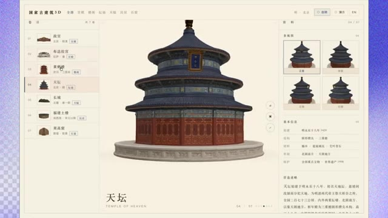

# 🎬 TENCENT HY4 Is WAY More Powerful Than GPT Astra, KIMI K3

> **Chaîne** : [Pursuing AI](https://www.youtube.com/@PursuingAi)  
> **Titre original** : `TENCENT HY4 Is WAY More Powerful Than GPT Astra, KIMI K3`  
> **Lien YouTube** : [https://www.youtube.com/watch?v=U8rB10LbAXk](https://www.youtube.com/watch?v=U8rB10LbAXk)  
> **Date de publication** : 2026-09-01  
> **Durée** : 09m 13s (`553s`)  
> **Identifiant vidéo** : `U8rB10LbAXk`  
> **Fiche Web Interactive** : [2026-09-01_YT-U8rB10LbAXk_TENCENT HY4 Is WAY More Powerful Than GPT Astra, KIMI K3_by-whisper-v3-large-turbo+gemini-3.5-flash-lite.html](2026-09-01_YT-U8rB10LbAXk_TENCENT HY4 Is WAY More Powerful Than GPT Astra, KIMI K3_by-whisper-v3-large-turbo+gemini-3.5-flash-lite.html)  
> **Captures de démonstration clés** : `1 captures réelles (anti-talking-head)`  
> **Modèles utilisés** : Audio: `large-v3-turbo` (Faster-Whisper int8 VPS) | Vision: `gemini-3.5-flash-lite` (Google AI Studio API)  

---

## 📌 Synthèse Exécutive & Outils

### 📌 Résumé
Tencent vient de franchir une étape majeure dans l'intelligence artificielle générative avec la sortie de **HY4 Preview**, un modèle open-source aux mensurations titanesques qui redéfinit les standards de la génération de code, de jeux vidéo et d'environnements 3D interactifs. Loin des simples prototypes textuels ou des lignes de code basiques, ce modèle est capable de concevoir de zéro des jeux complets (aventure à la troisième personne, FPS en forêt, jeux d'action top-down) intégrant des logiques de gameplay complexes, des systèmes de quêtes, des interfaces utilisateur (HUD), des effets sonores et des graphismes d'un réalisme saisissant. Le créateur de la vidéo orchestre sa démonstration en passant en revue ces prouesses vidéoludiques avant de s'attarder sur les capacités d'ingénierie logicielle pure, telles que la génération procédulaire d'îles 3D sous Three.js ou de scènes botaniques ultra-détaillées en un seul fichier HTML.

Au-delà du divertissement, cette analyse met en lumière l'efficacité redoutable de l'architecture de HY4 dans des tâches de programmation avancées, allant jusqu'à surpasser des concurrents lors de comparaisons communautaires en générant des structures 3D complexes comme un hélicoptère Airbus H145. Le workflow présenté repose sur l'exploitation d'une immense puissance de calcul modulée par une architecture MoE (Mixture of Experts), permettant aux développeurs et créateurs de manipuler des bases de code titanesques et de prototyper des applications interactives immersives en un temps record. 

Pour les créateurs de vidéo, les réalisateurs et les développeurs, HY4 Preview représente un outil de rupture. Il automatise la création d'actifs visuels interactifs et dynamiques, éliminant les frictions traditionnelles entre l'idéation d'un concept visuel 3D et son implémentation technique. C'est l'avènement d'une ère où l'intelligence artificielle ne se contente plus de générer des images statiques, mais bâtit des univers fonctionnels et interactifs exploitables immédiatement pour le prototypage rapide, la pré-visualisation cinématographique ou le développement de jeux indépendants.

### 🛠️ Outils, Modèles & Logiciels Présentés
* **HY4 Preview (Tencent Hanyuan)** : Nouveau modèle de langage open-source massif doté de 770 milliards de paramètres totaux, optimisé pour la génération de code complexe, d'environnements 3D interactifs et de jeux vidéo complets.
* **Claude / Claude Code** : Assistant de programmation et environnement d'exécution utilisé par la communauté pour interfacer et exploiter le modèle HY4 sur des tâches d'ingénierie logicielle 3D complexes.
* **Kimi K3 Max** : Modèle concurrent utilisé dans les comparaisons communautaires pour évaluer les performances de génération 3D (comme la modélisation d'un hélicoptère).
* **Three.js** : Librairie JavaScript utilisée pour le rendu et la manipulation de graphismes 3D interactifs directement dans un navigateur web via les scripts générés par l'IA.

### 🔑 Points Clés & Enseignements Stratégiques
* **Architecture à grande échelle hybride** : HY4 repose sur 770 milliards de paramètres totaux, mais n'en active que 49 milliards par inférence, garantissant une efficacité pratique redoutable malgré sa taille monumentale.
* **Fenêtre de contexte millionnaire** : Le support d'un million de tokens permet au modèle d'ingérer et de maintenir la cohérence sur des bases de code massives et des projets logiciels extrêmement complexes.
* **Génération de systèmes de jeu complets** : Le modèle ne se limite pas à des décors 3D vides ; il intègre l'intelligence artificielle du gameplay, les animations, les inventaires, les quêtes, les HUD et les écrans de résultats.
* **Maîtrise de la génération procédulaire** : Capacité à coder d'un seul tenant des environnements vivants sous Three.js (villes insulaires, routes, véhicules, cycles jour/nuit) avec des shaders personnalisés pour l'eau et le ciel.
* **Réalisme visuel poussé à l'extrême** : Génération de scènes organiques complexes (comme un cerisier en fleurs avec profondeur de champ et mouvement) entièrement rendues via du code HTML/JS brut.
* **Polyvalence des styles graphiques** : Aptitude à basculer d'un réalisme sombre (FPS en forêt, énigmes de salles fortes) à des styles colorés et stylisés (jeux d'action top-down) sans perdre la cohérence visuelle.
* **Intégration d'outils tiers (Claude Code)** : Possibilité d'utiliser HY4 via des interfaces de programmation externes comme Claude Code pour contourner les limites des harnais logiciels natifs (WorkBuddy).
* **Supériorité sur les tâches d'ingénierie 3D** : Les tests pratiques montrent une précision géométrique et un niveau de détail supérieurs à ceux de certains modèles concurrents sur des objets complexes (hélicoptères).
* **Automatisation du pipeline de prototypage** : Réduction drastique du temps nécessaire pour passer d'une idée textuelle de jeu vidéo à un prototype jouable et interactif.
* **Fiabilité des rendus interactifs** : Les productions finales ne sont pas de simples images statiques mais des environnements où l'utilisateur peut réellement naviguer, résoudre des énigmes et progresser.
* **Implication stratégique pour l'open-source** : L'arrivée de HY4 positionne Tencent comme un acteur incontournable capable de rivaliser avec les géants occidentaux sur le terrain de la génération logicielle et multimodale.

---

## ⏱️ Chronologie & Transcription Complète Audio & Visuelle (Mot pour Mot)

### ⏱️ `[00:00:00 - 00:00:25]` | Segment #01

**🔊 Audio (Transcription Intégrale Mot pour Mot en Français) :**
> Tencent has just released HY4 Preview, and this might be one of the most interesting open-source AI models we've seen recently. Because when you look at what Tencent is actually showing with this model, it's not just answering questions or writing a few lines of code. It's building games, generating interactive 3D worlds, creating complex software, and producing results that honestly look surprisingly close to something a real developer would make.

**👁️ Analyse Visuelle d'Écran (gemini-3.5-flash-lite) :**
**Interface & Outils** : le créateur face caméra ou transition sans partage d'écran.

**Contenu textuel & Code** : Explications orales des concepts et des méthodes de création vidéo IA.

**Action / Démonstration** : Démonstration pédagogique et présentation du workflow.

---

### ⏱️ `[00:00:26 - 00:01:00]` | Segment #02

**🔊 Audio (Transcription Intégrale Mot pour Mot en Français) :**
> So in this video, I'm going to show you exactly what HY4 can do, go through some of its most impressive examples, and then at the end I'll break down the model itself, including its parameter count, active parameters, context window, and what makes this model different. This is Pursuing AI, and you're watching the research report. So let's get into it. First, let's start with game development, because Tencent is already a huge gaming company, so it's pretty interesting to see what HY4 can actually create. One of their examples is a full third-person 3D adventure game where you play as a

**👁️ Analyse Visuelle d'Écran (gemini-3.5-flash-lite) :**
**Interface & Outils** : le créateur face caméra ou transition sans partage d'écran.

**Contenu textuel & Code** : Explications orales des concepts et des méthodes de création vidéo IA.

**Action / Démonstration** : Démonstration pédagogique et présentation du workflow.

---

### ⏱️ `[00:01:00 - 00:01:22]` | Segment #03

**🔊 Audio (Transcription Intégrale Mot pour Mot en Français) :**
> penguin exploring a snowy world, collecting berries, opening chests, fighting monsters, and trying to escape. And what really caught my attention is that HY4 isn't just generating a basic game scene here. It puts together the actual gameplay systems too. Things like animations, inventory, quests, a HUD, music and sound, different menus, and even a results screen.

**👁️ Analyse Visuelle d'Écran (gemini-3.5-flash-lite) :**
**Interface & Outils** : le créateur face caméra ou transition sans partage d'écran.

**Contenu textuel & Code** : Explications orales des concepts et des méthodes de création vidéo IA.

**Action / Démonstration** : Démonstration pédagogique et présentation du workflow.

---

### ⏱️ `[00:01:22 - 00:01:48]` | Segment #04

**🔊 Audio (Transcription Intégrale Mot pour Mot en Français) :**
> So instead of getting a simple prototype with a character walking around an empty environment, you're getting a much more complete game experience. And this is just the first example. And then things get even more interesting. HY4 also shows off a completely different kind of game, this time a first-person shooter set in a detailed forest environment. You can walk around the map, aim and shoot, fight enemies, and follow an objective. And just look at the environment.

**👁️ Analyse Visuelle d'Écran (gemini-3.5-flash-lite) :**
**Interface & Outils** : le créateur face caméra ou transition sans partage d'écran.

**Contenu textuel & Code** : Explications orales des concepts et des méthodes de création vidéo IA.

**Action / Démonstration** : Démonstration pédagogique et présentation du workflow.

---

### ⏱️ `[00:01:48 - 00:02:07]` | Segment #05

**🔊 Audio (Transcription Intégrale Mot pour Mot en Français) :**
> The trees, grass, lighting, shadows, and overall atmosphere make this look much closer to an actual game than a basic AI-generated demo. There's a proper HUD, health system, weapon, enemies, and a mission objective telling the player where to go. So again, the interesting part isn't simply that HY4 can generate a 3D scene.

**👁️ Analyse Visuelle d'Écran (gemini-3.5-flash-lite) :**
**Interface & Outils** : le créateur face caméra ou transition sans partage d'écran.

**Contenu textuel & Code** : Explications orales des concepts et des méthodes de création vidéo IA.

**Action / Démonstration** : Démonstration pédagogique et présentation du workflow.

---

### ⏱️ `[00:02:08 - 00:02:31]` | Segment #06

**🔊 Audio (Transcription Intégrale Mot pour Mot en Français) :**
> It's putting all these different pieces together into something you can actually interact with and play. And this next example is really impressive. When I first saw this, if you didn't tell me it was generated by an AI model, I'd honestly assume a developer had built it. You've got a proper first-person environment, detailed rooms, bookshelves, interactive objects, objectives on the screen, and even a puzzle where you interact with a safe.

**👁️ Analyse Visuelle d'Écran (gemini-3.5-flash-lite) :**
**Interface & Outils** : le créateur face caméra ou transition sans partage d'écran.

**Contenu textuel & Code** : Explications orales des concepts et des méthodes de création vidéo IA.

**Action / Démonstration** : Démonstration pédagogique et présentation du workflow.

---

### ⏱️ `[00:02:32 - 00:02:50]` | Segment #07

**🔊 Audio (Transcription Intégrale Mot pour Mot en Français) :**
> And the important thing is, this isn't just a beautiful scene that looks good from one camera angle. You can actually move around, interact with the environment, solve things, and progress through the game. That's what makes this example stand out to me. Because when you look at the final result, it doesn't really feel like you're watching something made by an AI.

**👁️ Analyse Visuelle d'Écran (gemini-3.5-flash-lite) :**
**Interface & Outils** : le créateur face caméra ou transition sans partage d'écran.

**Contenu textuel & Code** : Explications orales des concepts et des méthodes de création vidéo IA.

**Action / Démonstration** : Démonstration pédagogique et présentation du workflow.

---

### ⏱️ `[00:02:50 - 00:03:16]` | Segment #08

**🔊 Audio (Transcription Intégrale Mot pour Mot en Français) :**
> It feels like an actual game someone spent time developing. And that's a pretty crazy place for AI-generated software to be. And here's another example that I think is really cool. This time, HY4 generates a top-down action game with a completely different, much more colorful art style. You can see an entire little world here with houses, grass, characters, enemies, combat, health bars, and an actual objective system.

**👁️ Analyse Visuelle d'Écran (gemini-3.5-flash-lite) :**
**Interface & Outils** : le créateur face caméra ou transition sans partage d'écran.

**Contenu textuel & Code** : Explications orales des concepts et des méthodes de création vidéo IA.

**Action / Démonstration** : Démonstration pédagogique et présentation du workflow.

---

### ⏱️ `[00:03:16 - 00:03:34]` | Segment #09

**🔊 Audio (Transcription Intégrale Mot pour Mot en Français) :**
> And as the gameplay continues, the character is fighting multiple enemies at the same time with damage numbers and visual effects appearing on the screen. What I like about this example is that everything feels like it belongs together. The environment, characters, combat, UI, and visual effects all follow the same game style.

**👁️ Analyse Visuelle d'Écran (gemini-3.5-flash-lite) :**
**Interface & Outils** : le créateur face caméra ou transition sans partage d'écran.

**Contenu textuel & Code** : Explications orales des concepts et des méthodes de création vidéo IA.

**Action / Démonstration** : Démonstration pédagogique et présentation du workflow.

---

### ⏱️ `[00:03:34 - 00:03:52]` | Segment #10

**🔊 Audio (Transcription Intégrale Mot pour Mot en Français) :**
> It doesn't feel like AI just placed a bunch of 3D objects together and called it a game. And honestly, this is the kind of result that makes you stop and think, if you didn't know this came from an AI model, you could easily mistake it for a small indie game. But HY4 isn't only interesting because of its game generation capabilities.

**👁️ Analyse Visuelle d'Écran (gemini-3.5-flash-lite) :**
**Interface & Outils** : le créateur face caméra ou transition sans partage d'écran.

**Contenu textuel & Code** : Explications orales des concepts et des méthodes de création vidéo IA.

**Action / Démonstration** : Démonstration pédagogique et présentation du workflow.

---

### ⏱️ `[00:03:52 - 00:04:25]` | Segment #11

**🔊 Audio (Transcription Intégrale Mot pour Mot en Français) :**
> If we move over to its software engineering abilities, this is where things get really interesting. Just look at this coding example. HY4 was given a pretty demanding task. task. Build a complete isometric 3D island town in a single 3.js file, entirely procedurally. And it's not just a few buildings placed on a map. You've got roads, houses, a church, a castle, a lighthouse, farms, vehicles, people, boats, and even animals with actual movement animations. It also generates the terrain procedurally, makes sure the buildings properly

**👁️ Analyse Visuelle d'Écran (gemini-3.5-flash-lite) :**
**Interface & Outils** : le créateur face caméra ou transition sans partage d'écran.

**Contenu textuel & Code** : Explications orales des concepts et des méthodes de création vidéo IA.

**Action / Démonstration** : Démonstration pédagogique et présentation du workflow.

---

### ⏱️ `[00:04:25 - 00:05:02]` | Segment #12

**🔊 Audio (Transcription Intégrale Mot pour Mot en Français) :**
> sit on the ground, adds custom shaders for the sky, water, and foliage, and then takes it even further with a full day and night cycle and different camera presets. And when you actually see the final result running, this is pretty amazing for something generated as a single file. This is also why I think HY4 deserves to be taken seriously as a coding model, because we're not talking about simple HTML pages or basic scripts anymore. It's tackling the kind of complex multi-system software generation tasks where models like OpenAI's and Claude have traditionally been very strong, and HY4 is starting to enter that same conversation.

**👁️ Analyse Visuelle d'Écran (gemini-3.5-flash-lite) :**
**Interface & Outils** : le créateur face caméra ou transition sans partage d'écran.

**Contenu textuel & Code** : Explications orales des concepts et des méthodes de création vidéo IA.

**Action / Démonstration** : Démonstration pédagogique et présentation du workflow.

---

### ⏱️ `[00:05:02 - 00:05:24]` | Segment #13

**🔊 Audio (Transcription Intégrale Mot pour Mot en Français) :**
> And then we have this example, and honestly, this one really surprised me. When I first saw the final result, I actually thought it might be a pre-made render or something that had been heavily edited afterward. Because look at this, the cherry blossom tree, individual branches, flowers, depth of field, lighting, and overall atmosphere, everything looks incredibly detailed.

**👁️ Analyse Visuelle d'Écran (gemini-3.5-flash-lite) :**
**Interface & Outils** : le créateur face caméra ou transition sans partage d'écran.

**Contenu textuel & Code** : Explications orales des concepts et des méthodes de création vidéo IA.

**Action / Démonstration** : Démonstration pédagogique et présentation du workflow.

---

### ⏱️ `[00:05:24 - 00:05:50]` | Segment #14

**🔊 Audio (Transcription Intégrale Mot pour Mot en Français) :**
> But what makes this example much more convincing is that the user also shared a screenshot of HY4 actually creating it, and you can see the model generating the entire scene as a single HTML file, rather than simply producing a static image. If you look closely at the screenshot, it gets even more interesting. The model is dealing with things like individual blossoms, branches, materials, shaders, lighting, camera effects, and even movement of the tree.

**👁️ Analyse Visuelle d'Écran (gemini-3.5-flash-lite) :**
**Interface & Outils** : le créateur face caméra ou transition sans partage d'écran.

**Contenu textuel & Code** : Explications orales des concepts et des méthodes de création vidéo IA.

**Action / Démonstration** : Démonstration pédagogique et présentation du workflow.

---

### ⏱️ `[00:05:50 - 00:06:10]` | Segment #15

**🔊 Audio (Transcription Intégrale Mot pour Mot en Français) :**
> So this isn't simply AI made a pretty picture, it's actually generating the underlying code and rendering a complete interactive 3D scene. And honestly, this is one of those examples where the final result looks so polished that without seeing the generation process, I would have a hard time believing an AI model created it from scratch.

**👁️ Analyse Visuelle d'Écran (gemini-3.5-flash-lite) :**
**Interface & Outils** : le créateur face caméra ou transition sans partage d'écran.

**Contenu textuel & Code** : Explications orales des concepts et des méthodes de création vidéo IA.

**Action / Démonstration** : Démonstration pédagogique et présentation du workflow.

---

### ⏱️ `[00:06:10 - 00:06:28]` | Segment #16

**🔊 Audio (Transcription Intégrale Mot pour Mot en Français) :**
> And now let's look at an interesting community comparison. Someone actually compared HY4 Preview with Kimi K3 Max using Claude code on a similar 3D generation task. The task was pretty straightforward. Generate a detailed 3D model of an Airbus H145 helicopter in 3.js.

**👁️ Analyse Visuelle d'Écran (gemini-3.5-flash-lite) :**
**Interface & Outils** : le créateur face caméra ou transition sans partage d'écran.

**Contenu textuel & Code** : Explications orales des concepts et des méthodes de création vidéo IA.

**Action / Démonstration** : Démonstration pédagogique et présentation du workflow.

---

### ⏱️ `[00:06:28 - 00:07:07]` | Segment #17

**🔊 Audio (Transcription Intégrale Mot pour Mot en Français) :**
> And when you put the results side by side, HY4 comes out looking really impressive. The helicopter has a more complete shape and noticeably more detail, while the Kimi version is much simpler. Now, I want to be clear here, this is not some official benchmark, so I wouldn't use one example to declare HY4 the winner. And the person who posted the comparison also mentioned that they were using HY4 through Claude code, rather than Tencent's own WorkBuddy setup because they were running into issues with the WorkBuddy harness. So I wouldn't take this one comparison as definitive, but as a real-world example, it does show just how capable HY4 can be when you give it a fairly complex 3D software

**👁️ Analyse Visuelle d'Écran (gemini-3.5-flash-lite) :**
**Interface & Outils** : le créateur face caméra ou transition sans partage d'écran.

**Contenu textuel & Code** : Explications orales des concepts et des méthodes de création vidéo IA.

**Action / Démonstration** : Démonstration pédagogique et présentation du workflow.

---

### ⏱️ `[00:07:07 - 00:07:42]` | Segment #18

**🔊 Audio (Transcription Intégrale Mot pour Mot en Français) :**
> engineering task. Now, after seeing all of these examples, let's actually talk about the model itself. HY4 Preview is Tencent Hanyuan's new generation large language model, and the headline number is pretty ridiculous. It has 770 billion total parameters, with around 49 billion parameters active per inference, and it supports a 1 million token context window. And that active parameter number is important. Because even though the model has 770 billion parameters in total, it doesn't need to activate all of them for every single token. That's what makes the architecture

**👁️ Analyse Visuelle d'Écran (gemini-3.5-flash-lite) :**
**Interface & Outils** : le créateur face caméra ou transition sans partage d'écran.

**Contenu textuel & Code** : Explications orales des concepts et des méthodes de création vidéo IA.

**Action / Démonstration** : Démonstration pédagogique et présentation du workflow.

---

### ⏱️ `[00:07:42 - 00:08:05]` | Segment #19

**🔊 Audio (Transcription Intégrale Mot pour Mot en Français) :**
> much more practical than simply saying, here's a 770 billion parameter model. And then there's the 1 million token context window. That means the model is designed to handle an enormous amount of information within a single context, which becomes especially useful for things like large code bases, long documents, complex projects, and tasks that require maintaining a lot of information at once.

**👁️ Analyse Visuelle d'Écran (gemini-3.5-flash-lite) :**
**Interface & Outils** : le créateur face caméra ou transition sans partage d'écran.

**Contenu textuel & Code** : Explications orales des concepts et des méthodes de création vidéo IA.

**Action / Démonstration** : Démonstration pédagogique et présentation du workflow.

---

### ⏱️ `[00:08:05 - 00:08:38]` | Segment #20

**🔊 Audio (Transcription Intégrale Mot pour Mot en Français) :**
> And when you combine that scale with the examples we just looked at, you can see why HY4 is getting so much attention. Because the interesting thing about this release isn't just the 770 billion parameter number. It's what Tencent is demonstrating with it. Complex games, interactive 3D environments, procedural generation, software engineering, and long context tasks. So overall, HY4 preview is definitely a model I'll be keeping an eye on. The examples Tencent has shown are genuinely impressive, especially when you look at how much of the gameplay, code, environment, and

**👁️ Analyse Visuelle d'Écran (gemini-3.5-flash-lite) :**
**Interface & Outils** : le créateur face caméra ou transition sans partage d'écran.

**Contenu textuel & Code** : Explications orales des concepts et des méthodes de création vidéo IA.

**Action / Démonstration** : Démonstration pédagogique et présentation du workflow.

---

### ⏱️ `[00:08:38 - 00:09:00]` | Segment #21

**🔊 Audio (Transcription Intégrale Mot pour Mot en Français) :**
> interaction can be generated together. Of course, these are showcase examples so so they shouldn't be treated as proof that HY4 will outperform every other model on every task. But they do show something important. Open source AI models are becoming seriously capable at software and 3D generation. And HY4 looks like a very strong example of that trend.

**👁️ Analyse Visuelle d'Écran (gemini-3.5-flash-lite) :**
**Interface & Outils** : le créateur face caméra ou transition sans partage d'écran.

**Contenu textuel & Code** : Explications orales des concepts et des méthodes de création vidéo IA.

**Action / Démonstration** : Démonstration pédagogique et présentation du workflow.

---

### ⏱️ `[00:09:00 - 00:09:12]` | Segment #22

**🔊 Audio (Transcription Intégrale Mot pour Mot en Français) :**
> Si vous avez apprécié cette analyse, assurez-vous de vous abonner car je continuerai à couvrir les nouveaux modèles d'IA, la recherche, et les choses les plus intéressantes que les gens construisent réellement avec eux. Merci d'avoir regardé et je vous vois dans le prochain.

**👁️ Analyse Visuelle d'Écran (gemini-3.5-flash-lite) :**
**Interface & Outils** : Application web interactive avec un panneau de navigation à gauche listant divers monuments historiques, une vue centrale en 3D du monument sélectionné, et un panneau d'informations textuelles et de vignettes à droite.

**Contenu textuel & Code** : Texte en chinois et en anglais (ex: "国家古建筑 3D", "天坛", "Temple of Heaven"), vignettes de prévisualisation montrant différentes vues du Temple du Ciel, et informations historiques sur le monument dans le panneau latéral droit.

**Action / Démonstration** : Le modèle 3D du Temple du Ciel est affiché au centre de l'écran avec des options de sélection de vues multiples sur le côté droit.

*Interface d'un site web interactif de modélisation 3D d'architecture traditionnelle chinoise (Temple du Ciel).*

---
