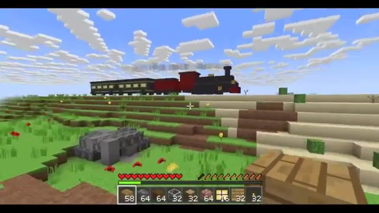
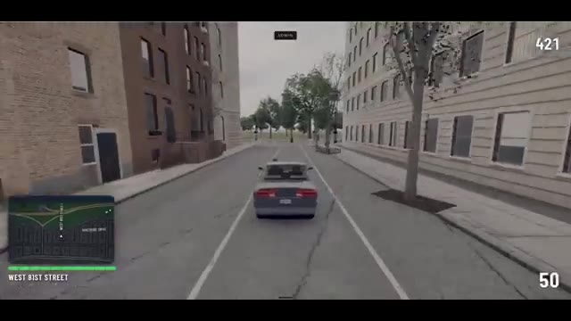
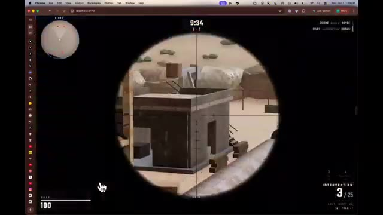
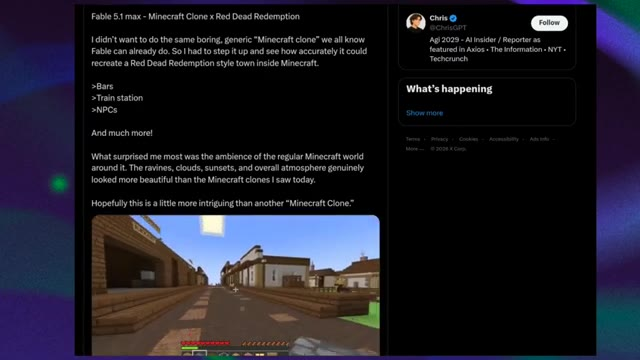
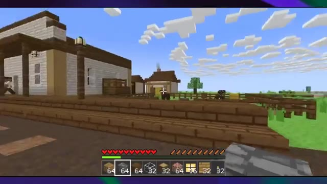
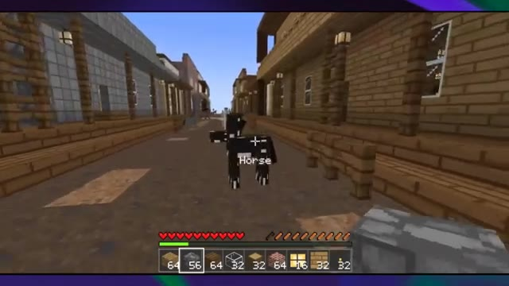
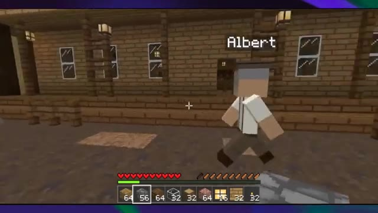
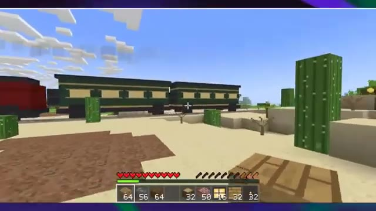
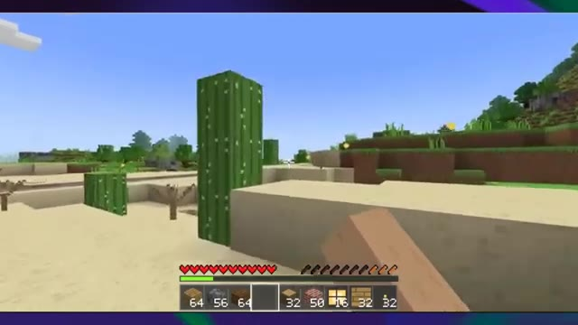
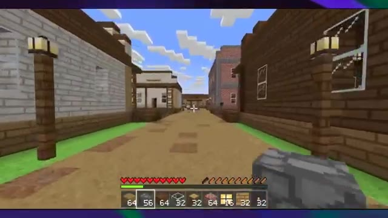

# 🎬 FABLE 5.1 est BEAUCOUP plus puissant que nous ne le pensions

> **Chaîne** : [Pursuing AI](https://www.youtube.com/@PursuingAi)  
> **Titre original** : `FABLE 5.1 Is FAR More Powerful Than We Realized`  
> **Lien YouTube** : [https://www.youtube.com/watch?v=ygDzSWJGC4o](https://www.youtube.com/watch?v=ygDzSWJGC4o)  
> **Date de publication** : 2026-09-03  
> **Durée** : 06m 20s (`380s`)  
> **Identifiant vidéo** : `ygDzSWJGC4o`  
> **Fiche Web Interactive** : [2026-09-03_YT-ygDzSWJGC4o_FABLE 5.1 est BEAUCOUP plus puissant que nous ne le pensions_by-whisper-v3-large-turbo+gemini-3.5-flash-lite.html](2026-09-03_YT-ygDzSWJGC4o_FABLE 5.1 est BEAUCOUP plus puissant que nous ne le pensions_by-whisper-v3-large-turbo+gemini-3.5-flash-lite.html)  
> **Captures de démonstration clés** : `10 captures réelles (anti-talking-head)`  
> **Modèles utilisés** : Audio: `large-v3-turbo` (Faster-Whisper int8 VPS) | Vision: `gemini-3.5-flash-lite` (Google AI Studio API)  

---

## 📌 Synthèse Exécutive & Outils

### 📌 Résumé
Dans ce tutoriel complet intitulé **FABLE 5.1 est BEAUCOUP plus puissant que nous ne le pensions**, le créateur présente les techniques de pointe pour maîtriser la génération de vidéos et de visuels par intelligence artificielle.

### 🛠️ Outils, Modèles & Logiciels Présentés
- **Modèles vidéo IA** : Génération de plans cinématiques.
- **Outils de prompt** : Structuration avancée des descriptions visuelles.

### 🔑 Points Clés & Enseignements Stratégiques
- Structurer ses prompts de mouvement avec des termes de caméra précis.
- Soigner la cohérence des personnages entre chaque plan.
- Exploiter les modèles de dernière génération pour un rendu professionnel.

---

## ⏱️ Chronologie & Transcription Complète Audio & Visuelle (Mot pour Mot)

### ⏱️ `[00:00:00 - 00:00:20]` | Segment #01

**🔊 Audio (Transcription Intégrale Mot pour Mot en Français) :**
> Anthropic vient de balancer Fable 5.1, et putain, ce truc est dingue. Ce qu'il génère est sérieusement hallucinant, et plus on regarde ces résultats, plus ça devient intéressant. Du coup, aujourd'hui, on va décortiquer certaines des choses les plus folles que Fable 5.1 peut faire, et voir à quel point ce nouveau modèle est réellement puissant.

**👁️ Analyse Visuelle d'Écran (gemini-3.5-flash-lite) :**
**Interface & Outils** : Interface de navigateur web affichant des environnements de jeux vidéo et des simulations 3D générées par IA.

**Contenu textuel & Code** : Éléments de HUD de jeux vidéo visibles : barres de vie, mini-cartes, compteurs de munitions (Intervention 3/25), horodatages de jeu (9:34) et noms de rues (West 81st Street).

**Action / Démonstration** : Présentation de séquences de gameplay et de simulations 3D fluides générées par le modèle Fable 5.1, illustrant ses capacités de génération interactive.

*Démonstration du modèle générant une scène de type Minecraft avec un train à vapeur circulant dans un paysage en blocs.*

*Démonstration du modèle générant une simulation de conduite urbaine en 3D avec une voiture sur une rue bordée d'immeubles.*

*Démonstration du modèle dans un navigateur web affichant une vue de sniper dans un jeu vidéo interactif.*

---

### ⏱️ `[00:00:21 - 00:00:45]` | Segment #02

**🔊 Audio (Transcription Intégrale Mot pour Mot en Français) :**
> C'est Pursuing AI, et vous regardez le rapport de recherche. D'accord, ce premier exemple est vraiment fou. Au lieu de faire un autre clone de Minecraft basique, Fable 5.1 a été poussé pour recréer une ville de style Red Dead Redemption à l'intérieur de Minecraft. Et regardez ça. Vous avez des bâtiments de style western, des PNJ, des chevaux, une gare, des voies ferrées, et même des intérieurs entièrement construits.

**👁️ Analyse Visuelle d'Écran (gemini-3.5-flash-lite) :**
**Interface & Outils** : Navigateur web affichant un post sur le réseau social X (Twitter), suivi du jeu Minecraft en vue subjective.

**Contenu textuel & Code** : Texte du post sur X : "Fable 5.1 max - Minecraft Clone x Red Dead Redemption. I didn't want to do the same boring, generic 'Minecraft clone' we all know Fable can already do... >Bars, >Train station, >NPCs". Interface de jeu Minecraft avec barre de vie, barre d'inventaire et curseur central.

**Action / Démonstration** : Le créateur présente un tweet détaillé sur un clone de Minecraft amélioré, puis montre des séquences de gameplay du jeu recréant une ville inspirée de Red Dead Redemption avec des chevaux et des bâtiments de style western.

*Publication Twitter (X) montrant le projet Fable 5.1 Max - Minecraft Clone x Red Dead Redemption.*

*Vue à la première personne dans Minecraft montrant une rue avec des bâtiments de style western.*

*Vue à la première personne dans Minecraft montrant un cheval au milieu d'une rue de style western.*

---

### ⏱️ `[00:00:46 - 00:01:08]` | Segment #03

**🔊 Audio (Transcription Intégrale Mot pour Mot en Français) :**
> Mais ce qui a vraiment attiré mon attention, c'est l'ambiance. Regardez l'éclairage, les nuages, le coucher de soleil et le paysage environnant. On a vraiment l'impression d'être dans un véritable monde de jeu plutôt que dans un simple assemblage de blocs générés par l'IA. Et c'est précisément ce qui rend cela si intéressant. Fable 5.1 ne se contente pas de générer un environnement esthétique, il crée quelque chose qui ressemble vraiment à un monde que l'on pourrait explorer.

**👁️ Analyse Visuelle d'Écran (gemini-3.5-flash-lite) :**
**Interface & Outils** : Interface de type jeu vidéo avec barre de vie, inventaire rapide et viseur central.

**Contenu textuel & Code** : Éléments de jeu de type Minecraft avec des textures thématiques western (bâtiments en bois, wagons, cactus, personnages non-joueurs avec noms au-dessus).

**Action / Démonstration** : Exploration visuelle d'un monde virtuel aux décors inspirés du Far West.

*Vue en jeu montrant un personnage nommé Albert marchant devant un bâtiment en bois de style western.*

*Vue panoramique d'un paysage désertique avec des cactus et des wagons de train.*

*Vue à la première personne dans un environnement désertique avec des cactus.*

*Vue d'une rue principale de style western bordée de bâtiments en bois et de lampadaires.*

---

### ⏱️ `[00:01:09 - 00:01:29]` | Segment #04

**🔊 Audio (Transcription Intégrale Mot pour Mot en Français) :**
> And this is only the first example. And it gets even crazier with this next one. Someone used Fable 5.1 to build a full Call of Duty-style multiplayer FPS. And I mean, look at this. You've got a proper desert map, weapons, enemies, a mini-map, health, ammo, kill notifications, basically all the pieces you'd expect from an actual FPS.

**👁️ Analyse Visuelle d'Écran (gemini-3.5-flash-lite) :**
**Interface & Outils** : le créateur face caméra ou transition sans partage d'écran.

**Contenu textuel & Code** : Explications orales des concepts et des méthodes de création vidéo IA.

**Action / Démonstration** : Démonstration pédagogique et présentation du workflow.

---

### ⏱️ `[00:01:30 - 00:01:53]` | Segment #05

**🔊 Audio (Transcription Intégrale Mot pour Mot en Français) :**
> And the crazy part, it's playable! But this wasn't even the final version. With just one more prompt, the map was expanded to support 8 players, the enemies were made smarter, voice tracks were added, and the overall quality was improved. And you can actually see the difference. The map is bigger, there's more going on, and the enemies feel more like actual opponents instead of just targets standing around.

**👁️ Analyse Visuelle d'Écran (gemini-3.5-flash-lite) :**
**Interface & Outils** : le créateur face caméra ou transition sans partage d'écran.

**Contenu textuel & Code** : Explications orales des concepts et des méthodes de création vidéo IA.

**Action / Démonstration** : Démonstration pédagogique et présentation du workflow.

---

### ⏱️ `[00:01:53 - 00:02:17]` | Segment #06

**🔊 Audio (Transcription Intégrale Mot pour Mot en Français) :**
> And according to the creator, the whole thing cost around $218. So for roughly $218, you're looking at an AI-generated game that you can actually play. And honestly, this might be one of the best examples of what iterative prompting can do with Fable 5.1. You start with an idea, see what the AI creates, and then instead of rebuilding everything from scratch, You simply tell it what you want changed.

**👁️ Analyse Visuelle d'Écran (gemini-3.5-flash-lite) :**
**Interface & Outils** : le créateur face caméra ou transition sans partage d'écran.

**Contenu textuel & Code** : Explications orales des concepts et des méthodes de création vidéo IA.

**Action / Démonstration** : Démonstration pédagogique et présentation du workflow.

---

### ⏱️ `[00:02:18 - 00:02:36]` | Segment #07

**🔊 Audio (Transcription Intégrale Mot pour Mot en Français) :**
> And it keeps improving the game. But now, let's compare Fable 5.1 directly with the previous version. And this one is really interesting because you can immediately see the difference in the overall presentation. We've got different characters, different designs, weapons, abilities, and even the interface around them. And the character designs are surprisingly detailed.

**👁️ Analyse Visuelle d'Écran (gemini-3.5-flash-lite) :**
**Interface & Outils** : le créateur face caméra ou transition sans partage d'écran.

**Contenu textuel & Code** : Explications orales des concepts et des méthodes de création vidéo IA.

**Action / Démonstration** : Démonstration pédagogique et présentation du workflow.

---

### ⏱️ `[00:02:36 - 00:02:54]` | Segment #08

**🔊 Audio (Transcription Intégrale Mot pour Mot en Français) :**
> What I really like here is that these don't just feel like random AI-generated characters. They actually feel like champions from the same game, with their own visual identity. You've got heavily armored characters, ranged characters, and others that have a much more magical or mysterious design. And when you switch between them, there's actually quite a bit of variety.

**👁️ Analyse Visuelle d'Écran (gemini-3.5-flash-lite) :**
**Interface & Outils** : le créateur face caméra ou transition sans partage d'écran.

**Contenu textuel & Code** : Explications orales des concepts et des méthodes de création vidéo IA.

**Action / Démonstration** : Démonstration pédagogique et présentation du workflow.

---

### ⏱️ `[00:02:55 - 00:03:13]` | Segment #09

**🔊 Audio (Transcription Intégrale Mot pour Mot en Français) :**
> Compared to Fable 5, this feels like a pretty noticeable step up in the overall game presentation. And remember, this is just the character selection screen. We haven't even gotten into the actual gameplay yet. Okay, this next one is completely different, and honestly, this might be one of the most impressive examples yet.

**👁️ Analyse Visuelle d'Écran (gemini-3.5-flash-lite) :**
**Interface & Outils** : le créateur face caméra ou transition sans partage d'écran.

**Contenu textuel & Code** : Explications orales des concepts et des méthodes de création vidéo IA.

**Action / Démonstration** : Démonstration pédagogique et présentation du workflow.

---

### ⏱️ `[00:03:13 - 00:03:33]` | Segment #10

**🔊 Audio (Transcription Intégrale Mot pour Mot en Français) :**
> Someone asked Fable 5.1 to demonstrate a four-stroke diesel engine, but instead of simply explaining how a diesel engine works, it actually built an interactive mechanical demonstration. You can literally take the engine apart and see what's happening inside. The piston, connecting rod, crankshaft, valves, cylinder liner, piston rings, and fuel injectors are all there.

**👁️ Analyse Visuelle d'Écran (gemini-3.5-flash-lite) :**
**Interface & Outils** : le créateur face caméra ou transition sans partage d'écran.

**Contenu textuel & Code** : Explications orales des concepts et des méthodes de création vidéo IA.

**Action / Démonstration** : Démonstration pédagogique et présentation du workflow.

---

### ⏱️ `[00:03:33 - 00:03:58]` | Segment #11

**🔊 Audio (Transcription Intégrale Mot pour Mot en Français) :**
> And here's where it gets really interesting. These aren't just static 3D models sitting inside an engine. They actually move together. You can see the complete four-stroke cycle happening. Intake, compression, fuel injection, and combustion, and exhaust. And it even gets the basic diesel engine logic right. There's no spark plug here because a diesel engine uses compression ignition, and you can actually see that process represented in the simulation.

**👁️ Analyse Visuelle d'Écran (gemini-3.5-flash-lite) :**
**Interface & Outils** : le créateur face caméra ou transition sans partage d'écran.

**Contenu textuel & Code** : Explications orales des concepts et des méthodes de création vidéo IA.

**Action / Démonstration** : Démonstration pédagogique et présentation du workflow.

---

### ⏱️ `[00:03:58 - 00:04:22]` | Segment #12

**🔊 Audio (Transcription Intégrale Mot pour Mot en Français) :**
> And this is a pretty big shift from what we normally expect from AI. Or you could ask an AI model to explain how a diesel engine works, and would give you a detailed text explanation. Now Fable 5.1 can actually build something you can see, interact with, and learn from. And that's what makes this example so impressive. It's not just generating something that looks cool, it's trying to demonstrate how the mechanism actually works.

**👁️ Analyse Visuelle d'Écran (gemini-3.5-flash-lite) :**
**Interface & Outils** : le créateur face caméra ou transition sans partage d'écran.

**Contenu textuel & Code** : Explications orales des concepts et des méthodes de création vidéo IA.

**Action / Démonstration** : Démonstration pédagogique et présentation du workflow.

---

### ⏱️ `[00:04:22 - 00:04:47]` | Segment #13

**🔊 Audio (Transcription Intégrale Mot pour Mot en Français) :**
> So after seeing all of these examples, let's quickly look at what Fable 5.1 actually brings to the table. Antropic describes Fable 5.1 as its latest frontier model for coding, knowledge work, and long-running tasks, and the performance jump over Fable 5 is pretty significant. On Terminal Bench Science, Fable 5.1 scored 52.6% compared to just 24.7% for Fable 5.

**👁️ Analyse Visuelle d'Écran (gemini-3.5-flash-lite) :**
**Interface & Outils** : le créateur face caméra ou transition sans partage d'écran.

**Contenu textuel & Code** : Explications orales des concepts et des méthodes de création vidéo IA.

**Action / Démonstration** : Démonstration pédagogique et présentation du workflow.

---

### ⏱️ `[00:04:47 - 00:05:07]` | Segment #14

**🔊 Audio (Transcription Intégrale Mot pour Mot en Français) :**
> And on Cursor Bench, it reached 73.4%. It also scored 65% on Humanity's last exam with tools. Now when it comes to the model size, there's one important thing to mention. Anthropic hasn't publicly revealed how many parameters Fable 5.1 has, so there's currently no official model size number we can give you.

**👁️ Analyse Visuelle d'Écran (gemini-3.5-flash-lite) :**
**Interface & Outils** : le créateur face caméra ou transition sans partage d'écran.

**Contenu textuel & Code** : Explications orales des concepts et des méthodes de création vidéo IA.

**Action / Démonstration** : Démonstration pédagogique et présentation du workflow.

---

### ⏱️ `[00:05:07 - 00:05:40]` | Segment #15

**🔊 Audio (Transcription Intégrale Mot pour Mot en Français) :**
> But we do know the pricing. Fable 5.1 costs $10 per million input tokens and $50 per million output tokens. And cash reads are just $0.25 per million tokens. Anthropic says that makes typical workloads around 25% cheaper than Fable 5, while highly agentic workloads can be up to 45% cheaper. And honestly, after looking at everything we've seen today, from generating playable games to building interactive mechanical simulations, I don't think the biggest upgrade is necessarily the benchmark numbers. It's what the model can actually create.

**👁️ Analyse Visuelle d'Écran (gemini-3.5-flash-lite) :**
**Interface & Outils** : le créateur face caméra ou transition sans partage d'écran.

**Contenu textuel & Code** : Explications orales des concepts et des méthodes de création vidéo IA.

**Action / Démonstration** : Démonstration pédagogique et présentation du workflow.

---

### ⏱️ `[00:05:40 - 00:06:00]` | Segment #16

**🔊 Audio (Transcription Intégrale Mot pour Mot en Français) :**
> We're moving beyond AI that simply tells you how something works. Now, it can actually build the thing, let you interact with it, and then improve it when you ask for changes. And if this is the direction AI-generated games, simulations, and interactive experiences are heading, things are about to get really interesting. But that's it for today's research report.

**👁️ Analyse Visuelle d'Écran (gemini-3.5-flash-lite) :**
**Interface & Outils** : le créateur face caméra ou transition sans partage d'écran.

**Contenu textuel & Code** : Explications orales des concepts et des méthodes de création vidéo IA.

**Action / Démonstration** : Démonstration pédagogique et présentation du workflow.

---

### ⏱️ `[00:06:00 - 00:06:20]` | Segment #17

**🔊 Audio (Transcription Intégrale Mot pour Mot en Français) :**
> What do you think about Fable 5.1? Is this actually the future of AI-generated games and interactive experiences, or are we still a long way from truly production-ready results? Let me know what you think in the comments. And if you enjoyed the video, hit that like button, subscribe to Pursuing AI, and I'll see you in the next one. Until then, keep exploring AI!

**👁️ Analyse Visuelle d'Écran (gemini-3.5-flash-lite) :**
**Interface & Outils** : le créateur face caméra ou transition sans partage d'écran.

**Contenu textuel & Code** : Explications orales des concepts et des méthodes de création vidéo IA.

**Action / Démonstration** : Démonstration pédagogique et présentation du workflow.

---

### ⏱️ `[00:06:20 - 00:06:27]` | Segment #18

**🔊 Audio (Transcription Intégrale Mot pour Mot en Français) :**
> .

**👁️ Analyse Visuelle d'Écran (gemini-3.5-flash-lite) :**
**Interface & Outils** : le créateur face caméra ou transition sans partage d'écran.

**Contenu textuel & Code** : Explications orales des concepts et des méthodes de création vidéo IA.

**Action / Démonstration** : Démonstration pédagogique et présentation du workflow.

---
