# 🎬 GPT-6 Astra est tellement plus puissant qu'on ne le pensait 🤔

> **Chaîne** : [Pursuing AI](https://www.youtube.com/@PursuingAi)  
> **Titre original** : `GPT-6 Astra Is Way More Powerful Than We Thought 🤔`  
> **Lien YouTube** : [https://www.youtube.com/watch?v=1CmH1cXkcj0](https://www.youtube.com/watch?v=1CmH1cXkcj0)  
> **Date de publication** : 2026-09-06  
> **Durée** : 08m 30s (`510s`)  
> **Identifiant vidéo** : `1CmH1cXkcj0`  
> **Fiche Web Interactive** : [2026-09-06_YT-1CmH1cXkcj0_GPT-6 Astra est tellement plus puissant qu'on ne le pensait 🤔_by-whisper-v3-large-turbo+gemini-3.5-flash-lite.html](2026-09-06_YT-1CmH1cXkcj0_GPT-6 Astra est tellement plus puissant qu'on ne le pensait 🤔_by-whisper-v3-large-turbo+gemini-3.5-flash-lite.html)  
> **Captures de démonstration clés** : `60 captures réelles (anti-talking-head)`  
> **Modèles utilisés** : Audio: `large-v3-turbo` (Faster-Whisper int8 VPS) | Vision: `gemini-3.5-flash-lite` (Google AI Studio API)  

---

## 📌 Synthèse Exécutive & Outils

### 📌 Résumé
La vidéo de *Pursuing AI* explore les capacités révolutionnaires du modèle « GPT-6 Astra », mis en scène à travers des démonstrations saisissantes allant de la génération 3D complexe au développement de jeux vidéo et au design web. L'analyse démontre comment cette intelligence artificielle dépasse la simple production d'actifs isolés pour orchestrer des structures de données sous-jacentes et des architectures logiques cohérentes. Le créateur adopte une approche méthodique et comparative, décortiquant les résultats de manière séquentielle — de la génération urbaine paramétrique à la modélisation industrielle issue de plans 2D — afin de prouver que l'IA peut structurer des environnements interactifs et modifiables.

L'analyse de la méthode révèle un processus itératif s'appuyant sur des flux de travail multi-agents et des boucles de rétroaction, permettant de passer d'un simple concept textuel à des applications pleinement fonctionnelles, telles qu'un jeu de conduite urbaine ou un clone de survie inspiré de Minecraft doté d'inventaires et de systèmes de fabrication. La vidéo met également en lumière l'impact des réglages de paramètres sur la qualité finale et illustre l'exécution pas à pas de flux de travail en peinture numérique et en développement front-end. Pour les créateurs de contenu et les développeurs, ces avancées redéfinissent les limites de la productivité, offrant des gains de temps spectaculaires et ouvrant la voie à une personnalisation poussée des environnements virtuels.

### 🛠️ Outils, Modèles & Logiciels Présentés
* **GPT-6 Astra** : Modèle d'intelligence artificielle multimodal de pointe capable de générer des environnements 3D structurés, du code de jeu interactif, des illustrations numériques étape par étape et des designs web complets.
* **Blender** : Logiciel de modélisation 3D open-source utilisé pour recevoir, éditer et manipuler les milliers d'objets modifiables générés par l'IA à partir de dessins techniques 2D.
* **Flux** : Outil ou écosystème technologique associé aux flux de travail d'IA et à la gestion des boucles d'exécution (mentionné comme outil global identifié).

### 🔑 Points Clés & Enseignements Stratégiques
* **Dépassement du simple prompt** : L'IA ne génère plus seulement des objets visuels plats, mais structure des environnements dotés de nœuds, de relations logiques et de connexions contextuelles.
* **Contrôle et éditabilité des données 3D** : Les utilisateurs peuvent conserver le contrôle sur le placement des éléments environnementaux et modifier en profondeur la disposition proposée par l'IA.
* **Conversion de plans 2D en 3D** : Capacité impressionnante à interpréter des dessins techniques de locomotives pour les transformer en milliers d'objets modifiables exploitables sous Blender.
* **Utilisation de sous-agents en boucles** : Le développement de jeux repose sur des flux de travail itératifs où plusieurs sous-agents collaborent pour traiter des tâches répétitives et complexes.
* **Création de mécaniques de jeu complètes** : Au-delà des décors, Astra intègre des systèmes de jeu fonctionnels (interfaces de véhicules, barres de santé, inventaires et systèmes de fabrication).
* **Polyvalence des typologies de jeux** : Le modèle prouve sa capacité à s'adapter à des styles radicalement différents, qu'il s'agisse d'un jeu de course ou d'un monde de survie en blocs.
* **Impact des paramètres de configuration** : La modification des réglages du modèle influence directement la complexité, la densité et la qualité visuelle globale du rendu final.
* **Visualisation des processus créatifs** : En peinture numérique, l'IA démontre sa capacité à construire une œuvre de manière séquentielle (toile, contours, couleurs, détails), offrant un aperçu précieux de sa logique de création.
* **Automatisation du développement Front-End** : Génération instantanée de sites web esthétiques complets comprenant navigation, typographie et sections structurées, réduisant le travail de codage initial.
* **Piège de l'échelle industrielle** : Bien que puissants, ces outils génératifs ne remplacent pas encore la complexité inhérente aux productions AAA massives, servant plutôt de puissants accélérateurs de prototypage.

---

## ⏱️ Chronologie & Transcription Complète Audio & Visuelle (Mot pour Mot)

### ⏱️ `[00:00:00 - 00:00:18]` | Segment #01

**🔊 Audio (Transcription Intégrale Mot pour Mot en Français) :**
> Salut les gars ! On a eu GPT-6 avant GTA 6, et aujourd'hui je vais vous montrer ce que GPT-Astra peut réellement générer à travers différentes catégories, de la génération 3D au développement de jeux, en passant par le design web et bien plus encore. Et croyez-moi, certaines des choses qu'il peut créer sont absolument dingues.

**👁️ Analyse Visuelle d'Écran (gemini-3.5-flash-lite) :**
**Interface & Outils** : Interface de jeu vidéo (Minecraft) et interfaces de sites web interactifs en 3D et design web.

**Contenu textuel & Code** : Mention "*2x speed" sur Minecraft ; titres "Stamford Bridge", "A corner of London" et options de contrôle en haut et en bas de l'écran 3D ; en-tête "Art.Car", texte "FLAWLESS CLEAN FOR YOUR CAR" et statistiques sur le site web.

**Action / Démonstration** : Démonstration visuelle de différents types de créations générées par l'IA, allant d'une construction dans Minecraft à des interfaces web interactives et de design.

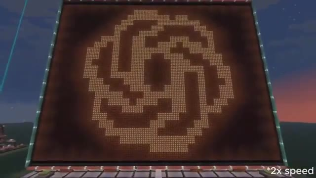
*Un motif géométrique pixelisé complexe affiché dans un jeu vidéo de type Minecraft, avec la mention "*2x speed" en bas à droite.*

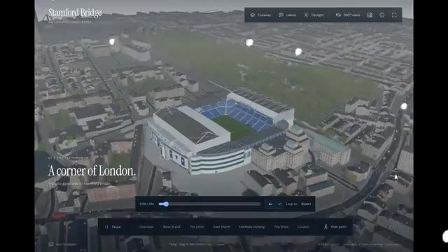
*Une interface web interactive en 3D représentant le stade de football de Stamford Bridge avec des options de navigation et des commandes vidéo en bas.*

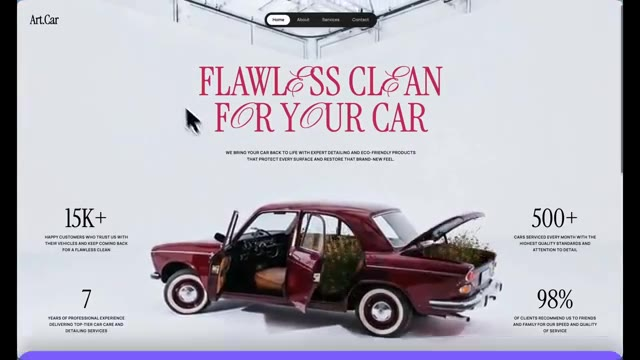
*Une maquette de site web moderne pour un service de nettoyage de voitures de luxe nommé "Art.Car" avec un curseur de souris visible.*

---

### ⏱️ `[00:00:18 - 00:00:53]` | Segment #02

**🔊 Audio (Transcription Intégrale Mot pour Mot en Français) :**
> Nous allons examiner ces générations une par une afin que vous puissiez voir par vous-même de quoi ce nouveau modèle est capable. Alors prenez vos chips, installez-vous confortablement et concentrez-vous sur la vidéo car nous avons beaucoup de choses à couvrir. Allez, c'est parti. C'est Pursuing AI et vous regardez le Research Report. Alors, commençons par la génération 3D. Et honnêtement, il y a quelque chose de vraiment intéressant à propos de ce premier exemple. À première vue, vous pourriez regarder ceci et vous dire, d'accord, c'est une ville 3D générée par IA, mais il y a en fait beaucoup plus de choses qui se passent sous la surface. Nous avons cette ville entière

**👁️ Analyse Visuelle d'Écran (gemini-3.5-flash-lite) :**
**Interface & Outils** : Interface de la plateforme web de visualisation de données 3D 'dat.city' (world data playground), comportant des menus de districts, une barre de recherche de données et une barre d'outils de navigation en bas.

**Contenu textuel & Code** : Texte "dat.city", "WORLD DATA PLAYGROUND", "Districts", "Search the data...", et "NOW PLAYING Bricklight Anthem". Piliers de données en 3D colorés dans des cercles lumineux sur fond de grille de données.

**Action / Démonstration** : Navigation et survol en 3D au-dessus d'une ville virtuelle, puis basculement vers une vue de visualisation de données souterraines sur la plateforme dat.city.

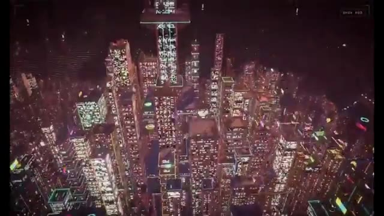
*Vue aérienne nocturne d'une ville 3D générée par intelligence artificielle avec des gratte-ciels illuminés.*

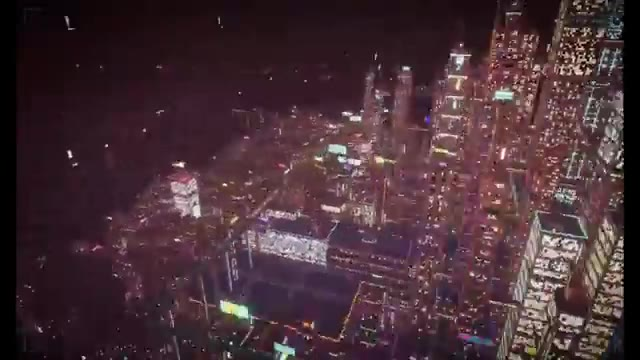
*Poursuite du survol aérien nocturne de la ville 3D futuriste.*

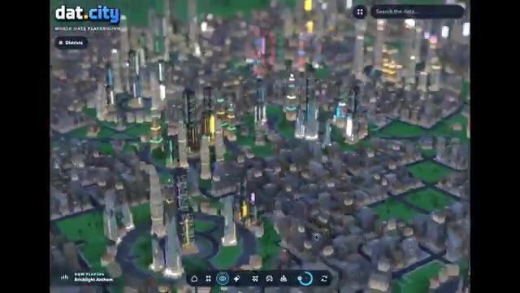
*Interface de la plateforme 'dat.city' montrant une maquette 3D interactive d'une ville en journée.*

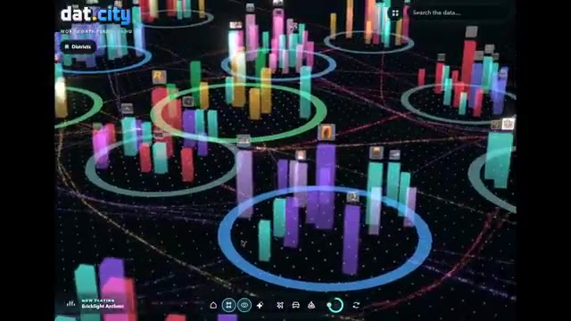
*Vue analytique sous la surface de la plateforme 'dat.city' affichant des données sous forme de piliers colorés et de cercles lumineux.*

---

### ⏱️ `[00:00:53 - 00:01:27]` | Segment #03

**🔊 Audio (Transcription Intégrale Mot pour Mot en Français) :**
> environnement avec différents bâtiments, routes, quartiers, paysages et tous ces éléments différents placés à travers la scène. Et ce qui rend la chose encore plus intéressante, c'est que le placement de ces éléments n'est pas complètement aléatoire. L'utilisateur qui a partagé cette génération nous a également montré un aperçu du graphique d'arrière-plan de la ville, et c'est plutôt fou. Vous pouvez voir différents nœuds, relations, quartiers et connexions qui composent l'environnement. Donc, au lieu de simplement générer un tas d'objets 3D et de les jeter sur un écran, il y a une structure sous-jacente connectant différentes parties de la ville. Et l'utilisateur a également mentionné qu'il peut contrôler le

**👁️ Analyse Visuelle d'Écran (gemini-3.5-flash-lite) :**
**Interface & Outils** : Interface web de dat.city (World Data Playground) et capture d'écran du réseau social X (Twitter).

**Contenu textuel & Code** : Texte de l'interface dat.city ("dat.city", "WORLD DATA PLAYGROUND", "Districts", "Search the data...", "NOW PLAYING Bricklight Anthem"). Texte du tweet de Ryan Sael (@RyanSael) : "BUT / I can control the placement however I want. / Here's a peak of the backend showing graph for the city:", avec un schéma de graphe montrant des nœuds et des relations en arrière-plan.

**Action / Démonstration** : Navigation et exploration visuelle de l'environnement virtuel 3D de dat.city, puis affichage du graphique de données en arrière-plan (backend graph).

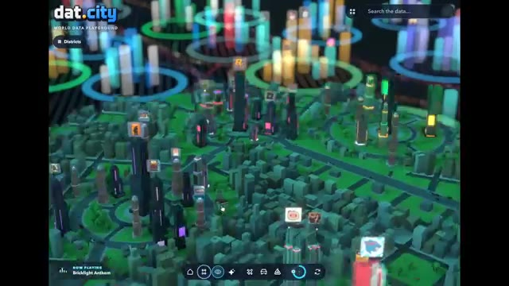
*Vue aérienne détaillée d'un environnement urbain virtuel 3D généré sur la plateforme dat.city.*

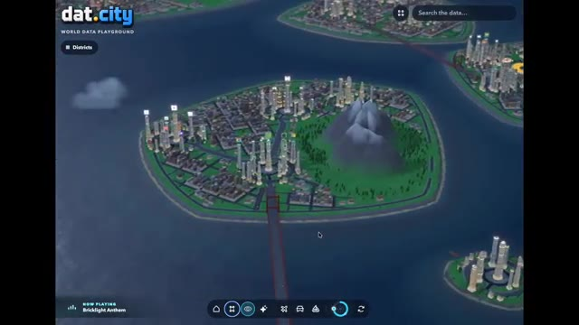
*Vue d'ensemble sur une île urbaine 3D avec des gratte-ciels et une montagne au centre.*

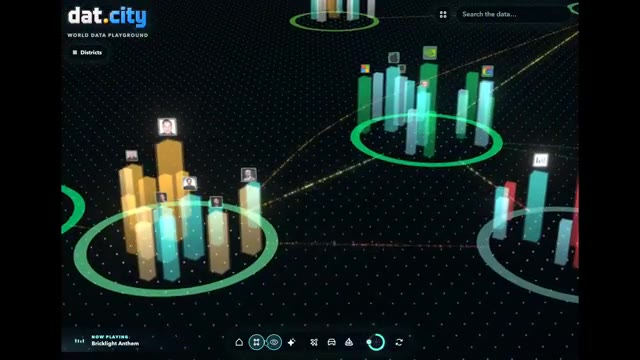
*Vue en gros plan du graphique de données sous-jacent représentant les nœuds et connexions de la ville.*

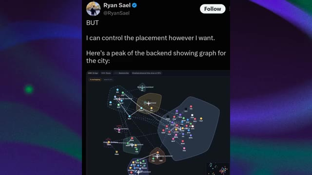
*Capture d'écran d'un tweet de Ryan Sael montrant le graphique de l'architecture backend de la ville.*

---

### ⏱️ `[00:01:27 - 00:02:04]` | Segment #04

**🔊 Audio (Transcription Intégrale Mot pour Mot en Français) :**
> le placement comme vous voulez. C'est important parce que vous n'êtes pas nécessairement bloqué avec la disposition que l'IA vous donne. Vous pouvez réellement contrôler où vont les différents éléments et comment l'environnement est organisé. Et il y a aussi cette autre vue où vous pouvez voir les différents districts représentés sous forme de groupes séparés de structures 3D. Donc quand vous mettez tout cela ensemble, cela devient beaucoup plus intéressant que de simplement dire que l'IA a généré une ville en 3D. Nous examinons un environnement doté d'une structure de données sous-jacente, de relations entre les différents éléments et d'un contrôle sur la façon dont ces éléments sont positionnés. Et c'est là que le contenu 3D généré par l'IA commence à devenir vraiment intéressant.

**👁️ Analyse Visuelle d'Écran (gemini-3.5-flash-lite) :**
**Interface & Outils** : Application web "dat.city" (World Data Playground) avec interface de navigation 3D et barres d'outils de visualisation.

**Contenu textuel & Code** : Texte du tweet de Ryan Sael ("BUT I can control the placement however I want. Here's a peak of the backend showing graph for the city:"), graphe de nœuds et liens de données, interface de dat.city avec barres de recherche, boutons de districts et lecteur audio ("NOW PLAYING Bricklight Anthem").

**Action / Démonstration** : Navigation et basculement entre la vue 3D de la ville urbaine interactive, le graphe de données sous-jacent et la vue des districts sous forme de structures 3D.

*Capture d'écran d'un tweet de Ryan Sael montrant le graphe backend de la ville avec ses connexions.*

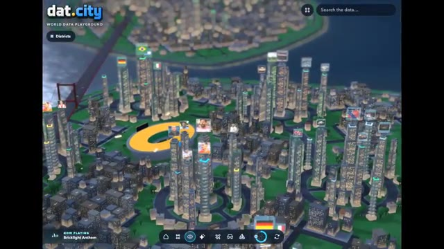
*Vue d'ensemble de l'interface de l'application dat.city montrant une ville 3D générée avec des bâtiments et des icônes.*

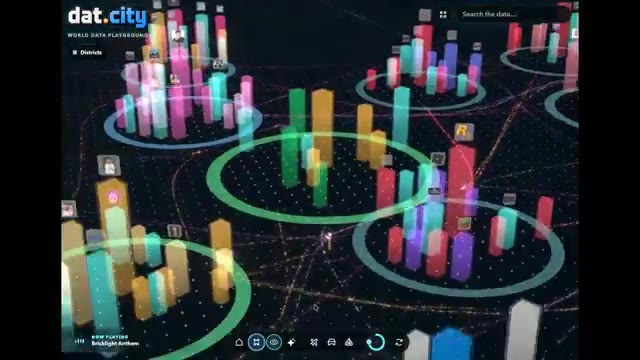
*Vue alternative de dat.city montrant les différents districts représentés par des groupes de structures 3D colorées sur un fond sombre de données.*

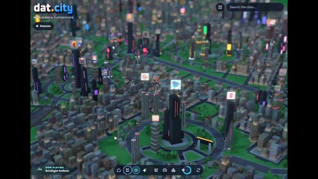
*Autre angle de vue de la ville 3D interactive dans l'application dat.city avec une palette de couleurs différente pour les bâtiments.*

---

### ⏱️ `[00:02:04 - 00:02:25]` | Segment #05

**🔊 Audio (Transcription Intégrale Mot pour Mot en Français) :**
> Imaginez pouvoir décrire le genre de monde que vous voulez, demander à l'IA de construire l'environnement initial, puis d'entrer à l'intérieur de cet environnement et de le modifier comme vous le souhaitez. Cela peut être utile pour le développement de jeux, les simulations, la visualisation, les sites web interactifs, et bien plus encore. Et rappelez-vous, ce n'est qu'un exemple. Vous pouvez réellement essayer cela par vous-même. Le lien est dans la description.

**👁️ Analyse Visuelle d'Écran (gemini-3.5-flash-lite) :**
**Interface & Outils** : Interface de la plateforme web interactive dat.city ("World Data Playground") avec barre de recherche, menu des districts et barre d'outils de navigation en bas d'écran. Capture d'écran d'un tweet du compte de Ryan Sael.

**Contenu textuel & Code** : Texte "dat.city", "WORLD DATA PLAYGROUND", "Search the data...", "Districts", "NOW PLAYING Bricklight Anthem", et sur le tweet "Ryan Sael @RyanSael", "Follow", "dat.city — World Data Playground", "From dat.city". Icônes de géants de la tech (Apple, Google, Nvidia, Microsoft).

**Action / Démonstration** : Exploration interactive en 3D d'une ville virtuelle générée par IA montrant différents districts, avec affichage d'icônes d'entreprises, puis affichage d'une publication Twitter illustrant le projet.

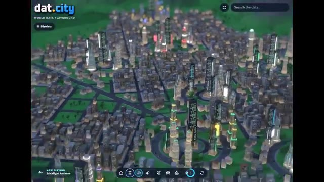
*Vue aérienne interactive de la ville virtuelle sur la plateforme dat.city.*

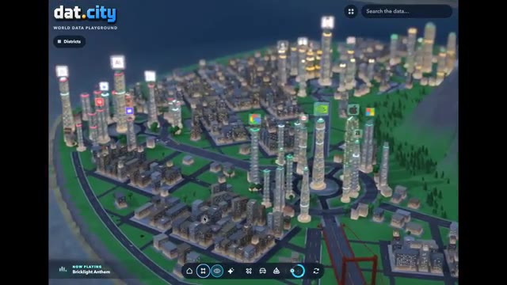
*Vue de la ville virtuelle sur dat.city avec des icônes d'entreprises technologiques au sommet des tours.*

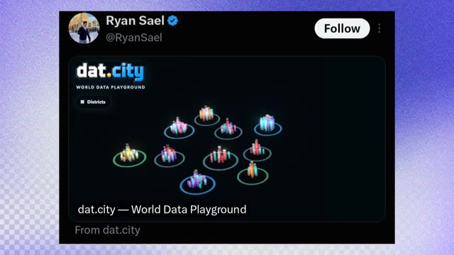
*Publication sur le réseau social X (Twitter) de Ryan Sael montrant une capture d'écran de dat.city.*

---

### ⏱️ `[00:02:26 - 00:02:58]` | Segment #06

**🔊 Audio (Transcription Intégrale Mot pour Mot en Français) :**
> Passons donc à une autre génération 3D. Et celle-ci adopte une approche complètement différente. Un créateur a pris un vieux dessin technique d'une locomotive à vapeur et l'a donné à Astra pour le reconstruire dans Blender. Et regardez simplement le résultat. Selon le créateur, Astra a généré 3 295 objets entièrement modifiables pour recréer le train. Et la partie vraiment cool, c'est que vous pouvez séparer le modèle en différentes parties et travailler réellement avec elles. Donc, au lieu d'obtenir un seul modèle 3D plat, vous obtenez quelque chose qui peut être édité et modifié à l'intérieur de Blender. Vous pouvez également contrôler

**👁️ Analyse Visuelle d'Écran (gemini-3.5-flash-lite) :**
**Interface & Outils** : Interface du réseau social X (Twitter) et du logiciel de modélisation 3D Blender.

**Contenu textuel & Code** : Textes des tweets de Ryan Sael et Tom Krcha (« So how good really is GPT-6 Astra at 3D modeling? I took an old drawing of a steam train... »), arborescence des calques Blender listant les 3 295 objets (ex: 'Axle 1 horn guide', 'Bell open bronze casting').

**Action / Démonstration** : Affichage de publications sur les réseaux sociaux et navigation/visualisation d'un modèle 3D complexe composé de milliers d'objets dans Blender.

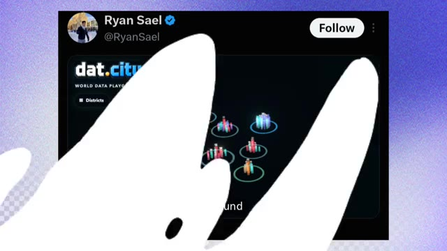
*Publication sur X (Twitter) du compte Ryan Sael montrant une interface graphique avec des graphiques de données en anneau.*

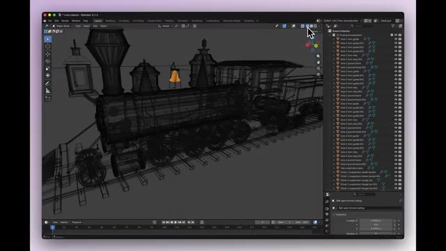
*Interface du logiciel Blender affichant le modèle 3D filaire d'une locomotive à vapeur et son arborescence de 3 295 objets modifiables.*

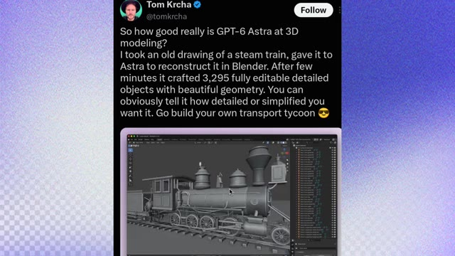
*Capture d'un tweet de Tom Krcha détaillant le processus de modélisation 3D d'une locomotive à vapeur par Astra dans Blender, avec une capture d'écran du résultat.*

---

### ⏱️ `[00:02:58 - 00:03:18]` | Segment #07

**🔊 Audio (Transcription Intégrale Mot pour Mot en Français) :**
> à quel point vous voulez que le modèle final soit détaillé ou simplifié. Maintenant, évidemment, ce n'est pas parfait, il y a encore des zones qui nécessitent un travail supplémentaire. Mais le fait qu'Astra puisse prendre un dessin technique 2D et le transformer en un modèle 3D complexe et modifiable est vraiment impressionnant, et cela vous donne une assez bonne idée de la direction que pourrait prendre la modélisation 3D assistée par IA.

**👁️ Analyse Visuelle d'Écran (gemini-3.5-flash-lite) :**
**Interface & Outils** : Logiciel de modélisation 3D Blender (version 5.1.2) affichant une arborescence de scène détaillée, une fenêtre de visualisation 3D en mode filaire et ombré, ainsi qu'une fenêtre contextuelle montrant le plan technique 2D d'origine (train.jpg).

**Contenu textuel & Code** : Interface complète de Blender avec le panneau "Scene Collection" listant les différents composants de la locomotive (frames & suspension, axle horn guide, driver suspension, etc.), la timeline en bas, et l'arborescence des calques.

**Action / Démonstration** : Navigation et inspection des différents éléments géométriques du modèle 3D de la locomotive dans l'espace de travail Blender, démontrant la structure éditable générée par l'outil d'IA Astra.

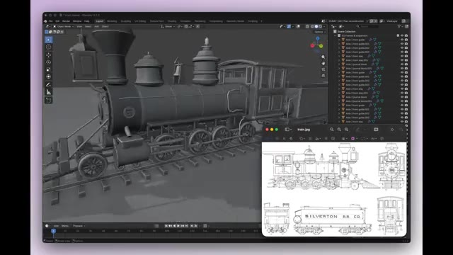
*Vue d'ensemble dans Blender montrant le modèle 3D d'une locomotive à vapeur généré à partir d'un dessin technique 2D affiché en incrustation.*

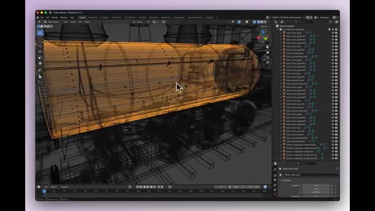
*Gros plan dans Blender mettant en surbrillance en orange la structure filaire de la chaudière de la locomotive, montrant la complexité de la géométrie 3D.*

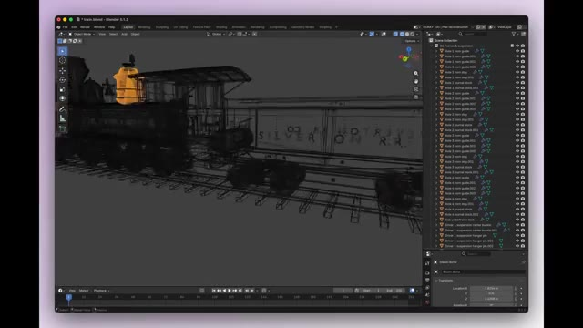
*Vue de l'éditeur 3D Blender affichant la sélection d'un dôme ou d'un élément spécifique de la locomotive en surbrillance orange.*

---

### ⏱️ `[00:03:18 - 00:03:42]` | Segment #08

**🔊 Audio (Transcription Intégrale Mot pour Mot en Français) :**
> Mais le prochain exemple pousse cette idée encore plus loin. Et ensuite le joueur monte dans la voiture. Maintenant nous roulons à travers la ville, et vous pouvez voir le trafic, les bâtiments, les routes et l'environnement qui changent à mesure que le joueur se déplace. Il y a même une interface de véhicule affichant des éléments comme la vitesse, le rapport de vitesse et l'option de quitter le véhicule. Et c'est là que cela commence à ressembler davantage à un vrai jeu plutôt qu'à une simple démo 3D.

**👁️ Analyse Visuelle d'Écran (gemini-3.5-flash-lite) :**
**Interface & Outils** : Logiciel 3D Blender et moteur de jeu interactif avec interface utilisateur (HUD, mini-carte, indicateur de vitesse).

**Contenu textuel & Code** : Blocs de code/interface Blender, plaques d'immatriculation, indication "E EXIT VEHICLE", vitesse en km/h, rapport engagé (GEAR 1), carte de navigation avec noms de zones urbaines.
[DESC_ACTION] Navigation dans Blender puis démonstration en temps réel d'un jeu vidéo interactif avec conduite de véhicule et affichage d'une carte de navigation.

**Action / Démonstration** : Démonstration pédagogique et présentation du workflow.

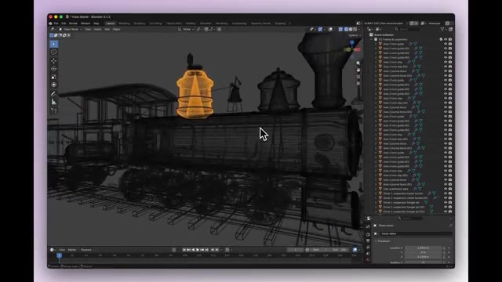
*Interface du logiciel Blender affichant le modèle 3D filaire d'une locomotive à vapeur.*

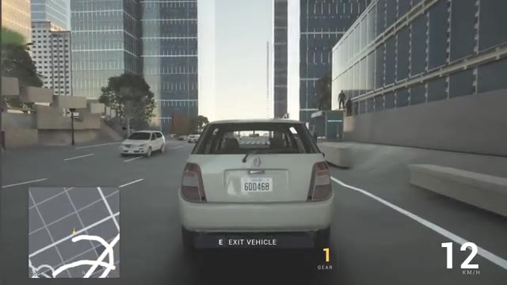
*Vue de jeu en mondes virtuels montrant une voiture en mouvement dans une rue urbaine avec une interface de véhicule (vitesse, rapport, mini-carte).*

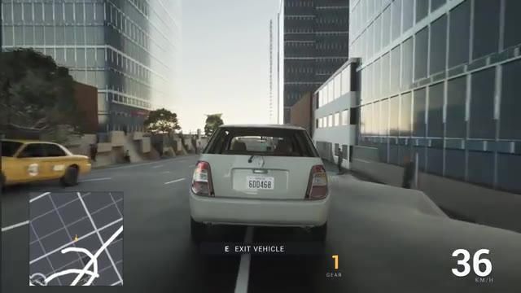
*Vue de jeu similaire avec la voiture accélérant, modifiant l'affichage de la vitesse (36 km/h) et l'environnement urbain.*

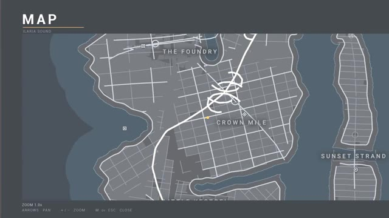
*Affichage en plein écran d'une carte interactive de jeu nommée "MAP" indiquant différents quartiers (The Foundry, Crown Mile, Sunset Strand).*

---

### ⏱️ `[00:03:42 - 00:04:03]` | Segment #09

**🔊 Audio (Transcription Intégrale Mot pour Mot en Français) :**
> Le créateur a également mentionné l'utilisation de multiples sous-agents en boucles lors de la construction du jeu. Donc au lieu de penser à l'IA comme écrivant simplement un bout de code et s'arrêtant là, vous examinez un flux de travail où différentes tâches peuvent être traitées de manière répétée. Maintenant, ce n'est évidemment pas GTA 6. L'échelle et la complexité d'un jeu AAA massif se situent à un tout autre niveau.

**👁️ Analyse Visuelle d'Écran (gemini-3.5-flash-lite) :**
**Interface & Outils** : Navigateur web affichant une publication sur la plateforme X (anciennement Twitter).

**Contenu textuel & Code** : Publication de l'utilisateur @rick_boers affirmant : "I just made this GTA 6 clone with ChatGPT 6 Astra on Ultra setting. I used a lot of subagents in loops and it looks so good! The graphics are like of games that cost millions..." Accompagné d'une image/vidéo du jeu montrant une voiture sur une route entre des immeubles.

**Action / Démonstration** : Affichage à l'écran de la publication sur les réseaux sociaux pour illustrer le post du créateur concernant la création de jeux par IA.

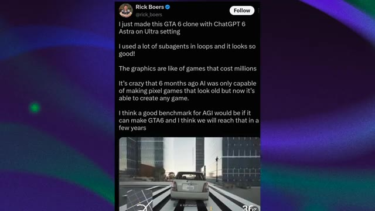
*Publication Twitter/X de Rick Boers montrant une capture d'écran d'un clone de GTA 6 généré par IA et le texte décrivant son utilisation de sous-agents.*

---

### ⏱️ `[00:04:03 - 00:04:24]` | Segment #10

**🔊 Audio (Transcription Intégrale Mot pour Mot en Français) :**
> Mais ce n'est pas vraiment le sujet. Ce qui est intéressant, c'est que quelqu'un puisse passer d'une idée à un jeu 3D jouable avec une ville, des véhicules, de la circulation, des personnages, une interface utilisateur et des systèmes de jeu, et cela montre comment l'IA pourrait commencer à devenir utile dans des parties beaucoup plus importantes du processus de développement de jeux. Et nous n'en avons pas fini avec les jeux, car le prochain exemple va dans une direction complètement différente.

**👁️ Analyse Visuelle d'Écran (gemini-3.5-flash-lite) :**
**Interface & Outils** : Démonstration visuelle d'un moteur de jeu 3D ou d'un prototype de jeu vidéo généré par IA montrant des environnements urbains interactifs.

**Contenu textuel & Code** : Environnement virtuel 3D texturé comprenant des bâtiments urbains, des véhicules (voitures, vans), du trafic routier, des lampadaires, de la végétation et des personnages modélisés.

**Action / Démonstration** : Défilement fluide de la caméra à travers différents angles de vue (rue, aérienne, place publique) au sein de la ville 3D interactive générée par IA pour illustrer le potentiel des outils de développement de jeux.

*Vue au niveau de la rue dans un environnement de jeu 3D généré par IA, montrant des immeubles, des lampadaires, des voitures en circulation et un aperçu de la mer à l'horizon.*

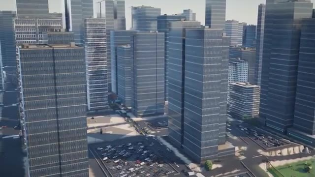
*Vue aérienne en plongée (drone) d'une ville 3D générée par IA dense avec de grands gratte-ciels en verre, des rues quadrillées et un parking rempli de véhicules.*

*Vue horizontale au niveau du sol d'une place urbaine d'un jeu 3D, montrant des bâtiments aux façades variées, du mobilier urbain, des véhicules garés et des personnages non-joueurs (PNJ) debout sur le trottoir.*

---

### ⏱️ `[00:04:24 - 00:04:46]` | Segment #11

**🔊 Audio (Transcription Intégrale Mot pour Mot en Français) :**
> Si vous avez déjà joué à Minecraft, celui-ci va vous sembler plutôt familier. Il s'agit d'un jeu de survie de style Minecraft généré avec Astra. Vous avez un monde basé sur des blocs avec des montagnes, des arbres, de l'eau, des maisons, des fermes et différentes zones que vous pouvez explorer. Mais il ne s'agit pas seulement de se promener. Il y a un inventaire, une barre d'accès rapide, des barres de santé et de faim, différents objets et même un système de fabrication.

**👁️ Analyse Visuelle d'Écran (gemini-3.5-flash-lite) :**
**Interface & Outils** : Jeu vidéo de type Minecraft généré par Astra / Interface utilisateur de jeu de survie (barre de vie, faim, inventaire, menu de craft).

**Contenu textuel & Code** : Éléments de jeu textuels et visuels : nom "WILDWOOD", barres de vie (coeurs) et de faim, grille de fabrication 3x3, inventaire contenant 3 bâtons et 12 blocs de bois, commandes affichées en bas de l'écran.

**Action / Démonstration** : Exploration d'un monde virtuel généré par IA et affichage des différentes interfaces de jeu (inventaire et craft).

*Vue d'une rue urbaine avec des voitures et des bâtiments, générée par intelligence artificielle.*

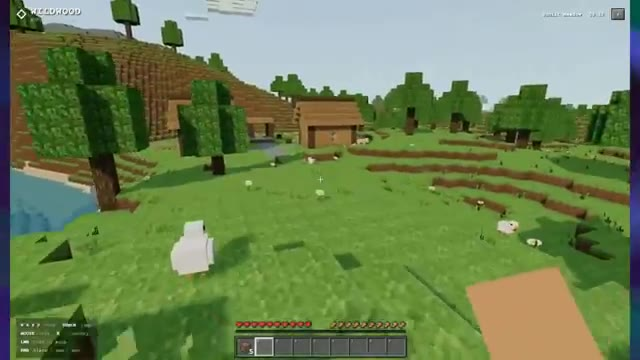
*Vue de gameplay dans un monde de type Minecraft avec des collines verdoyantes, des arbres et une maison en bois.*

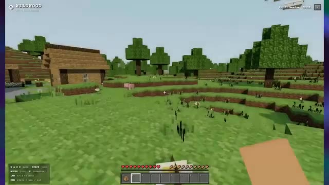
*Vue en mouvement montrant le personnage explorant le paysage pixelisé avec des animaux et un bâtiment en bois.*

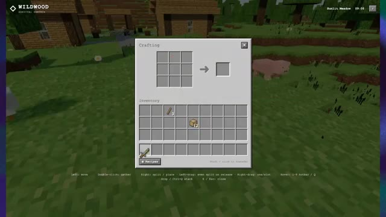
*Affichage de l'interface de fabrication (crafting) et de l'inventaire avec des objets en blocs de bois et des bâtons.*

---

### ⏱️ `[00:04:46 - 00:05:11]` | Segment #12

**🔊 Audio (Transcription Intégrale Mot pour Mot en Français) :**
> Vous pouvez réellement voir le joueur fabriquer une pioche puis l'utiliser tout en explorant le monde. Et c'est ce qui rend cet exemple intéressant. Nous ne regardons pas seulement un environnement généré. de multiples systèmes de jeu travaillant ensemble pour créer une véritable expérience jouable. Nous avons déjà vu le jeu de style GTA, et maintenant nous regardons un type de jeu complètement différent avec des mécaniques complètement différentes, et c'est ce que je voulais mettre en valeur ici.

**👁️ Analyse Visuelle d'Écran (gemini-3.5-flash-lite) :**
**Interface & Outils** : Interface du jeu vidéo "WILDWOOD" (survival sandbox) comprenant une barre d'inventaire rapide en bas, des indicateurs de santé/vies, des contrôles affichés en bas à gauche et un menu d'inventaire/coffre.

**Contenu textuel & Code** : Texte du logo "WILDWOOD - SURVIVAL SANDBOX", commandes clavier en bas à gauche (WASD: move, SPACE: jump, TAB: inventory, etc.), interface de coffre (Chest) avec divers matériaux et icônes d'objets, et nom du lieu "Oakridge Village" en haut à droite.

**Action / Démonstration** : Le joueur explore le monde, manie une pioche en bois, interagit avec des coffres pour gérer son inventaire et récolte des ressources dans un champ de blé.

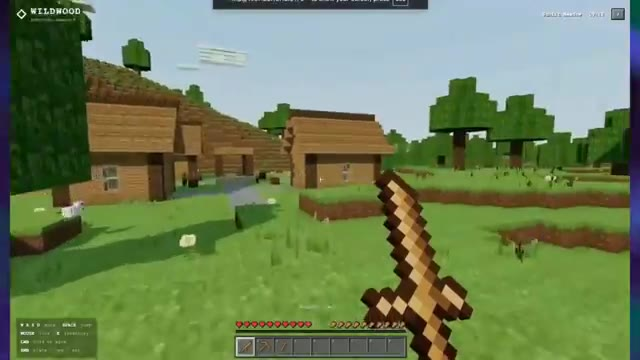
*Vue à la première personne dans le jeu "WILDWOOD" montrant un village avec des maisons en bois et un joueur tenant un outil.*

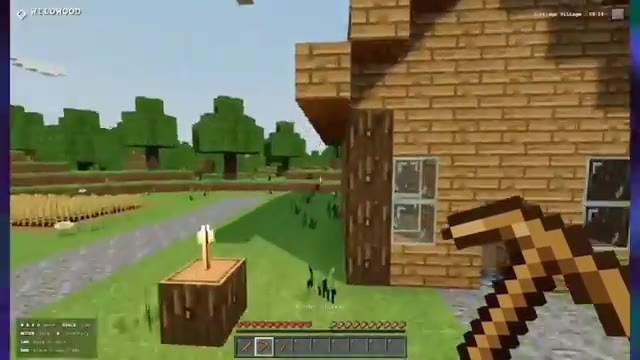
*Gros plan sur le personnage tenant une pioche en bois près d'un établi en bois dans le village.*

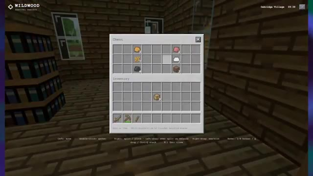
*Interface d'inventaire et de coffre montrant différents objets, matériaux et blocs dans le jeu.*

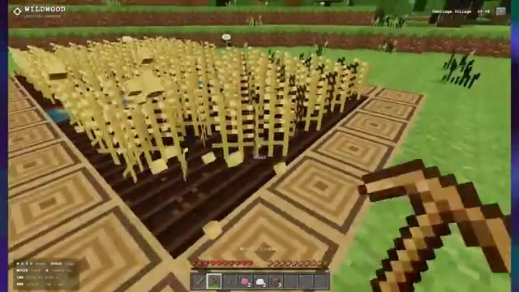
*Le joueur utilise la pioche pour récolter du blé dans un champ cultivé du jeu.*

---

### ⏱️ `[00:05:11 - 00:05:46]` | Segment #13

**🔊 Audio (Transcription Intégrale Mot pour Mot en Français) :**
> Astra n'est pas limité à un seul type de jeu. Il peut générer des expériences très différentes selon ce que vous lui demandez de créer. Mais il y a une comparaison supplémentaire intéressante à examiner. Ici, nous avons le même type de génération de jeu exécuté avec différents paramètres d'Astra, et vous pouvez immédiatement remarquer certaines différences. Le paramètre le plus élevé produit un résultat plus détaillé et soigné, en particulier dans l'environnement et la qualité visuelle globale. Le paramètre moyen est plus simple, mais il est toujours capable de produire l'expérience de jeu de base. Cela vous donne donc une assez bonne idée de la façon dont la modification des paramètres du modèle peut affecter la génération finale. Et honnêtement, si le moyen

**👁️ Analyse Visuelle d'Écran (gemini-3.5-flash-lite) :**
**Interface & Outils** : Interface de jeu vidéo généré par IA (moteur Astra / style Minecraft et jeu de plateforme 3D).

**Contenu textuel & Code** : Texte "WILDWOOD" en haut à gauche, barre d'inventaire et de santé en bas. Sur l'image 2, texte "GPT-6-Astra (Max)" et "GPT-6-Astra (Medium)" avec des compteurs de score et un personnage bleu de type Sonic en train de courir.

**Action / Démonstration** : Démonstration comparative d'un jeu généré par IA montrant un gameplay à la première personne (style Minecraft) puis une comparaison côte à côte entre deux réglages de modèle différents (Max vs Medium).

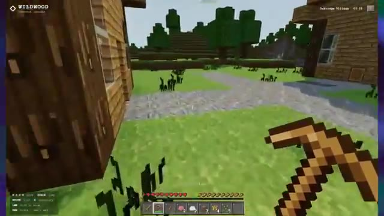
*Capture d'écran montrant un jeu de type Minecraft généré par IA dans un style voxel avec une pioche à la première personne et l'interface "Wildwood" en haut à gauche.*

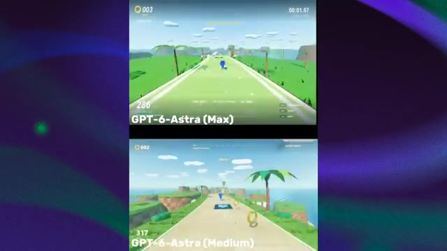
*Capture d'écran divisée en deux comparant deux versions d'un jeu de course généré par IA : "GPT-6-Astra (Max)" en haut et "GPT-6-Astra (Medium)" en bas.*

---

### ⏱️ `[00:05:46 - 00:06:21]` | Segment #14

**🔊 Audio (Transcription Intégrale Mot pour Mot en Français) :**
> la version peut déjà produire quelque chose comme ça, la version haut de gamme devient assez intéressante. Mais maintenant, laissons de côté le développement de jeux pendant un moment et examinons quelque chose de complètement différent. Ce prochain exemple est un flux de travail de peinture numérique. Et au lieu de simplement vous montrer l'image finale, Astra construit réellement l'œuvre d'art étape par étape. Vous pouvez la voir commencer par une toile de base, puis construire le contour, ajouter les couleurs, travailler sur les cheveux et les vêtements, et ajouter progressivement les plus petits détails. Et à la fin, cela se transforme en cette illustration complète de Hatsune Miku. Ce que je trouve intéressant ici, c'est que vous voyez le processus plutôt

**👁️ Analyse Visuelle d'Écran (gemini-3.5-flash-lite) :**
**Interface & Outils** : Interface logicielle de "Code Paint" pour la peinture numérique générée par code, ainsi qu'une interface de test de jeu montrant les performances de modèles ("GPT-6-Astra").

**Contenu textuel & Code** : Texte à l'écran : "GPT-6-Astra (Max)", "GPT-6-Astra (Medium)", "NICE RUN!", "00:24.59", "CODE PAINT", "初音ミク" (Hatsune Miku), lignes de code JavaScript pour le dessin de canvas (ex: `ctx.moveTo`), et liste des étapes du processus artistique (fond de toile, contours, couleurs, cheveux, vêtements).

**Action / Démonstration** : Le flux de travail numérique montre la génération et le tracé progressifs d'une illustration étape par étape, passant d'un simple contour à un dessin entièrement coloré, accompagné de contrôles de lecture et de vitesse (2X).

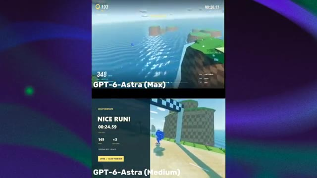
*Démonstration comparative de gameplay montrant le personnage Sonic en train de courir sur des îles flottantes, généré par "GPT-6-Astra (Max)" en haut et "GPT-6-Astra (Medium)" en bas avec un écran de fin de course.*

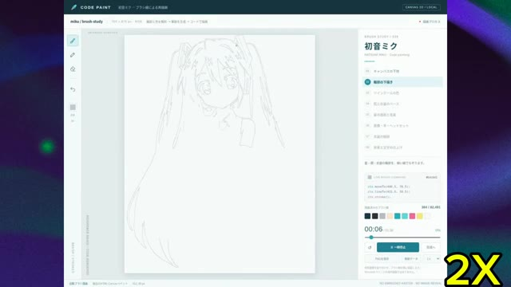
*Interface de l'application de peinture numérique "Code Paint" montrant la création étape par étape d'une illustration de Hatsune Miku, avec le tracé des contours en cours et un panneau latéral de code et de calques.*

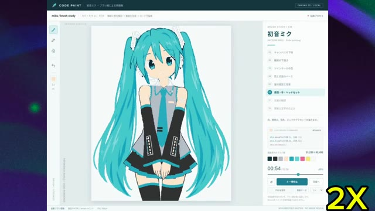
*Interface de l'application "Code Paint" affichant l'illustration presque complète et colorée de Hatsune Miku avec ses couettes turquoises, ses vêtements détaillés et les outils de pilotage du processus.*

---

### ⏱️ `[00:06:21 - 00:06:54]` | Segment #15

**🔊 Audio (Transcription Intégrale Mot pour Mot en Français) :**
> que le résultat final. Ça montre essentiellement comment un système d'IA peut aborder une œuvre d'art numérique étape par étape. Et maintenant, passons à une autre grande catégorie : le développement front-end. Et celle-ci est assez impressionnante parce qu'Astra peut prendre une idée et la transformer en site web complet. Ici, vous pouvez voir qu'il a créé un site web complet de préparation esthétique automobile avec navigation, typographie, statistiques, différentes sections et un grand visuel juste au centre. Et la partie intéressante, c'est que ça ne ressemble pas seulement à une page basique générée par IA. Les différents éléments fonctionnent réellement ensemble pour former un

**👁️ Analyse Visuelle d'Écran (gemini-3.5-flash-lite) :**
**Interface & Outils** : Logiciel de création artistique Code Paint et navigateur web affichant un site web généré par IA.

**Contenu textuel & Code** : Code Paint (Hatsune Miku, Canvas 2D / Local, 01:18, code JS/HTML visible). Site web "Art.Car" avec navigation (Home, About, Services, Contact), titre "FLAWLESS CLEAN FOR YOUR CAR", statistiques (15K+, 500+, 7, 98%) et menu de services ("Ceramic Coating 9H", "Full Exterior Polish", "Paint Correction & Restore").

**Action / Démonstration** : Démonstration du processus de création d'une œuvre étape par étape, transition textuelle, puis présentation interactive d'un site web complet généré par IA avec navigation entre les sections et affichage des détails.

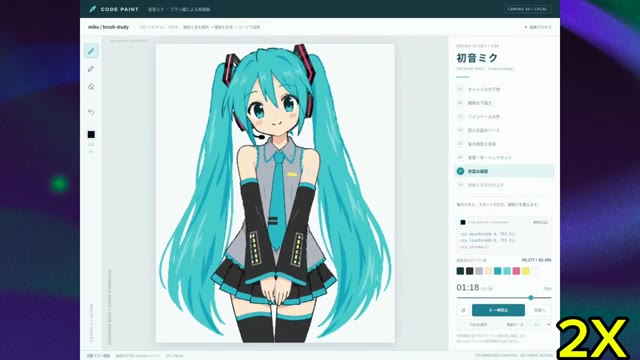
*Interface de programmation de Code Paint montrant la création étape par étape d'une illustration style anime de Hatsune Miku*

*Titre de transition affichant "FRONTEND DEVELOPMENT" en lettres découpées sur fond bleu*

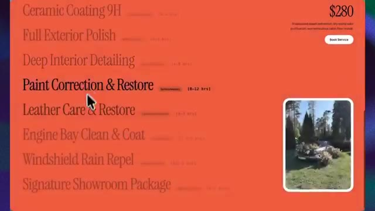
*Section de services sur fond rouge d'un site web de detailing automobile généré par IA, montrant différentes prestations et tarifs*

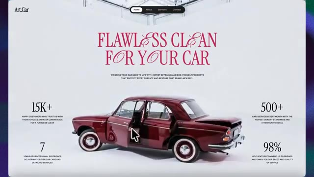
*Page d'accueil complète d'un site web de detailing automobile ("Art.Car") avec navigation, titre principal, statistiques et image centrale d'une voiture ancienne rouge*

---

### ⏱️ `[00:06:54 - 00:07:25]` | Segment #16

**🔊 Audio (Transcription Intégrale Mot pour Mot en Français) :**
> un design complet. Donc au lieu de commencer avec un écran vide et de construire chaque section manuellement, vous pouvez donner une idée à l'IA et obtenir quelque chose qui ressemble déjà beaucoup plus à un site web fini. Et ce n'est qu'un exemple. Voici une autre génération de front-end, et celle-ci prend une direction complètement différente. Vous pouvez voir une interface propre et interactive avec un style visuel et une mise en page complètement différents. Et c'est ce que j'aime dans ces exemples. Astra ne se contente pas de répéter le même modèle de site web, il peut adapter le design en fonction de ce que vous lui demandez de construire.

**👁️ Analyse Visuelle d'Écran (gemini-3.5-flash-lite) :**
**Interface & Outils** : Navigateur web affichant un design de site web et une publication sur le réseau social X (anciennement Twitter).

**Contenu textuel & Code** : Textes visibles : "Art.Car", "FLAWLESS CLEAN FOR YOUR CAR", "Ceramic Coating 9H $850", "GPT-6 Astra Is Finally Here (And It's REALLY Good)", "One-shot anything.", profil de Viktor Oddy (@viktoroddy), post d'OpenAI. Sur la troisième image : "Engineered for the Demands of Tomorrow", "How we manage your network efficiently".

**Action / Démonstration** : Défilement et présentation visuelle de différents modèles de sites web générés par l'intelligence artificielle Astra, illustrant la diversité des designs et des mises en page.

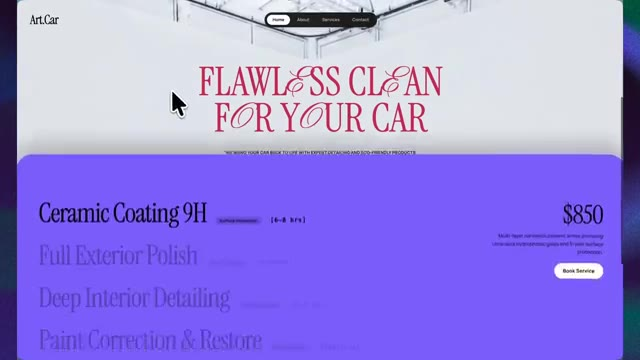
*Aperçu rapproché d'un design de site web automobile généré par IA, montrant le titre principal et les options de service en surbrillance violette.*

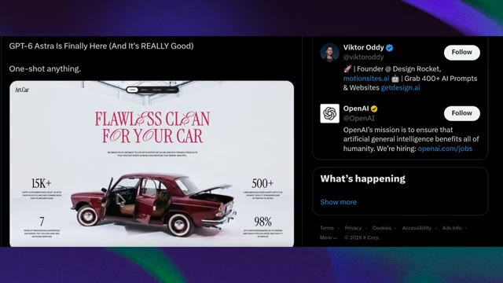
*Capture d'écran d'un tweet de Viktor Oddy présentant le site 'Art.Car' généré par GPT-6 Astra, avec l'interface X (Twitter) sur le côté droit.*

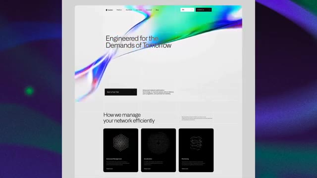
*Aperçu d'un autre design de site web front-end interactif avec un style visuel et une mise en page épurés, axé sur l'optimisation réseau.*

---

### ⏱️ `[00:07:26 - 00:07:59]` | Segment #17

**🔊 Audio (Transcription Intégrale Mot pour Mot en Français) :**
> Et honnêtement, après avoir vu tous ces exemples, nous avons couvert pas mal de choses. Et cela nous amène à la fin de notre regard sur GPT-6 Astra. Nous avons commencé par la génération 3D, puis sommes passés à Blender, au développement de jeux, à l'art numérique, et enfin au développement front-end. Et à travers tous ces exemples, une chose devient assez claire. L'IA va au-delà de la simple génération de pièces de contenu individuelles. Nous commençons à la voir fonctionner avec des environnements plus complexes, des flux de travail plus longs, de multiples outils et des expériences interactives réelles. Bien sûr, il y a encore des limitations,

**👁️ Analyse Visuelle d'Écran (gemini-3.5-flash-lite) :**
**Interface & Outils** : Navigateur web, logiciel Blender, outils de simulation de ville et applications de génération 3D/graphique.

**Contenu textuel & Code** : Textes "Engineered for the Demands of Tomorrow", "How we manage your network efficiently", affichage de visualisations de données, interface Blender avec modélisation de train, mini-carte GPS et graphismes de paon en 3D.

**Action / Démonstration** : Présentation récapitulative des différents domaines d'application de l'IA (3D, Blender, jeux, art, front-end) à travers une grille d'interfaces dynamiques.

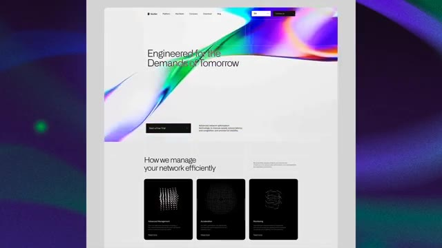
*Page web affichant un site technologique avec des graphismes abstraits et colorés.*

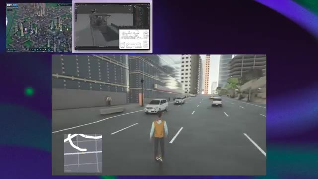
*Collage d'interfaces multiples montrant une carte de ville interactive, un logiciel 3D (Blender) et une simulation de conduite urbaine en vue subjective.*

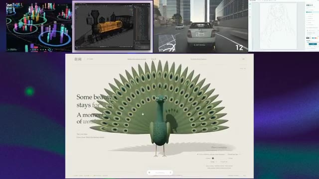
*Vue éclatée comprenant plusieurs fenêtres : visualisation de données 3D, modélisation d'une locomotive dans Blender, conduite en ville et interface de création graphique avec un paon stylisé en bas.*

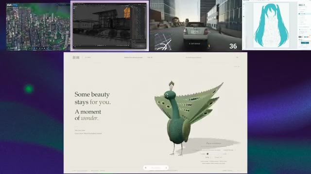
*Poursuite de la démonstration avec le paon en 3D interactif et les différentes fenêtres d'outils d'IA en haut.*

---

### ⏱️ `[00:07:59 - 00:08:17]` | Segment #18

**🔊 Audio (Transcription Intégrale Mot pour Mot en Français) :**
> et ces exemples ne doivent pas être pris comme la preuve que l'IA peut remplacer des équipes créatives ou techniques entières du jour au lendemain. Mais la direction est vraiment intéressante, et si ces capacités continuent de s'améliorer, la façon dont nous créons des jeux, des mondes 3D, des sites web et du contenu numérique pourrait être très différente à l'avenir.

**👁️ Analyse Visuelle d'Écran (gemini-3.5-flash-lite) :**
**Interface & Outils** : Écran composite affichant plusieurs interfaces logicielles et web simultanément (outils de modélisation 3D, cartes, site web interactif de paon 3D, simulation de conduite).

**Contenu textuel & Code** : Textes visibles sur le site web central : "Some beauty stays for you. A moment of wonder." et commandes de paramètres en bas à droite. Fenêtres miniatures en haut montrant un modèle de locomotive dans Blender, une carte urbaine, une vue satellite (dat.city) et un personnage anime.

**Action / Démonstration** : Présentation visuelle de multiples exemples de créations numériques et de mondes 3D générés ou modélisés, illustrant la diversité des outils présentés dans la vidéo.

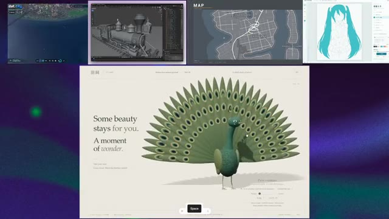
*Interface de présentation affichant un paon 3D interactif au centre entouré de plusieurs fenêtres de logiciels de création, de modélisation 3D et de cartographie.*

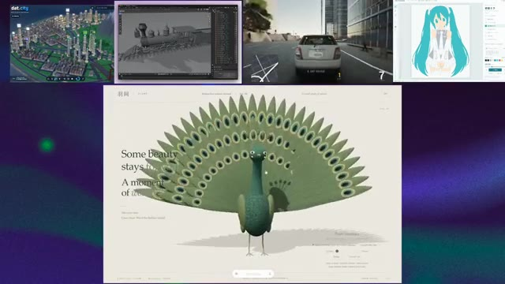
*Interface similaire avec le paon 3D au centre, montrant l'évolution des fenêtres en haut, notamment une vue de simulation de conduite automobile urbaine.*

---

### ⏱️ `[00:08:17 - 00:08:30]` | Segment #19

**🔊 Audio (Transcription Intégrale Mot pour Mot en Français) :**
> Donc, si vous avez apprécié la vidéo, assurez-vous de l'aimer, de vous abonner à Pursuing AI, et de me dire ce que vous pensez d'Astra. Et je vous vois dans la prochaine. C'est Pursuing AI, et vous regardez le Research Report.

**👁️ Analyse Visuelle d'Écran (gemini-3.5-flash-lite) :**
**Interface & Outils** : Écrans de démonstration multi-fenêtres intégrant divers outils de création 3D, des sites web de design et des animations de fin de chaîne YouTube (boutons Like/Subscribe/Notification).

**Contenu textuel & Code** : Éléments visuels variés : modèle 3D de ville sur dat.city, interface Blender, animation de personnage, dessin de Hatsune Miku, site web avec le texte "Some beauty stays for your... A moment of wonder", logo central "PAI" avec un cerveau.

**Action / Démonstration** : Présentation d'un montage vidéo récapitulatif montrant plusieurs projets et outils créatifs simultanément à l'écran, avec incrustation des boutons d'appel à l'action pour s'abonner.

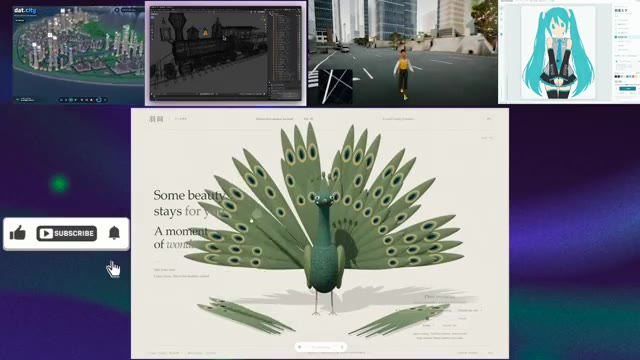
*Interface multi-fenêtres affichant des visualisations 3D, une maquette de ville, un modèle Blender de train, un personnage 3D dans une rue et une illustration de Hatsune Miku, ainsi qu'un site web au premier plan montrant un paon stylisé.*

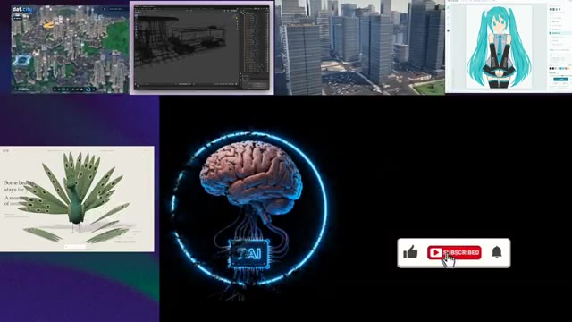
*Interface multi-fenêtres similaire avec des projets 3D et des rendus, montrant au centre le logo animé de Pursuing AI (un cerveau relié à un circuit électronique entouré d'un cercle néon bleu).*

---
