# 🎬 GPT Astra est en réalité PIRE que ce qu'on pensait 👀

> **Chaîne** : [Pursuing AI](https://www.youtube.com/@PursuingAi)  
> **Titre original** : `GPT Astra Is Actually WORSE Than We Thought 👀`  
> **Lien YouTube** : [https://www.youtube.com/watch?v=MgCr9prca9s](https://www.youtube.com/watch?v=MgCr9prca9s)  
> **Date de publication** : 2026-09-11  
> **Durée** : 07m 48s (`468s`)  
> **Identifiant vidéo** : `MgCr9prca9s`  
> **Fiche Web Interactive** : [2026-09-11_YT-MgCr9prca9s_GPT Astra est en réalité PIRE que ce qu'on pensait 👀_by-whisper-v3-large-turbo+gemini-3.5-flash-lite.html](2026-09-11_YT-MgCr9prca9s_GPT Astra est en réalité PIRE que ce qu'on pensait 👀_by-whisper-v3-large-turbo+gemini-3.5-flash-lite.html)  
> **Captures de démonstration clés** : `47 captures réelles (anti-talking-head)`  
> **Modèles utilisés** : Audio: `large-v3-turbo` (Faster-Whisper int8 VPS) | Vision: `gemini-3.5-flash-lite` (Google AI Studio API)  

---

## 📌 Synthèse Exécutive & Outils

### 📌 Résumé
La vidéo de *Pursuing AI* met en lumière un phénomène intrigant et controversé autour de **GPT-6 Astra**, le modèle phare d'intelligence artificielle d'OpenAI. Peu de temps après son lancement tonitruant marqué par des résultats d'une qualité et d'un niveau de détail époustouflants, de nombreux utilisateurs ont constaté une baisse flagrante de performance et de complexité sur des tests similaires, voire identiques. Ce constat soulève une question brûlante au sein de la communauté technologique : OpenAI a-t-il subrepticement « bridé » (nerfed) son modèle pour des raisons de coût ou de performance serveur ? 

Pour en avoir le cœur net, le créateur analyse rigoureusement plusieurs cas d'usage comparatifs « avant/après » partagés par la communauté (notamment par les utilisateurs Chet Aslua, Sui et Bhavy). À travers des tests variés allant de la génération d'images fixes (le pélican sur un vélo) à la modélisation 3D et aux séquences vidéo dynamiques (le lancement d'une fusée), les preuves s'accumulent : les nouveaux rendus affichent systématiquement moins de détails structurels, une géométrie simplifiée et une perte notable de photoréalisme. De plus, les temps de génération et d'inférence (le « budget de réflexion ») ont parfois été divisés par deux, suggérant une allocation de ressources en baisse drastique par les serveurs d'OpenAI.

Face à ces accusations, la situation reste paradoxale et polarisée : d'un côté, les observations empiriques et reproductibles des utilisateurs pointent vers une dégradation qualitative ; de l'autre, un employé d'OpenAI (Thibault) affirme de manière catégorique qu'aucun changement n'a été opéré depuis le lancement. Pour les créateurs de contenu vidéo et les professionnels de l'IA générative, cette polémique rappelle la volatilité inhérente aux modèles hébergés dans le cloud. Elle souligne l'importance vitale de mener des tests A/B rigoureux, de documenter ses prompts et ses paramètres, et de ne jamais tenir pour acquis les performances d'un outil propriétaire dont l'infrastructure technique échappe totalement au contrôle de l'utilisateur final.

### 🛠️ Outils, Modèles & Logiciels Présentés
* **GPT-6 Astra** : Modèle d'intelligence artificielle multimodal d'OpenAI au cœur de la polémique, capable de générer des images détaillées, des structures 3D et des séquences vidéo complexes à partir de prompts textuels.

### 🔑 Points Clés & Enseignements Stratégiques
* **Le syndrome du « Shadow Nerfing »** : Phénomène où un fournisseur d'IA réduit discrètement les capacités ou les temps de calcul alloués à un modèle (souvent pour économiser de la bande passante ou des coûts d'inférence) sans communication officielle.
* **Diminution du budget d'inférence** : Observation concrète que les temps de génération ont chuté (passant par exemple de plus de 9 minutes à moins de 5 minutes), corrélée directement à une baisse visible de la complexité du résultat.
* **Perte de complexité structurelle en 3D** : Les comparaisons montrent que les générations récentes peinent à comprendre les objets comme de véritables structures 3D interconnectées, se contentant d'assembler des formes basiques.
* **Disparition du photoréalisme** : Sur les séquences dynamiques (comme le lancement d'une fusée), les détails atmosphériques complexes (fumée, interactions lumineuses, profondeur de champ) sont gommés au profit d'illustrations épurées.
* **Le piège de l'évaluation isolée** : Une nouvelle image générée peut paraître satisfaisante en soi, mais la perte de qualité ne saute aux yeux que lors d'une comparaison directe côte à côte (« side-by-side ») avec les versions du jour du lancement.
* **Contradiction utilisateur vs développeur** : Illustration d'un décalage classique dans l'écosystème de l'IA entre l'expérience empirique de la communauté et les dénégations officielles des équipes de développement.
* **Importance des tests A/B contrôlés** : Pour valider une baisse de performance, il est indispensable de reproduire strictement les mêmes conditions : prompt identique, paramètres de raisonnement inchangés et même interface.
* **La variabilité inhérente aux LLM et modèles multimodaux** : Le mystère demeure quant à savoir si ces changements proviennent d'un bridage volontaire, d'une modification des comportements côté serveur ou d'une simple variance naturelle du modèle.
* **Impact pour les créateurs de contenu** : La dépendance aux outils basés sur le cloud expose les créateurs à des modifications unilatérales de qualité, rendant difficile la standardisation à long terme de workflows de production vidéo automatisés.
* **Nécessité d'une veille active** : Le rapport de recherche démontre l'intérêt de surveiller les retours de la communauté en temps réel pour détecter rapidement les altérations de comportement des outils d'IA générative.

---

## ⏱️ Chronologie & Transcription Complète Audio & Visuelle (Mot pour Mot)

### ⏱️ `[00:00:00 - 00:00:35]` | Segment #01

**🔊 Audio (Transcription Intégrale Mot pour Mot en Français) :**
> Quelque chose d'bizarre se passe avec Astra. Quand OpenAI a introduit pour la première fois GPT-6 Astra, les gens obtenaient des résultats absolument fous. Mais maintenant, juste quelques jours plus tard, les gens relancent les mêmes tests ou de très similaires et les résultats sont visiblement différents. La question est donc : est-ce qu'OpenAI a vraiment bridé Astra ? J'ai trouvé plusieurs tests comparant les résultats originaux avec ce qu'Astra fait aujourd'hui, et la différence est plutôt intéressante. Voyons donc ce qui a réellement changé. Ici Pursuing AI et vous regardez le rapport de recherche. Et c'est

**👁️ Analyse Visuelle d'Écran (gemini-3.5-flash-lite) :**
**Interface & Outils** : Interface de comparaison vidéo comparative (split-screen) illustrant les performances de GPT-6 Astra.

**Contenu textuel & Code** : Texte à l'écran : "GPT-6 Astra (Launch)" au-dessus de la vidéo de gauche et "GPT-6 Astra (Today)" au-dessus de la vidéo de droite. Affichage de données textuelles et de télémétrie de conduite en haut à gauche de la vidéo de droite.

**Action / Démonstration** : Comparaison visuelle côte à côte de deux simulations de conduite de véhicules générées par IA pour illustrer une baisse de qualité (nerf) entre la version initiale et la version actuelle.

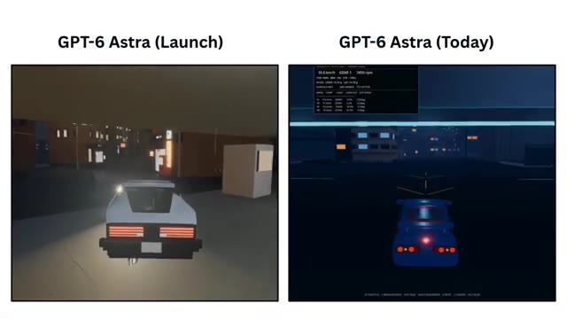
*Comparaison vidéo côte à côte entre GPT-6 Astra au lancement (à gauche) et aujourd'hui (à droite) montrant une simulation de conduite urbaine de nuit.*

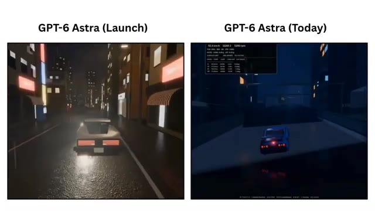
*Comparaison vidéo côte à côte montrant l'évolution du rendu des graphismes et de l'éclairage de la simulation de conduite entre le lancement et aujourd'hui.*

---

### ⏱️ `[00:00:35 - 00:01:08]` | Segment #02

**🔊 Audio (Transcription Intégrale Mot pour Mot en Français) :**
> là où la comparaison devient vraiment intéressante. Parce que Chet Aslua n'a pas seulement dit qu'Astra a l'air différente, il nous a réellement montré les résultats avant et après. Prenons ce test du pélican sur un vélo. Dans le résultat précédent, Astra a généré cette illustration très détaillée. Vous pouvez voir le pélican, le vélo, l'écharpe, l'arrière-plan, l'eau, le soleil. Il se passe beaucoup de choses dans cette image, et toute la composition semble étonnamment complète. Maintenant, comparez cela avec le résultat plus récent. L'idée de base est toujours là. Vous avez toujours le pélican, vous avez toujours le

**👁️ Analyse Visuelle d'Écran (gemini-3.5-flash-lite) :**
**Interface & Outils** : Présentation vidéo comparative avec des captures d'écran et des illustrations générées par intelligence artificielle (GPT-6 Astra).

**Contenu textuel & Code** : Textes visibles : "GPT-6 Astra (Launch)", "GPT-6 Astra (Today)", "Astra Launch", "Astra Today". Illustrations d'un pélican sur un vélo et séquences de conduite automobile.

**Action / Démonstration** : Le présentateur compare visuellement les résultats d'anciennes et de nouvelles générations d'IA pour illustrer l'évolution des performances.

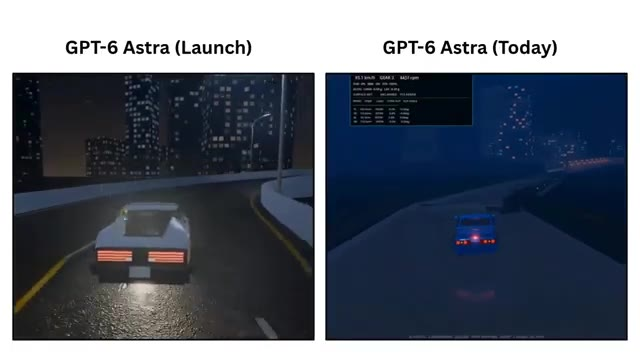
*Comparaison vidéo avant/après de GPT-6 Astra montrant une voiture sur une route de nuit au lancement et aujourd'hui.*

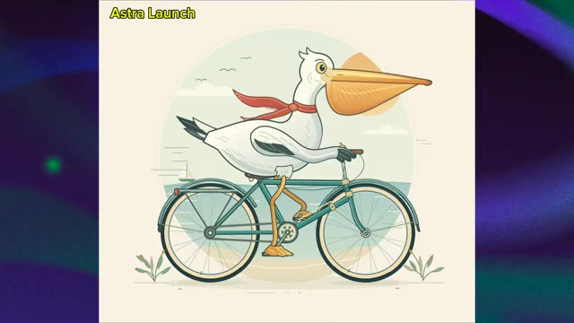
*Illustration générée par Astra Launch montrant un pélican sur un vélo avec de nombreux détails d'arrière-plan.*

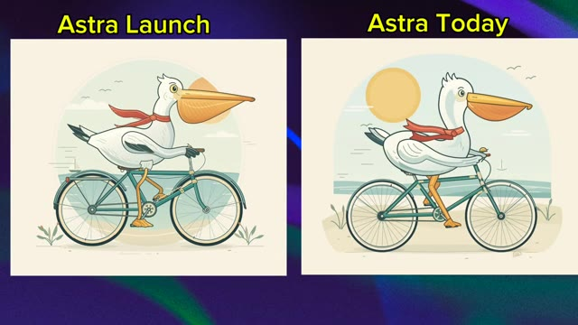
*Comparaison côte à côte entre Astra Launch et Astra Today d'une illustration de pélican sur un vélo.*

---

### ⏱️ `[00:01:08 - 00:01:40]` | Segment #03

**🔊 Audio (Transcription Intégrale Mot pour Mot en Français) :**
> bicyclette, et vous avez toujours le même concept visuel général. Ce n'est donc pas comme si Astra avait soudainement oublié comment suivre le prompt. Mais lorsque vous placez les deux résultats côte à côte, la différence devient beaucoup plus facile à remarquer. La nouvelle image semble plus simple. Il y a moins de petits détails, la composition semble moins élaborée, et certains des éléments visuels qui donnaient au résultat original un aspect plus soigné n'y sont tout simplement pas de la même manière. Et c'est important, car si vous me montriez seulement la nouvelle image sans me dire qu'il existe une version plus ancienne, je pourrais facilement la regarder et

**👁️ Analyse Visuelle d'Écran (gemini-3.5-flash-lite) :**
**Interface & Outils** : Écran de comparaison d'images avec des étiquettes textuelles "Astra Launch" et "Astra Today".

**Contenu textuel & Code** : Texte "Astra Launch" au-dessus de l'image de gauche et "Astra Today" au-dessus de l'image de droite, représentant des illustrations de pélicans à bicyclette.

**Action / Démonstration** : Présentation comparative de deux versions d'une image générée par intelligence artificielle pour analyser l'évolution de la qualité visuelle.

*Comparaison côte à côte de deux images générées par IA : "Astra Launch" (version originale) et "Astra Today" (version récente), montrant un pélican sur un vélo.*

*Comparaison côte à côte avec l'image de gauche assombrie pour mettre en valeur l'image de droite "Astra Today".*

---

### ⏱️ `[00:01:40 - 00:02:14]` | Segment #04

**🔊 Audio (Transcription Intégrale Mot pour Mot en Français) :**
> disons, ouais, ça a l'air plutôt bien. Et honnêtement, c'est le cas. Le problème ne devient vraiment évident que lorsque vous le comparez directement avec ce qu'Astra produisait avant. Parce que la question n'est pas : est-ce que le nouveau résultat est bon ? La vraie question est : est-ce qu'il fait la même quantité de travail que l'ancien résultat ? Et c'est là que les choses deviennent intéressantes. Sheta Slua a souligné que la première exécution a pris environ 9 minutes et 8 secondes, mais que la nouvelle exécution n'a pris que 4 minutes et 48 secondes. C'est presque la moitié du temps. Et selon son observation, l'effort de réflexion semblait également être significativement

**👁️ Analyse Visuelle d'Écran (gemini-3.5-flash-lite) :**
**Interface & Outils** : Capture d'écran d'un navigateur affichant une publication sur le réseau social X (Twitter) et des visuels comparatifs.

**Contenu textuel & Code** : Textes visibles : "Astra Launch", "Astra Today", le tweet de @chetaslua avec le texte "astra is nerfed maybe they have fucked up the juice / effort value before vs after in max < it took 9m 08s before and now 4m 48s > basically half the time and thinking effort".

**Action / Démonstration** : Le présentateur affiche des captures d'écran comparatives et un tweet pour illustrer la diminution du temps de calcul et des performances d'Astra.

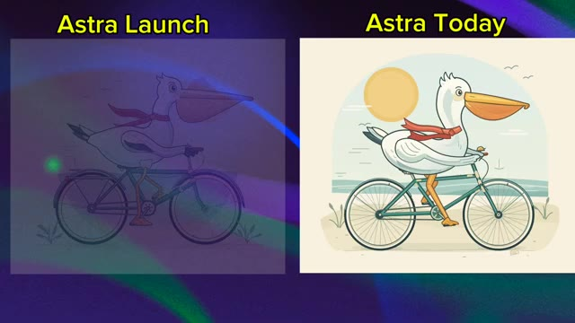
*Comparaison côte à côte entre "Astra Launch" et "Astra Today" montrant des illustrations de pélican sur un vélo.*

*Affichage complet et clair des deux images comparatives "Astra Launch" et "Astra Today".*

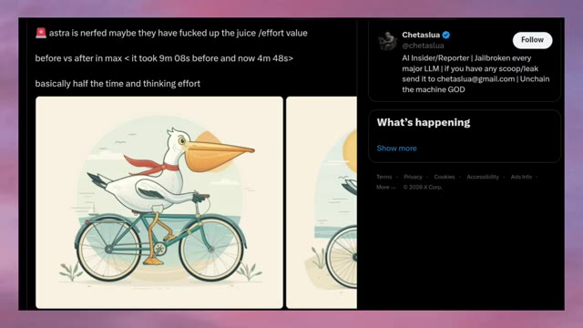
*Capture d'écran d'un tweet de Chetaslua sur X (Twitter) discutant des performances d'Astra et du temps d'exécution.*

---

### ⏱️ `[00:02:14 - 00:02:38]` | Segment #05

**🔊 Audio (Transcription Intégrale Mot pour Mot en Français) :**
> inférieur. Donc vous avez cette combinaison intéressante, moins de temps passé à raisonner, et un résultat potentiellement moins détaillé. Et puis les choses deviennent encore plus confuses. Parce qu'après que Chetislua a posté cette comparaison, Thibault, un employé d'OpenAI, a répondu directement. Et sa réponse a été plutôt directe. Nous n'avons apporté aucun changement depuis le lancement d'Astra. Maintenant, nous avons deux choses qui ne semblent pas correspondre.

**👁️ Analyse Visuelle d'Écran (gemini-3.5-flash-lite) :**
**Interface & Outils** : Interface du réseau social X (anciennement Twitter).

**Contenu textuel & Code** : Publication de @chetaslua ("astra is nerfed maybe they have fucked up the juice /effort value, before vs after in max < it took 9m 08s before and now 4m 48s>, basically half the time and thinking effort") avec une image de pélican à vélo. Sur l'image 2, la réponse de Tibo (@thsottiaux, Codex & ChatGPT @OpenAI) apparaît en bas : "We have made no changes since the launch of Astra."

**Action / Démonstration** : Affichage à l'écran de tweets et de captures de comparaisons de performances d'IA sur le réseau social X, puis apparition de la réponse officielle d'un employé d'OpenAI.

*Capture d'écran du réseau social X (Twitter) montrant la publication de Chetislua comparant les performances d'Astra avant et après, avec une illustration de pélican à vélo.*

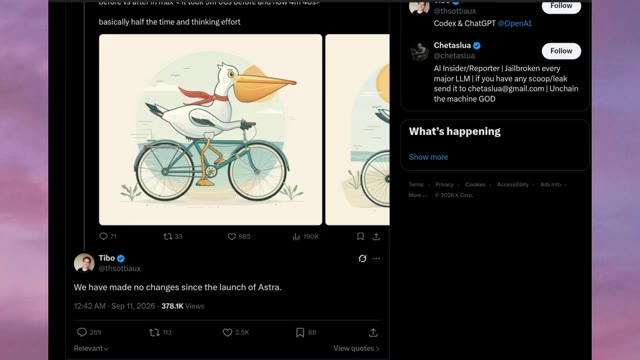
*Capture d'écran du réseau social X (Twitter) montrant la publication de Chetislua ainsi que la réponse de l'employé d'OpenAI (Tibo) affirmant qu'aucun changement n'a été fait depuis le lancement d'Astra.*

---

### ⏱️ `[00:02:38 - 00:03:01]` | Segment #06

**🔊 Audio (Transcription Intégrale Mot pour Mot en Français) :**
> D'un côté, les utilisateurs disent que quelque chose semble différent. Nous voyons des exemples où le résultat apparaît moins détaillé, et dans ce test particulier, le temps de génération est tombé de plus de neuf minutes à moins de 5. Mais d'un autre côté, OpenAI affirme que rien n'a changé depuis le lancement. Alors que se passe-t-il exactement ? Et c'est là qu'une autre comparaison a attiré mon attention.

**👁️ Analyse Visuelle d'Écran (gemini-3.5-flash-lite) :**
**Interface & Outils** : Navigateur web affichant des publications sur le réseau social X (anciennement Twitter).

**Contenu textuel & Code** : Texte du tweet de gauche : "astra is nerfed maybe they have fucked up the juice /effort value before vs infer in max < it took 9m 08s before and now 4m 48s > basically half the time and thinking effort". Image d'un pélican sur un vélo. Tweet de droite sur l'image #2 : "We have made no changes since the launch of Astra." posté par Tibo le 11 sept. 2026.

**Action / Démonstration** : Affichage à l'écran de captures d'écran de tweets pour illustrer le débat sur la baisse des performances ou du temps de calcul d'Astra et la réponse officielle d'OpenAI.

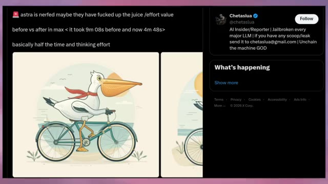
*Capture d'écran d'un tweet montrant une comparaison de génération (avant/après) et le profil Twitter de Chetaslua.*

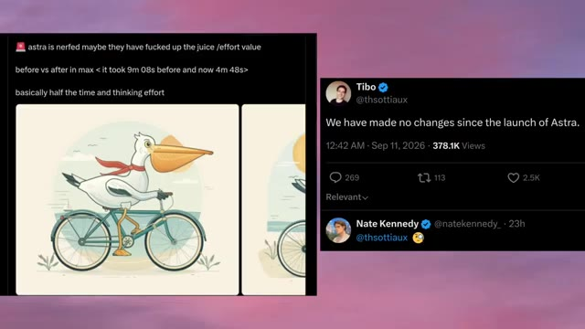
*Capture d'écran d'un tweet de Tibo affirmant qu'aucun changement n'a été fait depuis le lancement d'Astra, aux côtés du message initial avec l'image du pélican sur un vélo.*

---

### ⏱️ `[00:03:01 - 00:03:36]` | Segment #07

**🔊 Audio (Transcription Intégrale Mot pour Mot en Français) :**
> Un autre utilisateur, Sui, a publié une comparaison côte à côte montrant spécifiquement GPT-6 Astra au lancement par rapport à Astra Now. Et selon la publication, ils ont utilisé le même prompt et le même paramètre de raisonnement. Cette fois, la tâche était complètement différente. Ils ont demandé à Astra de générer un modèle 3D. Et honnêtement, cet exemple est plutôt intéressant. Regardez le résultat du lancement sur la gauche. Astra a produit un objet 3D beaucoup plus détaillé. Il y a de multiples composants, différents éléments mécaniques et beaucoup plus de structure dans la conception globale. On dirait que le modèle est

**👁️ Analyse Visuelle d'Écran (gemini-3.5-flash-lite) :**
**Interface & Outils** : Interface du réseau social X (Twitter) affichant un tweet de l'utilisateur @birdabo (Sui) avec des visuels de comparaison 3D.

**Contenu textuel & Code** : Texte du tweet : "GPT-6 Astra on launch vs Astra now. same prompt, same reasoning. it seems we only get the unquantized models for a week then all 3d capabilities and knowledge goes out the window 😅 meanwhile Grok gets nerfed from being TOO fun and edgy lmao." et étiquettes vidéo "GPT ASTRA (AT LAUNCH)" et "GPT ASTRA (now)".

**Action / Démonstration** : Présentation comparative côte à côte de deux objets 3D générés par IA avec le même prompt pour illustrer la dégradation des performances du modèle au fil du temps.

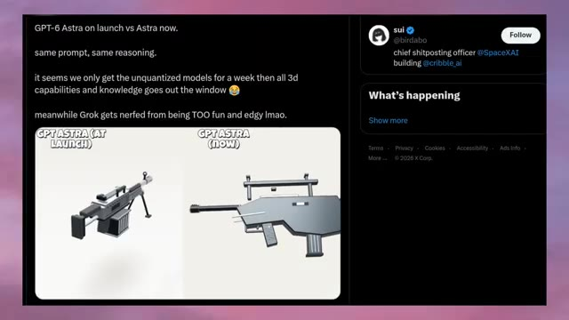
*Publication sur les réseaux sociaux montrant une capture d'écran de Twitter/X avec une comparaison comparative de modèles 3D générés par GPT-6 Astra au lancement versus maintenant.*

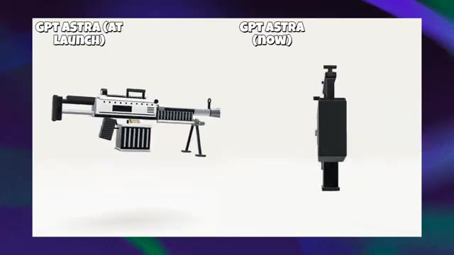
*Gros plan sur la comparaison vidéo des deux modèles 3D de fusils générés, mettant en évidence le contraste de niveau de détail entre "GPT ASTRA (AT LAUNCH)" et "GPT ASTRA (now)".*

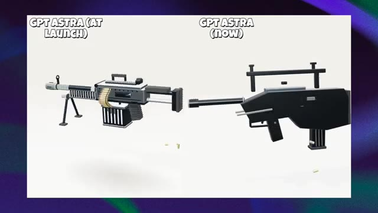
*Vue rapprochée des deux modèles 3D en rotation, montrant clairement les composants mécaniques détaillés de l'objet de gauche face au design simplifié de l'objet de droite.*

---

### ⏱️ `[00:03:36 - 00:04:08]` | Segment #08

**🔊 Audio (Transcription Intégrale Mot pour Mot en Français) :**
> en essayant de comprendre l'objet comme une structure 3D plutôt que de simplement générer quelque chose qui lui ressemble visuellement. Regardez maintenant le nouveau résultat sur la droite. Le modèle comprend toujours le concept général. On devine clairement ce qu'il est censé représenter, mais la géométrie est beaucoup plus simple. Le corps principal est plus basique, plusieurs composants ont l'air moins cohérents, et une grande partie des petits détails structurels du résultat d'origine manque. Et c'est une différence importante, car il ne s'agit pas simplement d'une image plus jolie qu'une autre. Il s'agit de savoir à quel point

**👁️ Analyse Visuelle d'Écran (gemini-3.5-flash-lite) :**
**Interface & Outils** : Comparaison comparative de modèles 3D avec étiquettes textuelles

**Contenu textuel & Code** : Textes affichés : "GPT ASTRA (AT LAUNCH)" à gauche et "GPT ASTRA (NOW)" à droite. À gauche, un modèle 3D détaillé d'une mitrailleuse avec des douilles de munitions et un bipied. À droite, un modèle 3D noir au design beaucoup plus géométrique et simplifié.

**Action / Démonstration** : Comparaison visuelle de deux rendus 3D pour illustrer la perte de détails et de complexité géométrique d'un modèle d'IA au fil du temps.

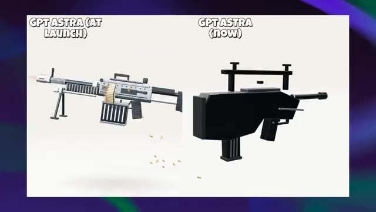
*Comparaison côte à côte entre GPT Astra au lancement montrant une mitrailleuse détaillée et GPT Astra actuel montrant un modèle 3D géométrique simplifié.*

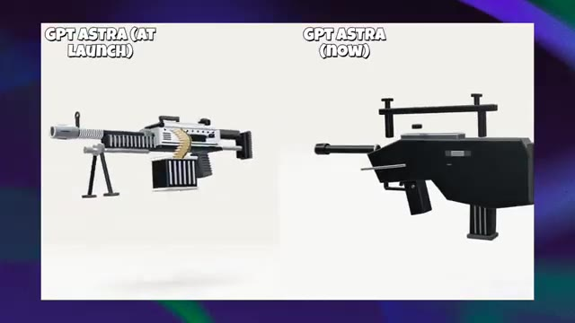
*Vue légèrement modifiée de la même comparaison de modèles 3D*

---

### ⏱️ `[00:04:08 - 00:04:42]` | Segment #09

**🔊 Audio (Transcription Intégrale Mot pour Mot en Français) :**
> des informations structurelles que le modèle semble préserver. Le résultat du lancement donne l'impression d'avoir davantage de relations entre ses différentes parties. Le résultat plus récent ressemble plutôt à une collection de formes simples assemblées pour représenter la même idée. Et ensuite, nous avons un autre exemple. Cette fois, la différence est encore plus facile à voir. Bervia a publié une comparaison d'Astra au jour du lancement par rapport à Astra aujourd'hui, en affirmant à nouveau utiliser le même prompt. Et cette fois, la tâche consistait à générer une séquence de lancement de fusée. Regardez maintenant la comparaison attentivement. Du côté du jour du lancement, la fusée et le

**👁️ Analyse Visuelle d'Écran (gemini-3.5-flash-lite) :**
**Interface & Outils** : Interface de la plateforme X (Twitter) intégrée dans la vidéo de démonstration.

**Contenu textuel & Code** : Texte du tweet : "Astra (launch day) vs Astra (Today). Same prompt. Today's result looks off. The photo realism is gone. It clearly looks nerfed. GPT-5.6 Sol is unusable for me right now too." Labels sur les images : "GPT-6 Astra (Launch)" et "GPT-6 Astra (Today)".

**Action / Démonstration** : Le créateur présente des comparaisons côte à côte de modèles générés par IA pour illustrer la dégradation de la qualité entre le jour du lancement et aujourd'hui.

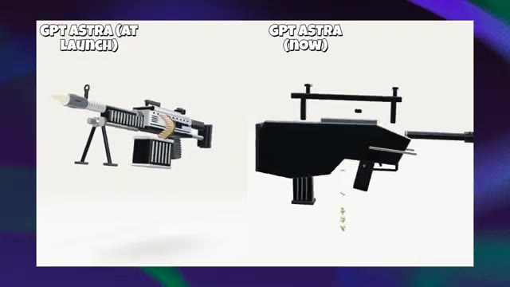
*Comparaison visuelle entre "GPT Astra (at launch)" et "GPT Astra (now)" montrant deux conceptions de mitrailleuses en 3D.*

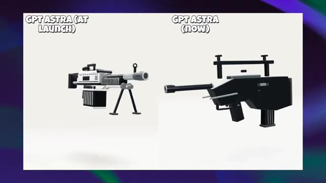
*Vue rapprochée de la comparaison des deux modèles de mitrailleuses générées par IA.*

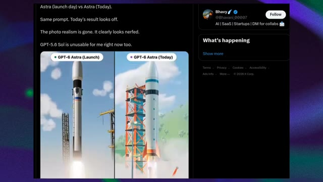
*Capture d'écran d'un tweet de @Bhavani_00007 montrant une comparaison vidéo de lancement de fusée.*

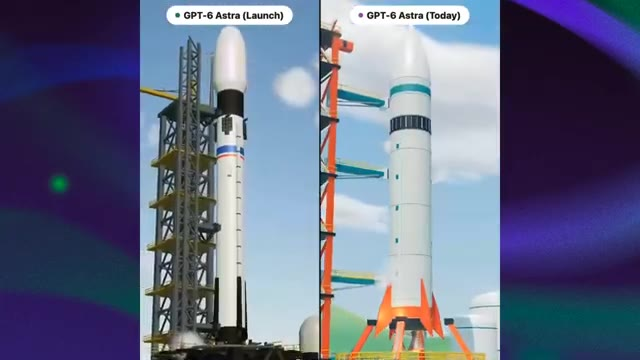
*Gros plan sur la comparaison vidéo des lancements de fusées "GPT-6 Astra (Launch)" et "GPT-6 Astra (Today)".*

---

### ⏱️ `[00:04:42 - 00:05:03]` | Segment #10

**🔊 Audio (Transcription Intégrale Mot pour Mot en Français) :**
> L'environnement environnant paraît beaucoup plus détaillé. La tour de lancement possède des éléments structurels plus visibles, la fusée elle-même a plus de détails, et toute la scène a un aspect rendu 3D plus réaliste. Même l'environnement semble plus développé. Vous avez le pas de tir, les structures environnantes, la fumée, l'éclairage et les gaz d'échappement qui fonctionnent tous ensemble.

**👁️ Analyse Visuelle d'Écran (gemini-3.5-flash-lite) :**
**Interface & Outils** : Écran de comparaison vidéo montrant un test visuel côte à côte étiqueté "GPT-6 Astra (Launch)" à gauche et "GPT-6 Astra (Today)" à droite.

**Contenu textuel & Code** : Textes visibles : "GPT-6 Astra (Launch)" et "GPT-6 Astra (Today)" au sommet des deux fenêtres de comparaison.

**Action / Démonstration** : Comparaison visuelle de deux rendus 3D de fusées spatiales au décollage, mettant en évidence les améliorations de détails graphiques, d'éclairage et de structures.

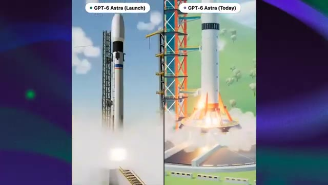
*Comparaison côte à côte de deux versions d'une fusée au décollage, montrant les détails améliorés du pas de tir et de la tour de lancement.*

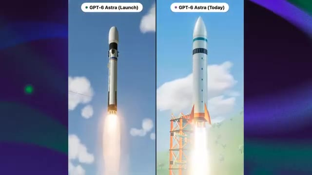
*Comparaison côte à côte des fusées en vol avec des panaches de fumée et des structures modernisées.*

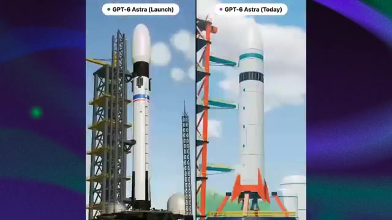
*Comparaison détaillée des tours de lancement et de la texture des fusées entre la version de lancement et la version actuelle.*

---

### ⏱️ `[00:05:03 - 00:05:31]` | Segment #11

**🔊 Audio (Transcription Intégrale Mot pour Mot en Français) :**
> Maintenant, regardez la version plus récente. La scène de base est toujours correcte, il y a toujours une fusée, il y a toujours un pas de tir, il y a toujours de la fumée et des gaz d'échappement, donc là encore, le modèle n'a pas complètement échoué à la tâche, mais l'exécution visuelle semble différente. Le résultat le plus récent ressemble beaucoup plus à une illustration 3D épurée, tandis que le résultat du lancement a un aspect plus détaillé et presque photoréaliste. Et la différence devient encore plus évidente lorsque la fusée décolle réellement.

**👁️ Analyse Visuelle d'Écran (gemini-3.5-flash-lite) :**
**Interface & Outils** : Navigateur web affichant un tweet sur la plateforme X (anciennement Twitter) et comparatif vidéo côte à côte.

**Contenu textuel & Code** : Texte du tweet : "Astra (launch day) vs Astra (Today). Same prompt. Today's result looks off. The photo realism is gone. It clearly looks nerfed. GPT-5.6 Sol is unusable for me right now too." Labels vidéo : "GPT-6 Astra (Launch)" et "GPT-6 Astra (Today)".

**Action / Démonstration** : Le comparatif vidéo montre le décollage de deux fusées générées par IA pour illustrer l'évolution et la perte perçue de réalisme dans le rendu visuel.

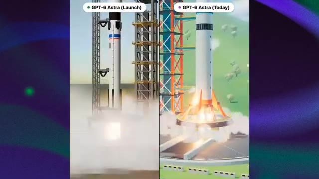
*Comparaison côte à côte de deux versions de génération de fusée, montrant GPT-6 Astra (Launch) à gauche et GPT-6 Astra (Today) à droite.*

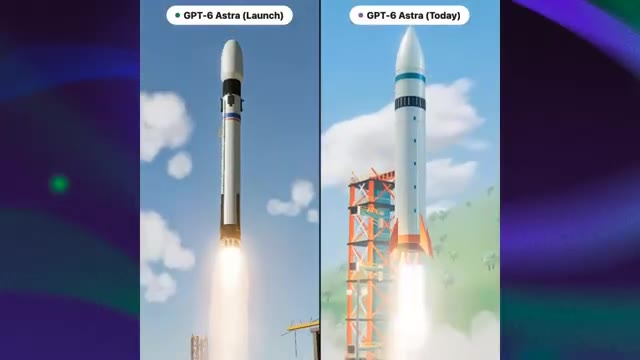
*Visualisation de la fusée en plein vol avec panache de fumée, illustrant la différence d'aspect visuel entre la version de lancement et la version actuelle.*

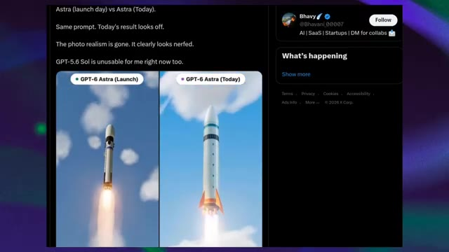
*Capture d'écran d'un tweet de Bhavy sur X (Twitter) commentant la baisse de photoréalisme entre Astra (launch day) et Astra (Today).*

---

### ⏱️ `[00:05:31 - 00:06:03]` | Segment #12

**🔊 Audio (Transcription Intégrale Mot pour Mot en Français) :**
> La version plus ancienne a un sentiment de profondeur et d'atmosphère plus prononcé, la fumée interagit avec l'environnement, l'éclairage semble plus complexe, et la fusée conserve plus de détails visuels tout au long de la séquence. La version plus récente, en revanche, semble beaucoup plus simplifiée. Bhavy a même décrit la différence en disant que le photoréalisme a disparu et que cela a clairement l'air d'avoir été bridé (nerfed). Jusqu'à ce que nous ayons cela, qualifier cela de bridage confirmé serait aller plus vite que les faits, mais en même temps, je ne pense pas qu'il soit juste de simplement rejeter ce que les utilisateurs constatent, car nous examinons maintenant plusieurs exemples qui pointent dans une

**👁️ Analyse Visuelle d'Écran (gemini-3.5-flash-lite) :**
**Interface & Outils** : Capture d'écran d'une plateforme de réseau social (X/Twitter) affichant des comparaisons vidéo côte à côte.

**Contenu textuel & Code** : Texte à l'écran : "GPT-6 Astra (Launch)", "GPT-6 Astra (Today)", tweet de Bhavy (@Bhavani_00007) avec le texte "Astra (launch day) vs Astra (Today). Same prompt. Today's result looks off. The photo realism is gone. It clearly looks nerfed. GPT-5.6 Sol is unusable for me right now too."

**Action / Démonstration** : Affichage comparatif de vidéos générées par IA pour illustrer la perte de qualité et le "nerf" perçu entre le lancement et l'état actuel.

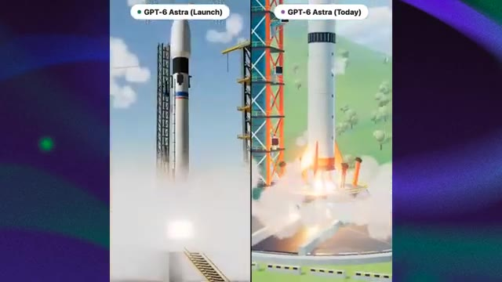
*Comparaison côte à côte de la version de lancement de GPT-6 Astra et de la version actuelle montrant le décollage d'une fusée.*

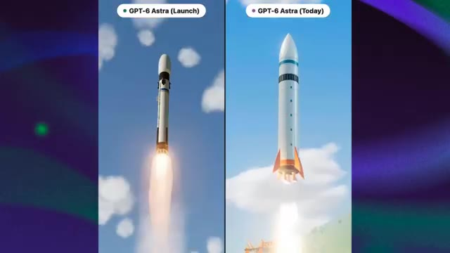
*Suite de la comparaison vidéo montrant la fusée en vol dans les deux versions (lancement vs aujourd'hui).*

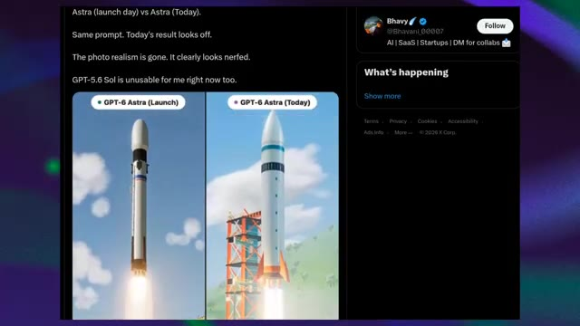
*Capture d'écran d'un tweet de Bhavy commentant la différence entre la version de lancement et la version actuelle.*

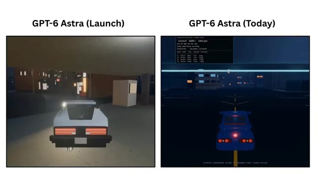
*Comparaison d'un autre exemple montrant une voiture en mouvement (GPT-6 Astra Launch vs Today).*

---

### ⏱️ `[00:06:03 - 00:06:27]` | Segment #13

**🔊 Audio (Transcription Intégrale Mot pour Mot en Français) :**
> direction similaire. La comparaison du Pélican montre une différence majeure dans le temps de raisonnement rapporté, la comparaison de génération 3D montre une différence notable dans la complexité structurelle, et la comparaison de la Fusée montre une différence visible dans le réalisme et le détail visuel. Et tout cela se produit alors qu'un employé d'OpenAI dit, nous n'avons apporté aucun changement depuis le lancement d'Astra. Il nous reste donc un mystère plutôt intéressant.

**👁️ Analyse Visuelle d'Écran (gemini-3.5-flash-lite) :**
**Interface & Outils** : Interface du réseau social X (Twitter) et captures d'écran comparatives de générations d'IA.

**Contenu textuel & Code** : Tweets et comparaisons visuelles étiquetées "GPT ASTRA (AT LAUNCH)", "GPT ASTRA (now)", "GPT-6 Astra (Launch)" et "GPT-6 Astra (Today)".

**Action / Démonstration** : Affichage successif des exemples de comparaisons de performances et de complexité visuelle pour illustrer le mystère des changements non officialisés d'OpenAI.

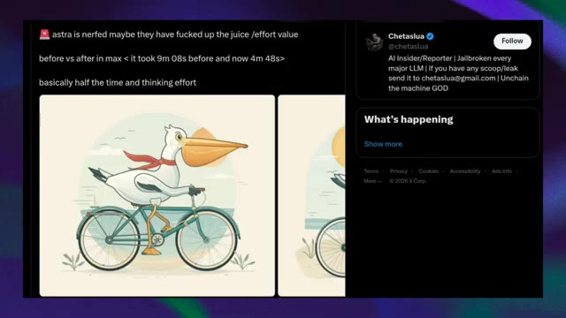
*Capture d'écran d'un tweet montrant un test de performance du modèle Astra avec une image de pélican à vélo.*

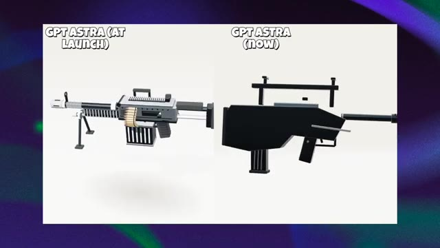
*Comparaison côte à côte de la génération 3D d'une arme par GPT Astra au lancement et maintenant.*

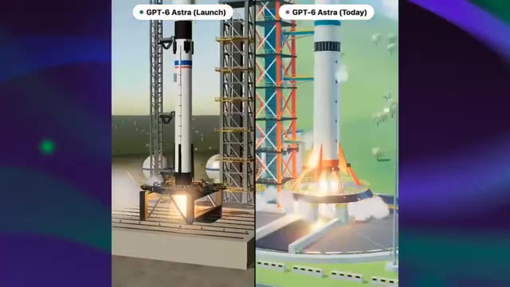
*Comparaison côte à côte de la génération d'une fusée par GPT-6 Astra au lancement et aujourd'hui.*

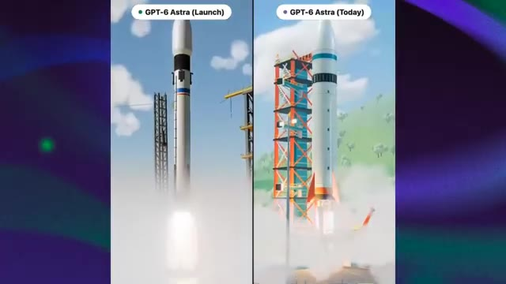
*Deuxième angle de comparaison côte à côte d'une fusée par GPT-6 Astra au lancement et aujourd'hui.*

---

### ⏱️ `[00:06:27 - 00:06:46]` | Segment #14

**🔊 Audio (Transcription Intégrale Mot pour Mot en Français) :**
> Si le modèle sous-jacent n'a vraiment pas changé, pourquoi ces résultats changent-ils ? Astra est-elle réellement servie différemment ? Le budget d'inférence est-il en train de changer ? Y a-t-il un comportement côté serveur que les utilisateurs ne voient pas ? Ou voyons-nous simplement la variation naturelle d'un modèle capable de produire des résultats très différents à partir de prompts identiques ou similaires ? Pour l'instant, nous ne savons pas.

**👁️ Analyse Visuelle d'Écran (gemini-3.5-flash-lite) :**
**Interface & Outils** : Navigateur web affichant des images comparatives, un tweet sur les réseaux sociaux (X), et une interface de visualisation de données 3D de ville (dat.city).

**Contenu textuel & Code** : Texte à l'écran : "GPT-6 Astra (Launch)" et "GPT-6 Astra (Today)", tweet de @chetaslua mentionnant "astra is nerfed... before vs after in max < it took 9m 08s before and now 4m 48s>", et l'interface de dat.city avec une barre de recherche "Search the data...".

**Action / Démonstration** : Affichage successif de visuels comparatifs illustrant les variations de performance et de rendu des modèles d'IA.

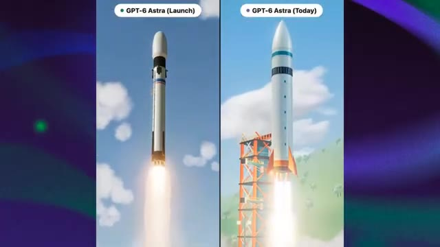
*Comparaison visuelle côte à côte de deux lancements de fusée intitulée 'GPT-6 Astra (Launch)' et 'GPT-6 Astra (Today)'.*

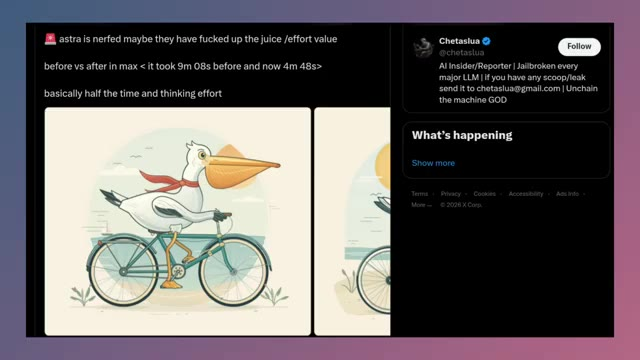
*Capture d'écran d'un tweet sur X (anciennement Twitter) de l'utilisateur @chetaslua discutant d'un modèle Astra affichant un pélican sur un vélo.*

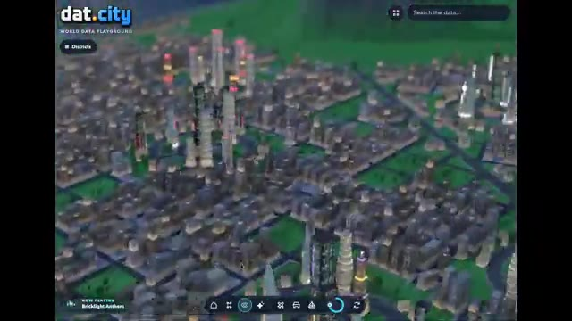
*Capture d'écran de l'interface du site web 'dat.city' montrant une vue aérienne interactive d'une ville générée en 3D.*

---

### ⏱️ `[00:06:46 - 00:07:22]` | Segment #15

**🔊 Audio (Transcription Intégrale Mot pour Mot en Français) :**
> Mais c'est exactement pour cela que je vais garder un œil là-dessus. Parce que si davantage de personnes commencent à mener des tests comparatifs avant/après contrôlés, et que le même schéma continue d'apparaître, alors cela passe de quelques captures d'écran intéressantes à quelque chose de beaucoup plus significatif. Alors, est-ce qu'OpenAI a réellement bridé Astra ? Pour l'instant, nous n'avons tout simplement pas assez de preuves pour l'affirmer avec certitude. Nous avons plusieurs utilisateurs qui montrent des résultats du jour du lancement qui semblent plus détaillés, plus performants ou plus gourmands en ressources que ce qu'ils obtiennent aujourd'hui. Mais nous avons aussi un employé d'OpenAI qui affirme qu'aucun changement n'a été apporté depuis le lancement. Donc pour l'instant, cela reste un mystère. Peut-être que quelque chose a réellement changé.

**👁️ Analyse Visuelle d'Écran (gemini-3.5-flash-lite) :**
**Interface & Outils** : Plateforme de visualisation de données 3D "dat.city" et interface de comparaison de gameplay "GPT-6 PRO" (Mario-Style World / Arena Boss Fight).

**Contenu textuel & Code** : Texte "dat.city WORLD DATA PLAYGROUND", "Search the data", "NOW PLAYING: Bricklight Anthem", "GPT-6 PRO", "TODAY", "2 DAYS AGO", "MARIO-STYLE WORLD", "ARENA BOSS FIGHT", "GAMEPLAY COMPARISON".
[DESC_IMAGE_1] Navigation et exploration d'une simulation de ville interactive en 3D.
[DESC_IMAGE_2] Affichage de données et de métriques en surimpression sur la carte 3D de la ville.
[DESC_IMAGE_3] Démonstration du gameplay actuel dans un monde virtuel aux couleurs vives.
[DESC_IMAGE_4] Démonstration du gameplay d'il y a deux jours montrant une scène de combat (Arena Boss Fight).

**Action / Démonstration** : Démonstration pédagogique et présentation du workflow.

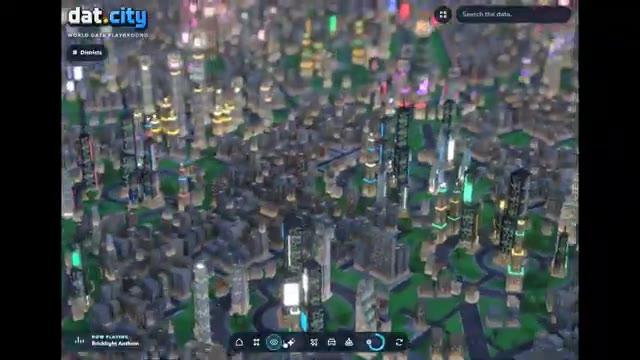
*Vue aérienne nocturne d'une maquette de ville interactive avec des graphismes 3D stylisés sur la plateforme dat.city.*

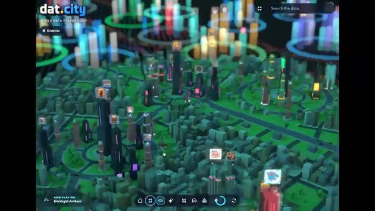
*Vue rapprochée de la ville 3D sur dat.city avec des indicateurs et graphiques lumineux colorés superposés.*

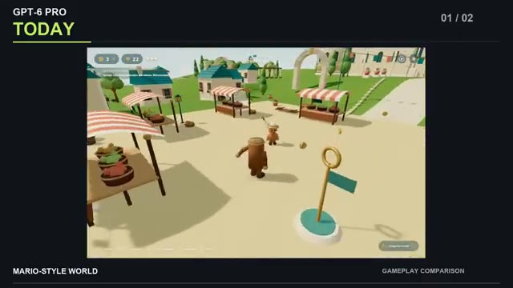
*Comparaison 'Today' montrant un monde 3D de style Mario avec un personnage cylindrique et des étals de marché.*

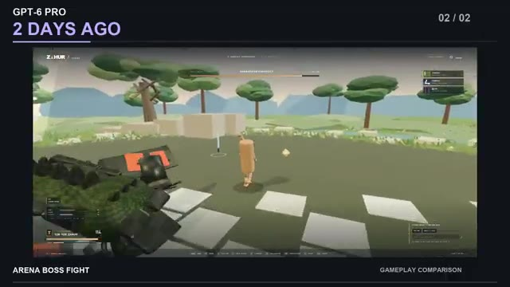
*Comparaison '2 Days Ago' montrant un combat de boss en arène 3D avec un personnage et un ennemi imposant.*

---

### ⏱️ `[00:07:22 - 00:07:48]` | Segment #16

**🔊 Audio (Transcription Intégrale Mot pour Mot en Français) :**
> quelque part dans le système. Peut-être que c'est l'inférence ou le comportement côté serveur, ou peut-être que ces comparaisons capturent simplement la variation naturelle entre les générations. Mais une chose est claire, les gens ont remarqué une différence, et maintenant les gens surveillent Astra de beaucoup plus près. Si des tests plus contrôlés commencent à montrer le même schéma, cette histoire pourrait devenir beaucoup plus intéressante. C'est tout pour cette fois. C'est Pursuing AI, et je vous retrouve dans la prochaine.

**👁️ Analyse Visuelle d'Écran (gemini-3.5-flash-lite) :**
**Interface & Outils** : Interface de présentation vidéo avec écrans partagés comparant des rendus d'IA générés.

**Contenu textuel & Code** : Texte à l'écran : "GPT-6 PRO", "TWO DAYS APART.", "TODAY", "2 DAYS AGO", "MARIO-STYLE WORLD", "ARENA BOSS FIGHT", "YOUR VERDICT?", "GPT-6 Astra (Launch)", "GPT-6 Astra (Today)".

**Action / Démonstration** : Affichage comparatif visuel de deux versions de rendus 3D générés par IA pour illustrer l'évolution des performances ou des différences de comportement.

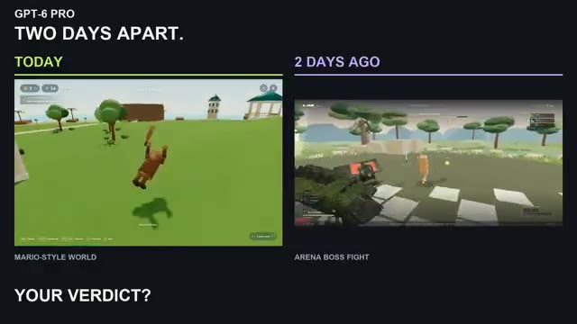
*Comparaison côte à côte de GPT-6 Pro entre 'Today' et '2 Days Ago' montrant un monde de style Mario et un combat de boss en arène.*

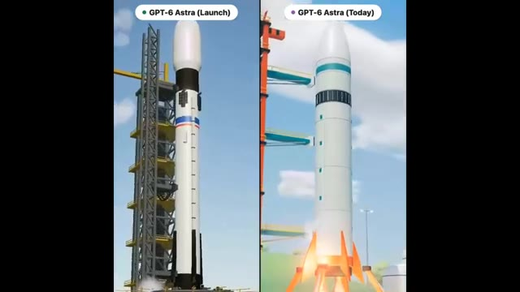
*Comparaison côte à côte de GPT-6 Astra entre le lancement et aujourd'hui montrant un décollage de fusée.*

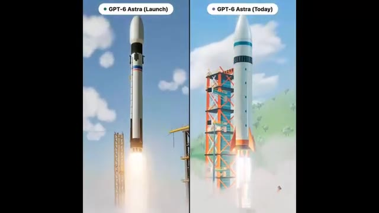
*Comparaison côte à côte de GPT-6 Astra entre le lancement et aujourd'hui montrant le décollage d'une fusée avec une tour de lancement orange.*

---
