# 🎬 Opus 5.2 est bien plus puissant qu'on ne le pensait 🤔

> **Chaîne** : [Pursuing AI](https://www.youtube.com/@PursuingAi)  
> **Titre original** : `Opus 5.2 Is Way More Powerful Than We Thought 🤔`  
> **Lien YouTube** : [https://www.youtube.com/watch?v=vE1OOz4XAyA](https://www.youtube.com/watch?v=vE1OOz4XAyA)  
> **Date de publication** : 2026-09-17  
> **Durée** : 07m 15s (`435s`)  
> **Identifiant vidéo** : `vE1OOz4XAyA`  
> **Fiche Web Interactive** : [2026-09-17_YT-vE1OOz4XAyA_Opus 5.2 est bien plus puissant qu'on ne le pensait 🤔_by-whisper-v3-large-turbo+gemini-3.5-flash-lite.html](2026-09-17_YT-vE1OOz4XAyA_Opus 5.2 est bien plus puissant qu'on ne le pensait 🤔_by-whisper-v3-large-turbo+gemini-3.5-flash-lite.html)  
> **Captures de démonstration clés** : `37 captures réelles (anti-talking-head)`  
> **Modèles utilisés** : Audio: `large-v3-turbo` (Faster-Whisper int8 VPS) | Vision: `gemini-3.5-flash-lite` (Google AI Studio API)  

---

## 📌 Synthèse Exécutive & Outils

### 📌 Résumé

Cette vidéo d'analyse prospective de *Pursuing AI* explore la contradiction saisissante entre les appels publics à la modération — initiés notamment par Dario Amodei — et l'accélération frénétique du secteur, marquée par des fuites massives concernant la prochaine génération de modèles de pointe (Claude Opus 5.2, Gemini 4, GPT-6 Soul et Grok 4.7). Le créateur décortique une série de benchmarks officieux et de "leaks" audacieux partagés sur les réseaux sociaux, illustrant un basculement technologique majeur : les intelligences artificielles quittent le terrain exclusif du texte et de l'image plane pour investir massivement le code d'interface complexe (SVG), la génération d'environnements 3D explorables et l'intégration logicielle profonde en milieu professionnel.

Sur le plan méthodologique, la vidéo adopte une approche comparative rigoureuse, confrontant les capacités émergentes des laboratoires rivaux à travers des tests pratiques similaires. Le créateur analyse étape par étape la génération d'interfaces graphiques interactives en code SVG, la création de mondes 3D stylisés à partir de prompts textuels avec un effort de réflexion élevé, ainsi que le déploiement d'agents autonomes pré-intégrés à des environnements CRM comme Salesforce. Chaque fuite est disséquée avec esprit critique, séparant le battage médiatique (*hype*) des ruptures techniques réelles, tout en contextualisant l'impact de ces innovations sur l'écosystème logiciel global.

Pour les créateurs de contenu, les réalisateurs et les professionnels de la vidéo par IA, ces avancées annoncent des perspectives révolutionnaires. La transition vers des modèles capables de produire des environnements 3D interactifs (comme l'île japonaise générée par Gemini 4 Pro) et des interfaces fonctionnelles en quelques minutes redéfinit les workflows de production virtuelle, de prototypage rapide et de design d'assets. En comprenant comment ces modèles s'interतयाent désormais directement aux outils de productivité et repoussent les limites des fenêtres contextuelles (jusqu'à 2 millions de tokens), les créateurs disposent d'une vision claire des outils de demain pour automatiser et enrichir leurs pipelines de création.

### 🛠️ Outils, Modèles & Logiciels Présentés

* **Claude Opus 5.2** : Modèle de pointe non officiellement publié d'Anthropic, testé sur la génération de code SVG complexe et la création de scènes 3D stylisées.
* **GPT-6 Astra / GPT-6 Soul** : Itérations avancées de la famille de modèles d'OpenAI, illustrées par des capacités de recréation d'interface interactive en SVG et des perspectives de performances économiques.
* **Gemini 4 Pro (Nom de code : Argon)** : Prochain modèle phare de Google, capable de générer des environnements 3D entièrement explorables de type Minecraft avec une limite de sortie accrue et une grande profondeur de raisonnement.
* **Salesforce** : Plateforme CRM désormais intégrée nativement à Claude via 37 compétences de vente pré-intégrées pour automatiser la gestion des pipelines et des comptes.
* **Grok 4.7** : Modèle de xAI mentionné parmi la nouvelle vague de solutions de pointe attendues sur le marché.

### 🔑 Points Clés & Enseignements Stratégiques

* **Le paradoxe du ralentissement** : Malgré les appels publics d'acteurs majeurs comme Dario Amodei à freiner le développement de l'IA, l'industrie connaît une accélération sans précédent nourrie par des fuites massives et des lancements imminents.
* **Benchmark de génération d'interface SVG** : La confrontation directe entre Claude Opus 5.2 et GPT-6 Astra sur la recréation d'une interface X démontre la capacité des modèles à traduire une image en code structuré (mise en page, typographie, espacement).
* **Supériorité des compositions interactives** : Sur le test SVG, Astra s'est distingué par une composition plus solide et un rendu proche d'un produit fini interactif plutôt que d'une simple animation graphique.
* **Émergence de la génération 3D contextuelle** : Les fuites attribuées à Opus 5.2 révèlent une transition vers la création d'environnements 3D complets (maisons, paysages) plutôt que de simples images plates.
* **Agents IA intégrés aux environnements professionnels** : L'intégration de Claude à Salesforce avec 37 compétences de vente illustre le passage d'une IA conversationnelle à une surcouche logicielle opérationnelle capable d'agir directement dans les outils métiers.
* **Explosion des capacités environnementales de Gemini 4 Pro** : Le modèle de Google (nom de code Argon) aurait généré un environnement 3D explorable (style île japonaise) en 2,4 minutes grâce à un effort de réflexion élevé.
* **Augmentation radicale des limites de tokens** : Gemini 4 Pro introduit des spécifications techniques impressionnantes avec une limite de sortie de 256k tokens et des perspectives d'une fenêtre contextuelle atteignant 2 millions de tokens.
* **Convergence d'une "super-semaine" de lancements** : La concomitance des fuites concernant Gemini 4, Grok 4.7, Opus 5.2 et la famille GPT-6 signale un basculement imminent vers une offre multi-modèle de pointe extrêmement concurrentielle.
* **Démocratisation potentielle des performances** : Des fuites suggèrent que des variantes comme GPT-6 Soul pourraient offrir des performances supérieures à bas coût, rendant l'IA de pointe accessible à un public beaucoup plus large.
* **Filtrage rigoureux du battage médiatique (*hype*)** : Face à la prolifération de rumeurs et de captures d'écran non vérifiées, le rôle de l'analyste est de séparer les promesses marketing des capacités techniques réellement démontrées.

---

## ⏱️ Chronologie & Transcription Complète Audio & Visuelle (Mot pour Mot)

### ⏱️ `[00:00:00 - 00:00:20]` | Segment #01

**🔊 Audio (Transcription Intégrale Mot pour Mot en Français) :**
> Après que Dario Amadei a appelé à ralentir le rythme du développement de l'IA, on pourrait penser que les choses commenceraient à se calmer. Mais d'une manière ou d'une autre, c'est l'inverse qui s'est produit. Nous assistons maintenant à des fuites et à des premiers signes de ce qui pourrait être certains des plus grands modèles à venir, notamment Claude Opus 5.2, Gemini 4, GPT-6 Soul, et bien plus encore.

**👁️ Analyse Visuelle d'Écran (gemini-3.5-flash-lite) :**
**Interface & Outils** : Interface de démonstration interactive et simulation scientifique Isaac Lab / PhysX.

**Contenu textuel & Code** : Sur l'image 2 : "Made by Opus 5.2", "TEMPEST'S HEART", "A storm kept under glass", curseurs de contrôle de tempête et d'éclair. Sur l'image 3 : "SHARPA WAVE | PPO POLICY | t=12.47s", "Isaac Lab / PhysX trajectory | g=9.81 m/s2 | turns=+0.22 | episode=2 | drops=0".

**Action / Démonstration** : Présentation de rendus générés par IA et de simulations physiques de pointe illustrant les performances des nouveaux modèles.

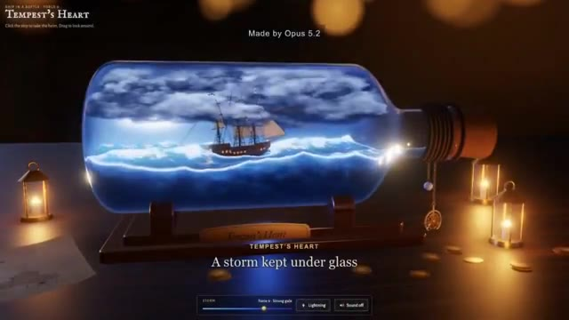
*Démonstration visuelle d'une application interactive "Tempest's Heart" générée par Claude Opus 5.2 montrant un bateau dans une bouteille avec des effets de tempête.*

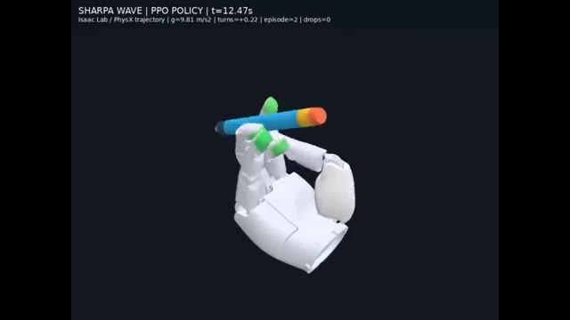
*Simulation physique 3D par IA (Isaac Lab) montrant une main robotique manipulatrice faisant tourner un crayon ("Sharpa Wave").*

---

### ⏱️ `[00:00:20 - 00:00:39]` | Segment #02

**🔊 Audio (Transcription Intégrale Mot pour Mot en Français) :**
> Et certaines des choses qui fuites sont vraiment folles. Alors prenez vos snacks, installez-vous confortablement, et c'est parti. C'est Pursuing AI, et vous regardez The Research Report. Commençons par l'une des fuites les plus intéressantes. Un utilisateur sur X a testé GPT-6 Astra et le prochain Claude Opus 5.2 sur la même tâche.

**👁️ Analyse Visuelle d'Écran (gemini-3.5-flash-lite) :**
**Interface & Outils** : Interface du réseau social X (Twitter) simulée / affichée sous forme de code SVG généré par IA.

**Contenu textuel & Code** : Texte affiché au-dessus : 'An SVG of a screenshot of X by GPT-6 Astra and opus 5.2'. Post de l'utilisateur @Haleeeemahhh avec le texte 'this user is ♀ and loves Ai building REDACTED' et la section 'What's happening'.

**Action / Démonstration** : Affichage à l'écran d'une génération SVG complexe reproduisant une interface de réseau social, illustrant les capacités des modèles d'IA mentionnés.

*Visuel d'illustration montrant un bateau miniature dans une bouteille avec le texte 'Made by Opus 5.2'.*

*Capture d'écran d'un tweet et d'une interface simulant le réseau social X générée en SVG par GPT-6 Astra et Opus 5.2.*

---

### ⏱️ `[00:00:39 - 00:00:58]` | Segment #03

**🔊 Audio (Transcription Intégrale Mot pour Mot en Français) :**
> Recréer une capture d'écran de X en utilisant SVG. Et il ne s'agit pas seulement de générer une image. Les modèles doivent essentiellement recréer l'interface en utilisant du code, en comprenant la mise en page, la typographie, les icônes, l'espacement, les couleurs et tous les minuscules détails qui composent l'interface. Et les deux résultats sont en fait assez impressionnants.

**👁️ Analyse Visuelle d'Écran (gemini-3.5-flash-lite) :**
**Interface & Outils** : Captures d'écran comparatives d'interfaces X (Twitter) recréées en code SVG par des intelligences artificielles.

**Contenu textuel & Code** : Texte en haut à gauche : "An SVG of a screenshot of X by GPT-6 Astra and opus 5.2". Légendes des modèles : "Astra" et "Opus 5.2". Éléments d'interface X complets (barre latérale de navigation, flux de publications avec tweets, images, avatars et boutons, panneau "What's happening" et "Who to follow").

**Action / Démonstration** : Affichage comparatif des interfaces recréées par les deux modèles d'IA, avec un zoom sur les détails de l'interface pour l'image #1.

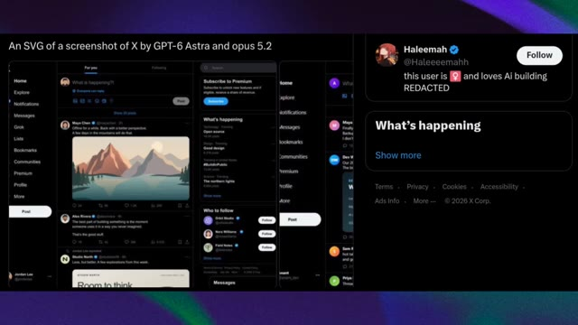
*Comparaison de captures d'écran SVG générées par GPT-6 Astra et opus 5.2 avec zoom sur les détails de l'interface de X.*

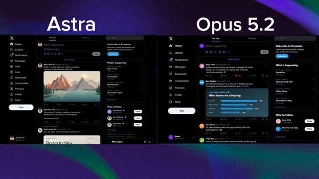
*Comparaison côte à côte des interfaces X recréées en SVG par les modèles "Astra" et "Opus 5.2".*

---

### ⏱️ `[00:00:58 - 00:01:19]` | Segment #04

**🔊 Audio (Transcription Intégrale Mot pour Mot en Français) :**
> Opus 5.2 produit une recréation vraiment soignée avec une mise en page épurée et des éléments visuels détaillés. Mais Astra adopte une approche légèrement différente. Sa sortie ressemble davantage à une expérience interactive complète avec des éléments plus structurés à l'intérieur du SVG généré. Donc, si nous jugeons le résultat visuel global, je donnerais en fait celui-ci à Astra.

**👁️ Analyse Visuelle d'Écran (gemini-3.5-flash-lite) :**
**Interface & Outils** : Interface web simulant le réseau social X (anciennement Twitter) en mode sombre.

**Contenu textuel & Code** : Affichage de fils d'actualité, de barres de navigation latérales avec les menus Home, Explore, Notifications, Messages, et de panneaux de tendances "What's happening".

**Action / Démonstration** : Présentation comparative des interfaces générées par les modèles Opus 5.2 et Astra pour évaluer la qualité visuelle et les éléments structurés des graphiques SVG.

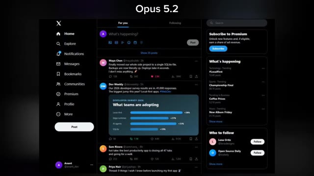
*Interface simulant le réseau social X générée par Opus 5.2 avec une mise en page propre et des graphiques détaillés.*

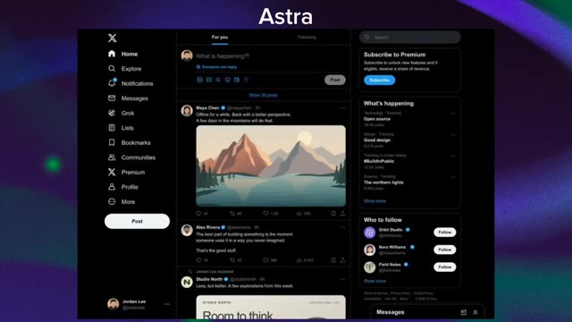
*Interface simulant le réseau social X générée par Astra, présentant une approche interactive avec des éléments SVG plus structurés.*

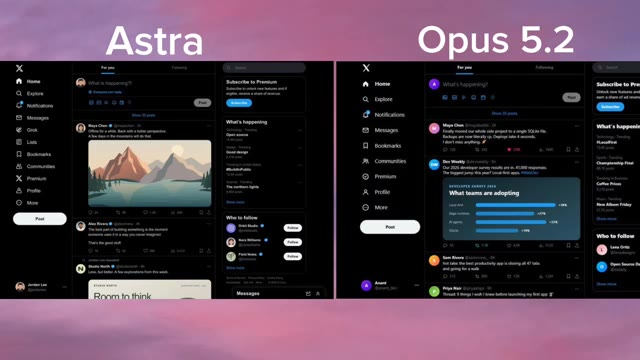
*Comparatif côte à côte des interfaces générées par Astra et Opus 5.2.*

---

### ⏱️ `[00:01:19 - 00:01:42]` | Segment #05

**🔊 Audio (Transcription Intégrale Mot pour Mot en Français) :**
> La composition semble plus solide, les éléments sont mieux organisés, et l'ensemble ressemble davantage à un produit fini plutôt qu'à un simple SVG animé. Donc sur ce test particulier, Astro l'emporte. Mais il y a un détail important ici. Opus 5.2 n'est même pas encore officiellement sorti. Et c'est là que les choses deviennent intéressantes, car les fuites concernant Opus 5.2 ne s'arrêtent pas aux fichiers SVG.

**👁️ Analyse Visuelle d'Écran (gemini-3.5-flash-lite) :**
**Interface & Outils** : Interface utilisateur affichant une comparaison de maquettes ou de codes de l'application X (anciennement Twitter) en mode sombre.

**Contenu textuel & Code** : Texte à l'écran : "Astra" et "Opus 5.2" en titres, ainsi que la mention "An SVG of a screenshot of X by GPT-6 Astra and opus 5.2". Les interfaces affichent des fils d'actualité, des profils (Maya Chen, Dev Weekly, etc.), des graphiques statistiques et des panneaux latéraux.

**Action / Démonstration** : Comparaison visuelle côte à côte de deux rendus SVG différents issus de modèles d'IA pour évaluer la qualité de composition et l'organisation des éléments.

*Comparaison côte à côte de deux interfaces de type X (Twitter) générées en SVG, respectivement étiquetées "Astro" à gauche et "Opus 5.2" à droite.*

*Affichage d'un SVG de capture d'écran de X généré par GPT-6 Astro et Opus 5.2, avec un zoom sur un panneau latéral.*

---

### ⏱️ `[00:01:43 - 00:02:02]` | Segment #06

**🔊 Audio (Transcription Intégrale Mot pour Mot en Français) :**
> Un autre utilisateur, Salio, a partagé ce qu'il prétend être l'une des premières sorties d'Opus 5.2. Et cette fois, nous regardons une scène 3D. Le résultat montre un environnement stylisé avec une petite maison, des arbres, un immense champ et de multiples objets disséminés dans toute la scène. Ce qui a retenu mon attention, c'est la composition globale.

**👁️ Analyse Visuelle d'Écran (gemini-3.5-flash-lite) :**
**Interface & Outils** : Interface de la plateforme X (anciennement Twitter) affichant un tweet et une vidéo intégrée.

**Contenu textuel & Code** : Texte du tweet : "Opus 5.2 First Output Leaked. The jump in visual quality is already noticeable better details, stronger composition. Anthropic is back". Profil de l'utilisateur Salio (@Mr_Salio) avec la mention "I track AI Models • AI News".

**Action / Démonstration** : Affichage d'un tweet sur les réseaux sociaux présentant un exemple de rendu 3D généré par une intelligence artificielle, suivi d'un zoom sur la vidéo.

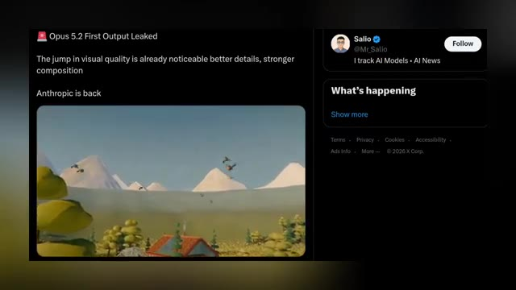
*Capture d'écran d'un tweet de Salio montrant une publication sur Opus 5.2 avec une vidéo intégrée représentant un environnement 3D stylisé.*

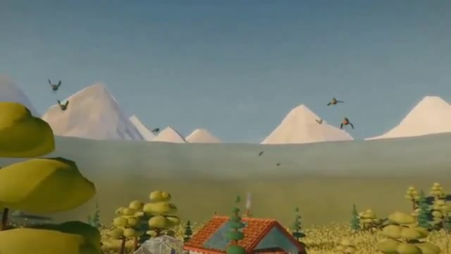
*Gros plan sur la vidéo montrant l'environnement 3D stylisé avec une petite maison, des arbres et des montagnes en arrière-plan.*

---

### ⏱️ `[00:02:02 - 00:02:32]` | Segment #07

**🔊 Audio (Transcription Intégrale Mot pour Mot en Français) :**
> Au lieu de simplement générer une image plate, le modèle semble créer un environnement 3D complet avec différents objets placés dans toute la scène pour construire un monde réel. La publication prétend qu'il y a déjà un saut notable dans la qualité visuelle, les détails et la composition. Maintenant, évidemment, un seul résultat divulgué ne suffit pas à prouver à quel point Opus 5.2 est réellement capable, mais si ce résultat provient véritablement d'Opus 5.2, Anthropic pourrait pousser ses capacités visuelles et 3D beaucoup plus loin que nous ne l'espérions.

**👁️ Analyse Visuelle d'Écran (gemini-3.5-flash-lite) :**
**Interface & Outils** : Capture d'écran d'une publication sur le réseau social X (anciennement Twitter).

**Contenu textuel & Code** : Texte du tweet : "Opus 5.2 First Output Leaked. The jump in visual quality is already noticeable better details, stronger composition. Anthropic is back". Profil de Salio (@Mr_Salio) avec la mention "I track AI Models • AI News".

**Action / Démonstration** : Affichage à l'écran d'un rendu visuel 3D puis d'un tweet commentant ce même visuel de démonstration.

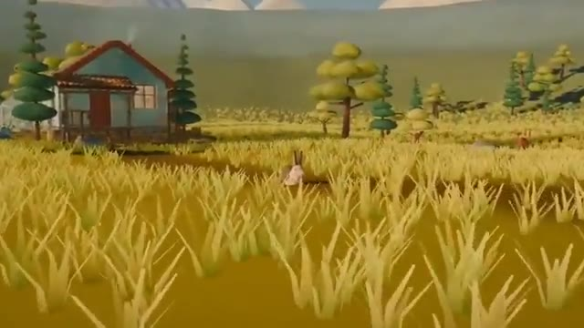
*Rendu visuel 3D montrant un environnement rural avec une maison, des arbres et un champ de hautes herbes.*

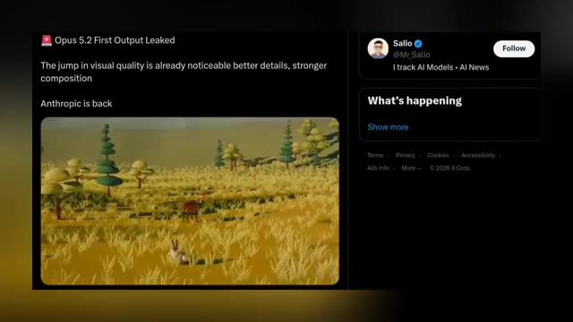
*Capture d'écran d'un tweet du compte de Salio montrant la publication sur une fuite concernant Opus 5.2.*

---

### ⏱️ `[00:02:32 - 00:03:07]` | Segment #08

**🔊 Audio (Transcription Intégrale Mot pour Mot en Français) :**
> Et puis Anthropic a fait un autre mouvement qui n'a rien à voir avec la 3D, mais qui pourrait en fait être beaucoup plus important pour les entreprises. Claude a maintenant ajouté Salesforce et Beta, intégrant les comptes, opportunités et pipelines Salesforce directement dans Claude. Et il ne s'agit pas d'une simple intégration basique. Claude est fourni avec 37 compétences de vente pré-intégrées. Vous pouvez donc préparer un appel commercial, examiner une transaction, créer un tableau de bord de pipeline ou travailler sur vos prévisions sans basculer constamment entre Claude et Salesforce. Et cela représente une tendance beaucoup plus large. L'IA passe de "réponds-moi à une question"

**👁️ Analyse Visuelle d'Écran (gemini-3.5-flash-lite) :**
**Interface & Outils** : Interface de la plateforme X (anciennement Twitter) et interface de l'assistant IA Claude.

**Contenu textuel & Code** : Tweets de Salio (@Mr_Salio) et de Claude (@claudeai), textes sur l'intégration Salesforce ("Salesforce in Claude is now available in beta", "Build account plans from your Salesforce records", "Salesforce is connected", "Account Executive", "Sales Manager").

**Action / Démonstration** : Le créateur montre des publications sur les réseaux sociaux et des captures d'écran illustrant l'intégration de Salesforce dans l'assistant Claude.

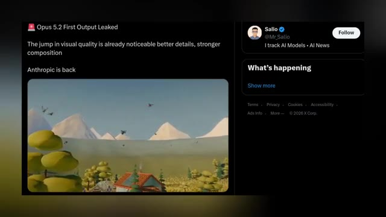
*Capture d'un tweet de Salio sur X montrant une publication concernant la sortie d'Opus 5.2 et la qualité visuelle.*

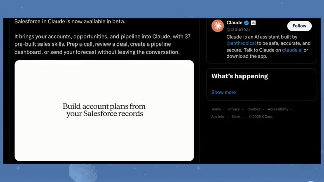
*Publication sur le compte officiel de Claude sur X annonnçant l'intégration de Salesforce en version bêta.*

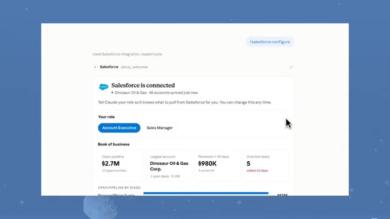
*Interface de configuration de l'intégration Salesforce dans Claude montrant l'état de connexion et le rôle utilisateur.*

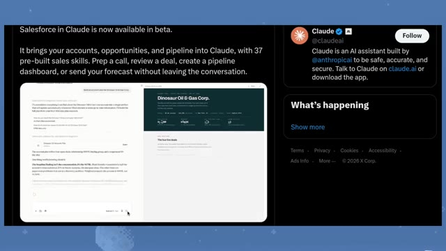
*Capture d'une interface de démonstration montrant un plan de compte généré à partir des données Salesforce.*

---

### ⏱️ `[00:03:07 - 00:03:27]` | Segment #09

**🔊 Audio (Transcription Intégrale Mot pour Mot en Français) :**
> pour me donner accès aux outils que j'utilise et m'aider réellement à faire le travail. C'est la direction que nous observons à travers toute l'industrie en ce moment. Les modèles d'IA deviennent une couche qui se superpose aux logiciels que les gens utilisent déjà. Et si ces modèles peuvent effectuer des actions de manière fiable à l'intérieur de ces outils, c'est là que la course aux agents IA devient vraiment intéressante.

**👁️ Analyse Visuelle d'Écran (gemini-3.5-flash-lite) :**
**Interface & Outils** : Interface du réseau social X (Twitter) affichant un tweet du compte officiel de Claude (@claudeai).

**Contenu textuel & Code** : Texte du tweet de Claude : "Salesforce in Claude is now available in beta. It brings your accounts, opportunities, and pipeline into Claude, with 37 pre-built sales skills. Prep a call, review a deal, create a pipeline dashboard, or send your forecast without leaving the conversation." On y voit également une capture d'écran d'une conversation avec Claude intégrée à Salesforce.

**Action / Démonstration** : Affichage d'un article ou d'un tweet illustrant l'intégration d'un outil externe (Salesforce) directement au sein de l'interface de l'assistant IA Claude.

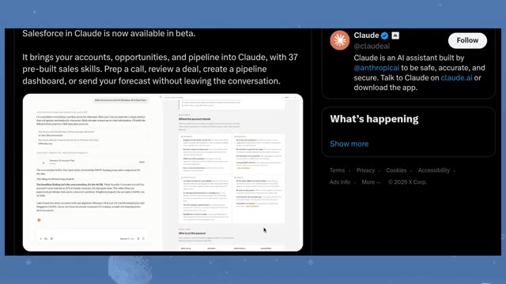
*Capture d'écran montrant une publication sur X (anciennement Twitter) de Claude annonçant l'intégration de Salesforce en version bêta.*

---

### ⏱️ `[00:03:27 - 00:03:52]` | Segment #10

**🔊 Audio (Transcription Intégrale Mot pour Mot en Français) :**
> Mais alors qu'Anthropic étend Claude au lieu de travail, OpenAI pourrait bien préparer quelque chose de beaucoup plus grand. Car Sam Altman lui-même a récemment jeté de l'huile sur le feu. Il a publié que ça allait être énorme cette semaine, et a ajouté, et puis pour le Dev Day. C'était déjà intéressant. Mais ensuite, Tebow d'OpenAI a répondu, en disant que le niveau de lancements attendus cette semaine est quelque chose qu'on aurait pu attendre du Dev Day 2025.

**👁️ Analyse Visuelle d'Écran (gemini-3.5-flash-lite) :**
**Interface & Outils** : Interface du réseau social X (anciennement Twitter).

**Contenu textuel & Code** : Tweets d'Anthropic/Claude et de Sam Altman (@sama) annonçant de nouveautés et des lancements importants ("big this week", "and then for devday").

**Action / Démonstration** : Affichage à l'écran de tweets et de messages textuels pour illustrer les annonces d'Anthropic et de Sam Altman sur les réseaux sociaux.

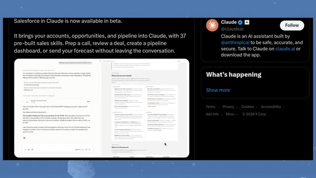
*Capture d'écran montrant une publication sur X (Twitter) concernant l'intégration de Salesforce dans Claude en version bêta.*

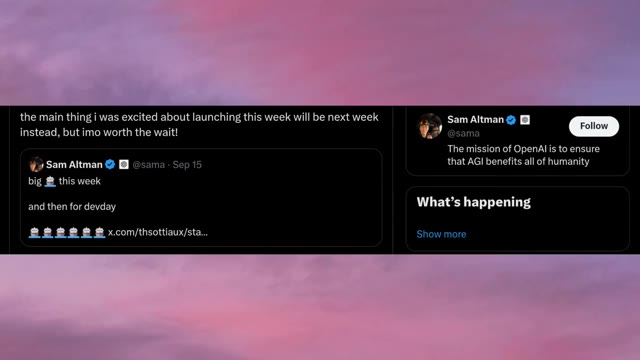
*Capture d'écran montrant des publications sur X (Twitter) de Sam Altman au sujet des lancements prévus pour la semaine et le Dev Day.*

---

### ⏱️ `[00:03:52 - 00:04:15]` | Segment #11

**🔊 Audio (Transcription Intégrale Mot pour Mot en Français) :**
> Aucun d'eux n'a réellement révélé ce qui arrive, mais le message est plutôt clair. OpenAI a quelque chose de gros de prévu, et apparemment cette semaine n'est que le début. Et maintenant, quand on combine cela avec toutes les fuites que nous voyons d'autres laboratoires, les choses commencent à devenir vraiment intéressantes. Parce que nous ne regardons peut-être pas seulement le lancement d'un modèle majeur, nous pourrions assister à l'arrivée de multiples modèles de pointe à peu près en même temps.

**👁️ Analyse Visuelle d'Écran (gemini-3.5-flash-lite) :**
**Interface & Outils** : Interface de génération 3D et vidéo divisée en deux fenêtres (probablement des outils comme Claude/ChatGPT à gauche et une interface vidéo à droite).

**Contenu textuel & Code** : Texte du prompt à gauche concernant la création d'un modèle 3D de voiture de course de Formule 1. À droite, mention 'Made by Opus 5.2' et 'Tempest's Heart: A storm kept under glass'.

**Action / Démonstration** : Présentation visuelle de démonstrations technologiques de modèles d'IA générative (3D et vidéo).

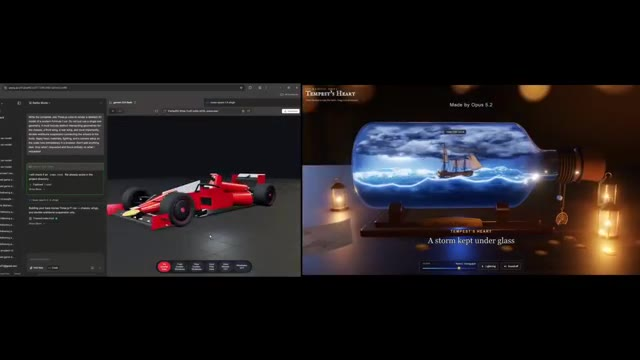
*Écran divisé montrant à gauche une interface de modélisation 3D avec un modèle de voiture de course rouge, et à droite une vidéo générée par IA intitulée 'Tempest's Heart' représentant un bateau dans une bouteille.*

---

### ⏱️ `[00:04:16 - 00:04:36]` | Segment #12

**🔊 Audio (Transcription Intégrale Mot pour Mot en Français) :**
> Et c'est là qu'intervient la plus grande fuite. Car alors que tout le monde parle d'Opus 5.2 et de GPT-6, Google est peut-être déjà en train de tester Gemini 4 en interne. Une nouvelle fuite affirme que des points de contrôle (checkpoints) de Gemini 4 Pro ont commencé à apparaître en interne, le modèle portant apparemment le nom de code Argon. Et le premier résultat affirmé est absolument fou.

**👁️ Analyse Visuelle d'Écran (gemini-3.5-flash-lite) :**
**Interface & Outils** : Navigateur web affichant une interface de développement à double volet (éditeur de code/modélisation 3D) et un réseau social (X/Twitter).

**Contenu textuel & Code** : Texte du tweet : « Gemini 4 Pro checkpoints have finally started appearing internally a few days ago. This is the first ever output from the model, internally codenamed "argon". It took 2.4 minutes on High thinking effort. It has a 256k token "output limit"... » et image d'un décor de pagode et de cerisiers en fleurs.

**Action / Démonstration** : Présentation visuelle de fuites d'informations et de comparaisons entre modèles d'IA (Opus 5.2 et Gemini 4 Pro).

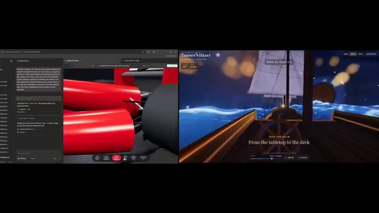
*Capture d'écran divisée en deux montrant un éditeur de code et une interface de prévisualisation 3D d'une Formule 1 à gauche, et une scène maritime interactive à droite portant la mention « Made by Opus 5.2 ».*

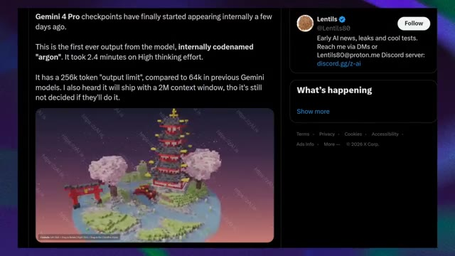
*Capture d'un tweet du compte X @Lentils80 détaillant la fuite concernant Gemini 4 Pro et son nom de code « Argon », avec une image générée d'une pagode asiatique sur une île flottante.*

---

### ⏱️ `[00:04:36 - 00:04:56]` | Segment #13

**🔊 Audio (Transcription Intégrale Mot pour Mot en Français) :**
> Au lieu de générer une image normale, Gemini 4 Pro aurait créé un environnement 3D entièrement explorable. On parle d'une île japonaise de style Minecraft avec une immense pagode à plusieurs niveaux, des cerisiers en fleurs, des portails torii, de l'eau, du terrain et toutes sortes de petits détails environnementaux.

**👁️ Analyse Visuelle d'Écran (gemini-3.5-flash-lite) :**
**Interface & Outils** : Visualiseur d'environnement 3D interactif avec des instructions de contrôle en bas à gauche ("Controls: Left Click + Drag to Rotate...").

**Contenu textuel & Code** : Affichage d'une île voxelisée/style Minecraft comprenant une pagode rouge et grise à plusieurs niveaux, deux cerisiers en fleurs roses, un portail torii rouge, un plan d'eau et un terrain vallonné. Des filigranes "https://zAI.is" sont visibles en diagonale.

**Action / Démonstration** : Présentation visuelle de l'environnement 3D explorable généré par l'IA.

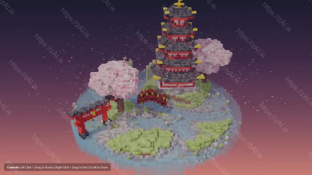
*Capture d'écran montrant un environnement 3D style Minecraft généré, représentant une île japonaise avec une pagode, des cerisiers et un portail torii.*

---

### ⏱️ `[00:04:56 - 00:05:33]` | Segment #14

**🔊 Audio (Transcription Intégrale Mot pour Mot en Français) :**
> Selon la fuite, le modèle a pris environ 2,4 minutes en utilisant un effort de réflexion élevé. Et il y a aussi des affirmations techniques assez folles associées à cette fuite. La publication affirme que Gemini 4 Pro a une limite de sortie de 256k tokens par rapport à 64k sur les modèles Gemini précédents. Et il y a aussi une affirmation selon laquelle Google envisage une fenêtre contextuelle de 2 millions de tokens, bien que la publication elle-même dise que ce n'est pas finalisé. Nous devons évidemment être prudents ici, ce sont des affirmations de fuite et non des spécifications confirmées de Gemini 4. Mais s'il s'agit vraiment d'un premier point de contrôle de Gemini 4 Pro, Google pourrait

**👁️ Analyse Visuelle d'Écran (gemini-3.5-flash-lite) :**
**Interface & Outils** : Navigateur web affichant une publication sur les réseaux sociaux (X / Twitter) sur l'image 1, puis une application web de visualisation et d'édition de code SVG interactif sur l'image 2.

**Contenu textuel & Code** : Sur l'image 1 : Texte parlant de Gemini 4 Pro, du nom de code 'argon', du temps de 2,4 minutes avec 'High thinking effort', et d'une limite de sortie de 256k tokens. Sur l'image 2 : Titre 'Le Pélican Cycliste', boutons 'Inspect SVG Code', 'Copy SVG Code', 'Download .SVG' et lignes de code SVG en bas de l'écran.

**Action / Démonstration** : Le présentateur illustre ses propos sur la fuite de Gemini 4 Pro avec la publication X à l'écran, puis montre un exemple de réalisation ou d'interface technique connexe.

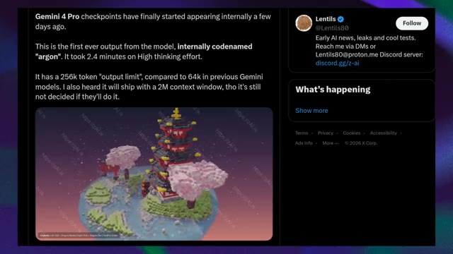
*Capture d'écran d'une publication sur X (Twitter) du compte @Lentils80 concernant des fuites sur les points de contrôle de Gemini 4 Pro et le modèle nommé 'argon', incluant une image générée d'une pagode japonaise en blocs.*

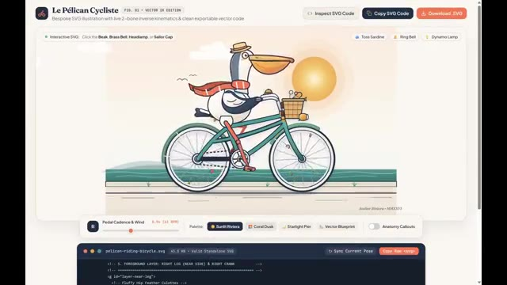
*Interface web montrant une illustration vectorielle interactive d'un pélican sur un vélo intitulée 'Le Pélican Cycliste', avec des options de code SVG et des commandes de lecture.*

---

### ⏱️ `[00:05:33 - 00:06:05]` | Segment #15

**🔊 Audio (Transcription Intégrale Mot pour Mot en Français) :**
> pousser Gemini au-delà de la simple génération de contenu. Il pourrait évoluer vers la génération d'environnements interactifs complets. Et honnêtement, c'est beaucoup plus intéressant que de simplement faire de plus jolies images. Et maintenant, regardez la vue d'ensemble. Un utilisateur de 1x appelle déjà cela une semaine de lancement, Gemini 4, Grok 4.7, Opus 5.2, la famille GPT-6, et plusieurs modèles chinois. Et puis il y a GPT-6 Sol. Le post affirme que Sol pourrait être bien meilleur que tout le reste tout en étant moins cher,

**👁️ Analyse Visuelle d'Écran (gemini-3.5-flash-lite) :**
**Interface & Outils** : Navigateur web affichant une application interactive vectorielle SVG (« Le Pélican Cycliste ») et une interface de réseau social (X / Twitter).

**Contenu textuel & Code** : Texte affiché sur les images 1 et 2 : « Le Pélican Cycliste » FIG. 01 VECTOR 1K EDITION, « Inspect SVG Code », « Copy SVG Code », « Download .SVG ». Texte de la publication Twitter sur l'image 3 : « Happy Launch Week, it's gonna be crazy week ever as we are expecting alot, > gemini 4, > grok 4.7, > opus 5.2, > gpt 6 family, > few chinese models. I expect 6 sol to be way better then anything and cheaper so everyone can use, which one are you most excited for? » avec le profil de JAZII (@notjazii).

**Action / Démonstration** : Affichage d'une illustration vectorielle interactive et d'une publication sur les réseaux sociaux évoquant les lancements majeurs de modèles d'intelligence artificielle.

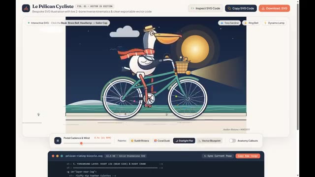
*Interface web montrant une illustration interactive vectorielle d'un pélican sur un vélo avec le code SVG en bas.*

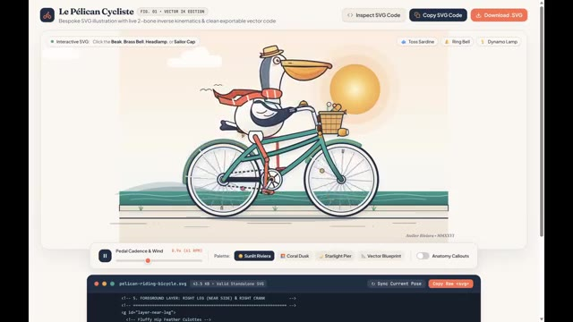
*Même interface web montrant l'illustration interactive vectorielle du pélican cycliste.*

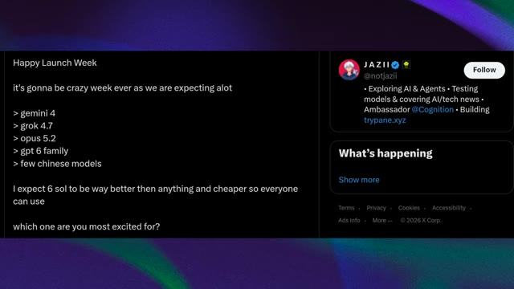
*Capture d'écran d'un tweet sur X (Twitter) posté par JAZII listant les lancements de modèles d'IA attendus.*

---

### ⏱️ `[00:06:05 - 00:06:40]` | Segment #16

**🔊 Audio (Transcription Intégrale Mot pour Mot en Français) :**
> ce qui le rend potentiellement accessible à un bien plus grand nombre de personnes. Encore une fois, nous devons être prudents. Ce sont des attentes et des fuites, pas des spécifications confirmées ni des annonces de lancement. Mais c'est précisément ce qui rend ce moment si intéressant. Parce qu'il y a tout juste quelques jours, nous parlions de Dario Amodei demandant à l'industrie de l'IA de ralentir. Et maintenant, nous envisageons potentiellement Opus 5.2, Gemini 4, GPT-6, Grok 4.7, de nouveaux modèles chinois, de nouveaux agents IA, et potentiellement toute une vague de nouveaux produits. Donc, au lieu que le développement de l'IA ne ralentisse

**👁️ Analyse Visuelle d'Écran (gemini-3.5-flash-lite) :**
**Interface & Outils** : Navigateur web affichant une publication sur le réseau social X (Twitter) et interface de présentation comparative de modèles d'IA avec illustrations de stations lunaires animées.

**Contenu textuel & Code** : Texte du tweet : "Happy Launch Week... it's gonna be crazy week ever as we are expecting alot > gemini 4 > grok 4.7 > opus 5.2 > gpt 6 family > few chinese models". Prompt visible en bas de l'image 2 : "Generate a richly animated SVG of a whimsical lunar parcel station...".

**Action / Démonstration** : Affichage successif des prédictions de sorties de modèles d'IA sur les réseaux sociaux et démonstration comparative des rendus graphiques générés par Opus 5.2 et GPT-6 Astra.

*Capture d'écran d'un tweet de JAZII listant les sorties de modèles d'IA attendues (gemini 4, grok 4.7, opus 5.2, gpt 6 family, few chinese models).*

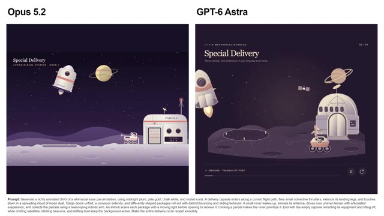
*Comparaison visuelle entre les rendus animés de deux modèles différents, étiquetés "Opus 5.2" et "GPT-6 Astra", accompagnés d'un prompt textuel détaillé en bas.*

---

### ⏱️ `[00:06:40 - 00:07:06]` | Segment #17

**🔊 Audio (Transcription Intégrale Mot pour Mot en Français) :**
> ...en bas, on dirait que tout le monde appuie sur l'accélérateur. Et si ne serait-ce que la moitié de ces fuites s'avèrent réelles, les prochaines semaines pourraient être absolument folles. Alors que vous attendiez GPT-6, Gemini 4, Opus 5.2, Grok 4.7, ou l'un des modèles chinois, il y a beaucoup à observer. Et je testerai ces modèles, je décortiquerai les sorties, et je séparerai les vraies capacités du battage médiatique.

**👁️ Analyse Visuelle d'Écran (gemini-3.5-flash-lite) :**
**Interface & Outils** : Interface de démonstration interactive de modèles d'IA (Opus 5.2 et GPT-6 Astra), affichant des visualisations de stations spatiales animées et des environnements interactifs en 3D à la première personne avec commandes de navigation (barre de navigation, réglage de tempête, contrôles de voilure).

**Contenu textuel & Code** : Textes visibles : "Opus 5.2", "GPT-6 Astra", "Special Delivery", "LUNAR PARCEL STATION - DOCK 7", "LITTLE MECHANICAL WONDERS", "ROVER 03 - IN TRANSIT", prompt complet en bas de l'image 1 commençant par "Prompt: Generate a richly animated SVG of a whimsical lunar parcel station...", "Tempest's Heart", "Made by Opus 5.2", "TAKE THE HELM / From the tabletop to the deck", indicateurs de cap (067°, 6.0 KN / 039°, 3.4 KN), options de navigation (Reefed, Half sail, Full sail, Leave the helm), curseur de tempête ("STORM / Force 9 - Strong gale"), boutons "Lightning" et "Sound off".

**Action / Démonstration** : Présentation de démonstrations interactives de code/génération d'IA (animation vectorielle complexe pour Opus 5.2 et GPT-6 Astra) puis navigation interactive en vue subjective (première personne) à bord d'un navire virtuel avec des commandes de simulation météo et de voilure.

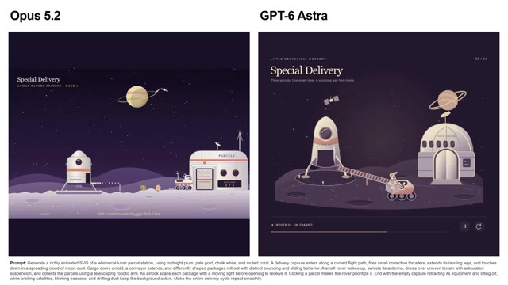
*Comparaison visuelle entre les interfaces de démonstration de "Opus 5.2" et "GPT-6 Astra" illustrant une station lunaire animée avec un prompt détaillé.*

*Vue interactive à la première personne depuis le pont d'un voilier en pleine mer de nuit, titrée "Tempest's Heart" et marquée "Made by Opus 5.2".*

*Vue interactive similaire depuis le pont du voilier avec un angle de caméra légèrement différent montrant les vagues agitées et le gouvernail.*

---

### ⏱️ `[00:07:06 - 00:07:15]` | Segment #18

**🔊 Audio (Transcription Intégrale Mot pour Mot en Français) :**
> Si vous avez apprécié ce rapport de recherche, abonnez-vous à Pursuing AI pour ne pas rater les prochaines vidéos. C'était Pursuing AI, et je vous dis à la prochaine.

**👁️ Analyse Visuelle d'Écran (gemini-3.5-flash-lite) :**
**Interface & Outils** : Interface utilisateur de simulation interactive ou d'application web de navigation avec des commandes de voile (Reefed, Half sail, Full sail), un indicateur de cap (Heading) et de vitesse (KN), ainsi qu'une barre de contrôle de tempête.

**Contenu textuel & Code** : Texte affiché : "SHIP IN A BOTTLE - FORCE 6", "TEMPEST'S HEART", "Steer with A and D, trim sails with W and S", "Made by Opus 5.2", "FULL SAIL", "Watch the sails catch the wind", ainsi que des options de contrôle météo (Storm, Force 9 - Strong gale, Lightning, Sound off).

**Action / Démonstration** : Visualisation d'une simulation de navigation interactive sur un bateau naviguant sur une mer agitée sous un ciel nocturne orageux.

*Capture d'écran montrant une application interactive ou un jeu de simulation de navigation à bord d'un voilier en pleine tempête.*

---
