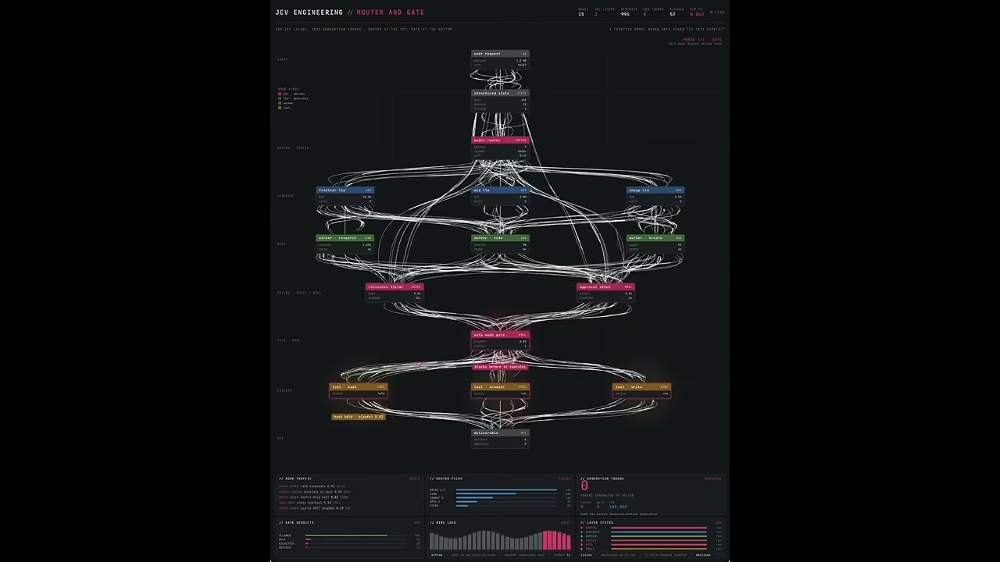
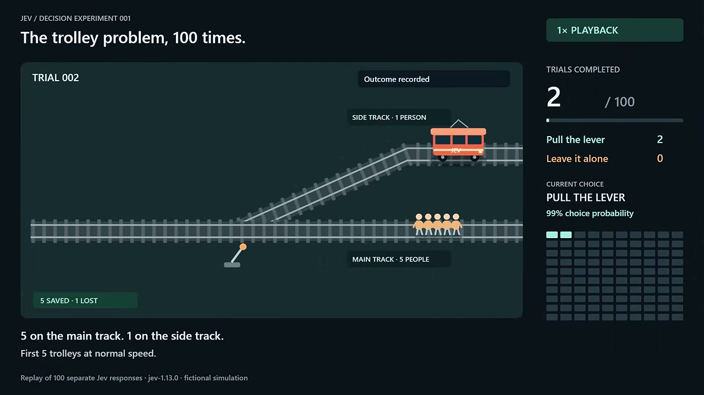
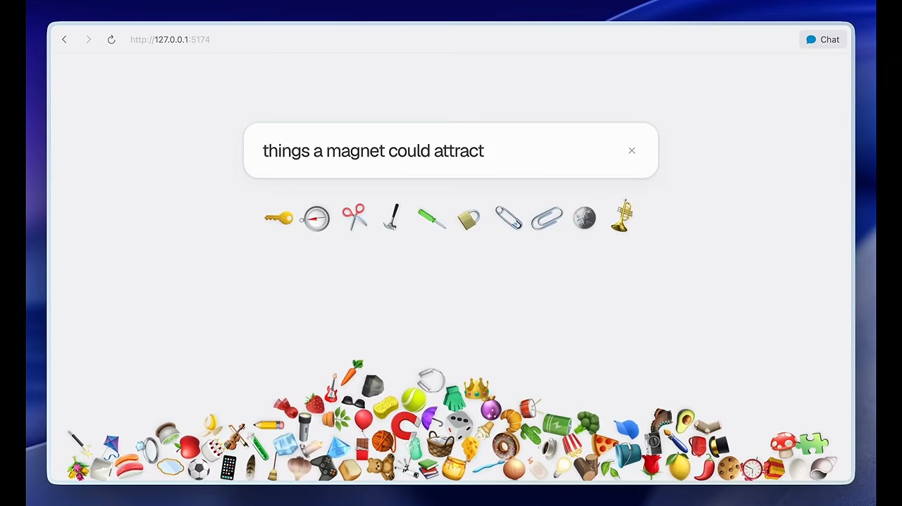
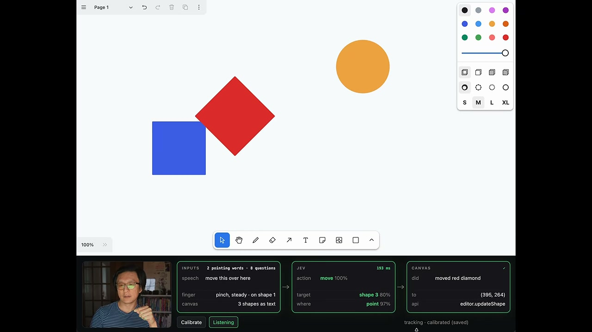
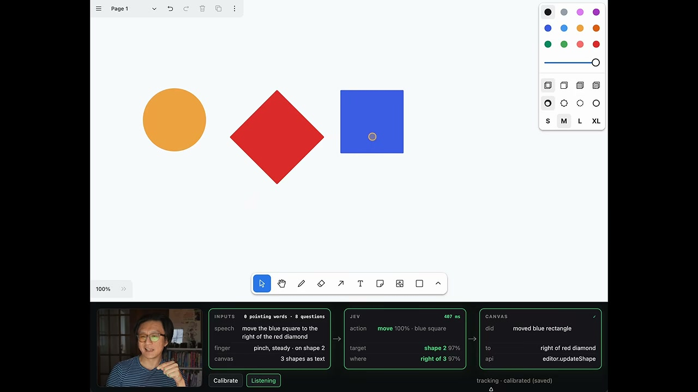
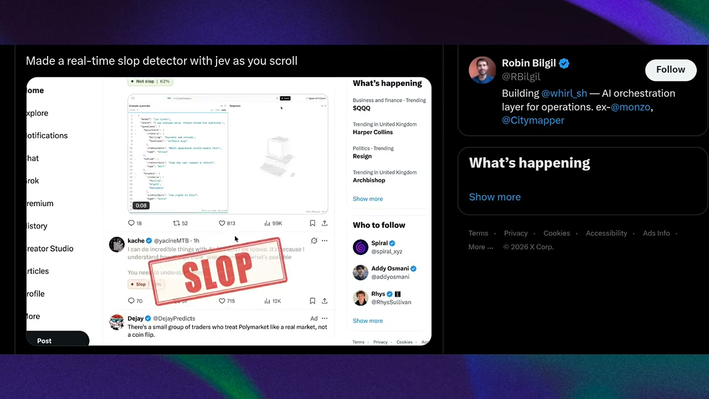
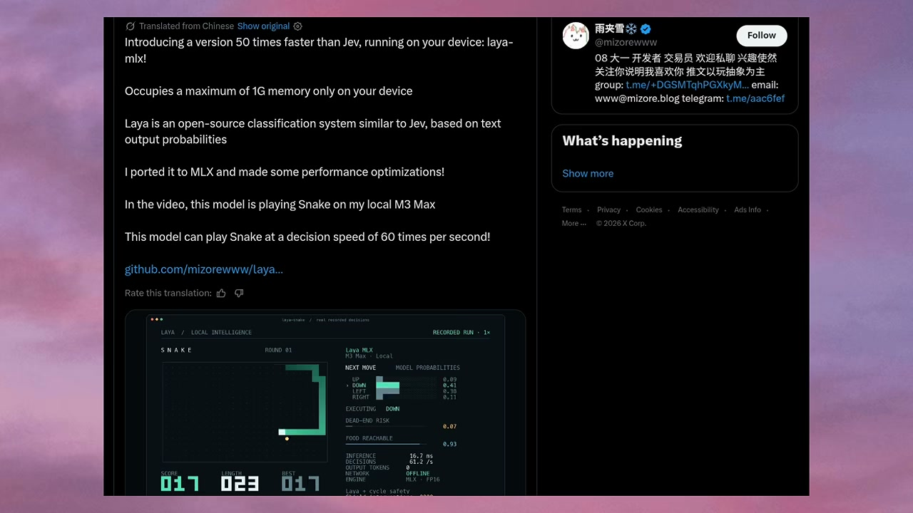
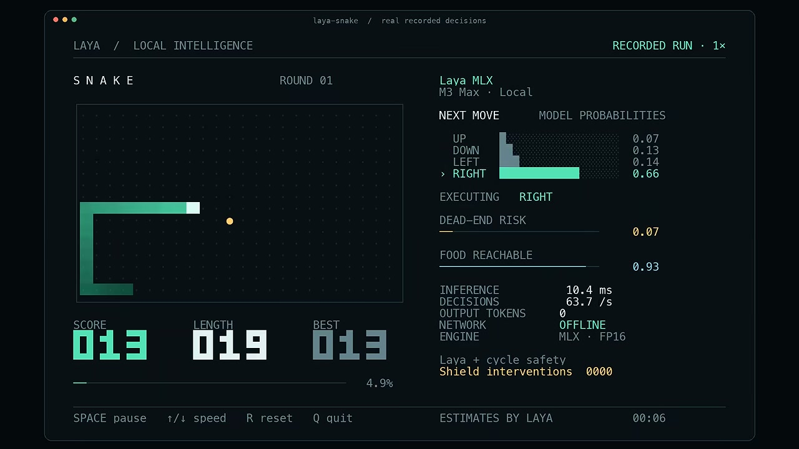
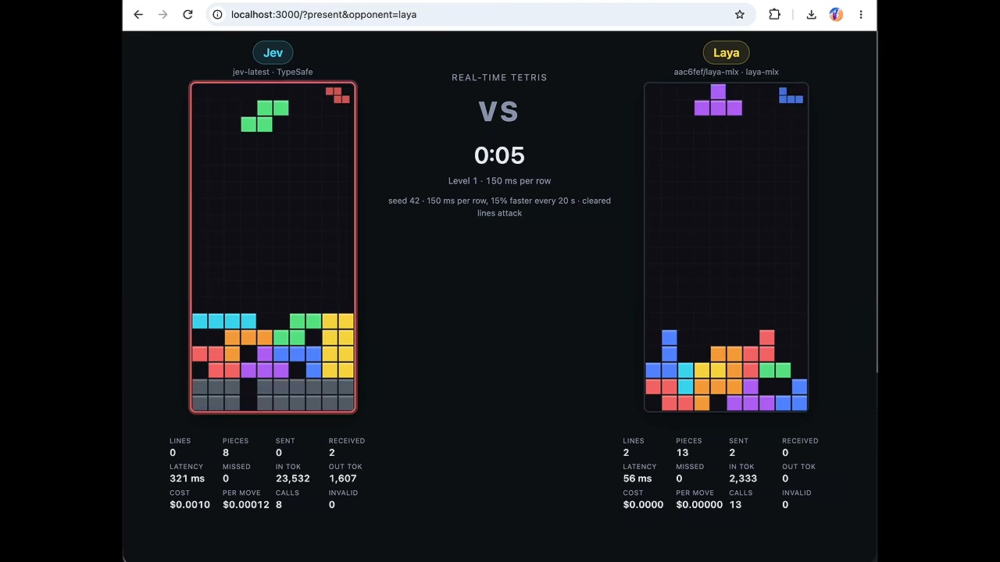
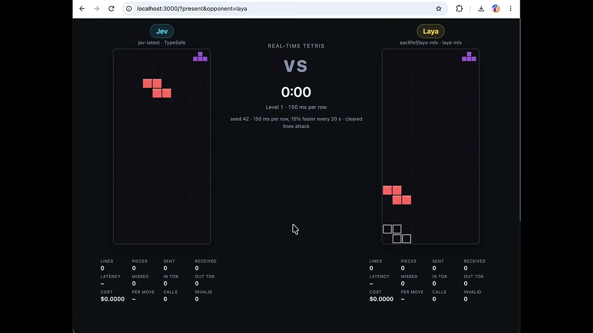

# 🎬 Jev est BIEN plus puissant que nous le pensions (Jev Is WAY More Powerful Than We Thought)

> **Chaîne** : [Pursuing AI](https://www.youtube.com/@PursuingAi)  
> **Lien YouTube** : [https://www.youtube.com/watch?v=I34qxJjyms0](https://www.youtube.com/watch?v=I34qxJjyms0)  
> **Date de publication** : 2026-09-22  
> **Durée** : 08m 11s  
> **Identifiant vidéo** : `I34qxJjyms0`  

---

## 📌 Synthèse Exécutive & Outils

### 💡 Résumé

**Jev s'impose comme un nouveau modèle open source révolutionnaire, radicalement différent des chatbots conversationnels traditionnels. Conçu pour prendre des décisions rapides et agir directement au cœur des logiciels, il fonctionne à une vitesse impressionnante, capable d'interagir en temps réel avec des environnements dynamiques complexes à un rythme soutenu.**

**La vidéo démontre des cas d'usage saisissants : un véhicule autonome en simulation continue, 100 itérations réussies du dilemme du tramway, du design d'interface interactif par la voix et le texte, un détecteur de posts indésirables (slop) sur les réseaux sociaux, ainsi que des performances exceptionnelles en audit de maillage interne SEO surpassant largement Claude Opus. L'écosystème intègre également Laya, un modèle tournant localement sur Apple Silicon M3 Max capable de jouer à Snake à une cadence vertigineuse.**

**Cette percée technologique marque le passage d'une IA passive à des modèles dits 'System One' ultra-rapides. En réduisant drastiquement la latence et les coûts tout en s'exécutant parfois entièrement hors ligne, ces agents autonomes redéfinissent la manière dont l'intelligence artificielle s'intègre nativement dans nos applications et flux de travail logiciels.**

### 🛠️ Outils, Modèles & Logiciels Présentés
- **Jev**
- **Claude Opus 5**
- **Laya**
- **Distribb.io**
- **Apple Silicon M3 Max**

### 🔑 Points Clés & Enseignements Stratégiques
- Jev est un modèle open source conçu pour prendre des décisions rapides et agir directement au sein des logiciels plutôt que de se comporter comme un simple chatbot.
- Il a été testé avec succès dans un environnement de simulation de conduite automobile en temps réel, s'adaptant continuellement sans jamais bloquer la simulation.
- Soumis 100 fois de suite au dilemme du tramway, Jev a montré une probabilité de 99 % de tirer le levier à chaque itération dans un environnement structuré.
- Il peut être utilisé comme un outil créatif interactif, modifiant instantanément des éléments visuels à l'écran à partir de simples instructions textuelles.
- Un utilisateur a créé un détecteur de contenu poubelle (slop detector) en temps réel sur X (Twitter) qui analyse et étiquette les posts en arrière-plan pendant le défilement.
- Lors d'un audit SEO comparatif sur 586 pages, Jev a traité l'ensemble du site en 45 secondes pour un coût de 0,21 $, surpassant Claude Opus en vitesse et en efficacité tarifaire.
- Le maillage interne est analysé par Jev à travers des milliers de micro-décisions de type oui/non, illustrant parfaitement la puissance des modèles de classification rapide.
- Le modèle alternatif Laya permet d'exécuter des prises de décision ultra-rapides entièrement hors ligne, directement en local sur une machine Apple Silicon.
- L'inférence avec Laya sur une puce M3 Max atteint une latence d'environ 10 millisecondes, démontrant la faisabilité d'exécuter des IA réactives à la périphérie sans cloud.
- Jev a également été démontré en train de jouer au jeu Snake localement sur M3 Max à une vitesse impressionnante de 60 décisions par seconde.
- L'approche de Jev repose sur la multiplication de milliers de micro-décisions pour automatiser des flux de travail complexes comme le SEO ou l'interaction avec des interfaces en direct.
- Ces avancées illustrent la transition vers des modèles faisant partie intégrante du logiciel, capables de déclencher des actions immédiates dans des environnements interactifs.

---

## ⏱️ Chronologie & Transcription Complète Audio & Visuelle (Mot pour Mot)

### ⏱️ `[00:00:00 - 00:00:31]` | Segment #01

**🔊 Audio (Transcription Intégrale Mot pour Mot en Français) :**
> Un nouvel open source AI appelé Jev juste drop, et les gens sont déjà en train de construire du serious software avec. Jev n'est pas un autre chatbot, c'est design pour make fast decisions et actually work avec software. Je went through some of the craziest examples people are sharing on X and trust me, you're going to want to see these. So grab your chips, sit back et let's see what Jev can actually do. This is Pursuing AI, et vous êtes en train de regarder le research report. Let's start with something that immediately caught my attention. Quelqu'un actually

**👁️ Analyse Visuelle d'Écran (gemini-3.5-flash-lite) :**
**Interface & Outils** : Interface de contrôle de Jev Engineering nommée 'ROUTER AND GATE' affichée sur fond sombre avec un diagramme en réseau complexe.

**Contenu textuel & Code** : Le schéma détaille les flux de données et de décisions : 'user request', 'structured state', 'model router', 'frontier llm', 'mid llm', 'cheap llm', 'relevance filter', 'approval check', 'auto node gate' avec des graphiques de trafic de nœuds et d'utilisation de la couche 'LAYER STATUS'.

**Action / Démonstration** : Visualisation en direct du routage des requêtes utilisateurs à travers différentes couches de modèles LLM et de barrières de sécurité (gates) au sein de l'architecture Jev.

---

### ⏱️ `[00:00:31 - 00:01:02]` | Segment #02

**🔊 Audio (Transcription Intégrale Mot pour Mot en Français) :**
> Mais le modèle continuait à raisonner en continu, sans pause, adaptant sa vitesse, évitant les obstacles. Le résultat est tout simplement bluffant.

**👁️ Analyse Visuelle d'Écran (gemini-3.5-flash-lite) :**
**Interface & Outils** : Un simulateur de conduite 3D doté d'un tableau de bord de télémétrie en temps réel (volant, accélérateur, frein) et d'un panneau d'analyse de trajectoire sur fond noir en bas à droite.

**Contenu textuel & Code** : Le compteur indique une vitesse de 16.4 mph. Le volant affiche -3.0 degrés. Le panneau de télémétrie et de réseau routier affiche des métriques détaillées comme 'speed 16.1 mph', 'Jev: steering -0.075', 'p(collision) 0.02', ainsi qu'une carte vectorielle de la route avec des courbes à l'approche et des cônes de signalisation.

**Action / Démonstration** : Démonstration en temps réel du modèle Jev pilotant une voiture rouge sur une route goudronnée ensoleillée, gérant la direction et la vitesse de manière autonome face à des obstacles.

---

### ⏱️ `[00:01:02 - 00:01:33]` | Segment #03

**🔊 Audio (Transcription Intégrale Mot pour Mot en Français) :**
> décisions, alors que le véhicule était déjà moving, avec la simulation never stopping to wait for it. Et c'est une pretty interesting demonstration de ce qui arrive when you take a model like Jev out of a chat window and give it control over a dynamic environment. Mais then, quelqu'un gave Jev a much more uncomfortable challenge. Ils l'ont put it through the trolley problem one hundred times. The setup is simple: 5 people are on the main track, 1 person is on the side track, and Jev has to decide whether to pull the lever and sacrifice one to save five or leave the lever

**👁️ Analyse Visuelle d'Écran (gemini-3.5-flash-lite) :**
**Interface & Outils** : Simulateur de conduite 3D doté d'une vue à la troisième personne depuis l'arrière d'un véhicule rouge (Jev), d'un panneau d'affichage HUD en haut (« 4x SPEED »), d'un tableau de bord virtuel en bas à gauche affichant le volant, l'accélération (THROTTLE à 0.02) et le freinage, ainsi que d'une mini-carte en bas à droite (« road network: 109 lanes within 200 m »).

**Contenu textuel & Code** : Les mesures en temps réel sont affichées dans l'encadré noir en bas à droite : speed 19.5 mph (8.7 m/s), lane 2, offset +0.04 m, heading +0.00 rad. Jev : steering +0.00 (score 4.0, conf 1.0), throttle +0.02 (score 3.05), p(collision) 0.12, p(off road) 0.06.

**Action / Démonstration** : Le véhicule rouge (Jev) navigue de manière autonome sur une route à plusieurs voies en contournant une zone de travaux signalée par des cônes oranges.

---

### ⏱️ `[00:01:33 - 00:02:04]` | Segment #04

**🔊 Audio (Transcription Intégrale Mot pour Mot en Français) :**
> seul. Mais au lieu de demander à Jev une fois, ils ont raté 100 séparés et raté de. Et right de from the beginning, Jev showed a 99% probability of choosing to pull the lever. As the experiment runs, you can actually watch each decision being recorded. And after all 100 trials, Jev pulled the lever every single time. Now, this is explicitly a fictional simulation, so obviously, this isn't a real world test of life or death decision making, but it does show something interesting. You can repeatedly put Jev into a structured environment,

**👁️ Analyse Visuelle d'Écran (gemini-3.5-flash-lite) :**
**Interface & Outils** : Interface de simulation interactive nommée "JEV / DECISION EXPERIMENT 001", intitulée "The trolley problem, 100 times.". Panneau latéral droit affichant le statut de lecture (1x Playback), les essais complétés (2 / 100), les choix (Pull the lever: 2, Leave it alone: 0), et la grille de probabilité de choix en cours.

**Contenu textuel & Code** : Textes affichés : "TRIAL 002", "Outcome recorded", "SIDE TRACK - 1 PERSON", "MAIN TRACK - 5 PEOPLE", "5 SAVED - 1 LOST". En bas à gauche : "5 on the main track. 1 on the side track. First 5 trolleys at normal speed.".

**Action / Démonstration** : Démonstration du dilemme du tramway (Trolley Problem) simulé 100 fois par l'IA Jev, illustrant le choix de tirer le levier pour sauver 5 personnes au détriment d'une seule.

---

### ⏱️ `[00:02:04 - 00:02:35]` | Segment #05

**🔊 Audio (Transcription Intégrale Mot pour Mot en Français) :**
> Et cette idée devient encore plus intéressante lorsque les gens commencent à donner à Jev actual creative tools. He's a designer, and when he got access to Jev, he built something pretty crazy. Remember, Jev is designed to make decisions quickly. So, instead of simply generating a response and waiting for you to decide what happens next, Jev can immediately decide what information or visual elements should appear. Stephen can give it a simple prompt like 'things you can wear in winter,' and Jev immediately...

**👁️ Analyse Visuelle d'Écran (gemini-3.5-flash-lite) :**
**Interface & Outils** : Interface web locale (localhost:5174) dans une fenêtre de navigateur au style épuré, avec une barre de recherche centrale et une zone interactive en bas remplie d'émojis d'objets divers.

**Contenu textuel & Code** : Le champ de recherche contient le texte saisi : 'things a magne' (choses magnétiques / aimantées). En bas, de nombreux émojis d'objets du quotidien et d'outils sont entassés.

**Action / Démonstration** : Démonstration d'une interface interactive et créative propulsée par Jev, où les éléments visuels réagissent en temps réel à une requête textuelle simple pour trier ou filtrer des objets.

---

### ⏱️ `[00:02:35 - 00:03:06]` | Segment #06

**🔊 Audio (Transcription Intégrale Mot pour Mot en Français) :**
> Mais Jack Chang a pris l'idée dans une direction complètement différente. Il a fondamentalement transformé Jev en un temps réel...

**👁️ Analyse Visuelle d'Écran (gemini-3.5-flash-lite) :**
**Interface & Outils** : Navigateur web affichant une application interactive locale avec une barre de recherche centrale, un bouton « Chat » en haut à droite, et une pile d'émojis divers accumulés au bas de l'écran.

**Contenu textuel & Code** : La barre de recherche contient la requête : "things a magnet could attract" (choses qu'un aimant pourrait attirer). Au-dessus, une liste d'émojis filtrés et générés dynamiquement (clé, boussole, ciseaux, marteau, tournevis, cadenas, trombone, pince, pièce de monnaie, trompette) est affichée en ligne.

**Action / Démonstration** : Démonstration interactive de Jev permettant de filtrer et faire tomber des émojis en temps réel basés sur une description textuelle thématique.

---

### ⏱️ `[00:03:06 - 00:03:37]` | Segment #07

**🔊 Audio (Transcription Intégrale Mot pour Mot en Français) :**
> Dessine un cercle jaune ici. Fais un bleu carré ici. Ajoute un red diamond ici.

**👁️ Analyse Visuelle d'Écran (gemini-3.5-flash-lite) :**
**Interface & Outils** : Interface d'une application de dessin web collaborative (type tableau blanc) avec une barre d'outils en bas, une palette de formes et de couleurs en haut à droite, et un panneau de débogage et de suivi en bas affichant les inputs, les actions Jev et l'API Canvas.

**Contenu textuel & Code** : On observe un tableau blanc numérique comportant un cercle orange en haut à droite, un carré bleu sur la gauche, et un losange rouge (red diamond) positionné entre le carré bleu et le cercle. En bas de l'écran, les sections INPUTS, JEV et CANVAS affichent les métriques en temps réel (par exemple, action: move 100%, target: shape 3, did: moved red diamond, API: editor.updateShape).

**Action / Démonstration** : Démonstration de la manipulation et du déplacement d'une forme (le losange rouge) sur le canevas à l'aide de commandes combinant la voix et les gestes de la main capturés par l'IA Jev.

---

### ⏱️ `[00:03:37 - 00:04:08]` | Segment #08

**🔊 Audio (Transcription Intégrale Mot pour Mot en Français) :**
> Agrandissez ceci. Déplacez ceci par ici. Mettez cela là. Déplacez le carré bleu à droite du diamant rouge. En fait, annulez cela. Sélectionnez tout cela. Supprimer.

**👁️ Analyse Visuelle d'Écran (gemini-3.5-flash-lite) :**
**Interface & Outils** : Interface de type tableau blanc interactif (« Page 1 ») avec une barre d'outils en haut et en bas, incluant des outils de sélection, dessin, formes et curseurs de couleur. En bas, un panneau de contrôle technique (section JEV) affiche les métriques de traitement, les entrées vocales et gestuelles (inputs, JEV, canvas).

**Contenu textuel & Code** : Trois formes géométriques colorées sur un fond blanc : un cercle/ellipse jaune, un diamant rouge et un carré bleu. Le panneau du bas affiche les détails de l'action en cours : action « move 100% », cible « shape 2 », position « right of 3 », et le résultat dans le canvas « moved blue rectangle ».

**Action / Démonstration** : Démonstration d'une commande vocale et gestuelle combinée où l'utilisateur déplace dynamiquement le carré bleu à droite du diamant rouge, l'interface analysant l'intention et exécutant la mise à jour correspondante.

---

### ⏱️ `[00:04:08 - 00:04:39]` | Segment #09

**🔊 Audio (Transcription Intégrale Mot pour Mot en Français) :**
> Quelqu'un a réellement utilisé Jev pour résoudre un problème tout en browsant X en temps réel. Robin a built un real-time slop detector que watches posts as you scroll. And you can see exactly what happens in the demo as new...

**👁️ Analyse Visuelle d'Écran (gemini-3.5-flash-lite) :**
**Interface & Outils** : Interface de Twitter / X affichant un flux d'actualités, des publications de comptes (Robin Bilgil, Kache, Dejay), un panneau latéral des tendances (« What's happening ») et des suggestions de comptes (« Who to follow »).

**Contenu textuel & Code** : Un tweet de Robin Bilgil (« Made a real-time slop detector with jev as you scroll ») incluant une vidéo intégrée avec le statut « Not slop 62% » et du code JSON dans une interface d'évaluation (OpenAI Client), ainsi qu'un autre tweet estampillé d'un grand tampon rouge « SLOP » d'alerte.

**Action / Démonstration** : Démonstration d'un outil de détection en temps réel (« slop detector ») intégré lors du défilement des publications sur X, illustrant l'analyse automatique et visuelle de contenus textuels ou générés par IA.

---

### ⏱️ `[00:04:39 - 00:05:10]` | Segment #10

**🔊 Audio (Transcription Intégrale Mot pour Mot en Français) :**
> posts appear, Jev analyzes them and makes a decision: slop or not slop. Then it puts that label directly on the post. So you're just scrolling normally while Jev is making these decisions in the background. And this is another really good example of the difference between a traditional chatbot and a fast decision-making model. Jev isn't simply generating text. It's observing what's happening, making a decision, and triggering an action in the interface. And you can imagine taking that concept way beyond X, an AI constantly deciding what needs your attention

**👁️ Analyse Visuelle d'Écran (gemini-3.5-flash-lite) :**
**Interface & Outils** : Interface de la plateforme X (anciennement Twitter) affichant un fil d'actualité, le panneau latéral « What's happening » et un profil utilisateur dans un encadré séparé.

**Contenu textuel & Code** : Un tweet de l'utilisateur @RBilgil (« Building @whirl_sh — AI orchestration layer for operations... ») avec un bouton de suivi, ainsi qu'un autre tweet intégré doté d'un badge de classification rouge « SLOP » et divers compteurs d'interactions (réponses, reposts, likes, vues).

**Action / Démonstration** : Démonstration d'un détecteur de contenu indésirable (« slop ») en temps réel intégré au défilement d'un réseau social.

---

### ⏱️ `[00:05:10 - 00:05:41]` | Segment #11

**🔊 Audio (Transcription Intégrale Mot pour Mot en Français) :**
> Mais il y a un autre exemple qui montre vraiment pourquoi la vitesse compte. Le créateur a mis Jev et Claude Opus cinq contre chaque autre sur la même tâche SEO. Le job : analyser 586 pages d'un site web et figurer où les liens internes font vraiment sens. Et selon le créateur, Jev a processé tous les 586 pages en juste 45 secondes, placé 584 liens et rejeté

**👁️ Analyse Visuelle d'Écran (gemini-3.5-flash-lite) :**
**Interface & Outils** : Un tweet de l'utilisateur @borjafat avec une interface de comparaison de sites web, affichant des données et des graphiques comparatifs.

**Contenu textuel & Code** : Le texte du tweet indique : 'Jev is WILD for SEO audit 🤯 in 45.1 seconds it read all 586 pages on my site and rebuilt the internal link map... Claude Opus 5, same 586 pages, same clock, got through 21 of them and spent $1.43.' En bas, un tableau comparatif détaillé 'Internal Link Dealer' montre les métriques de performance de Jev face à Claude Opus 5.

**Action / Démonstration** : Démonstration comparative en direct des performances de Jev par rapport à Claude Opus 5 pour l'analyse SEO et le maillage interne d'un site web de 586 pages.

---

### ⏱️ `[00:05:41 - 00:06:12]` | Segment #12

**🔊 Audio (Transcription Intégrale Mot pour Mot en Français) :**
> Jev est WILD pour l'audit SEO. En 45,1 secondes, il a lu toutes les 586 pages de mon site et a reconstruit la carte des liens internes. 584 liens placés, 139 pages qu'il a refusé de lier parce que rien ne convenait honnêtement. Coût total : 0,21 dollar. Maintenant, comparez cela avec Claude Opus 5. Il a reçu les mêmes 586 pages, le même fichier, mais selon le post, il n'a traversé que 21 pages dans le même temps et a coûté 1,43 dollar. Maintenant, ce n'est pas un benchmark contrôlé, donc nous ne devrions pas traiter ces chiffres comme une comparaison universelle entre les deux modèles. Mais cela met en lumière quelque chose d'important. Le maillage interne ne consiste pas vraiment à rédiger des paragraphes, c'est 8 790 appels de type oui/non : est-ce que cette page a une vraie raison de lier à celle-là, et y a-t-il un texte d'ancre déjà présent dans le contenu ? C'est un problème de classification, et nous avons payé des prix de pointe pour le faire une page à la fois. Ce que vous regardez : la colonne de gauche est Jev, celle de droite est Opus, même file d'attente, même grille d'évaluation. L'exécution s'arrête au moment où Jev termine, de sorte qu'Opus arrête de consommer des tokens. Bientôt disponible sur @distribb_io plus connecteur plus plugin gpt.

**👁️ Analyse Visuelle d'Écran (gemini-3.5-flash-lite) :**
**Interface & Outils** : Interface web interactive de test et simulation intitulée « Internal Link Dealer by Distribb », affichant deux colonnes comparatives côte à côte : à gauche « Jev (TypeSafe AI - jev-latest) » et à droite « Claude Opus 5 (Anthropic - via OpenRouter) ».

**Contenu textuel & Code** : En-tête indiquant « Edition of September 18, 2026 », « 586 pages crawled off distribb.io », « 15 destinations », « 8790 page pairs », « simulated run ». Pour Jev : Read 440/586, Mapped 425/422, Judgments 42,210, J/sec 1267, P50 Call 297ms, Elapsed 33.3s, Cost $0.1568. Pour Claude Opus 5 : Read 16/586, Mapped 12/16, Judgments 1,224, J/sec 37, P50 Call 5,095ms, Elapsed 33.3s, Cost $0.9711. Graphiques radar de métriques (depth, intent, freshness, orphaned, equity, overlap), cartes de liens, listes d'articles de blog et catégories SEO (AI SEO Agent, AI Content Writer, Backlink Exchange, AI SEO Audit, Content Calendar, Shopify SEO, Local SEO, White Label, SaaS SEO, Healthcare SEO, Free Tools, Comparisons, Reviews, Launch Videos, Docs).

**Action / Démonstration** : Démonstration comparative en temps réel de l'audit et du maillage interne automatisé de centaines de pages web par deux intelligences artificielles (Jev vs Claude Opus 5), illustrant la vitesse, le nombre de jugements, le coût en tokens et la pertinence des liens générés.

---

### ⏱️ `[00:06:12 - 00:06:43]` | Segment #13

**🔊 Audio (Transcription Intégrale Mot pour Mot en Français) :**
> Parce que quelqu'un a bu un modèle appelé Laya qui est désigné autour du même genre de fast decision-making, mais roule localement sur votre appareil. Et ce truc est ridiculement rapide. Dans le demo, Laya est

**👁️ Analyse Visuelle d'Écran (gemini-3.5-flash-lite) :**
**Interface & Outils** : Une interface de terminal ou d'application macOS intitulée 'LAYA / LOCAL INTELLIGENCE' montrant un jeu en cours, avec le panneau de contrôle latérale 'LAYA MLX M3 Max Local' et des scores.

**Contenu textuel & Code** : Le jeu 'SNAKE' est affiché en cours d'exécution avec 'ROUND 01', les scores (SCORE 017, LENGTH 023, BEST 017), les probabilités de mouvements ('NEXT MOVE' avec UP, DOWN, LEFT, RIGHT et leurs scores comme DOWN à 0.41), 'DEAD-END RISK' (0.07), 'FOOD REACHABLE' (0.93), ainsi que les performances d'inférence ('INFERENCE 16.7 ns', 'DECISIONS 61.2 /s', 'NETWORK OFFLINE'). Sur le tweet visible, le message d'un utilisateur nommé '雨夹雪❄️' (@mizorewww) présente 'laya-mlx' comme une version 50 fois plus rapide que Jev, consommant moins de 1G de mémoire, capable de jouer au jeu Snake à une vitesse de 60 décisions par seconde sur un M3 Max.

**Action / Démonstration** : Démonstration du modèle open-source Laya (porté sur MLX) fonctionnant localement sur un appareil Apple M3 Max, capable de prendre des décisions ultra-rapides en temps réel pour jouer au jeu Snake à 60 décisions par seconde.

---

### ⏱️ `[00:06:43 - 00:07:14]` | Segment #14

**🔊 Audio (Transcription Intégrale Mot pour Mot en Français) :**
> Vous pouvez également voir en bas à droite qu'il y a un certain nombre de métriques intéressantes. Par exemple, le temps d'inférence est d'environ 10 millisecondes, et nous avons le compteur de décisions par seconde. Ce qui est remarquable, c'est que l'ensemble du système tourne entièrement hors ligne, localement sur une machine Apple Silicon, en utilisant spécifiquement les capacités de calcul du M3 Max. Cela démontre qu'il est désormais possible d'exécuter des modèles d'intelligence artificielle hautement réactifs directement à la périphérie, sans dépendre du cloud.

**👁️ Analyse Visuelle d'Écran (gemini-3.5-flash-lite) :**
**Interface & Outils** : Fenêtre d'application logicielle de bureau intitulée 'laya-snake / real recorded decisions', exécutée localement sur macOS (boutons de contrôle de la fenêtre rouge/jaune/vert en haut à gauche).

**Contenu textuel & Code** : En-tête : 'LAYA / LOCAL INTELLIGENCE', 'RECORDED RUN 1x'. Section gauche : Jeu Snake en cours, score 013, longueur 019, meilleur 013. Section droite : Panneau 'Laya MLX M3 Max Local', 'NEXT MOVE', probabilités des modèles (UP: 0.07, DOWN: 0.13, LEFT: 0.14, RIGHT: 0.66), action exécutée 'RIGHT', 'DEAD-END RISK: 0.07', 'FOOD REACHABLE: 0.93', métriques (Inference: 10.4 ms, Decisions: 63.7 /s, Output Tokens: 0, Network: OFFLINE, Engine: MLX FP16), bouclier de sécurité 'Shield interventions: 0000'. En bas : contrôles clavier (SPACE pause, ↑/↓ speed, R reset, Q quit) et horodatage 00:06.

**Action / Démonstration** : Démonstration du modèle d'IA 'Laya MLX' jouant au jeu Snake en temps réel, affichant les probabilités de décision pour chaque mouvement (haut, bas, gauche, droite) mis à jour à une fréquence élevée d'environ 63-64 décisions par seconde.

---

### ⏱️ `[00:07:14 - 00:07:45]` | Segment #15

**🔊 Audio (Transcription Intégrale Mot pour Mot en Français) :**
> Alors, ce que je trouve le plus fascinant dans la version originale, c'est que l'auteur nous dit clairement qu'il a réussi à rendre ce modèle open source de classification de type Jev, basé sur les probabilités de sortie de texte, non seulement utilisable localement sur son appareil, mais surtout 50 fois plus rapide, tout en occupant un maximum de 1 Go de mémoire. Et là, on le voit directement en action : dans la vidéo de démonstration, le modèle joue au jeu Snake sur sa puce M3 Max locale, et il prend des décisions à une vitesse hallucinante de 60 fois par seconde. C'est donc une véritable rupture par rapport aux approches classiques où l'IA met du temps à répondre ou nécessite des requêtes réseau distantes. Ici, tout est exécuté en temps réel, de manière ultra-fluide et locale, ouvrant la voie à des agents autonomes capables d'interagir immédiatement avec des environnements interactifs complexes comme des jeux ou des interfaces logicielles en direct.

**👁️ Analyse Visuelle d'Écran (gemini-3.5-flash-lite) :**
**Interface & Outils** : Interface de simulation comparative en temps réel affichée dans un navigateur web (localhost:3000/?present&opponent=laya), divisée entre deux adversaires IA : Jev (jev-latest TypeSafe) à gauche et Laya (aac6fef/laya-mlx) à droite.

**Contenu textuel & Code** : Le titre central indique 'REAL-TIME TETRIS' avec un chronomètre à '0:05', 'Level 1 · 150 ms per row', et les paramètres 'seed 42 · 150 ms per row, 15% faster every 20 s · cleared lines attack'. Les statistiques de Jev affichent : LINES 0, PIECES 8, SENT 0, RECEIVED 2, LATENCY 321 ms, MISSED 0, IN TOK 23,532, OUT TOK 1,607, COST $0.0010, PER MOVE $0.00012, CALLS 8, INVALID 0. Les statistiques de Laya affichent : LINES 2, PIECES 13, SENT 2, RECEIVED 2, LATENCY 56 ms, MISSED 0, IN TOK 2,333, OUT TOK 0, COST $0.0000, PER MOVE $0.00000, CALLS 13, INVALID 0.

**Action / Démonstration** : Démonstration comparative en direct d'une partie de Tetris entre deux agents d'IA, montrant la supériorité de Laya en termes de latence (56 ms contre 321 ms), de coût ($0.0000 contre $0.0010) et de rapidité d'exécution par rapport à Jev.

---

### ⏱️ `[00:07:45 - 00:08:11]` | Segment #16

**🔊 Audio (Transcription Intégrale Mot pour Mot en Français) :**
> Que ce soit pour piloter un simulateur, contrôler un outil de design, filtrer des publications ou prendre des milliers de micro-décisions pour un workflow SEO, le modèle devient partie intégrante du logiciel lui-même. Et c'est la partie la plus folle à propos de Jev : il ne s'agit pas seulement de répondre à des questions, il s'agit de prendre des décisions et d'agir immédiatement. Si vous avez apprécié ce rapport de recherche, abonnez-vous car beaucoup d'autres analyses sur l'IA arrivent très bientôt. Je vous retrouve dans la prochaine vidéo !

**👁️ Analyse Visuelle d'Écran (gemini-3.5-flash-lite) :**
**Interface & Outils** : Interface web d'une application de jeu en temps réel comparant deux intelligences artificielles ("Jev" contre "Laya") sur le jeu Tetris, accessible sur localhost:3000.

**Contenu textuel & Code** : Tableau de bord affichant les statistiques en direct de la partie : lignes (4 pour Jev, 3 pour Laya), pièces (22 contre 37), latence (286 ms contre 51 ms), coût (0,0029 $ contre 0,0000 $), jetons utilisés, appels de modèle et message de fin de partie indiquant que Jev a gagné ("Jev wins: Laya topped out first").

**Action / Démonstration** : Démonstration comparative en temps réel de deux IA jouant à Tetris simultanément, avec affichage des métriques de performance et des coûts d'API.

