# 🎬 Opus 5.5 est TELLEMENT plus puissant qu'on ne le pensait 🤔

> **Chaîne** : [Pursuing AI](https://www.youtube.com/@PursuingAi)  
> **Titre original** : `Opus 5.5 Is WAY More Powerful Than We Thought 🤔`  
> **Lien YouTube** : [https://www.youtube.com/watch?v=-wBOccKF6Zs](https://www.youtube.com/watch?v=-wBOccKF6Zs)  
> **Date de publication** : 2026-09-25  
> **Durée** : 11m 28s (`688s`)  
> **Identifiant vidéo** : `-wBOccKF6Zs`  
> **Fiche Web Interactive** : [2026-09-25_YT--wBOccKF6Zs_Opus 5.5 est TELLEMENT plus puissant qu'on ne le pensait 🤔_by-whisper-v3-large-turbo+gemini-3.5-flash-lite.html](2026-09-25_YT--wBOccKF6Zs_Opus 5.5 est TELLEMENT plus puissant qu'on ne le pensait 🤔_by-whisper-v3-large-turbo+gemini-3.5-flash-lite.html)  
> **Captures de démonstration clés** : `83 captures réelles (anti-talking-head)`  
> **Modèles utilisés** : Audio: `large-v3-turbo` (Faster-Whisper int8 VPS) | Vision: `gemini-3.5-flash-lite` (Google AI Studio API)  

---

## 📌 Synthèse Exécutive & Outils

### 📌 Résumé
La vidéo de Pursuing AI met en lumière les capacités surprenantes et avancées du nouveau modèle d'IA **Opus 5.5**, à travers une série de démonstrations pratiques et créatives. Loin de se limiter à la simple génération de texte ou de code brut, ce modèle démontre une aptitude remarquable à traduire des requêtes conceptuelles de haut niveau en environnements interactifs complexes et visuellement soignés. Qu'il s'agisse de concevoir un laboratoire optique pédagogique, un prototype de jeu de basketball en 3D, une île tropicale immersive en monde ouvert ou de transformer un simple croquis en simulation physique interactive, Opus 5.5 redéfinit les frontières de la création assistée par agent.

Derrière ces résultats spectaculaires se cachent des flux de travail exigeants et itératifs, combinant l'utilisation intensive de sous-agents, des investissements en temps de calcul significatifs (allant de plus d'une heure à près de deux heures d'API) et des coûts financiers non négligeables (de 25 $ à près de 1 900 $ de jetons). Les créateurs mettent en œuvre une méthode basée sur l'impulsion globale et des retours correctifs itératifs (« ajoute ceci », « c'est bizarre, améliore-le »), délégant la quasi-totalité de l'implémentation technique à l'IA. 

Pour les créateurs de contenu vidéo et les développeurs, ces avancées ouvrent des perspectives inédites en matière de narration visuelle et de prototypage rapide. Il devient possible de matérialiser des concepts abstraits sous forme d'expériences interactives explorables, transformant radicalement la manière dont les idées complexes peuvent être présentées et partagées avec un public, tout en conservant un regard critique sur les limites actuelles (bugs, artefacts visuels et nécessité d'une supervision humaine ciblée).

### 🛠️ Outils, Modèles & Logiciels Présentés
* **Opus 5.5** : Modèle d'intelligence artificielle de pointe d'Anthropic, utilisé comme moteur principal pour la génération de code, la conception de simulations interactives et le pilotage de sous-agents complexes.
* **Astra** : Modèle de référence concurrent mentionné pour la comparaison des performances sur les benchmarks de l'industrie.
* **3.js** : Bibliothèque JavaScript utilisée pour le rendu graphique 3D dans le navigateur, constituant la base technique des démos interactives de jeux et d'environnements.
* **GeneX Games (outils de développement pour agents)** : Suite d'outils utilisée en synergie avec l'IA pour structurer et faciliter le flux de développement de jeux vidéo par agents.

### 🔑 Points Clés & Enseignements Stratégiques
* **Dépassement du texte brut** : Opus 5.5 transforme des concepts abstraits ou textuels en visualisations interactives fonctionnelles, rendant l'apprentissage et la communication de concepts ardus (comme l'optique) immédiatement intuitifs.
* **Investissement en temps et en calcul** : La génération de projets complexes requiert une puissance de calcul substantielle, avec des temps d'API mesurés en heures (ex. : 1h26 ou 2h07) et non en secondes.
* **Réalité des coûts financiers** : Les projets d'envergure (comme l'île tropicale interactive) nécessitent des budgets de jetons importants, atteignant parfois près de 1 900 $, ce qui redéfinit l'économie du prototypage par IA.
* **Approche par prompts itératifs de haut niveau** : Le rôle de l'humain évolue vers celui de directeur artistique ou de testeur, se limitant à des instructions générales (« ajoute x et y ») et correctives plutôt qu'à l'écriture de code manuel.
* **Synergie avec des frameworks spécialisés** : Le succès de la création de jeux (ex. : le jeu de basketball) repose sur l'association d'Opus 5.5 avec des technologies existantes comme 3.js et des outils de développement par agents.
* **Complexité multi-systèmes** : L'IA est capable d'orchestrer de multiples sous-systèmes simultanément (éclairage dynamique, cycles jour/nuit, physique, environnements aquatiques) au sein d'une même expérience unifiée.
* **Du croquis à la simulation physique** : La capacité à convertir un simple dessin à la main en un modèle 3D doté de propriétés physiques interactives (comme une catapulte fonctionnelle) ouvre des voies révolutionnaires pour le design rapide.
* **Acceptation des imperfections techniques** : Ces prototypes ne constituent pas des produits finis de niveau commercial (AAA) ; ils comportent inévitablement des bugs, des artefacts visuels et des textures perfectibles qu'il faut accepter à ce stade technologique.
* **Attention au piège de l'illusion "magique"** : Il ne s'agit pas d'un prompt unique et instantané (« one-shot »), mais du fruit d'un processus itératif orchestré par de multiples sous-agents sous supervision humaine.
* **Valeur pédagogique et démonstrative** : Pour les créateurs de vidéo, ces outils permettent de générer des b-rolls interactifs et des démonstrations sur mesure pour illustrer des sujets technologiques ou scientifiques avec un impact visuel maximal.

---

## ⏱️ Chronologie & Transcription Complète Audio & Visuelle (Mot pour Mot)

### ⏱️ `[00:00:00 - 00:00:26]` | Segment #01

**🔊 Audio (Transcription Intégrale Mot pour Mot en Français) :**
> Dario Amodei a récemment déclaré que nous devons ralentir le rythme du développement de l'IA, et ensuite Anthropic a sorti Opus 5.5. Et honnêtement, ce modèle est sérieusement impressionnant. Il produit des résultats de très haute qualité, et il surpasse même Astra sur plusieurs benchmarks. Donc dans la vidéo d'aujourd'hui, je vais vous montrer certaines des choses les plus impressionnantes qu'Opus 5.5 a générées, et croyez-moi, certains de ces résultats vont sincèrement vous surprendre.

**👁️ Analyse Visuelle d'Écran (gemini-3.5-flash-lite) :**
**Interface & Outils** : Navigateur web affichant une application web locale de simulation ("Teraum") et comparatifs visuels de modèles d'IA.

**Contenu textuel & Code** : Textes visibles : "GPT-6 Astra / 8h 06m of compute" et "Claude Opus 5.5 / 6h 40m of compute". URL locale affichée : "http://localhost:5199". Boutons de contrôle : "VEHICLE", "ROBOT".

**Action / Démonstration** : Démonstration visuelle des capacités graphiques et de rendu des différents modèles d'IA générative comparés à l'écran.

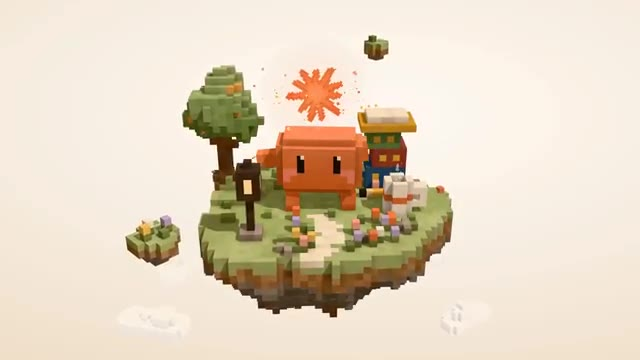
*Animation 3D isométrique en blocs de type voxel représentant une petite île flottante avec une créature orange, des arbres et un soleil.*

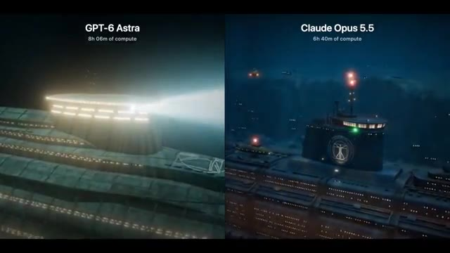
*Comparaison comparative en écran partagé entre "GPT-6 Astra" (8h 06m of compute) et "Claude Opus 5.5" (6h 40m of compute) montrant des scènes maritimes nocturnes.*

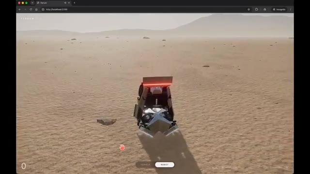
*Capture d'écran d'un navigateur web montrant une simulation de véhicule futuriste dans un paysage désertique sur un serveur local.*

---

### ⏱️ `[00:00:26 - 00:00:48]` | Segment #02

**🔊 Audio (Transcription Intégrale Mot pour Mot en Français) :**
> Prenez donc vos chips, installez-vous confortablement, et voyons de quoi Opus 5.5 est capable. C'est Pursuing AI, et vous regardez le rapport de recherche. C'est donc l'un des exemples les plus intéressants que j'aie vus d'Opus 5.5. Ryan Sale a simplement demandé à Opus 5.5 d'expliquer la mise au point d'un appareil photo en créant un laboratoire d'objectifs interactif.

**👁️ Analyse Visuelle d'Écran (gemini-3.5-flash-lite) :**
**Interface & Outils** : Navigateur web affichant une application interactive isométrique (Token Town) puis un tweet de Ryan Sale.

**Contenu textuel & Code** : Texte du tweet : "I asked Opus 5.5 to explain camera focus by building an interactive lens lab. Here's what it came up with after 1 hour 26 minutes in one shot, $25.66 API cost. lens.lab.sael.net. Move the focus ring and you can see the glass elements shift the sharp plane through the scene".

**Action / Démonstration** : Affichage d'une simulation 3D de ville en mode isométrique, puis transition vers un tweet illustré par une vidéo montrant les éléments en verre d'un objectif de caméra interactif.

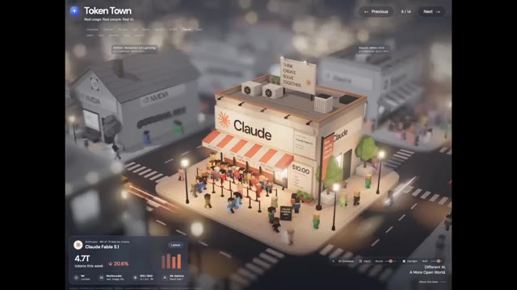
*Interface de simulation isométrique "Token Town" avec des graphismes de type voxel représentant un magasin Claude.*

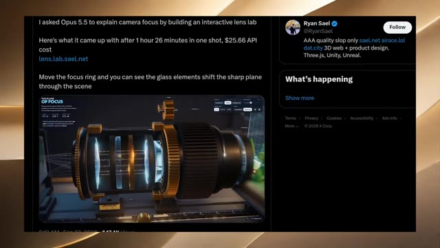
*Publication sur le réseau social X (Twitter) de Ryan Sale montrant le laboratoire d'objectifs interactif généré par Opus 5.5.*

---

### ⏱️ `[00:00:48 - 00:01:07]` | Segment #03

**🔊 Audio (Transcription Intégrale Mot pour Mot en Français) :**
> Et au lieu de simplement lui donner un mur de texte, Opus 5.5 a réellement construit une simulation interactive visuelle. Vous pouvez voir ici toute une configuration d'objectif de caméra, avec les éléments en verre individuels, le plan de focalisation, la scène en arrière-plan, et des commandes qui vous permettent de modifier différents paramètres. Et c'est là que ça devient vraiment intéressant.

**👁️ Analyse Visuelle d'Écran (gemini-3.5-flash-lite) :**
**Interface & Outils** : Simulation interactive web de l'outil Opus 5.5 expliquant les principes optiques (The Plane of Focus).

**Contenu textuel & Code** : Texte à l'écran : "THE PLANE OF FOCUS", paramètres de réglage "Focus", "Aperture", "Sharp zone", et contrôles de distance (Foreground, Middle, Background) et de lentille (Assembled, Exploded).

**Action / Démonstration** : Présentation visuelle et manipulation d'une simulation interactive 3D démontrant le fonctionnement d'un objectif photographique et le plan de netteté.

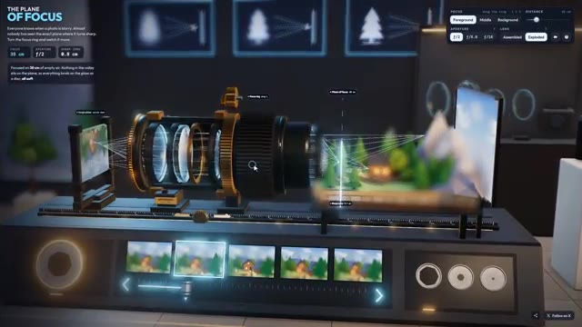
*Simulation interactive d'un objectif de caméra montrant les éléments en verre, le plan de focalisation et une scène miniature en arrière-plan.*

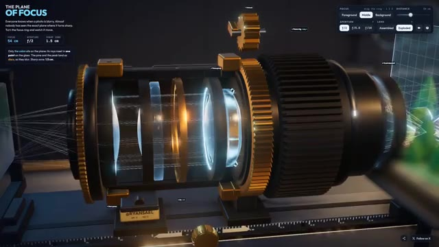
*Vue rapprochée de la structure interne éclatée de l'objectif de caméra avec ses anneaux dorés et ses lentilles en verre.*

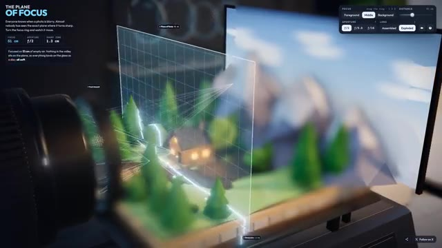
*Gros plan sur le plan de focalisation interactif mettant en valeur la zone nette sur une maquette de paysage avec une cabane.*

---

### ⏱️ `[00:01:07 - 00:01:30]` | Segment #04

**🔊 Audio (Transcription Intégrale Mot pour Mot en Français) :**
> Au fur et à mesure que vous déplacez la mise au point, le modèle montre visuellement comment le plan net se déplace dans la scène. Ainsi, vous ne lisez pas seulement une explication de la profondeur de champ, vous pouvez réellement voir le concept se dérouler sous vos yeux. Et honnêtement, la présentation visuelle est plutôt impressionnante. L'objectif lui-même est détaillé, l'interface est organisée et la simulation vous offre une manière intuitive de comprendre quelque chose qui peut s'avérer assez difficile à expliquer avec du texte seul.

**👁️ Analyse Visuelle d'Écran (gemini-3.5-flash-lite) :**
**Interface & Outils** : Application interactive web ou logicielle de simulation optique (« The Plane of Focus ») avec des contrôles de mise au point (Foreground, Middle, Background), d'ouverture (f/2, f/5.6, f/16) et de vue de l'objectif (Assembled, Exploded).

**Contenu textuel & Code** : Texte à l'écran : « THE PLANE OF FOCUS », « FOCUS », « APERTURE », « SHARP ZONE », boutons de réglage de la distance, de l'ouverture et de l'état de l'objectif (assemblé/éclaté).

**Action / Démonstration** : L'utilisateur manipule la mise au point et les paramètres de l'objectif dans la simulation pour observer en temps réel l'impact sur la profondeur de champ et le plan net.

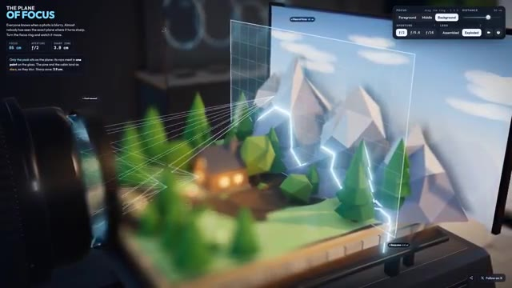
*Simulation interactive 3D d'un objectif de caméra montrant le plan de focalisation et la profondeur de champ sur un diorama de paysage.*

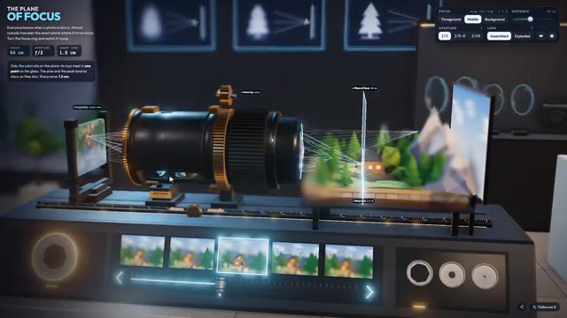
*Vue d'ensemble de l'outil interactif montrant le corps de l'objectif complet, le diorama et un panneau de sélection de scènes.*

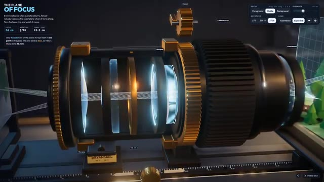
*Vue éclatée (Exploded view) de l'objectif montrant les différents éléments optiques internes et les lentilles alignées.*

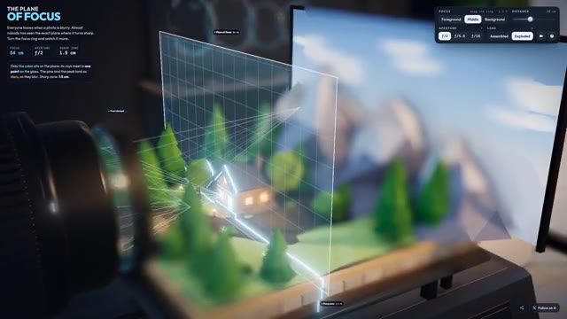
*Gros plan sur le plan de focalisation (The Plane of Focus) se déplaçant à travers les éléments du diorama (maison et arbres en 3D).*

---

### ⏱️ `[00:01:30 - 00:01:49]` | Segment #05

**🔊 Audio (Transcription Intégrale Mot pour Mot en Français) :**
> Mais il y a aussi un détail important ici. Selon Ryan, Opus 5.5 a pris 1 heure et 26 minutes pour produire ceci en une seule tentative avec un coût d'API de 25,66 dollars. Ce n'est donc pas une petite page Web instantanée qui est apparue en quelques secondes. Il a fallu un temps et une puissance de calcul considérables pour le générer.

**👁️ Analyse Visuelle d'Écran (gemini-3.5-flash-lite) :**
**Interface & Outils** : Interface de Twitter / X affichant un tweet multimédia avec une vidéo interactive 3D de démonstration technique.

**Contenu textuel & Code** : Texte du tweet de Ryan Sael : "I asked Opus 5.5 to explain camera focus by building an interactive lens lab. Here's what it came up with after 1 hour 26 minutes in one shot, $25.66 API cost. lens.lab.sael.net. Move the focus ring and you can see the glass elements shift the sharp plane through the scene."

**Action / Démonstration** : Le tweet défile ou présente la démonstration interactive d'un laboratoire de lentilles 3D créé par intelligence artificielle, illustrant le fonctionnement de la mise au point photographique.

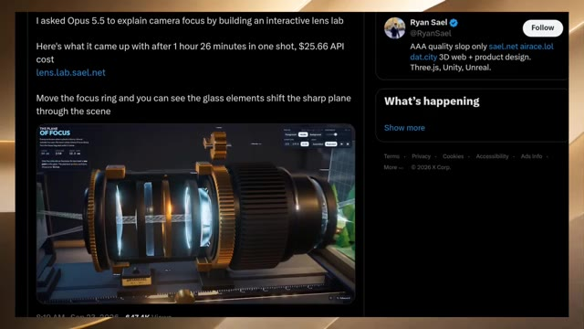
*Capture d'écran d'un tweet de Ryan Sael présentant une application interactive 3D générée par Opus 5.5, montrant la structure interne d'un objectif de caméra.*

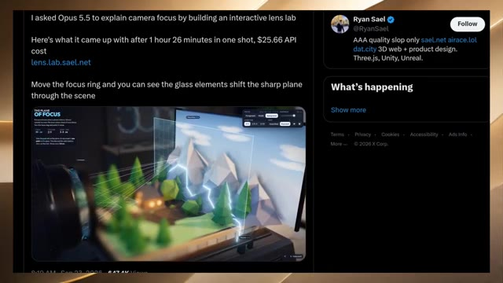
*Suite du tweet interactif montrant le plan de focalisation de l'objectif sur un diorama de paysage avec des arbres et des montagnes.*

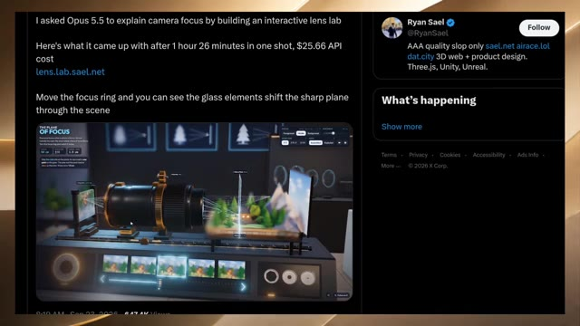
*Vue globale de l'interface de l'application interactive montrant les différents éléments de réglage et la chronologie de l'objectif.*

---

### ⏱️ `[00:01:49 - 00:02:09]` | Segment #06

**🔊 Audio (Transcription Intégrale Mot pour Mot en Français) :**
> Et c'est précisément ce qui rend cet exemple intéressant à mes yeux. Car la partie impressionnante n'est pas simplement qu'il ait généré une jolie interface. C'est que le modèle a compris la requête comme un problème pédagogique et l'a transformée en une visualisation interactive. Maintenant, je ne regarderais pas non plus cela en disant que l'IA vient de construire un simulateur physique parfait. Ce n'est pas ce que nous voyons ici.

**👁️ Analyse Visuelle d'Écran (gemini-3.5-flash-lite) :**
**Interface & Outils** : Navigateur web affichant un fil d'actualité X (Twitter) et une application interactive web 3D/WebGL de simulation d'optique.

**Contenu textuel & Code** : Texte du tweet : "I asked Opus 5.5 to explain camera focus by building an interactive lens lab. Here's what it came up with after 1 hour 26 minutes in one shot, $25.66 API cost. lens.lab.sael.net. Move the focus ring and you can see the glass elements shift the sharp plane through the scene". L'application affiche le titre "THE PLANE OF FOCUS", des curseurs de réglage (Focus, Aperture, Sharp zone) et une maquette 3D détaillée d'un objectif de caméra et de lentilles optiques.

**Action / Démonstration** : Le créateur présente une publication sur les réseaux sociaux et la visualisation interactive générée par intelligence artificielle simulant le fonctionnement d'une lentille de caméra.

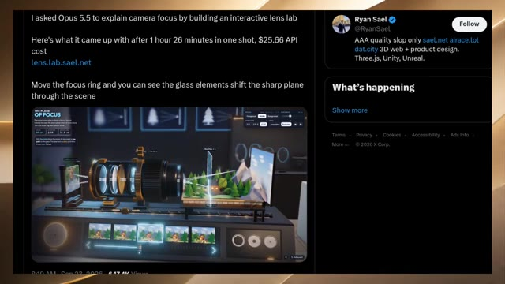
*Publication sur X (Twitter) par Ryan Sael montrant une interface interactive de laboratoire de lentilles générée par IA.*

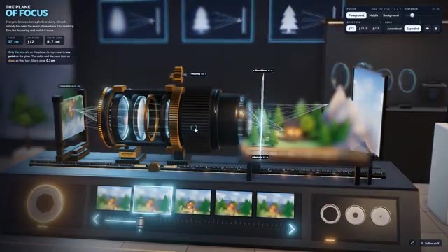
*Gros plan sur l'interface interactive 3D d'un laboratoire de mise au point d'objectifs de caméra ("The Plane of Focus").*

---

### ⏱️ `[00:02:09 - 00:02:32]` | Segment #07

**🔊 Audio (Transcription Intégrale Mot pour Mot en Français) :**
> Ce que nous voyons est une démonstration interactive hautement soignée conçue pour communiquer le concept de la mise au point de la caméra, et à cette fin spécifique, c'est véritablement impressionnant. Si vous voulez l'essayer vous-même, j'ai mis le lien dans la description, le même lien partagé par Ryan dans sa publication originale. Mais ce n'est que le début, car Opus 5.5 peut passer de l'explication de concepts à la construction concrète de choses avec lesquelles vous pouvez jouer.

**👁️ Analyse Visuelle d'Écran (gemini-3.5-flash-lite) :**
**Interface & Outils** : Application web interactive éducative intitulée "The Plane of Focus" avec des panneaux de contrôle pour l'ouverture (f/2, f/5.6, f/16), les modes d'objectif (Assembled, Exploded) et les préréglages de mise au point (Foreground, Middle, Background).

**Contenu textuel & Code** : Titre "THE PLANE OF FOCUS", curseurs de distance, paramètres de mise au point (Focus 66 cm, Aperture f/2, Sharp Zone 2.3 cm), explications textuelles sur la formation de l'image et la netteté des rayons lumineux.

**Action / Démonstration** : Manipulation interactive d'une simulation 3D démontrant l'optique photographique, le plan de focalisation, la profondeur de champ et l'effet du diaphragme sur la netteté d'une scène miniature.

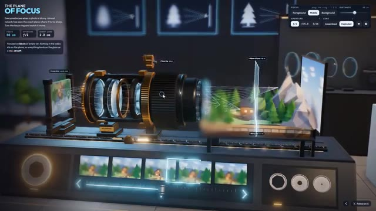
*Démonstration interactive 'The Plane of Focus' montrant un objectif de caméra en coupe avec des rayons lumineux et des réglages d'ouverture.*

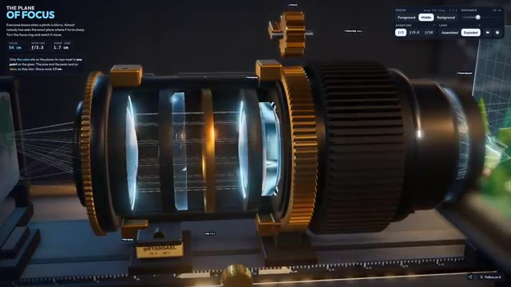
*Gros plan sur l'objectif de la caméra en vue éclatée montrant les différentes lentilles dorées et noires.*

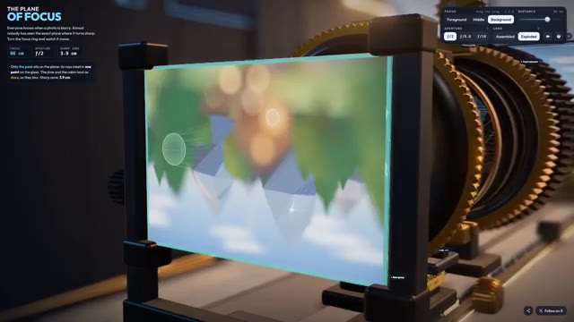
*Vue rapprochée de l'écran de verre mat montrant la formation de l'image floue et nette à travers le système optique.*

*Vue générale de la simulation interactive du plan de mise au point avec une frise de vignettes de prévisualisation en bas.*

---

### ⏱️ `[00:02:32 - 00:02:54]` | Segment #08

**🔊 Audio (Transcription Intégrale Mot pour Mot en Français) :**
> Et cela nous amène à notre prochain exemple. Celui-ci est un jeu de basketball sur navigateur. Le créateur a demandé à Opus 5.5 d'aider à construire une expérience de basketball de style NBA 2K, et c'est ce qu'ils ont obtenu. Vous avez un terrain de basketball en 3D, un personnage jouable, un ballon de basketball, un tableau d'affichage, une horloge des 24 secondes, des mécaniques de tir, des déplacements et un système de timing de tir.

**👁️ Analyse Visuelle d'Écran (gemini-3.5-flash-lite) :**
**Interface & Outils** : Navigateur web affichant une publication sur le réseau social X (Twitter) et un jeu vidéo 3D en cours d'exécution.

**Contenu textuel & Code** : Texte du tweet : "Opus 5.5 cooked NBA 2K in the browser. Is that AGI? Made with @threejs + @genex_games game-dev tools for agents. You can try it here. We'll share the source soon. genex.games/opus-2k".

**Action / Démonstration** : Démonstration du jeu de basketball 3D sur navigateur, avec un joueur contrôlable sur le terrain, un panneau de score et une horloge de tir visibles.

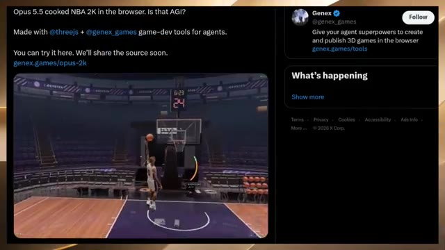
*Publication sur X montrant une vidéo de gameplay d'un jeu de basket 3D sur navigateur créé avec Opus 5.5.*

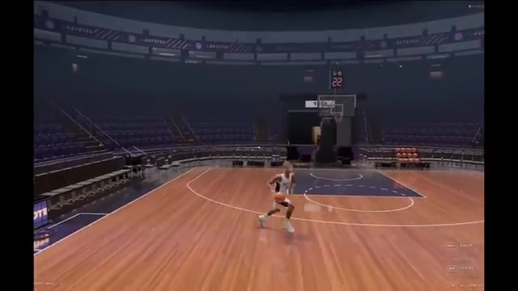
*Vue rapprochée en plein écran du jeu de basketball 3D sur navigateur montrant le joueur sur le terrain.*

---

### ⏱️ `[00:02:54 - 00:03:29]` | Segment #09

**🔊 Audio (Transcription Intégrale Mot pour Mot en Français) :**
> Et la partie importante, c'est qu'il ne s'agit pas juste d'une maquette statique. La vidéo montre le joueur se déplaçant sur le terrain, dribblant le ballon, prenant des tirs et interagissant avec le jeu. Mais il y a une distinction importante que je tiens à faire ici. Il ne s'agit pas de NBA 2K tournant dans un navigateur. Le message précise explicitement que cela a été réalisé en utilisant 3.js, ainsi que les outils de développement de jeux pour agents de GeneX Games. La contribution d'Opus 5.5 doit donc être comprise comme faisant partie de ce flux de développement plus large. Il a aidé à générer le jeu grâce au codage et aux outils d'agents plutôt qu'en fournissant indépendamment chaque actif, système et élément d'infrastructure.

**👁️ Analyse Visuelle d'Écran (gemini-3.5-flash-lite) :**
**Interface & Outils** : Navigateur web affichant une application de jeu 3D (Image 1) et un fil d'actualité de réseau social (Image 2).

**Contenu textuel & Code** : Texte du post : "Opus 5.5 cooked NBA 2K in the browser. Is that AGI? Made with @threejs + @genex_games game-dev tools for agents. You can try it here. We'll share the source soon. genex.games/opus-2k".

**Action / Démonstration** : Un joueur de basketball virtuel dribble et tire au panier sur un terrain en 3D interactif dans un navigateur web.

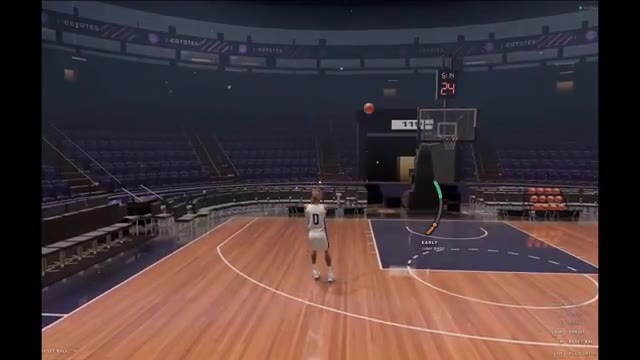
*Un joueur de basket virtuel sur un terrain 3D en train de tirer au panier avec une jauge de timing de tir visible.*

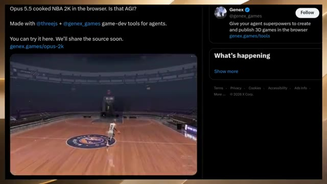
*Une publication sur les réseaux sociaux (X/Twitter) montrant une vidéo du jeu de basket avec le texte explicatif sur son développement.*

---

### ⏱️ `[00:03:29 - 00:03:53]` | Segment #10

**🔊 Audio (Transcription Intégrale Mot pour Mot en Français) :**
> Et c'est en fait plus intéressant pour moi, parce que vous ne demandez plus seulement à une IA d'écrire quelques lignes de JavaScript. Vous lui donnez une idée de haut niveau et vous obtenez quelque chose que vous pouvez réellement ouvrir dans un navigateur et avec lequel interagir. Maintenant, évidemment, ce n'est en rien comparable à la profondeur d'un véritable titre NBA 2K. Les graphismes sont beaucoup plus simples, les animations sont plus basiques et les systèmes de gameplay sont bien plus limités. Mais ce n'est pas vraiment le sujet.

**👁️ Analyse Visuelle d'Écran (gemini-3.5-flash-lite) :**
**Interface & Outils** : Navigateur web affichant une publication sur les réseaux sociaux (X / Twitter) et une démo de jeu 3D interactif.

**Contenu textuel & Code** : Texte visible : "Opus 5.5 cooked NBA 2K in the browser. Is that AGI?", "Made with @threejs + @genex_games game-dev tools for agents.", "You can try it here. We'll share the source soon.", "genex.games/opus-2k", et un chronomètre de jeu affichant "6:20 24".

**Action / Démonstration** : Présentation d'une démo de jeu vidéo de basket-ball en 3D développé par une intelligence artificielle dans un navigateur web.

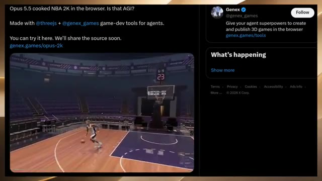
*Capture d'écran d'un tweet montrant un jeu de basket-ball 3D généré par IA dans un navigateur web avec le texte du post et un aperçu vidéo.*

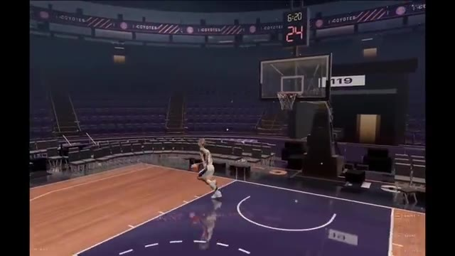
*Gros plan sur le jeu de basket-ball 3D interactif dans le navigateur avec un joueur sur un parquet de basket et un panneau d'affichage.*

---

### ⏱️ `[00:03:53 - 00:04:29]` | Segment #11

**🔊 Audio (Transcription Intégrale Mot pour Mot en Français) :**
> La partie impressionnante est que vous pouvez passer d'une idée comme « Construis-moi un jeu de basket » à un prototype 3D fonctionnel dans le navigateur. Et c'est une expérience très différente de simplement demander à l'IA de générer du code. Et si vous trouvez cela impressionnant, les choses deviennent encore plus ambitieuses. Car cet exemple suivant n'est pas juste un petit jeu par navigateur. C'est un environnement interactif tout entier. Dan Greenheck a partagé une expérience qu'il a créée en utilisant l'équivalent de 1 874,40 $ de jetons Opus 5.5. Et oui, vous avez bien entendu, près de 1 900 dollars. Ce qu'il a construit est essentiellement un jeu jouable

**👁️ Analyse Visuelle d'Écran (gemini-3.5-flash-lite) :**
**Interface & Outils** : Navigateur web affichant un jeu 3D interactif et un message sur les réseaux sociaux (X / Twitter).

**Contenu textuel & Code** : Texte du tweet de Dan Greenheck détaillant les détails de son projet avec Opus 5.5 ("Ever wonder what $1874.40 of Opus 5.5 tokens looks like?"), et affichage en jeu du score et des commandes.

**Action / Démonstration** : Démonstration visuelle de prototypes de jeux 3D interactifs générés par IA et présentation d'un tweet explicatif.

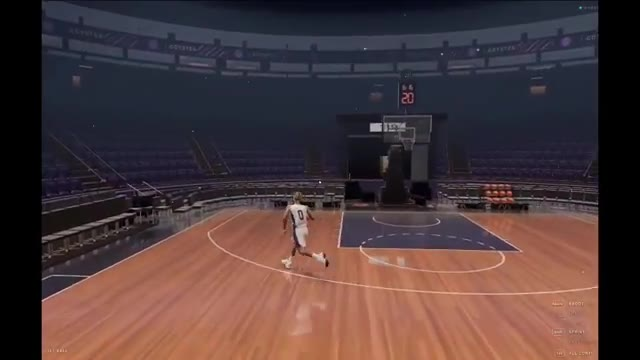
*Capture d'écran montrant un prototype de jeu de basket-ball 3D dans le navigateur avec un joueur sur le terrain.*

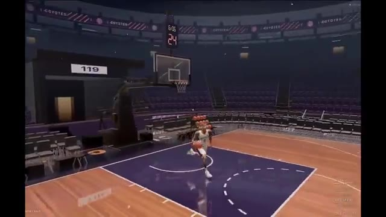
*Capture d'écran du jeu de basket-ball 3D montrant l'action en jeu dans une grande arène.*

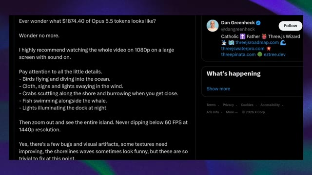
*Publication sur les réseaux sociaux (X / Twitter) de Dan Greenheck expliquant son projet d'environnement interactif réalisé avec Opus 5.5.*

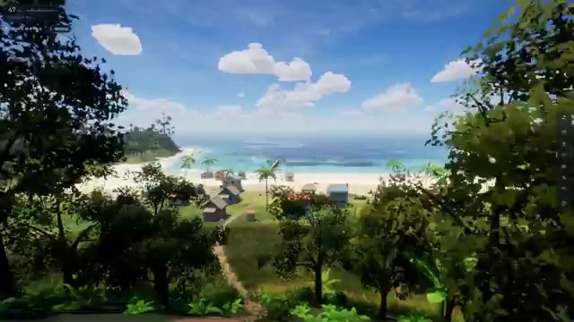
*Capture d'écran montrant l'environnement 3D interactif d'une île tropicale avec des palmiers et l'océan.*

---

### ⏱️ `[00:04:29 - 00:04:54]` | Segment #12

**🔊 Audio (Transcription Intégrale Mot pour Mot en Français) :**
> environnement d'île tropicale. Et ce n'est pas seulement une belle capture d'écran. Vous pouvez vous déplacer sur l'île, explorer la plage, marcher dans l'environnement, aller sur le ponton, voyager sur un bateau et même aller sous l'eau. Et c'est là que je pense que la démo devient vraiment impressionnante. Regardez le niveau de détail dans l'environnement. Vous avez des maisons, de la végétation, l'océan, des pontons, des bateaux, des changements d'éclairage et une transition complète du jour à la nuit.

**👁️ Analyse Visuelle d'Écran (gemini-3.5-flash-lite) :**
**Interface & Outils** : Environnement de simulation ou de jeu interactif en temps réel (affichage des performances avec compteur de FPS en haut à gauche et barre latérale d'outils à droite).

**Contenu textuel & Code** : Interface utilisateur affichant des indicateurs techniques discrets (FPS, état de marche/exploration) et des menus contextuels sur le bord droit de l'écran.

**Action / Démonstration** : Navigation et déplacement en vue subjective ou libre à travers un environnement virtuel 3D photoréaliste représentant une île tropicale.

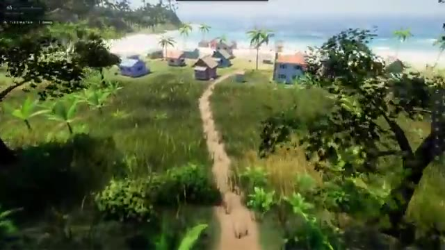
*Vue aérienne en plongée d'un village tropical côtier avec des maisons colorées et un chemin de terre à travers la végétation.*

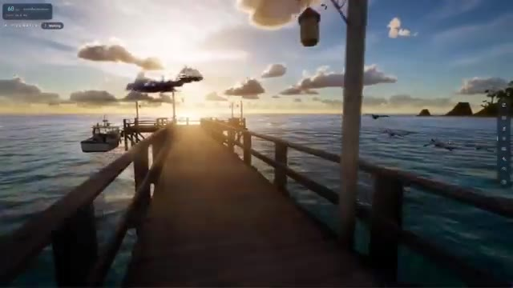
*Vue le long d'un ponton en bois au coucher du soleil, avec la mer, des nuages dorés et un bateau amarré à gauche.*

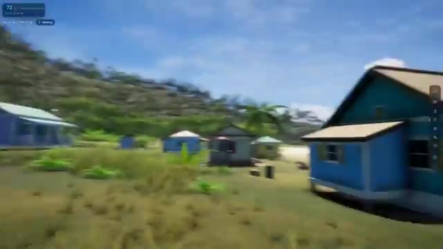
*Vue à hauteur d'homme se déplaçant près de maisons bleues et de cabanes dans un décor tropical.*

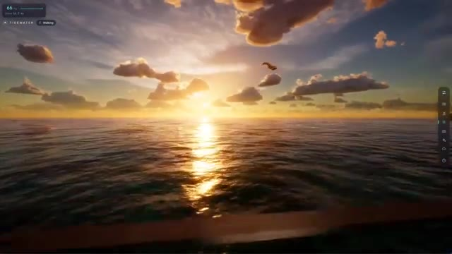
*Vue panoramique de l'océan scintillant au coucher du soleil avec un ciel nuageux et chaleureux.*

---

### ⏱️ `[00:04:54 - 00:05:13]` | Segment #13

**🔊 Audio (Transcription Intégrale Mot pour Mot en Français) :**
> La nuit, l'environnement change radicalement, avec des lumières qui illuminent le quai et les environs. Et ensuite, vous pouvez remonter sur le bateau et explorer l'océan depuis une perspective complètement différente. Il y a même une section sous-marine où vous pouvez voir la baleine et la vie marine sous la surface. C'est un grand nombre de systèmes différents qui sont rassemblés en une seule expérience interactive.

**👁️ Analyse Visuelle d'Écran (gemini-3.5-flash-lite) :**
**Interface & Outils** : Application interactive 3D nommée "Tidewater" avec compteur de performances (FPS) et outils de navigation.

**Contenu textuel & Code** : Texte "TIDEWATER", indicateur de mode ("Walking", "Diving"), indicateur de profondeur ("3.7 m"), et commandes de gameplay contextuelles.

**Action / Démonstration** : Exploration interactive de l'environnement virtuel marin, passant de la surface au coucher du soleil à une scène nocturne sur le bateau, puis à une immersion sous-marine.

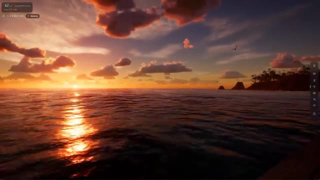
*Vue panoramique de l'océan au coucher du soleil avec un ciel nuageux et orangé dans l'expérience interactive Tidewater.*

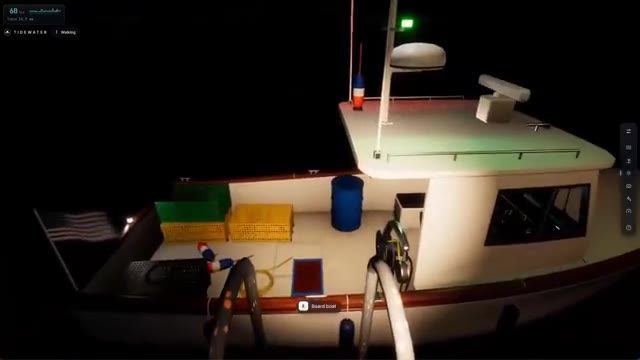
*Vue nocturne depuis le bateau illuminé avec une invite interactive "Board boat" visible à l'écran.*

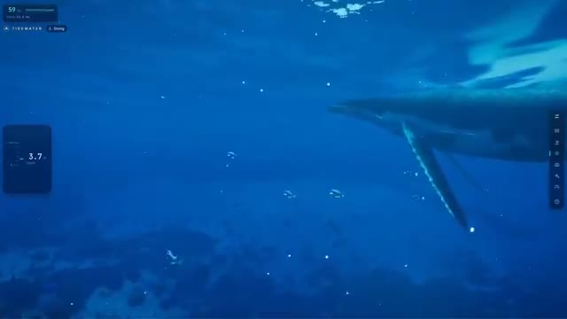
*Vue sous-marine de l'océan montrant une baleine et des petits poissons dans l'application Tidewater.*

---

### ⏱️ `[00:05:13 - 00:05:34]` | Segment #14

**🔊 Audio (Transcription Intégrale Mot pour Mot en Français) :**
> Mais il y a quelques réserves importantes. Le créateur lui-même dit que le projet a encore des bugs et des artefacts visuels, que certaines textures doivent être améliorées et que les vagues du rivage peuvent paraître étranges par endroits, et l'on peut effectivement voir certaines de ces imperfections dans la séquence. Donc non, ce n'est pas un jeu en monde ouvert commercialement poli. Et je ne pense pas que ce soit la bonne comparaison.

**👁️ Analyse Visuelle d'Écran (gemini-3.5-flash-lite) :**
**Interface & Outils** : Lecteur vidéo interactif de démonstration 3D (avec compteur de FPS et outils de navigation) et interface du réseau social X (Twitter).

**Contenu textuel & Code** : Texte du tweet de Dan Greenheck : "Ever wonder what $1874.40 of Opus 5.5 tokens looks like? Wonder no more. I highly recommend watching the whole video on 1080p on a large screen with sound on..." ainsi que des liens vers threejsroadmap.com, threejswaterpro.com, threepinata.com, eztree.dev.

**Action / Démonstration** : Affichage d'une scène sous-marine générée, puis passage à un tweet explicatif sur les coûts et détails techniques, et enfin affichage d'un paysage marin au coucher du soleil.

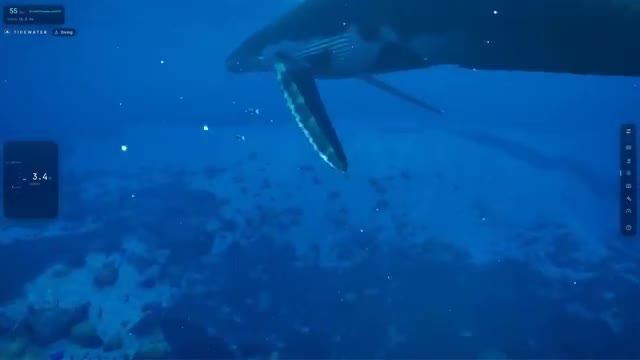
*Extrait vidéo montrant une scène sous-marine avec une baleine et des particules flottantes dans l'eau.*

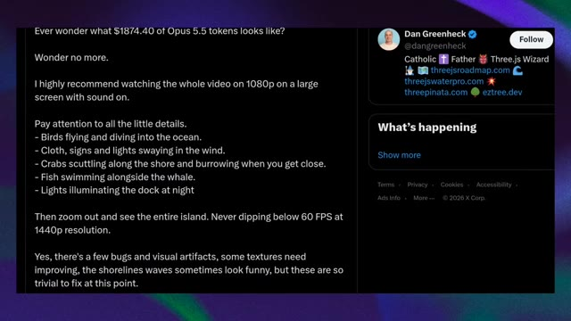
*Publication sur Twitter/X de Dan Greenheck détaillant le projet créé avec des tokens Opus 5.5.*

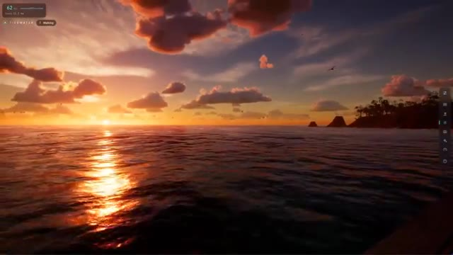
*Extrait vidéo montrant un coucher de soleil pittoresque sur l'océan avec des nuages dorés et des vagues.*

---

### ⏱️ `[00:05:34 - 00:05:59]` | Segment #15

**🔊 Audio (Transcription Intégrale Mot pour Mot en Français) :**
> La partie la plus intéressante est la façon dont cela a été créé. Selon Dan, le processus a impliqué environ 2 heures et 7 minutes de temps d'API en utilisant plusieurs sous-agents, ce qui s'est traduit par approximativement 8 heures en temps réel. Et il y a un autre détail qui a vraiment attiré mon attention. Il dit qu'il y a eu très peu de direction technique impliquée. Selon lui, la plupart de ses prompts étaient essentiellement des choses comme : ajoute x et y, ou ça a l'air bizarre, améliore-le.

**👁️ Analyse Visuelle d'Écran (gemini-3.5-flash-lite) :**
**Interface & Outils** : Interface utilisateur de l'application ou du simulateur 'Tidewater' ainsi qu'un post sur les réseaux sociaux (type X/Twitter).

**Contenu textuel & Code** : Texte du tweet : "FYI I'm on the $200 subscription plan. This used 59% of my weekly usage and took 2h 7m of API time using multiple subagents, about 8h in real-time. There was extremely little technical direction here. 99% of my prompts were 'Add X and Y' or 'This looks weird, make it better'." En haut à gauche des images 1 et 3, le panneau de contrôle 'Tidewater' indique des métriques de performance et d'état (ex: '63 fps', 'TIDEWATER | Walking', 'Diving').

**Action / Démonstration** : Présentation visuelle de scènes générées par IA (coucher de soleil sur l'océan, ciel nuageux, exploration sous-marine avec une baleine) accompagnée de la publication textuelle décrivant la méthodologie de prompt et le temps de calcul.

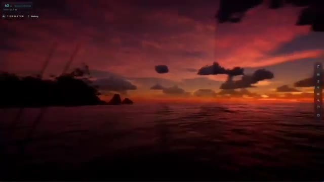
*Capture d'écran vidéo montrant un paysage marin crépusculaire avec des nuages dans le ciel et l'interface 'Tidewater' dans le coin supérieur gauche.*

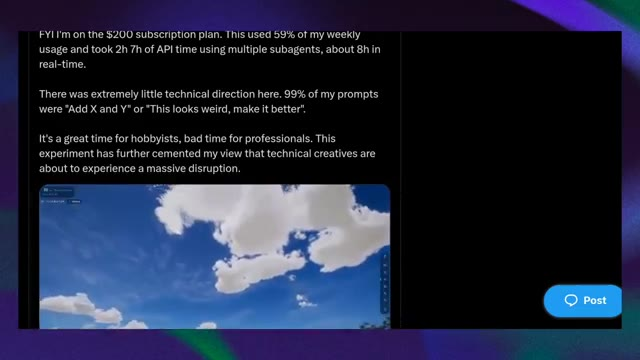
*Capture d'écran d'un tweet textuel détaillant le processus de création avec un sous-affichage vidéo de nuages.*

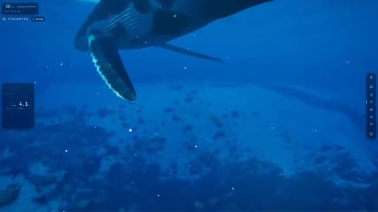
*Capture d'écran vidéo montrant une scène sous-marine avec une baleine et des poissons, avec les indicateurs de l'application 'Tidewater' à l'écran.*

---

### ⏱️ `[00:05:59 - 00:06:26]` | Segment #16

**🔊 Audio (Transcription Intégrale Mot pour Mot en Français) :**
> Donc l'humain ne spécifiait pas manuellement chaque morceau de code ou chaque implémentation technique. L'IA gérait une énorme quantité de la construction et de l'itération. Maintenant, je ne ferais pas dire à cela qu'on peut donner à Opus 5.5 une seule phrase et obtenir instantanément un jeu AAA terminé. Ce n'est clairement pas ce qui s'est passé. Il y a eu une puissance de calcul importante, de multiples sous-agents, des heures d'itération et près de 1 900 dollars d'utilisation de jetons derrière ce résultat.

**👁️ Analyse Visuelle d'Écran (gemini-3.5-flash-lite) :**
**Interface & Outils** : Moteur de jeu / environnement de simulation 3D avec des menus de débogage et des outils de navigation (Tidewater, mode Walk/Free camera, FPS, indicateurs de profondeur).

**Contenu textuel & Code** : Textes et indicateurs visibles à l'écran : "62 FPS", "TIDEWATER", "Diving" / "Walk" / "Free camera", barres d'outils verticales avec icônes de paramétrage sur le bord droit.

**Action / Démonstration** : Navigation et exploration interactive au sein d'un environnement virtuel généré en 3D, illustrant le résultat d'un monde virtuel/jeu vidéo en cours de test ou de rendu.

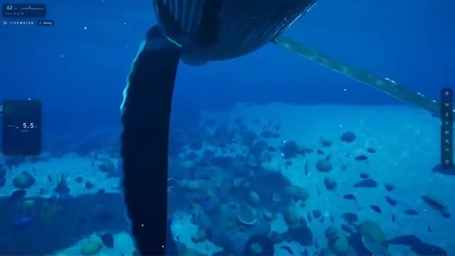
*Vue sous-marine montrant une baleine et des fonds marins avec des interfaces de développement ou de moteur de jeu sur les côtés.*

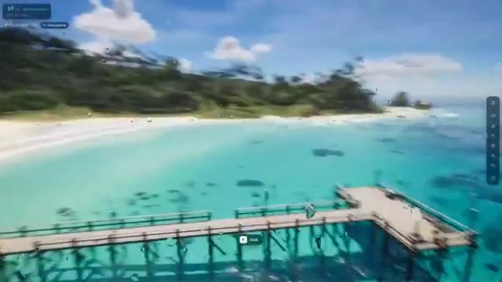
*Vue aérienne au-dessus d'une plage tropicale et d'une jetée avec des indicateurs de performance et de mode de déplacement ("Walk").*

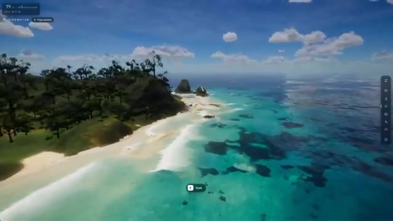
*Vue panoramique en plongée d'une île tropicale verdoyante avec l'océan turquoise et des options de caméra.*

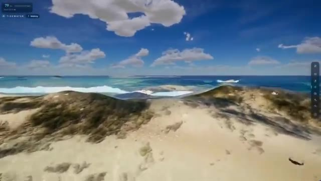
*Vue en hauteur d'un paysage côtier avec des dunes de sable, l'océan et le ciel nuageux.*

---

### ⏱️ `[00:06:26 - 00:06:59]` | Segment #17

**🔊 Audio (Transcription Intégrale Mot pour Mot en Français) :**
> Mais même avec ces réserves, le résultat est assez remarquable. Parce qu'on va au-delà de la simple génération de code par l'IA. On commence à voir l'IA générer quelque chose dans lequel on peut réellement se promener et interagir. Et cela nous amène à une autre capacité que j'ai trouvée particulièrement intéressante. Ce prochain exemple est une démonstration de croquis vers simulation. Le créateur commence avec ce qui est fondamentalement un dessin à la main d'une petite catapult, d'un projectile, et d'une pile de blocs. Et puis Opus 5.5 transforme ce croquis en une véritable simulation 3D interactive. On peut voir le dessin brut

**👁️ Analyse Visuelle d'Écran (gemini-3.5-flash-lite) :**
**Interface & Outils** : Interface de démonstration de simulation interactive 3D ("Tidewater") et interface de conversion "Sketch to Physics".

**Contenu textuel & Code** : Texte visible : "64 fps", "TIDECATER", "Free camera", encadré en bas "Sketch to Physics", titre "Paper Trebuchet", description "A pencil sketch, measured, built and thrown.", boutons "Play the tour" et "Build it yourself", annotations "ball", "cup", "weight".

**Action / Démonstration** : Le curseur clique sur le bouton "Build it yourself" de l'interface de conversion d'un croquis dessiné à la main en simulation physique 3D.

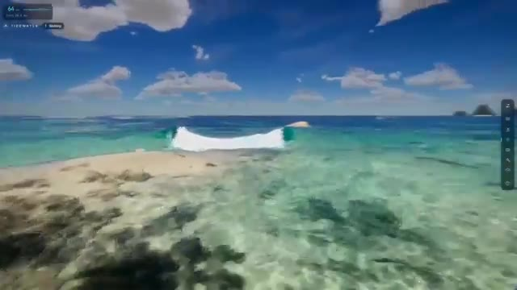
*Vue en 3D interactive d'un paysage côtier tropical avec de l'eau turquoise et des vagues.*

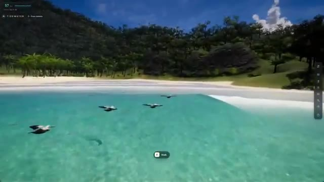
*Vue aérienne de la côte avec des oiseaux survolant l'eau transparente et un bouton 'Walk' affiché en bas.*

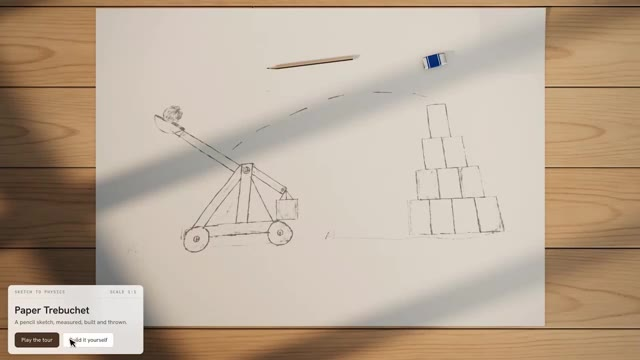
*Croquis sur papier d'une catapulte et d'une pile de blocs avec une interface 'Sketch to Physics' et le titre 'Paper Trebuchet'.*

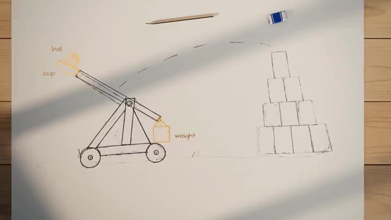
*Gros plan du croquis sur papier montrant des annotations orange ('ball', 'cup', 'weight') et une trajectoire en pointillés.*

---

### ⏱️ `[00:06:59 - 00:07:31]` | Segment #18

**🔊 Audio (Transcription Intégrale Mot pour Mot en Français) :**
> transformé en un modèle 3D adéquat avec la catapulte, les roues, le projectile et les blocs tous représentés dans la scène. Mais la partie vraiment intéressante vient ensuite. Il ne s'agit pas seulement d'une reconstruction 3D du dessin. La catapulte se comporte réellement comme un système physique. Vous pouvez modifier des paramètres, voir la trajectoire du projectile, puis réellement le lancer. Et quand le projectile touche les blocs, ils réagissent et s'effondrent. On peut même voir des mesures s'afficher pendant la simulation, incluant des éléments comme la masse et la vitesse du projectile. Ainsi, ce qui a commencé comme un simple croquis a

**👁️ Analyse Visuelle d'Écran (gemini-3.5-flash-lite) :**
**Interface & Outils** : Interface de simulation physique interactive 3D avec affichage de données en surimpression (HUD) et commandes de ralenti.

**Contenu textuel & Code** : Texte et annotations sur les croquis (cotes en mm), affichage de la masse (0,68 kg), de la vitesse (2,35 m/s) et indicateur de vitesse (0,25x).

**Action / Démonstration** : Transition d'un dessin 2D vers une simulation physique interactive 3D où un projectile est lancé d'une catapulte pour percuter une pile de blocs.

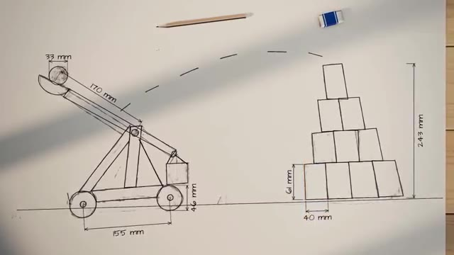
*Croquis 2D annoté sur papier représentant une catapulte face à une pile de blocs avec des dimensions en millimètres.*

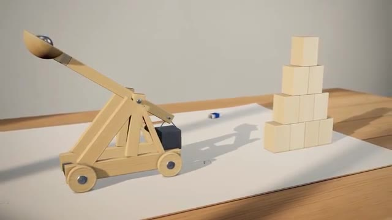
*Modèle 3D en bois texturé généré à partir du croquis, affichant la catapulte et la pile de blocs sur une table.*

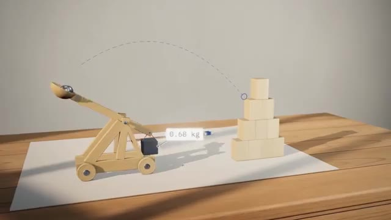
*Simulation physique de la catapulte montrant la trajectoire pointillée et l'affichage de la masse de 0,68 kg.*

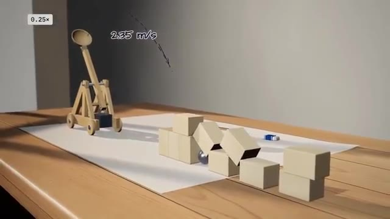
*Simulation au ralenti (0,25x) montrant le lancement du projectile à 2,35 m/s et l'impact qui fait s'effondrer les blocs.*

---

### ⏱️ `[00:07:31 - 00:07:52]` | Segment #19

**🔊 Audio (Transcription Intégrale Mot pour Mot en Français) :**
> devient effectivement une expérience de physique interactive. Et je pense que c'est le point important ici. Ce qui est impressionnant, ce n'est pas simplement qu'Opus 5.5 a créé une jolie scène 3D. Il a pris un concept visuel, l'a converti en un environnement structuré, et a ensuite ajouté un comportement et une simulation par-dessus. C'est un saut beaucoup plus important que de simplement générer une image à partir d'un croquis.

**👁️ Analyse Visuelle d'Écran (gemini-3.5-flash-lite) :**
**Interface & Outils** : Interface utilisateur web interactive avec un panneau de contrôle latéral droit intitulé "Build it yourself!".

**Contenu textuel & Code** : Texte "Build it yourself!", curseur de vitesse (SPEED), d'angle (ANGLE), de portée (RANGE), bouton "Fire", options "Slow motion" et "Flight path", curseur de poids (WEIGHT), curseur "SKETCH - MODEL", boutons de vue "Hero", "Side", "Top", "Reset", "Replay tour", et instruction en bas "Drag the cup back and let go".

**Action / Démonstration** : Présentation d'un environnement 3D interactif avec une catapulte en bois prête à tirer sur une pile de cubes en bois posée sur une table.

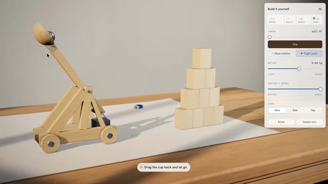
*Interface de simulation interactive montrant une catapulte en bois et une pile de blocs avec un panneau de contrôle à droite.*

---

### ⏱️ `[00:07:53 - 00:08:16]` | Segment #20

**🔊 Audio (Transcription Intégrale Mot pour Mot en Français) :**
> Maintenant, je ne prétends pas qu'il s'agit d'un moteur physique parfait rien qu'à partir de cette démo. Nous n'avons pas assez d'informations pour vérifier à quel point chaque calcul physique correspond à une catapulte réelle, mais nous n'avons pas besoin de faire cette affirmation pour apprécier ce qui se passe. Et honnêtement, c'est le genre de génération par IA que je trouve bien plus intéressant que de simplement fabriquer une autre jolie page web. Mais Opus 5.5 ne fait pas seulement de petites simulations.

**👁️ Analyse Visuelle d'Écran (gemini-3.5-flash-lite) :**
**Interface & Outils** : Application ou interface web de simulation physique 3D « Build it yourself » avec panneau de contrôle latéral, combinée à une interface de type lecteur vidéo et affichage de publications sur les réseaux sociaux (Twitter/X).

**Contenu textuel & Code** : Panneau de contrôle visible avec les métriques : vitesse (2.06 m/s), angle (32°), portée (527 mm), bouton « Fire », options « Slow motion » et « Flight path », curseur de poids (« Weight » de Light à Heavy), curseur « Sketch - Model », et choix de la vue (« Hero », « Side », « Top »). Texte en haut à gauche : « sketch-to-simulation with Opus 5.5 ».

**Action / Démonstration** : Démonstration interactive d'une simulation physique générée par IA où une catapulte virtuelle projette un projectile vers des blocs en bois, convertissant un croquis d'abord dessiné sur papier en un modèle 3D animé.

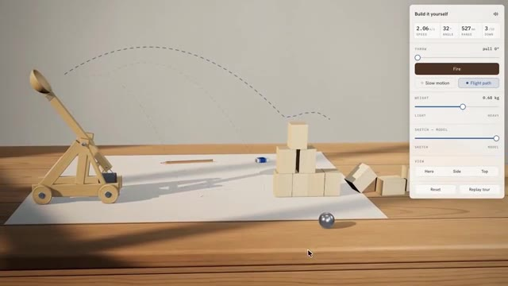
*Interface de simulation physique interactive montrant une catapulte en 3D tirant une sphère métallique vers des blocs de bois, avec un panneau de contrôle à droite.*

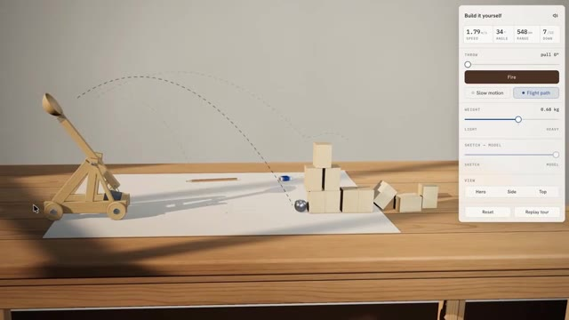
*Suite de la simulation montrant l'impact de la sphère métallique sur les blocs de bois, faisant s'effondrer la structure.*

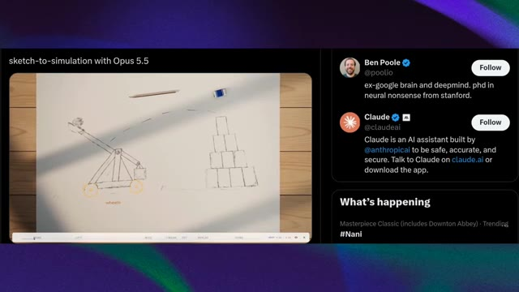
*Capture d'écran divisée montrant à gauche un croquis dessiné sur papier d'une catapulte (« sketch-to-simulation with Opus 5.5 ») et à droite un fil d'actualité Twitter / X avec le profil de Ben Poole et le compte officiel de Claude.*

---

### ⏱️ `[00:08:16 - 00:08:49]` | Segment #21

**🔊 Audio (Transcription Intégrale Mot pour Mot en Français) :**
> Cela peut aussi devenir beaucoup plus grand. Le suivant est peut-être la démo de jeu la plus impressionnante visuellement de toute cette liste. Le créateur affirme qu'il s'agit d'une section de 3 minutes d'un jeu Three.js réalisé avec Opus 5.5 medium, et selon la publication, chaque modèle 3D, texture et animation a été créé à partir de zéro, et l'on comprend immédiatement ce qu'ils visaient. C'est essentiellement un jeu de balancement sur toile de type Spider-Man se déroulant dans une grande ville en 3D. Vous pouvez courir sur les toits, sauter entre les bâtiments, vous balancer dans les rues, grimper sur des immeubles en verre et vous déplacer dans la ville à partir de

**👁️ Analyse Visuelle d'Écran (gemini-3.5-flash-lite) :**
**Interface & Outils** : Navigateur web affichant un fil d'actualité Twitter/X et des extraits vidéo de gameplay en 3D généré par IA.

**Contenu textuel & Code** : Texte de publication : "Here's 3 mins of a Three.js game I have been making with Opus 5.5 Medium. Every 3D model, texture, and animation is made from scratch." Mention de l'outil Opus 5.5 medium et de Three.js.

**Action / Démonstration** : Le présentateur fait défiler des publications sur les réseaux sociaux présentant des démonstrations techniques de jeux 3D interactifs générés par IA, illustrant le gameplay de type Spider-Man en milieu urbain.

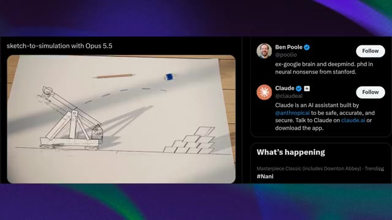
*Capture d'une publication montrant un croquis de catapulte animé avec la mention "sketch-to-simulation with Opus 5.5"*

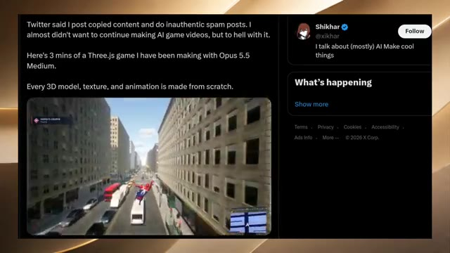
*Publication X (Twitter) montrant une vidéo d'un jeu de type Spider-Man en 3D dans une rue urbaine avec du texte explicatif*

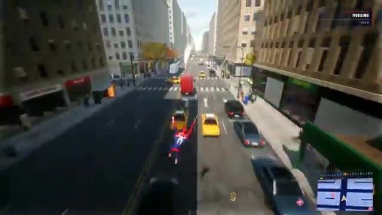
*Vue en plein écran du jeu 3D montrant un personnage ressemblant à Spider-Man se balançant au milieu de la circulation urbaine*

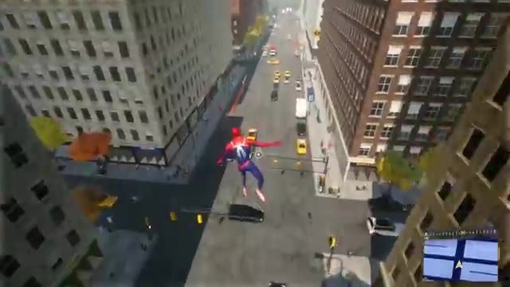
*Vue aérienne du jeu montrant le personnage planant au-dessus d'une grande rue bordée d'immeubles avec une mini-carte en bas à droite*

---

### ⏱️ `[00:08:49 - 00:09:22]` | Segment #22

**🔊 Audio (Transcription Intégrale Mot pour Mot en Français) :**
> différentes hauteurs. Et ce qui me frappe vraiment, c'est la cohérence de l'environnement. Nous ne regardons pas seulement une scène isolée. La même ville continue tout au long du jeu avec des bâtiments, des routes, de la circulation, des arbres, des piétons, des lampadaires, des toits et une ligne d'horizon au loin. Il y a aussi une véritable interface de jeu, une minimap, des objectifs, des mouvements interactifs plutôt qu'il ne s'agit simplement d'une animation rendue. Et le balancement sur toile est probablement la partie la plus cool. On peut voir le personnage attaché aux bâtiments, se balancer autour des coins, gagner en élan,

**👁️ Analyse Visuelle d'Écran (gemini-3.5-flash-lite) :**
**Interface & Outils** : Interface de jeu vidéo (HUD) montrant une minimap en bas à droite, une boussole, des objectifs et des alertes de mission ("Crime in Progress", "Car Chase") dans un jeu de type monde ouvert.

**Contenu textuel & Code** : Éléments de HUD de jeu vidéo : minimap, boussole, indicateur d'objectifs, alertes textuelles de missions ("Crime in Progress", "Car Chase").

**Action / Démonstration** : Le personnage de Spiderman se déplace à travers la ville : escalade de façade, course sur les toits et balancement urbain entre les gratte-ciels.

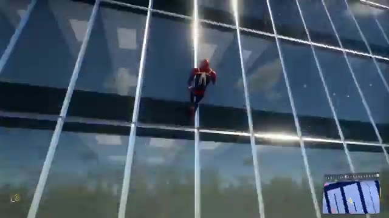
*Spiderman escaladant une façade vitrée avec une minimap visible en bas à droite.*

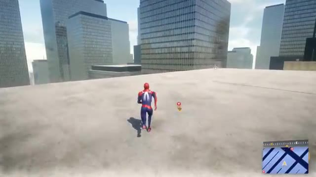
*Spiderman courant sur le toit d'un immeuble au milieu d'un paysage urbain avec une minimap en bas à droite.*

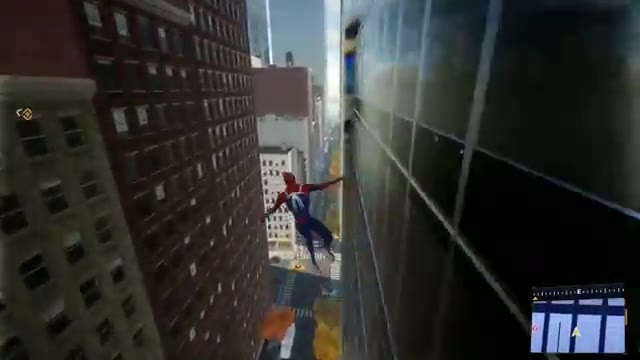
*Spiderman se balançant entre deux grands immeubles urbains.*

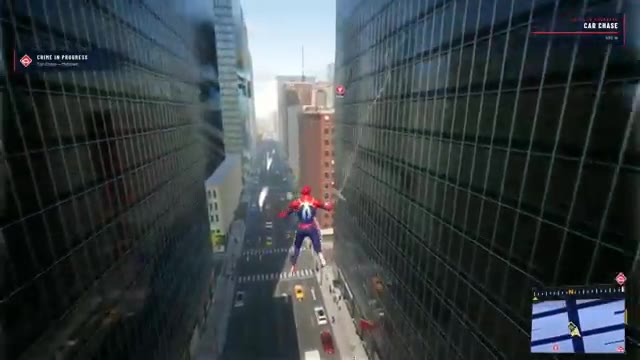
*Spiderman se balançant dans une rue encaissée entre des gratte-ciels avec des indications de mission en haut à gauche et une minimap.*

---

### ⏱️ `[00:09:22 - 00:09:48]` | Segment #23

**🔊 Audio (Transcription Intégrale Mot pour Mot en Français) :**
> relâcher la toile, et se déplacer entre différents bâtiments. Maintenant, ce n'est clairement pas Spider-Man 2. L'animation est beaucoup plus simple, la géométrie de la ville est assez répétitive, et certains mouvements de personnages et la physique ne sont pas au niveau d'un jeu développé professionnellement. Mais ce n'est pas vraiment ce qui rend cette démo intéressante. La partie impressionnante est que le créateur affirme que les modèles, les textures et les animations ont tous été générés à partir de zéro, et que l'ensemble tourne comme un jeu de navigateur 3.js.

**👁️ Analyse Visuelle d'Écran (gemini-3.5-flash-lite) :**
**Interface & Outils** : Jeu web 3.js affichant une interface inspirée de Spider-Man, avec mini-carte en bas à droite et indicateurs de mission en haut à droite et à gauche ("CAR CHASE", "FINANCIAL DISTRICT", "MUDGING").

**Contenu textuel & Code** : Éléments d'interface de jeu vidéo : mini-carte de navigation, indicateurs de quête textuels rouges en haut ("CAR CHASE", "MUDGING"), boussole et repères visuels sur les immeubles.

**Action / Démonstration** : Le personnage de Spider-Man se balance dynamiquement entre les gratte-ciels d'une ville générée en 3D dans le navigateur web.

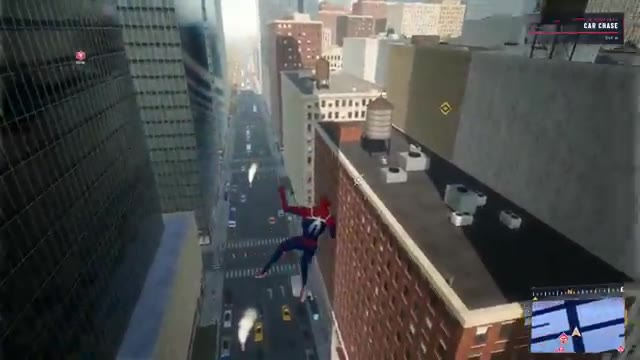
*Vue aérienne en plongée montrant Spider-Man en train de se balancer entre les immeubles dans une démo de jeu 3.js.*

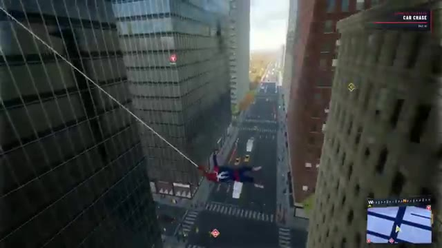
*Vue de profil de Spider-Man lançant sa toile et se déplaçant le long d'une avenue urbaine.*

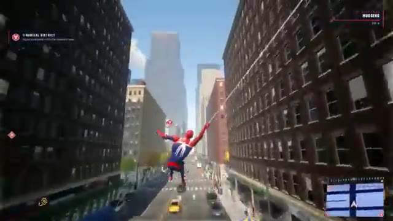
*Vue de dos de Spider-Man se balançant au-dessus d'une rue du Financial District avec une mini-carte en bas à droite.*

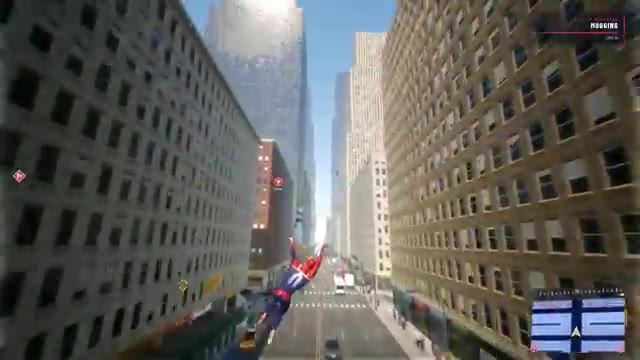
*Vue en contre-plongée de Spider-Man naviguant rapidement entre de grands bâtiments générés par IA.*

---

### ⏱️ `[00:09:48 - 00:10:10]` | Segment #24

**🔊 Audio (Transcription Intégrale Mot pour Mot en Français) :**
> Donc nous examinons des actifs 3D générés par l'IA, de l'animation, de la logique de jeu, de l'environnement et de l'interaction, le tout combiné en une seule expérience jouable. Et c'est une nette progression par rapport au fait de demander à une IA de générer une simple page web ou un petit jeu en JavaScript. Il y a évidemment des limites. Vous pouvez voir une certaine répétition visuelle et des PNJ ainsi que des environnements relativement basiques.

**👁️ Analyse Visuelle d'Écran (gemini-3.5-flash-lite) :**
**Interface & Outils** : Interface de jeu vidéo affichant une mini-carte en bas à droite, des indicateurs de mission sur les côtés et des éléments graphiques 3D en temps réel.

**Contenu textuel & Code** : Environnement urbain 3D avec des gratte-ciels texturés, un personnage de type super-héros, une mini-carte avec un curseur de direction et une mention de quête "MUGGING" en haut à droite.

**Action / Démonstration** : Le personnage évolue en 3D dans un environnement interactif généré par IA, en chute libre puis en se balançant entre les immeubles avant d'atterrir sur un toit.

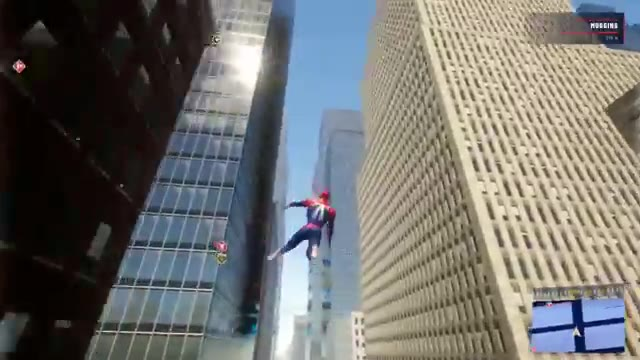
*Un personnage ressemblant à Spider-Man en train de chuter ou de voler entre des gratte-ciels dans un environnement urbain 3D généré par IA, avec une mini-carte en bas à droite et une interface de jeu vidéo.*

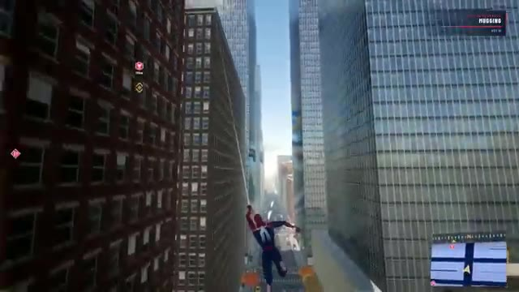
*Le même personnage en train de se balancer entre les immeubles de la ville grâce à une toile tirée vers un bâtiment, illustrant l'interaction et la logique de jeu.*

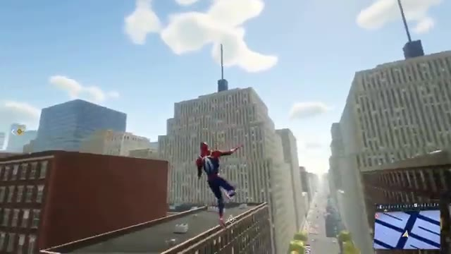
*Le personnage atterrissant sur le toit d'un immeuble au milieu d'un paysage urbain composé de bâtiments aux textures répétitives et d'un ciel nuageux.*

---

### ⏱️ `[00:10:10 - 00:10:30]` | Segment #25

**🔊 Audio (Transcription Intégrale Mot pour Mot en Français) :**
> Mais pour un flux de développement assisté par IA, c'est vraiment impressionnant. Parce que la question intéressante n'est pas seulement : est-ce que l'IA peut écrire du code ? Nous savons déjà qu'elle le peut. La question beaucoup plus importante est : pouvez-vous décrire le jeu que vous avez en tête, et faire en sorte que l'IA transforme cette idée en quelque chose que vous pouvez réellement jouer ? Et cette démo s'en approche de manière surprenante.

**👁️ Analyse Visuelle d'Écran (gemini-3.5-flash-lite) :**
**Interface & Outils** : Moteur de jeu / prototype vidéo montrant une interface de jeu avec mini-carte en bas à droite et indicateurs de zone.

**Contenu textuel & Code** : Environnement urbain 3D généré, personnage de type super-héros en mouvement, mini-carte de navigation et interface de jeu.

**Action / Démonstration** : Le personnage se déplace, court et se balance à l'aide de fils entre les bâtiments dans un environnement de jeu vidéo simulant une grande ville.

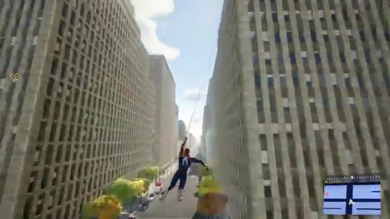
*Séquence de gameplay montrant un personnage ressemblant à Spider-Man se balançant entre des gratte-ciels dans une rue urbaine.*

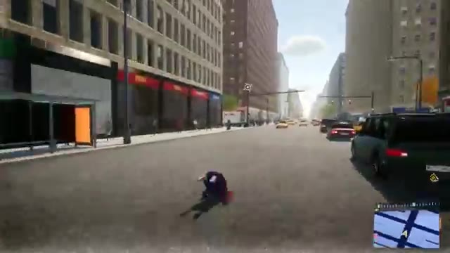
*Séquence de gameplay montrant le personnage au niveau du sol dans une rue animée avec des bâtiments et des véhicules.*

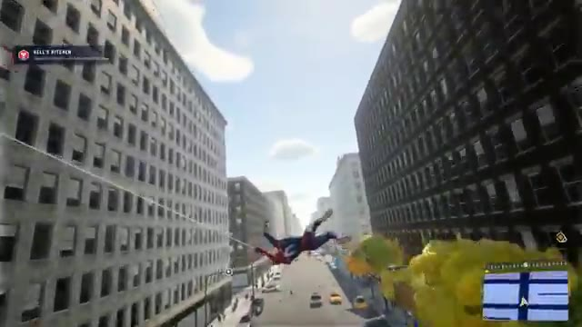
*Séquence de gameplay montrant le personnage en train de se balancer en l'air au-dessus d'une rue bordée d'arbres et d'immeubles.*

---

### ⏱️ `[00:10:30 - 00:10:50]` | Segment #26

**🔊 Audio (Transcription Intégrale Mot pour Mot en Français) :**
> Et honnêtement, ces exemples ne font qu'effleurer la surface de ce dont Opus 5.5 est capable. Des simulations interactives et jeux par navigateur aux mondes 3D entiers, ce qui ressort, c'est que nous ne demandons plus seulement à l'IA d'écrire du code. Nous lui demandons de prendre une idée et de la transformer en quelque chose que nous pouvons réellement voir, utiliser et avec lequel interagir.

**👁️ Analyse Visuelle d'Écran (gemini-3.5-flash-lite) :**
**Interface & Outils** : Navigateur web avec barre d'adresse affichant une URL locale (`http://localhost:5199`) et un en-tête minimaliste portant la mention "FERRUM".

**Contenu textuel & Code** : Un environnement 3D en temps réel représentant un désert sablonneux avec des rochers. Au centre, un véhicule gris aux lignes anguleuses est en mouvement. En bas de l'écran, on aperçoit un compteur (0) à gauche, et des boutons de contrôle "VEHICLE" et "ROBOT" au centre.

**Action / Démonstration** : Le véhicule 3D se déplace et navigue interactivement à l'intérieur de la simulation générée par l'intelligence artificielle dans le navigateur.

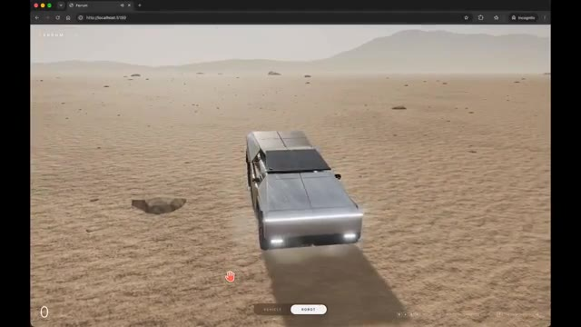
*Interface d'un navigateur web affichant une simulation 3D interactive d'un véhicule futuriste (type Cybertruck) évoluant dans un paysage désertique sur un serveur local.*

---

### ⏱️ `[00:10:50 - 00:11:08]` | Segment #27

**🔊 Audio (Transcription Intégrale Mot pour Mot en Français) :**
> Il y a encore des limitations, des bugs, et beaucoup de marge d'amélioration. Et certaines de ces démos ont nécessité des heures de calcul, de multiples agents, des outils de support, et des coûts de jetons importants. Nous ne sommes donc clairement pas au point où l'on peut décrire le prochain GTA et voir un jeu parfait apparaître cinq minutes plus tard. Mais la direction est assez claire.

**👁️ Analyse Visuelle d'Écran (gemini-3.5-flash-lite) :**
**Interface & Outils** : Navigateur web affichant une application web interactive locale (URL localhost:5199) et interface d'une application de visualisation 3D interactive (nommée "The Colossal Flower") avec des menus de contrôle de l'environnement ("Dawn", "Day", "Golden Hour", "Mist / Rain", "Night Glow") et de la fleur ("Closed", "Blooming", "Fully Open", "Cutaway", "Exploded").

**Contenu textuel & Code** : URL "http://localhost:5199", interface avec les options de contrôle de caméra (Hero, Low Angle, Petal, Bloom Core, Base, Aerial, Golden, Night, Cutaway), le statut "NIGHT GLOW - CLOSED" puis "NIGHT GLOW - BLOOMING 35%".

**Action / Démonstration** : Navigation et interaction sur des démos 3D générées ou contrôlées en temps réel, montrant d'abord un véhicule dans un désert, puis la manipulation de l'état d'une fleur lumineuse géante en 3D (passage de fermé à en cours de floraison).

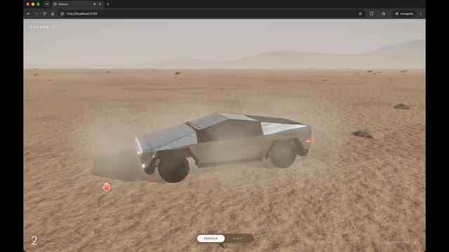
*Capture d'écran montrant l'interface d'une application web interactive hébergée en local avec un véhicule simulant la conduite dans un environnement désertique.*

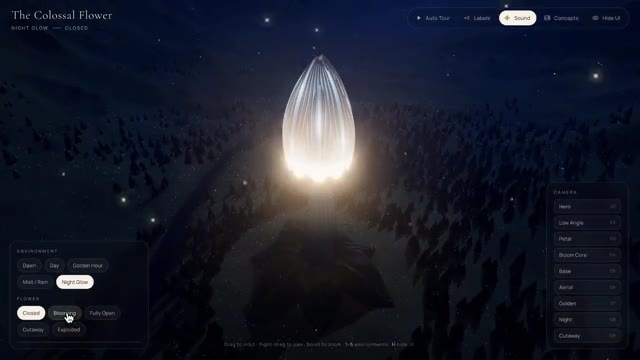
*Interface interactive de démonstration 3D intitulée "The Colossal Flower" avec des panneaux de contrôle pour l'environnement et l'état de la fleur.*

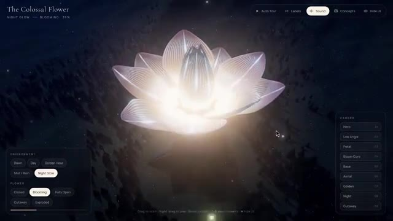
*Vue de l'application interactive montrant la fleur en train de s'ouvrir suite à une interaction de l'utilisateur.*

---

### ⏱️ `[00:11:08 - 00:11:28]` | Segment #28

**🔊 Audio (Transcription Intégrale Mot pour Mot en Français) :**
> Le code par IA va bien au-delà de la génération de fonctions individuelles et de fragments de code pour se diriger vers la création d'expériences interactives de plus en plus complètes. Et c'est précisément ce qui rend Opus 5.5 si intéressant. Si vous avez apprécié cette vidéo, n'oubliez pas de vous abonner à Pursuing AI pour découvrir d'autres expériences en IA, sorties de modèles et recherches. Merci d'avoir regardé et à bientôt dans la prochaine vidéo.

**👁️ Analyse Visuelle d'Écran (gemini-3.5-flash-lite) :**
**Interface & Outils** : Interface utilisateur web interactive d'une application de visualisation 3D ("The Colossal Flower") avec des menus latéraux de configuration (Environment, Flower, Camera) et des boutons de contrôle en haut à droite.

**Contenu textuel & Code** : En haut à gauche : "The Colossal Flower", "NIGHT GLOW — BLOOMING 55%". En haut à droite : "Auto Tour", "Labels", "Sound", "Concepts", "Hide UI". En bas à gauche, section ENVIRONMENT avec les options "Dawn", "Day", "Golden Hour", "Mist / Rain", "Night Glow", et section FLOWER avec "Closed", "Blooming", "Fully Open", "Cutaway", "Exploded". À droite, menu CAMERA avec "Hero", "Low Angle", "Petal", "Bloom Core", "Base", "Aerial", "Golden", "Night", "Cutaway". Au centre en bas : instructions "Drag to orbit · Right-drag to pan · Scroll to zoom · 1–5 environments · H Hide UI".

**Action / Démonstration** : Visualisation et démonstration d'une expérience interactive 3D générée ou construite avec l'aide de l'IA, montrant une fleur lumineuse rotative.

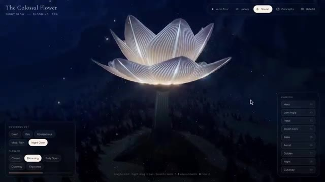
*Interface interactive d'une application web présentant une fleur géante lumineuse en 3D avec des panneaux de contrôle pour l'environnement, l'état de la fleur et les angles de caméra.*

---
