# 🎬 Space Bunny est bien plus puissant qu'on ne le pensait 🔥

> **Chaîne** : [Pursuing AI](https://www.youtube.com/@PursuingAi)  
> **Titre original** : `Space Bunny Is Way More Powerful Than We Thought 🔥`  
> **Lien YouTube** : [https://www.youtube.com/watch?v=gYkZlNqBO4o](https://www.youtube.com/watch?v=gYkZlNqBO4o)  
> **Date de publication** : 2026-09-28  
> **Durée** : 09m 41s (`581s`)  
> **Identifiant vidéo** : `gYkZlNqBO4o`  
> **Fiche Web Interactive** : [2026-09-28_YT-gYkZlNqBO4o_Space Bunny est bien plus puissant qu'on ne le pensait 🔥_by-whisper-v3-large-turbo+gemini-3.5-flash-lite.html](2026-09-28_YT-gYkZlNqBO4o_Space Bunny est bien plus puissant qu'on ne le pensait 🔥_by-whisper-v3-large-turbo+gemini-3.5-flash-lite.html)  
> **Captures de démonstration clés** : `68 captures réelles (anti-talking-head)`  
> **Modèles utilisés** : Audio: `large-v3-turbo` (Faster-Whisper int8 VPS) | Vision: `gemini-3.5-flash-lite` (Google AI Studio API)  

---

## 📌 Synthèse Exécutive & Outils

### 📌 Résumé
La vidéo de *Pursuing AI* lève le voile sur un modèle d'intelligence artificielle mystérieux et furtif nommé « Space Bunny », rapidement identifié par la communauté comme étant une création de Minimax. Apparu soudainement sur OpenRouter sans documentation officielle, ce modèle surprend par ses performances de pointe, se positionnant d'emblée comme un rival sérieux face à des poids lourds tels qu'Astra et Opus 5.5. Conçu pour générer des environnements complexes, interactifs et dynamiques (comme des étangs de carpes koï, des jardins japonais en voxel ou des scènes côtières animées), Space Bunny repousse les frontières de la génération procédurale et de la 3D assistée par IA à partir de simples instructions textuelles ou de combinaisons texte-image.

L'analyse des démonstrations partagées sur X met en lumière des workflows novateurs où les créateurs testent les limites des modèles dans des conditions variées. Par exemple, pour construire un jardin japonais en Three.js, Space Bunny a nécessité environ 45 minutes pour un rendu gratuit et très étendu, tandis qu'Astra a accompli une tâche similaire en 15 minutes pour un coût de 4,24 dollars. De même, en combinant des prompts textuels et des images de référence, Space Bunny s'est montré capable de synthétiser des micro-mondes animés cohérents — intégrant des trains en mouvement, des PNJ et des variations d'éclairage dynamiques — sans perdre sa direction artistique en pixel art ou en style voxel.

Pour les créateurs de vidéo et les concepteurs d'expériences interactives, ces avancées signalent un changement de paradigme majeur : la capacité à prototyper rapidement des environnements 3D immersifs et dynamiques directement depuis des interfaces d'IA. Toutefois, les analystes appellent à la prudence face aux démos virales. Entre les temps de génération plus longs, l'utilisation d'images de référence masquant une partie de la création de zéro, et l'absence de bancs d'essai standardisés, les créateurs doivent évaluer rigoureusement le compromis entre richesse visuelle, coût temporel et interactivité réelle avant d'intégrer ces outils émergents dans leurs pipelines de production professionnelle.

### 🛠️ Outils, Modèles & Logiciels Présentés
* **Space Bunny (Minimax M 3.1)** : Modèle d'IA furtif et non publié, découvert sur OpenRouter, spécialisé dans la génération d'environnements 3D détaillés et interactifs à partir de prompts textuels et d'images de référence.
* **Astra** : Modèle d'IA concurrent utilisé pour des benchmarks comparatifs de génération de scènes 3D (comme le jardin japonais en Three.js), reconnu pour sa rapidité d'exécution et son coût mesuré.
* **Grok 4.7** : Modèle d'IA employé dans des tests comparatifs pour évaluer le rendu visuel et la complexité d'environnements naturels stylisés (étangs de carpes koï).
* **OpenRouter** : Plateforme d'agrégation de modèles sur laquelle Space Bunny est initialement apparu de manière furtive avant d'être analysé par la communauté.
* **Three.js** : Librairie JavaScript utilisée pour le rendu et l'affichage d'éléments graphiques et 3D interactifs dans les tests de génération de code et de décors.

### 🔑 Points Clés & Enseignements Stratégiques
* **L'émergence des modèles furtifs** : Les fuites de modèles non publiés sur des plateformes comme OpenRouter (tel que Space Bunny par Minimax) constituent un indicateur avancé des capacités futures des IA avant leurs lancements officiels.
* **Supériorité sur le niveau de détail** : Space Bunny se distingue par sa capacité à privilégier la richesse environnementale globale, intégrant une multitude de micro-éléments (rochers, PNJ, vélos, panneaux) sans saturer visuellement la scène.
* **Gestion des entrées multimodales** : Le modèle exploite efficacement des combinaisons de prompts textuels et d'images de référence pour assimiler et restituer des directions visuelles complexes.
* **Le compromis temps/coût face au résultat** : Une génération gratuite (Space Bunny) peut s'avérer trois fois plus lente (45 minutes) qu'une solution payante optimisée (Astra en 15 minutes pour 4,24 $), un facteur critique pour les workflows de production.
* **Cohérence stylistique maintenue** : Qu'il s'agisse d'esthétiques en pixel art ou en style voxel, Space Bunny démontre une forte stabilité visuelle, évitant les mélanges de styles anarchiques au sein d'une même scène.
* **Dynamisme et animation contextuelle** : Au-delà des images fixes, le modèle insuffle de la vie dans ses environnements en animant des éléments mobiles (trains changeant de position, bateaux naviguant, personnages en mouvement).
* **Gestion avancée de l'éclairage dynamique** : Les tests (comme le scénario du pélican à vélo) prouvent la capacité de l'IA à faire basculer l'ensemble d'une scène — ciel, océan, route et ombres — d'un look diurne à un coucher de soleil chaleureux de manière cohérente.
* **Piège des démos virales et des "one-shots"** : Les publications sur X ne remplacent pas des bancs d'essai standardisés ; il est crucial de ne pas juger un outil uniquement sur son résultat final sans connaître le nombre d'itérations en coulisses.
* **Prototypage rapide d'environnements interactifs** : Ces technologies ouvrent la voie à la création instantanée de décors jouables ou de scènes de jeux vidéo miniatures à partir d'instructions simples.
* **Limitations géométriques persistantes** : Malgré des rendus impressionnants, des défis subsistent concernant la complexité géométrique pure et la robustesse de l'interactivité à grande échelle, rappelant que l'IA ne résout pas encore magiquement tout le développement 3D.

---

## ⏱️ Chronologie & Transcription Complète Audio & Visuelle (Mot pour Mot)

### ⏱️ `[00:00:00 - 00:00:20]` | Segment #01

**🔊 Audio (Transcription Intégrale Mot pour Mot en Français) :**
> Bon, c'est vraiment fou. Un modèle d'IA complètement mystérieux vient d'apparaître sur OpenRouter avec presque aucune information à son sujet. Il s'appelle Space Bunny, et c'était censé être un modèle furtif, sauf que la furtivité n'a pas duré très longtemps. Les gens ont commencé à creuser dans le code, et voilà, c'était Minimax.

**👁️ Analyse Visuelle d'Écran (gemini-3.5-flash-lite) :**
**Interface & Outils** : Navigateur web affichant une interface graphique animée (Postcard Radio) puis des publications sur le réseau social X (anciennement Twitter).

**Contenu textuel & Code** : Image 1 : "PELICAN ON TWO WHEELS", commandes de lecture et de vitesse. Image 2 : "Space Bunny (stealth model) is free for the next week", "- 1M Context", "- Multi-modal", "- Zero Data Retention". Image 3 : Tweet de @LuminaBench avec alerte rouge, mentionnant "The stealth model 'Space Bunny' is officially a MiniMax model", et un bloc de code JSON avec `"provider": "minimax-m3-a-official"`, `"model": "space-bunny"`.

**Action / Démonstration** : Présentation visuelle successive de l'animation, du tweet annonçant Space Bunny, puis du tweet d'analyse du code révélant l'origine MiniMax.

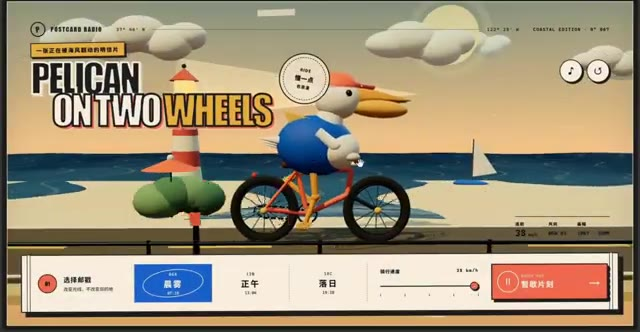
*Capture d'écran d'une interface web stylisée aux tons rétro intitulée "Pelican on Two Wheels" avec un personnage pélican sur un vélo.*

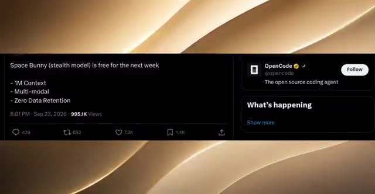
*Capture d'un tweet posté par OpenCode annonçant que "Space Bunny (stealth model) is free for the next week" avec ses spécifications.*

*Capture d'un tweet de Lumina (@LuminaBench) révélant que le modèle "Space Bunny" est officiellement un modèle MiniMax, avec un extrait de code JSON à l'appui.*

---

### ⏱️ `[00:00:20 - 00:00:41]` | Segment #02

**🔊 Audio (Transcription Intégrale Mot pour Mot en Français) :**
> Et ce n'est pas non plus un modèle expérimental aléatoire. Les premiers résultats montrent que Space Bunny rivalise avec des modèles comme Astra et Opus 5.5. Et aujourd'hui, j'ai quelques-uns des premiers résultats les plus fous de ce modèle avant sa sortie officielle. Alors prenez vos chips, installez-vous confortablement, car nous sommes sur le point de découvrir ce que ce modèle mystère peut réellement faire.

**👁️ Analyse Visuelle d'Écran (gemini-3.5-flash-lite) :**
**Interface & Outils** : Capture de post Twitter/X et comparatif visuel côte à côte de rendus graphiques comparant Space Bunny et Grok 4.7.

**Contenu textuel & Code** : Texte du tweet de Lumina mentionnant MiniMax et "space-bunny", et comparatif étiqueté Space Bunny (MiniMax M3.1) vs Grok 4.7.

**Action / Démonstration** : Présentation d'une publication sur les réseaux sociaux suivie d'une comparaison visuelle de performances entre modèles d'IA générative 3D.

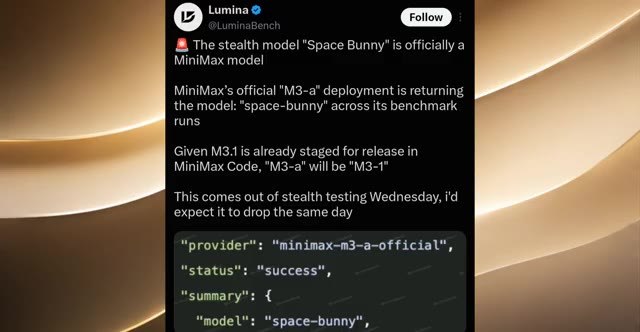
*Capture d'un tweet de Lumina (@LuminaBench) affirmant que le modèle mystère "Space Bunny" est officiellement un modèle MiniMax.*

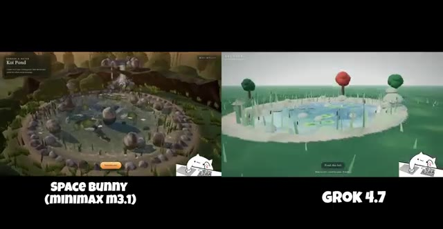
*Comparatif visuel côte à côte entre "Space Bunny (MiniMax M3.1)" et "Grok 4.7" montrant le rendu d'un environnement 3D de bassin à koi.*

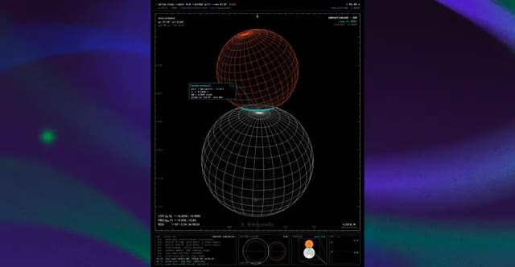
*Interface technique sombre affichant une simulation physique avec deux sphères en fil de fer et des données de calcul en surimpression.*

---

### ⏱️ `[00:00:41 - 00:01:00]` | Segment #03

**🔊 Audio (Transcription Intégrale Mot pour Mot en Français) :**
> C'est Pursuing AI, et vous regardez le rapport de recherche. D'accord, regardez ça maintenant. C'est l'une des comparaisons qui a commencé à attirer l'attention sur X. À gauche, nous avons Space Bunny, apparemment Minimax M 3.1, et à droite, Grok 4.7, et tous les deux travaillent sur le même concept d'étang à carpes koï.

**👁️ Analyse Visuelle d'Écran (gemini-3.5-flash-lite) :**
**Interface & Outils** : Écran de présentation et de comparaison vidéo côte à côte avec des étiquettes textuelles indiquant les modèles d'IA.

**Contenu textuel & Code** : Texte à l'écran : "SPACE BUNNY (MINIMAX M3.1)" à gauche et "GROK 4.7" à droite, montrant des rendus 3D interactifs ou des vidéos générées sur le thème d'un étang de koïs ("Koi Pond").

**Action / Démonstration** : Affichage d'une comparaison comparative de deux modèles de génération vidéo par IA illustrant le même prompt (étang de koïs).

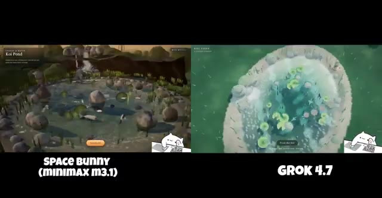
*Comparaison côte à côte de deux vidéos générées par IA sur le concept d'un étang à koïs, avec d'un côté Space Bunny (Minimax M 3.1) et de l'autre Grok 4.7.*

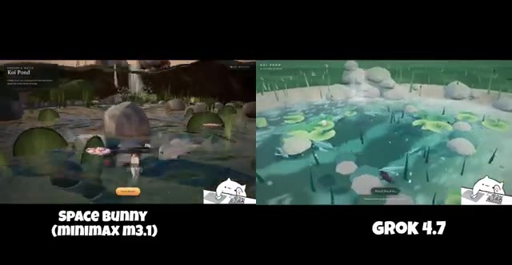
*Vue rapprochée de la même comparaison côte à côte montrant les détails des rendus des étangs à koïs pour Space Bunny (Minimax M 3.1) et Grok 4.7.*

---

### ⏱️ `[00:01:01 - 00:01:20]` | Segment #04

**🔊 Audio (Transcription Intégrale Mot pour Mot en Français) :**
> Maintenant, ce qui m'a immédiatement sauté aux yeux, c'est à quel point ces deux rendus sont différents. Space Bunny opte pour un environnement beaucoup plus détaillé, semblable à un jeu vidéo. On peut voir les rochers entourant l'étang, la végétation, l'eau, les petits poissons, les sentiers, et à mesure que la caméra change, la scène donne toujours l'impression d'un véritable environnement jouable.

**👁️ Analyse Visuelle d'Écran (gemini-3.5-flash-lite) :**
**Interface & Outils** : Écran partagé comparant deux clips vidéo générés par des IA avec des titres de modèles affichés en surimpression ("SPACE BUNNY (MINIMAX M3.1)" et "GROK 4.7").

**Contenu textuel & Code** : Texte à l'écran : "SPACE BUNNY (MINIMAX M3.1)" sous le panneau de gauche, "GROK 4.7" sous le panneau de droite. Dans les vidéos, on aperçoit des éléments textuels liés au jeu comme "Koï Pond".

**Action / Démonstration** : Comparaison visuelle côte à côte de deux environnements virtuels générés par intelligence artificielle représentant un étang avec des poissons et de la végétation.

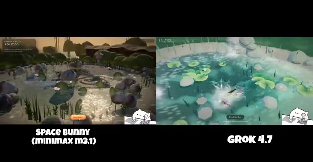
*Comparaison côte à côte de deux environnements de jeux générés par IA, montrant "Space Bunny (Minimax M3.1)" à gauche et "Grok 4.7" à droite.*

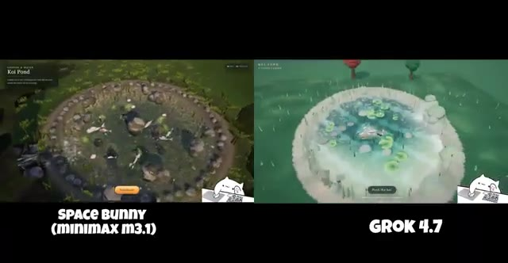
*Vue aérienne élargie de la même comparaison entre "Space Bunny (Minimax M3.1)" et "Grok 4.7" montrant l'étang à carpes koïs.*

---

### ⏱️ `[00:01:20 - 00:01:38]` | Segment #05

**🔊 Audio (Transcription Intégrale Mot pour Mot en Français) :**
> Ensuite, vous regardez Grok 4.7. Il a un aspect beaucoup plus épuré et stylisé avec cette eau bleu vif, des nénuphars, des rochers et des arbres autour de l'étang. Mais voici la partie intéressante. Alors que la vidéo passe par différentes vues, les deux modèles essaient de maintenir la même scène globale tout en ajoutant plus de détails.

**👁️ Analyse Visuelle d'Écran (gemini-3.5-flash-lite) :**
**Interface & Outils** : Écran partagé comparant deux modèles de génération vidéo par IA (Space Bunny MiniMax M3.1 à gauche et Grok 4.7 à droite), avec un widget animé d'un chat pianiste en bas à droite.

**Contenu textuel & Code** : Texte affiché : "Koi Pond", "SPACE BUNNY (MINIMAX M3.1)", "GROK 4.7", "Feed the koi".

**Action / Démonstration** : Comparaison comparative des performances de rendu visuel de deux IA génératrices de vidéo à travers différents angles de caméra et plans successifs.

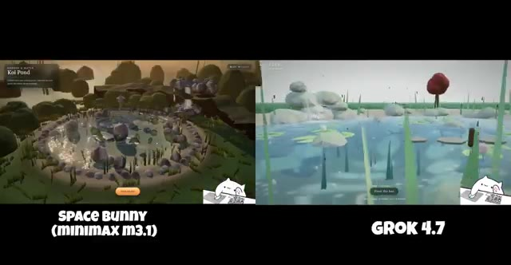
*Comparaison côte à côte de Space Bunny (MiniMax M3.1) et Grok 4.7 montrant une vue générale d'un étang à koïs stylisé.*

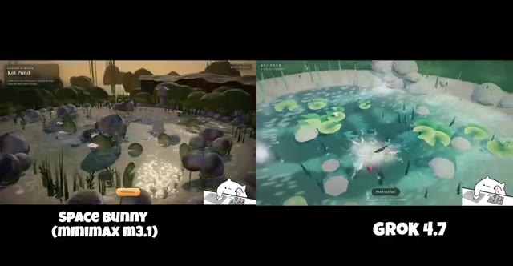
*Comparaison côte à côte montrant un changement de perspective et de plan sur les deux modèles d'IA.*

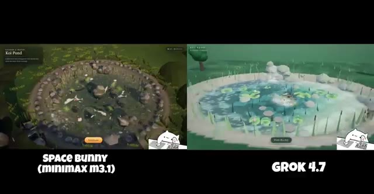
*Comparaison côte à côte montrant une vue en plongée plus large sur les deux scènes de l'étang.*

---

### ⏱️ `[00:01:38 - 00:02:00]` | Segment #06

**🔊 Audio (Transcription Intégrale Mot pour Mot en Français) :**
> Space Bunny devient particulièrement intéressant quand on zoome sur l'étang. On commence à voir des poissons individuels, des rochers, des plantes, et tous ces petits détails environnementaux intégrés dans la scène. Et c'est exactement pourquoi je pense que cette fuite mérite qu'on y prête attention. Nous voyons un modèle non publié testé sur une tâche qui lui demande de générer un environnement entier d'apparence interactive à partir d'une simple instruction.

**👁️ Analyse Visuelle d'Écran (gemini-3.5-flash-lite) :**
**Interface & Outils** : Écran comparatif vidéo divisé en deux fenêtres verticales affichant des environnements virtuels 3D interactifs ("SPACE BUNNY (MINIMAX M3.1)" à gauche et "GROK 4.7" à droite).

**Contenu textuel & Code** : Textes visibles à l'écran : "SPACE BUNNY (MINIMAX M3.1)", "GROK 4.7", "Koi Pond", et un petit widget animé de chat en bas à droite.

**Action / Démonstration** : La caméra effectue un zoom progressif vers l'étang pour révéler les détails des poissons, des rochers et de la végétation.

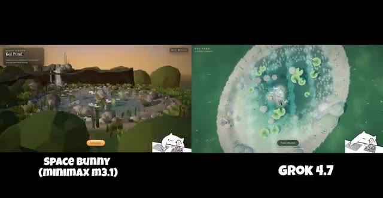
*Comparaison côte à côte de Space Bunny (MiniMax M3.1) montrant un étang à koi avec des nénuphars et Grok 4.7 montrant une vue aérienne du même étang.*

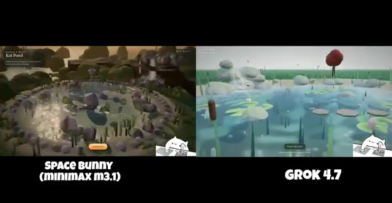
*Zoom progressif sur l'étang montrant les détails environnementaux des deux modèles d'IA.*

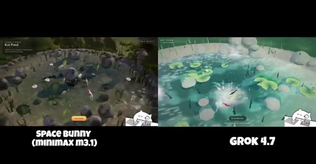
*Gros plan rapproché sur l'étang de Space Bunny révélant des poissons individuels, des rochers et des plantes aquatiques détaillées.*

---

### ⏱️ `[00:02:00 - 00:02:34]` | Segment #07

**🔊 Audio (Transcription Intégrale Mot pour Mot en Français) :**
> Et selon la publication sur X, ce point de contrôle s'est également amélioré par rapport aux tests précédents. Donc s'il s'agit vraiment d'un premier aperçu du prochain modèle de Minimax, ils ont peut-être préparé du très lourd. Mais évidemment, une comparaison sur X ne suffit pas pour déclarer un vainqueur. sur X a décidé de donner à Space Bunny et Astra exactement le même prompt, en un seul essai, sans modification de prompt entre les deux. La tâche ? Construire un jardin japonais détaillé de style voxel en Three.js avec une pagode, de minuscules villageois, un dragon volant et des éléments interactifs. Et regardez simplement les résultats. Sur le

**👁️ Analyse Visuelle d'Écran (gemini-3.5-flash-lite) :**
**Interface & Outils** : Navigateur web affichant le réseau social X (anciennement Twitter) avec des publications de test comparatif d'intelligences artificielles.

**Contenu textuel & Code** : Texte de publication X : "Build a detailed voxel-style Japanese garden in Three.js, with a pagoda, tiny villagers, a flying dragon and interactive details. - space bunny took about 45 minutes (free) - astra took about 15 minutes and cost $4.24". Labels vidéo : "SPACE BUNNY (XHIGH)" et "GPT-6 ASTRA (VERY HIGH)".

**Action / Démonstration** : Le créateur présente des publications sur X comparant les performances et les rendus de deux IA génératives (Space Bunny et Astra/Grok) sur une tâche de programmation 3D en Three.js.

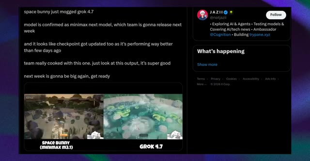
*Publication sur X montrant une comparaison entre Space Bunny (Minimax m3.1) et Grok 4.7 avec un texte sur les performances du modèle Minimax.*

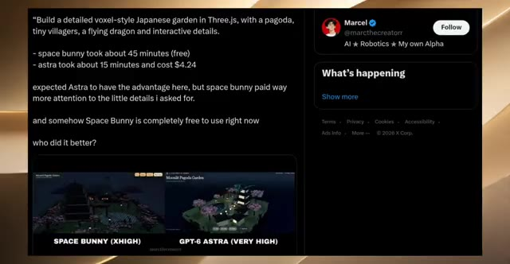
*Publication sur X de Marcel détaillant le prompt de test comparatif entre Space Bunny et GPT-6 Astra pour la création d'un jardin japonais en 3.js.*

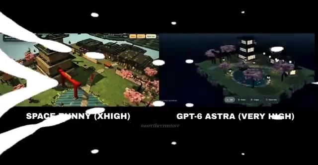
*Gros plan sur la comparaison vidéo en split-screen entre Space Bunny (Xhigh) et GPT-6 Astra (Very High) affichant les deux rendus 3D du jardin japonais.*

---

### ⏱️ `[00:02:34 - 00:03:07]` | Segment #08

**🔊 Audio (Transcription Intégrale Mot pour Mot en Français) :**
> à gauche, nous avons Space Bunny. À droite, Astra. Space Bunny adopte une approche beaucoup plus vaste ici. Vous avez la grande pagode centrale, la porte torii rouge, des cerisiers en fleurs, des sentiers, de l'eau et de multiples structures réparties dans tout l'environnement. Astra opte pour une composition sensiblement différente. Il crée un jardin plus sombre, aux allures nocturnes, avec une pagode et des bâtiments entourés de cerisiers en fleurs et un étang central. Et honnêtement, les deux résultats sont impressionnants pour différentes raisons. Mais il y a un autre détail ici qui, selon moi, est vraiment important.

**👁️ Analyse Visuelle d'Écran (gemini-3.5-flash-lite) :**
**Interface & Outils** : Interface de comparaison vidéo en écran partagé affichant deux environnements 3D interactifs nommés "Moonlit Pagoda Garden" (générés par Space Bunny à gauche et GPT-6 Astra à droite).

**Contenu textuel & Code** : Textes affichés à l'écran : "Moonlit Pagoda Garden", "SPACE BUNNY (XHIGH)", "GPT-6 Astra (VERY HIGH)", et le filigrane "marinthecreatorr".

**Action / Démonstration** : Présentation comparative de deux rendus 3D de jardins asiatiques stylisés générés par intelligence artificielle, mettant en valeur leurs différences de composition, d'échelle et d'éclairage.

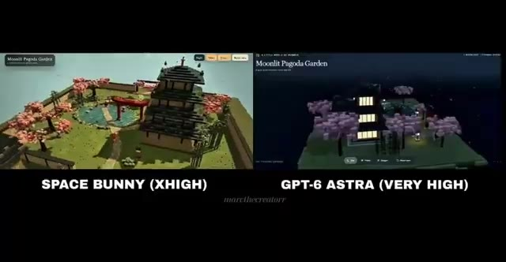
*Comparaison côte à côte entre "Space Bunny (Xhigh)" montrant un jardin lumineux avec une grande pagode, et "GPT-6 Astra (Very High)" montrant un jardin nocturne sous le titre "Moonlit Pagoda Garden".*

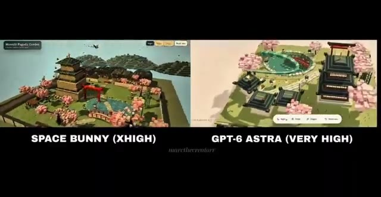
*Poursuite de la comparaison vidéo en écran partagé montrant les modifications de perspective et de rendu des deux environnements 3D générés.*

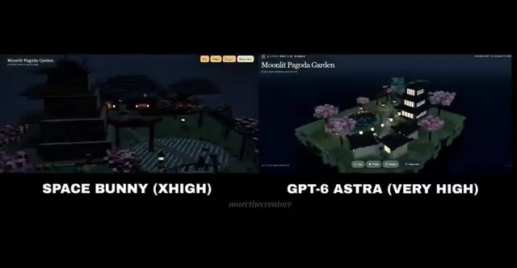
*Vue en gros plan de l'environnement de gauche basculé en mode nuit sombre, contrastant avec l'éclairage de l'interface d'Astra à droite.*

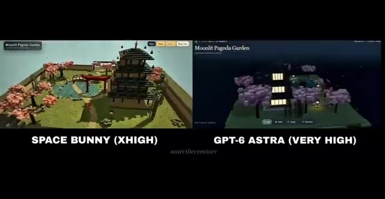
*Retour à la vue initiale en écran partagé montrant les deux jardins côte à côte avec leurs légendes respectives.*

---

### ⏱️ `[00:03:07 - 00:03:36]` | Segment #09

**🔊 Audio (Transcription Intégrale Mot pour Mot en Français) :**
> D'après le post sur X, Space Bunny a pris environ 45 minutes pour générer ceci, tandis qu'Astra a pris environ 15 minutes et a coûté 4,24 dollars. Donc oui, Space Bunny était gratuit dans ce test, mais gratuit ne signifie pas plus rapide. Et c'est quelque chose que vous devez absolument garder à l'esprit lorsque vous examinez des comparaisons d'IA virales. Parce que si vous jugez uniquement par le résultat final, vous pourriez regarder Space Bunny et vous dire, waouh, ce truc a surclassé Astra. Mais le temps de génération était environ trois fois plus long dans cet exemple particulier.

**👁️ Analyse Visuelle d'Écran (gemini-3.5-flash-lite) :**
**Interface & Outils** : Interface du réseau social X (Twitter) et lecteur vidéo affichant une comparaison comparative de deux modèles d'IA générative 3D ("Space Bunny" vs "GPT-6 Astra").

**Contenu textuel & Code** : Texte du post X : "Build a detailed voxel-style Japanese garden in Three.js, with a pagoda, tiny villagers, a flying dragon and interactive details. - space bunny took about 45 minutes (free) - astra took about 15 minutes and cost $4.24...". Légendes des vidéos : "SPACE BUNNY (XHIGH)" et "GPT-6 ASTRA (VERY HIGH)". Titre du projet affiché : "Moonlit Pagoda Garden".

**Action / Démonstration** : Affichage comparatif d'un post X textuel détaillant les performances, les temps de génération (45 min vs 15 min) et les coûts, suivi d'une démonstration visuelle côte à côte des rendus 3D générés par les deux IA.

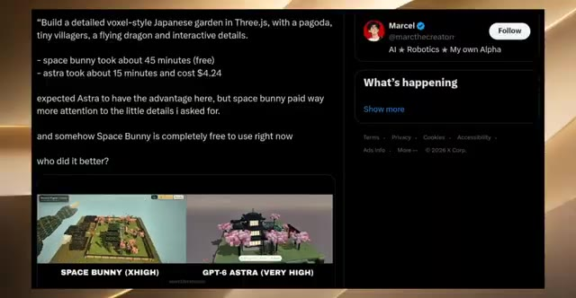
*Capture d'écran d'un post X (Twitter) de Marcel comparant Space Bunny et GPT-6 Astra avec les temps de génération et les coûts.*

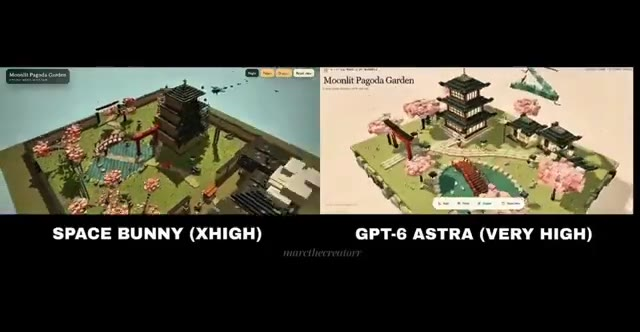
*Comparaison vidéo côte à côte montrant un jardin de style voxel généré par Space Bunny (XHIGH) à gauche et GPT-6 Astra (VERY HIGH) à droite.*

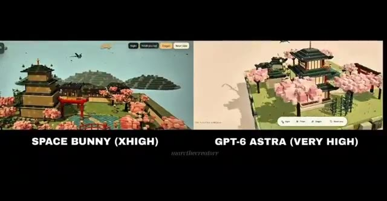
*Gros plan de la comparaison vidéo côte à côte du jardin voxel entre Space Bunny et GPT-6 Astra sous un autre angle de caméra.*

---

### ⏱️ `[00:03:36 - 00:03:55]` | Segment #10

**🔊 Audio (Transcription Intégrale Mot pour Mot en Français) :**
> Et il y a une autre chose que j'ai remarquée. Space Bunny semble donner la priorité aux petits détails environnementaux et à la taille globale de la scène, tandis que le résultat d'Astra semble plus compact et visuellement contrôlé. Mais je n'appellerais pas cela une victoire définitive pour l'un ou l'autre modèle. Pourquoi ? Parce qu'il s'agit d'un seul prompt, d'une seule exécution, provenant d'une publication sur X.

**👁️ Analyse Visuelle d'Écran (gemini-3.5-flash-lite) :**
**Interface & Outils** : Interface de comparaison comparative en écran partagé affichant deux rendus 3D isométriques côte à côte, avec des étiquettes textuelles pour chaque modèle.

**Contenu textuel & Code** : Textes visibles : 'Moonlit Pagoda Garden', 'SPACE BUNNY (XHIGH)', 'GPT-6 Astra (VERY HIGH)', filigrane 'marcthecreatorr'. Éléments graphiques : îlots isométriques stylisés avec pagodes, arbres en fleurs et jardins japonais.

**Action / Démonstration** : Comparaison visuelle côte à côte de deux moteurs d'IA générative 3D montrant l'évolution des rendus de paysages de pagodes au clair de lune.

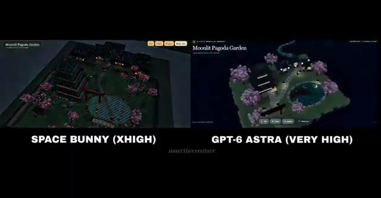
*Comparaison côte à côte de la scène 'Moonlit Pagoda Garden' générée par les modèles Space Bunny et GPT-6 Astra.*

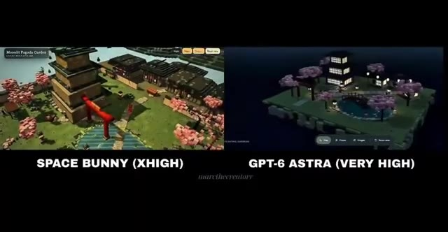
*Vue rapprochée de la scène en train de s'animer pour comparer les détails environnementaux des deux IA.*

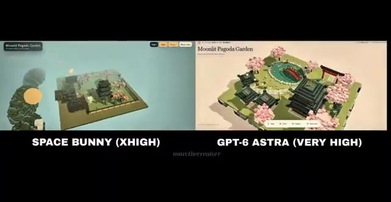
*Différents angles de rendu et perspectives montrant l'échelle et la compacité des scènes générées.*

---

### ⏱️ `[00:03:55 - 00:04:14]` | Segment #11

**🔊 Audio (Transcription Intégrale Mot pour Mot en Français) :**
> Nous n'avons pas de banc d'essai standardisé ici, et nous ne connaissons pas toutes les conditions d'exécution du test au-delà de ce que le créateur a rapporté. Mais ce n'est pas ce qui rend cela intéressant. Ce qui est intéressant, c'est qu'un modèle Minimax non publié, prétendument furtif, produit des résultats de ce niveau avant même que nous ayons vu son lancement officiel.

**👁️ Analyse Visuelle d'Écran (gemini-3.5-flash-lite) :**
**Interface & Outils** : Interface du réseau social X (anciennement Twitter) affichant un tweet de l'utilisateur @marcthecreatorr.

**Contenu textuel & Code** : Texte du tweet : "Build a detailed voxel-style Japanese garden in Three.js, with a pagoda, tiny villagers, a flying dragon and interactive details. - space bunny took about 45 minutes (free) - astra took about 15 minutes and cost $4.24 expected Astra to have the advantage here, but space bunny paid way more attention to the little details i asked for. and somehow Space Bunny is completely free to use right now who did it better?" et une image comparative montrant "SPACE BUNNY (XHIGH)" et "GPT-6 ASTRA (VERY HIGH)".

**Action / Démonstration** : Affichage d'une publication sur les réseaux sociaux comparant deux modèles d'IA générative.

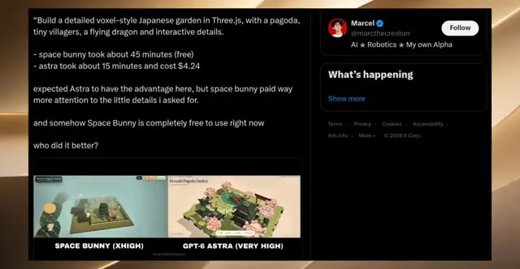
*Capture d'écran d'un tweet comparant les performances des modèles d'IA 'Space Bunny' et 'GPT-6 Astra' pour la création d'un jardin japonais en style voxel.*

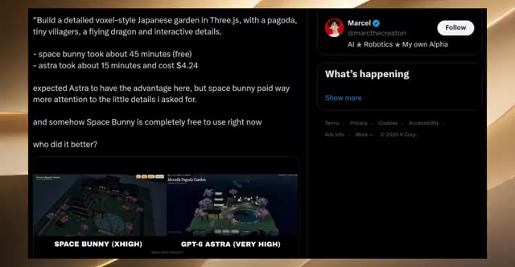
*Capture d'écran similaire au tweet précédent montrant la comparaison des deux modèles d'IA avec leurs résultats visuels respectifs.*

---

### ⏱️ `[00:04:14 - 00:04:39]` | Segment #12

**🔊 Audio (Transcription Intégrale Mot pour Mot en Français) :**
> Et si le point de contrôle continue de s'améliorer, Space Bunny pourrait devenir très intéressant. C'est un autre exemple qui a surgi sur X, et le créateur dit qu'il a fait tout ce jeu de bord de mer gratuitement en utilisant Space Bunny. Et ils ne lui ont pas juste donné un prompt textuel avant de s'en aller. Ils ont donné à Space Bunny un prompt plus quelques images, et selon le créateur, le modèle a été capable de comprendre ces différentes entrées et de les transformer en cet environnement.

**👁️ Analyse Visuelle d'Écran (gemini-3.5-flash-lite) :**
**Interface & Outils** : Interface de la plateforme X (anciennement Twitter) affichant des tweets et des captures d'écran de projets de jeux créés avec des modèles d'IA.

**Contenu textuel & Code** : Texte du tweet de Marcel : "Build a detailed voxel-style Japanese garden in Three.js... space bunny took about 45 minutes (free), astra took about 15 minutes and cost $4.24". Texte du tweet de Siddharth : "This is insane, made this Seaside game for FREE with Space Bunny, the new Stealth Model. gave it a prompt + a few images, it understood different inputs and made this very fast".

**Action / Démonstration** : Affichage successif de publications de créateurs sur le réseau social X illustrant l'utilisation du modèle Space Bunny pour générer des jeux vidéo à partir de prompts et d'images.

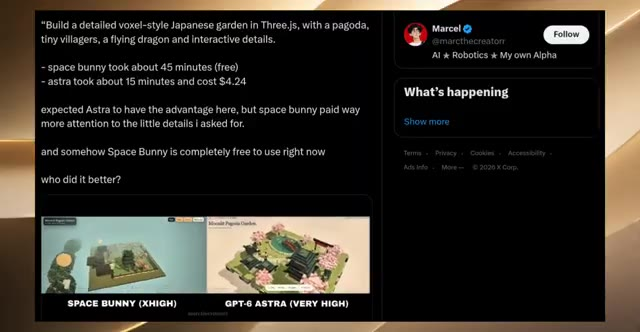
*Tweet de Marcel sur X comparant les performances entre Space Bunny et GPT-6 Astra pour la création d'un jardin japonais en voxel.*

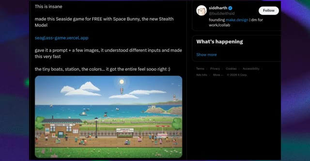
*Tweet de Siddharth sur X montrant le jeu de bord de mer créé avec Space Bunny pendant la journée.*

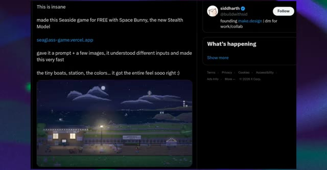
*Tweet de Siddharth sur X montrant le même jeu de bord de mer créé avec Space Bunny avec un rendu de nuit.*

---

### ⏱️ `[00:04:39 - 00:04:59]` | Segment #13

**🔊 Audio (Transcription Intégrale Mot pour Mot en Français) :**
> Et honnêtement, regardez tout ce qui se passe ici. Vous avez cet immense océan en arrière-plan, de petits bateaux qui se déplacent, un phare, une île, des nuages, des oiseaux, la voie ferrée, la gare, un train, tout un quai, et tous ces petits personnages qui se promènent. Et c'est vraiment ça qui a attiré mon attention.

**👁️ Analyse Visuelle d'Écran (gemini-3.5-flash-lite) :**
**Interface & Outils** : Animation ou jeu vidéo en pixel art présenté à l'écran.

**Contenu textuel & Code** : Paysage côtier pixélisé comportant une gare (« WAITING ROOM », « SEAGLASS »), des voies ferrées, un océan avec des bateaux, des nuages, des oiseaux, une montgolfière, un phare sur une île, et de nombreux personnages miniatures animés sur le quai.

**Action / Démonstration** : La scène visuelle défile ou montre une animation dynamique en pixel art illustrant une journée qui s'écoule (du jour au crépuscule) avec des éléments en mouvement constant.

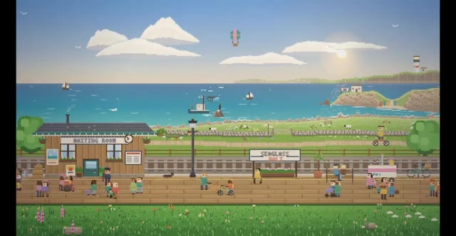
*Scène animée en pixel art montrant une gare côtière de jour avec de nombreux détails en arrière-plan (océan, bateaux, île, nuages, personnages sur le quai).*

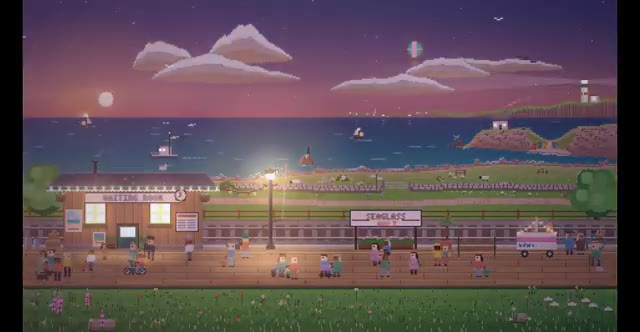
*Scène animée en pixel art montrant la même gare côtière au crépuscule ou de nuit, avec l'éclairage public allumé et des personnages se promenant sur le quai.*

---

### ⏱️ `[00:04:59 - 00:05:23]` | Segment #14

**🔊 Audio (Transcription Intégrale Mot pour Mot en Français) :**
> La scène ne donne pas l'impression d'être totalement statique, au fur et à mesure que la vidéo se lit, le train change de position, les personnages se déplacent autour de la station, des bateaux naviguent sur l'eau, et tous ces petits éléments donnent vie à l'univers. Même les minuscules détails, les vélos, les bancs, le panneau de la gare, les fleurs, les lampes et les PNJ contribuent à donner l'idée qu'il s'agit d'un véritable petit environnement de jeu plutôt que d'une simple capture d'écran générée par IA.

**👁️ Analyse Visuelle d'Écran (gemini-3.5-flash-lite) :**
**Interface & Outils** : Environnement de jeu vidéo en pixel art affiché à l'écran, illustrant une démonstration visuelle de génération de vidéo par IA.

**Contenu textuel & Code** : Visuels de pixel art représentant une gare nommée "SEAGLASS", une salle d'attente ("WAITING ROOM"), un plan d'eau avec des bateaux, des montagnes, un ciel étoilé ou ensoleillé avec des nuages, et de nombreux personnages (PNJ).

**Action / Démonstration** : Les images montrent des plans fixes ou animés d'un décor de jeu en pixel art, illustrant le mouvement des personnages, le changement de position du train entre le jour et la nuit, et l'animation de l'environnement.

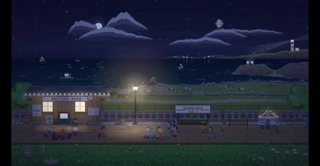
*Scène de gare en pixel art de nuit au bord de l'eau, avec des personnages et un lampadaire éclairé.*

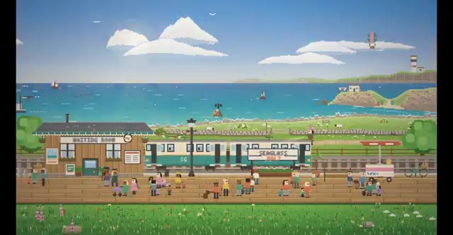
*Scène de gare en pixel art de jour, montrant un train à l'arrêt sur les voies et de nombreux personnages sur le quai.*

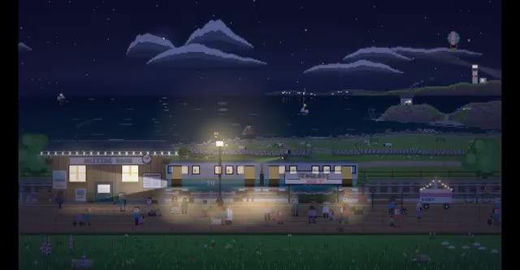
*Scène de gare en pixel art de nuit avec un train arrêté sur les voies et le quai animé par des personnages.*

---

### ⏱️ `[00:05:23 - 00:05:50]` | Segment #15

**🔊 Audio (Transcription Intégrale Mot pour Mot en Français) :**
> Et visuellement, j'aime vraiment beaucoup la cohérence ici. Ça a cette esthétique de bord de mer en pixel art très spécifique, et Space Bunny ne commence pas soudainement à mélanger des styles visuels complètement différents dans toute la scène. Mais il y a une chose importante qu'il ne faut pas ignorer. Le créateur dit qu'il lui a donné quelques images de référence, donc nous ne pouvons pas dire que Space Bunny a généré chaque idée visuelle complètement à partir de zéro, et nous ne savons pas non plus exactement combien d'itérations ont eu lieu en coulisses.

**👁️ Analyse Visuelle d'Écran (gemini-3.5-flash-lite) :**
**Interface & Outils** : Navigateur web affichant une publication sur la plateforme X (anciennement Twitter).

**Contenu textuel & Code** : Tweets de Siddharth (@buildwithsid) : "This is insane, made this Seaside game for FREE with Space Bunny, the new Stealth Model. seaglass-game.vercel.app. gave it a prompt + a few images, it understood different inputs and made this very fast. the tiny boats, station, the colors... it got the entire feel sooo right :)"

**Action / Démonstration** : Affichage successif des visuels du jeu pixel art en plein jour et de nuit, puis du tweet explicatif du créateur détaillant l'utilisation du modèle Space Bunny.

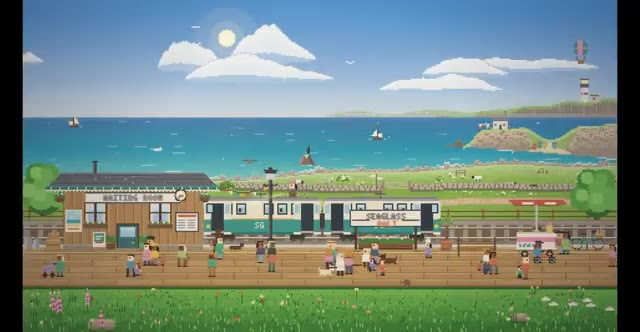
*Scène en pixel art représentant une gare au bord de la mer en plein jour.*

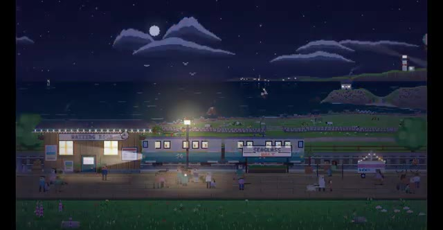
*Scène en pixel art représentant la même gare au bord de la mer de nuit, éclairée par des lampadaires.*

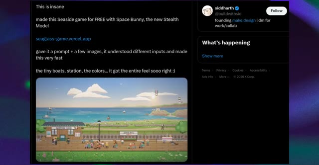
*Publication sur le réseau social X (Twitter) du compte de Siddharth montrant le jeu Seaside créé avec Space Bunny.*

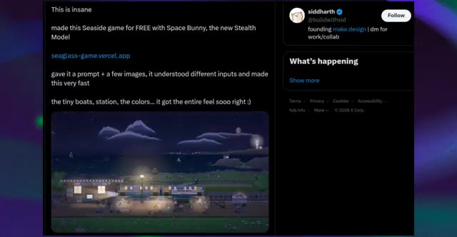
*Publication sur le réseau social X montrant la version nocturne du jeu Seaside.*

---

### ⏱️ `[00:05:50 - 00:06:10]` | Segment #16

**🔊 Audio (Transcription Intégrale Mot pour Mot en Français) :**
> Donc je ne regarderais pas cela en me disant que l'IA vient de créer un jeu complet de qualité commerciale en un seul clic. Ce n'est pas ce que cela prouve. Ce que cela montre, c'est quelque chose de beaucoup plus intéressant. Space Bunny semble capable de prendre de multiples entrées, de comprendre une direction visuelle assez complexe, et de transformer cela en un environnement interactif au style cohérent.

**👁️ Analyse Visuelle d'Écran (gemini-3.5-flash-lite) :**
**Interface & Outils** : Navigateur web affichant une publication sur le réseau social X (Twitter).

**Contenu textuel & Code** : Texte du tweet : "This is insane, made this Seaside game for FREE with Space Bunny, the new Stealth Model, seaglass-game.vercel.app, gave it a prompt + a few images, it understood different inputs and made this very fast, the tiny boats, station, the colors... it got the entire feel sooo right :)". Profil de Siddharth (@buildwithsid).

**Action / Démonstration** : Affichage d'une publication sur les réseaux sociaux illustrant la création d'un jeu vidéo par IA, suivi d'un zoom sur le rendu visuel en pixel art du jeu.

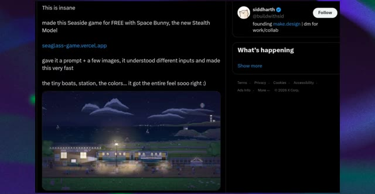
*Publication sur X (Twitter) par siddharth montrant un jeu créé gratuitement avec Space Bunny et une capture du jeu en bas.*

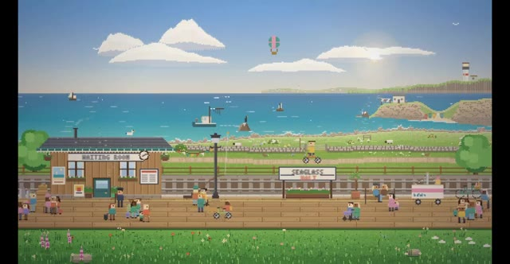
*Gros plan sur le rendu visuel en pixel art du jeu interactif "Seaglass" montrant une gare au bord de la mer.*

---

### ⏱️ `[00:06:10 - 00:06:28]` | Segment #17

**🔊 Audio (Transcription Intégrale Mot pour Mot en Français) :**
> Et selon la publication, le créateur a fait tout cela gratuitement. Comment pourrions-nous oublier le test du pélican ? Celui-ci est juste ridicule. Quelqu'un a donné à Space Bunny une tâche de codage 3D assez spécifique : un pélican qui fait du vélo le long d'une route côtière. Et Space Bunny n'a pas simplement jeté un pélican sur une route aléatoire.

**👁️ Analyse Visuelle d'Écran (gemini-3.5-flash-lite) :**
**Interface & Outils** : Navigateur web affichant le réseau social X (Twitter).

**Contenu textuel & Code** : Texte de la publication : "This is insane made this Seaside game for FREE with Space Bunny, the new Stealth Model seaglass-game.vercel.app gave it a prompt + a few images, it understood different inputs and made this very fast the tiny boats, station, the colors... it got the entire feel sooo right :)". Deuxième publication : "Drew it? Mysterious model Space Bunny Alpha runs 3D pelican riding a bike, effects absolutely mind-blowing! Build details: Pelican: Orange hat, yellow beak, blue outfit, natural riding pose with full sense of depth, Bicycle: Red frame, spoked wheels, clear pedals, Scene: Coastal highway + lighthouse + sailboat, San Francisco coordinates, Lighting: Morning mist / noon / sunset switchable, color temperature and shadows in sync, Interaction: 38 km/h speed bar + playback controls + radio UI. Anonymous 1M context + strong coding, surprisingly high level of completion. #SpaceBunnyAlpha #OpenCode #3D #PelicanOnTwoWheels #AIPredict #MiniMaxH31".

**Action / Démonstration** : Le présentateur affiche à l'écran des publications X (Twitter) illustrant les performances du modèle d'IA Space Bunny.

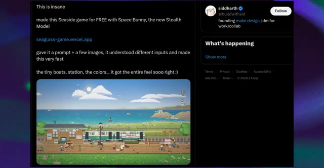
*Capture d'écran d'une publication X (Twitter) montrant un jeu créé gratuitement avec Space Bunny et une image de paysage côtier avec un train.*

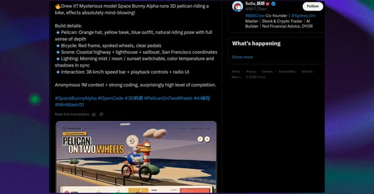
*Capture d'écran d'une publication X (Twitter) montrant les détails de construction du test du pélican en 3D avec Space Bunny.*

---

### ⏱️ `[00:06:29 - 00:06:49]` | Segment #18

**🔊 Audio (Transcription Intégrale Mot pour Mot en Français) :**
> Regardez ce qu'il a réellement construit. Vous avez le pélican avec un chapeau orange, un bec jaune et une tenue bleue, assis sur le vélo avec une pose de cycliste réaliste. Vous avez le vélo rouge, les roues et les pédales, la route côtière, l'océan, le phare, les voiliers, et même la petite interface autour de la scène. Mais ce que je veux vraiment que vous regardiez, c'est ce qui se passe lorsque nous commençons à interagir avec.

**👁️ Analyse Visuelle d'Écran (gemini-3.5-flash-lite) :**
**Interface & Outils** : Application web interactive de type "Postcard Radio" avec interface utilisateur stylisée, boutons de contrôle du temps et de la vitesse, et graphismes 3D.

**Contenu textuel & Code** : Texte à l'écran : "PELICAN ON TWO WHEELS", coordonnées géographiques, options de moment de la journée (晨雾 / 07:10, 正午 / 13:00, 落日 / 19:30), curseur de vitesse de conduite, et boutons de lecture/pause.

**Action / Démonstration** : Le curseur de la souris survole l'interface et clique sur différentes options de moment de la journée (passant de midi au coucher du soleil), modifiant l'éclairage de la scène 3D animée.

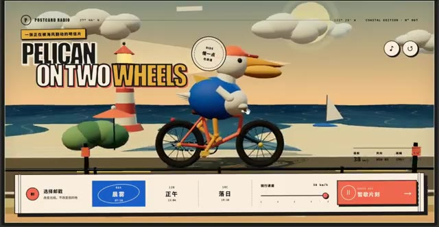
*Vue d'ensemble de l'interface web interactive montrant un pélican animé sur un vélo le long d'une route côtière, avec des options de configuration en bas.*

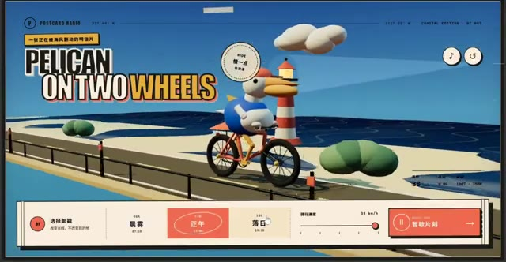
*Gros plan sur l'interface montrant la modification du paramètre d'éclairage avec le curseur pointant sur l'option de coucher de soleil.*

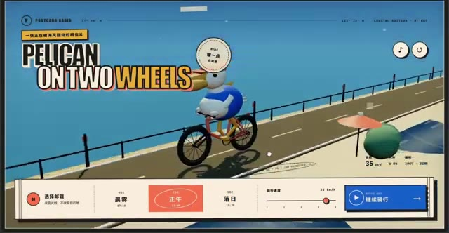
*Animation interactive de la caméra en mouvement plongeant vers le pélican à vélo suite à l'interaction sur l'interface.*

---

### ⏱️ `[00:06:49 - 00:07:12]` | Segment #19

**🔊 Audio (Transcription Intégrale Mot pour Mot en Français) :**
> L'éclairage change, on passe d'un look de jour lumineux à cette scène beaucoup plus chaleureuse de type coucher de soleil, puis on revient vers un environnement de jour plus frais. Et le plus important n'est pas simplement que les couleurs changent. Tout l'éclairage de la scène change avec elles. Le ciel, l'océan, la route et les ombres basculent tous ensemble, ce qui donne beaucoup plus l'impression d'une expérience 3D interactive plutôt que d'une collection d'images statiques.

**👁️ Analyse Visuelle d'Écran (gemini-3.5-flash-lite) :**
**Interface & Outils** : Interface web interactive nommée « Postcard Radio » (Coastal Edition) avec des contrôles de temps, de vitesse et de lecture audio.

**Contenu textuel & Code** : Textes visibles : « Postcard Radio », « PELICAN ON TWO WHEELS », options de temps « 晨雾 » (Brume matinale), « 正午 » (Midi), « 落日 » (Coucher de soleil), curseur de vitesse de déplacement (骑行速度).

**Action / Démonstration** : Navigation et démonstration d'une interface web interactive simulant un déplacement en vélo le long d'une côte avec modification dynamique de l'éclairage et de l'ambiance visuelle.

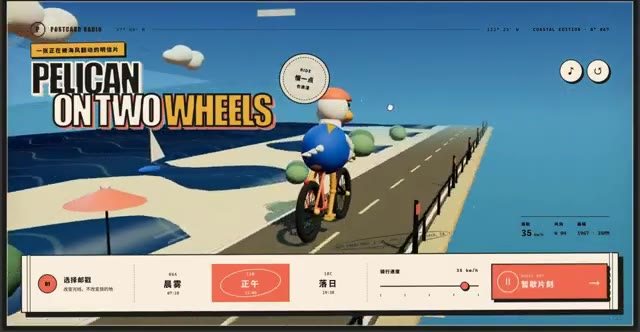
*Interface web interactive « Postcard Radio » montrant un personnage en pélican sur un vélo avec des options de sélection d'éclairage et de vitesse.*

*Vue de l'interface montrant une transition vers un éclairage de type coucher de soleil avec des tons plus chauds.*

*Vue rapprochée du pélican sur son vélo avec l'interface de contrôle affichant les modes d'éclairage (matin, midi, coucher de soleil).*

*Interface affichant un retour à l'environnement de jour avec un éclairage plus frais et des ombres ajustées.*

---

### ⏱️ `[00:07:13 - 00:07:38]` | Segment #20

**🔊 Audio (Transcription Intégrale Mot pour Mot en Français) :**
> Et puis il y a le contrôle de la vitesse. L'interface montre en fait le pélican se déplaçant à environ 38 kilomètres par heure, avec des commandes de lecture et une interface utilisateur de type radio. Maintenant, je veux être prudent ici. Cela ne signifie pas que Space Bunny a magiquement résolu le développement de jeux 3D. Il y a encore des limitations évidentes. L'environnement lui-même est relativement simple, la géométrie est stylisée, et nous ne savons pas par combien d'itérations le créateur est passé pour obtenir ce résultat final.

**👁️ Analyse Visuelle d'Écran (gemini-3.5-flash-lite) :**
**Interface & Outils** : Interface utilisateur web interactive personnalisée de type radio et post-card (Postcard Radio) avec lecteur et commandes de vitesse, affichée également dans un post sur le réseau social X (anciennement Twitter).

**Contenu textuel & Code** : Textes visibles : "POSTCARD RADIO", "PELICAN ON TWO WHEELS", options de moments de la journée ("晨雾" - Brume matinale, "正午" - Midi, "落日" - Coucher du soleil), curseur de vitesse ("骑行速度"), et texte du tweet : "Drew it? Mysterious model Space Bunny Alpha runs 3D pelican riding a bike, effects absolutely mind-blowing! Build details: Pelican, Bicycle, Scene, Lighting, Interaction... #SpaceBunnyAlpha #OpenCode #3D".

**Action / Démonstration** : Le curseur de vitesse et les paramètres de l'interface utilisateur sont manipulés, démontrant le contrôle en temps réel de la vitesse (de 10 à 38 km/h) et de l'éclairage de la scène 3D.

*Interface interactive affichant le pélican sur son vélo avec le panneau de configuration de vitesse réglé sur le coucher du soleil.*

*Interface interactive affichant le pélican en mouvement avec le curseur de vitesse à 35 km/h et le mode '正午' (midi) sélectionné.*

*Vue arrière du pélican sur la route côtière avec l'interface montrant une vitesse de 15 km/h et le mode '晨雾' (brume matinale) activé.*

*Capture d'écran d'un tweet du profil @NFT_Chen détaillant les spécifications du modèle Space Bunny Alpha et le projet 'Pelican on Two Wheels'.*

---

### ⏱️ `[00:07:39 - 00:07:57]` | Segment #21

**🔊 Audio (Transcription Intégrale Mot pour Mot en Français) :**
> Mais ce n'est pas vraiment le sujet. Ce qui est impressionnant, c'est le nombre de pièces détachées que Space Bunny a réussi à connecter en une seule petite expérience cohérente. Personnage 3D, animation, environnement, contrôles, éclairage, interface utilisateur et interaction. C'est une capacité bien différente de la simple génération d'une jolie page web.

**👁️ Analyse Visuelle d'Écran (gemini-3.5-flash-lite) :**
**Interface & Outils** : Navigateur web affichant une application web interactive 3D ("Postcard Radio" - "Pelican on Two Wheels").

**Contenu textuel & Code** : Textes en anglais et chinois ("Pelican on Two Wheels", "Postcard Radio"), contrôles de vitesse, curseur de sélection temporelle (晨雾, 正午, 落日) et boutons de lecture.

**Action / Démonstration** : Navigation et interaction avec une application web 3D intégrant animation, contrôles et interface utilisateur.

*Capture d'écran montrant l'interface web interactive "Postcard Radio" avec un pélican en 3D sur un vélo.*

*Vue de l'animation interactive montrant le changement de paramètre de temps sur la page web.*

*Illustration de l'expérience interactive montrant le contrôle de la vitesse et de la lecture audio.*

---

### ⏱️ `[00:07:57 - 00:08:19]` | Segment #22

**🔊 Audio (Transcription Intégrale Mot pour Mot en Français) :**
> C'est fondamentalement l'IA qui passe de « écris-moi du code » à « construis-moi un petit monde interactif ». D'accord, c'est là que Space Bunny devient sérieusement intéressant. Quelqu'un a donné au modèle une idée assez simple. Simuler deux sphères qui se rentrent dedans. Et au lieu de simplement vous donner une animation basique de deux balles qui entrent en collision, Space Bunny a construit ce qui ressemble à une simulation 3D de style ingénierie.

**👁️ Analyse Visuelle d'Écran (gemini-3.5-flash-lite) :**
**Interface & Outils** : Navigateur web affichant une application web interactive 3D, puis un fil d'actualité de réseau social (X/Twitter), et enfin une interface de simulation 3D technique.

**Contenu textuel & Code** : Sur l'image 1 : Titre "Pelican on Two Wheels", curseur de vitesse à 35 km/h, options de moment de la journée (Brume matinale, Midi, Coucher du soleil). Sur l'image 2 : Texte décrivant le modèle Space Bunny ("a mystery lab dropped a free model called Space Bunny... it built a full 3D engineering sim..."). Sur l'image 3 : Interface noire de simulation 3D avec des grilles de sphères fil de fer (orange et blanche), axes de coordonnées, et infobulles de données physiques ("Contact pressure").

**Action / Démonstration** : Le créateur montre d'abord une application interactive 3D, puis un post textuel expliquant la création de Space Bunny, et enfin la simulation 3D de deux sphères en collision avec des analyses de contraintes.

*Interface web interactive montrant un pélican sur un vélo dans un monde 3D stylisé avec des options de configuration en bas.*

*Publication sur le réseau social X (Twitter) par OpenCode présentant le modèle Space Bunny et une simulation de sphères.*

*Simulation 3D d'ingénierie détaillée montrant deux sphères en fil de fer (mesh) en train de se percuter avec des données de pression.*

---

### ⏱️ `[00:08:19 - 00:08:40]` | Segment #23

**🔊 Audio (Transcription Intégrale Mot pour Mot en Français) :**
> Regardez la vidéo. Vous pouvez voir les deux sphères s'approcher l'une de l'autre, les maillages se déformer autour de la zone de contact et la simulation se mettre à jour au moment de la collision. Et il ne s'agit pas seulement d'un joli rendu 3D. Vous avez la visualisation du maillage, la région de contact, la déformation, les informations de charge et de contrainte, ainsi que différents affichages de type ingénierie autour de la simulation.

**👁️ Analyse Visuelle d'Écran (gemini-3.5-flash-lite) :**
**Interface & Outils** : Logiciel de simulation 3D de type ingénierie avec affichage de maillage (wireframe) et de données télémétriques.

**Contenu textuel & Code** : Maillages filaires de deux sphères en contact, fenêtres de données techniques et coordonnées spatiales (CNT, PRS, RES) dans les coins, graphiques de charge en bas à droite.

**Action / Démonstration** : Visualisation d'une simulation de collision entre deux sphères montrant la déformation du maillage à l'impact.

*Simulation 3D de deux sphères en maillage filaire se touchant, avec des données techniques et de contrainte affichées à l'écran.*

---

### ⏱️ `[00:08:40 - 00:09:00]` | Segment #24

**🔊 Audio (Transcription Intégrale Mot pour Mot en Français) :**
> Au fur et à mesure que la collision progresse, la géométrie autour du point d'impact change, et vous pouvez voir la zone de contact se compresser et se déformer. C'est un type de tâche complètement différent de la génération d'une page de destination. Vous demandez au modèle de comprendre un scénario physique, de le traduire en code, de créer la géométrie, de simuler l'interaction, puis de visualiser les données résultantes.

**👁️ Analyse Visuelle d'Écran (gemini-3.5-flash-lite) :**
**Interface & Outils** : Interface de simulation scientifique ou d'outil de modélisation 3D avancé avec fenêtres de télémétrie, repères d'axes, grilles de coordonnées et graphiques de données en bas de l'écran.

**Contenu textuel & Code** : Texte technique et coordonnées en superposition autour de la simulation 3D : codes d'axes, repères de contact, et mini-fenêtres d'analyse de données dans les coins inférieurs.

**Action / Démonstration** : Affichage et analyse d'une simulation numérique de physique montrant la déformation de la géométrie lors d'un impact.

*Visualisation 3D filaire d'une simulation de collision entre deux objets sphériques ou dermoïdes, montrant la zone d'impact avec des repères textuels et des graphiques techniques.*

---

### ⏱️ `[00:09:00 - 00:09:32]` | Segment #25

**🔊 Audio (Transcription Intégrale Mot pour Mot en Français) :**
> Et selon la personne qui a publié ceci, cela a même produit un rapport d'ingénierie final à partir de la simulation. Maintenant, voici où je veux être prudent. Je ne prendrais pas cette capture d'écran pour dire soudainement que Space Bunny peut remplacer un logiciel de simulation d'ingénierie. C'est une affirmation audacieuse, et cet exemple à lui seul ne le prouve absolument pas. Nous ne savons pas à quel point la physique sous-jacente est précise, quel solveur ou quelles hypothèses ont été utilisés, ou si les résultats ont été validés de manière indépendante. Mais en tant que démonstration de génération de code, c'est vraiment impressionnant. Parce que Space Bunny ne se contente pas de fabriquer quelque chose qui ressemble

**👁️ Analyse Visuelle d'Écran (gemini-3.5-flash-lite) :**
**Interface & Outils** : Navigateur web affichant un fil d'actualité sur le réseau social X (Twitter).

**Contenu textuel & Code** : Texte du tweet : « a mystery lab dropped a free model called Space Bunny, i asked it to simulate two spheres crushing into each other. it built a full 3D engineering sim with live mesh, load, strain and a final report, engineers pay for software that does this. this cost $0, OpenCode made it free for one week. download OpenCode, pick Space Bunny, type what you want built, bookmark this before the bunny gets a price tag ». On aperçoit également une image incrustée montrant une simulation filaire 3D de deux sphères en collision.

**Action / Démonstration** : Affichage d'une publication sur les réseaux sociaux détaillant les capacités de simulation du modèle Space Bunny développé par OpenCode.

*Capture d'écran d'un tweet sur X (anciennement Twitter) concernant le modèle Space Bunny et sa simulation 3D.*

---

### ⏱️ `[00:09:32 - 00:09:41]` | Segment #26

**🔊 Audio (Transcription Intégrale Mot pour Mot en Français) :**
> comme une simulation d'ingénierie. J'ai le sentiment qu'on va entendre parler de ce modèle très bientôt. C'est Pursuing AI, et je vous dis à la prochaine.

**👁️ Analyse Visuelle d'Écran (gemini-3.5-flash-lite) :**
**Interface & Outils** : Rendu vidéo de synthèse généré par intelligence artificielle (style voxel/pixel art 3D).

**Contenu textuel & Code** : Un modèle 3D style voxel représentant une île-tortue miniature comprenant un phare, des maisons, des arbres stylisés, avec un dégradé de couleur en arrière-plan.

**Action / Démonstration** : Affichage d'un rendu vidéo démonstratif illustrant les capacités du modèle d'intelligence artificielle présenté.

*Rendu vidéo par IA montrant un diorama en voxel en forme d'île miniature avec un phare et des habitations.*

---
