# 🎬 L'OpenDevDay d'OpenAI était bien plus énorme que prévu…

> **Chaîne** : [Pursuing AI](https://www.youtube.com/@PursuingAi)  
> **Titre original** : `OpenAI DevDay Was WAY Bigger Than We Expected…`  
> **Lien YouTube** : [https://www.youtube.com/watch?v=ixDclukqjkM](https://www.youtube.com/watch?v=ixDclukqjkM)  
> **Date de publication** : 2026-09-30  
> **Durée** : 08m 39s (`519s`)  
> **Identifiant vidéo** : `ixDclukqjkM`  
> **Fiche Web Interactive** : [2026-09-30_YT-ixDclukqjkM_L'OpenDevDay d'OpenAI était bien plus énorme que prévu…_by-whisper-v3-large-turbo+gemini-3.5-flash-lite.html](2026-09-30_YT-ixDclukqjkM_L'OpenDevDay d'OpenAI était bien plus énorme que prévu…_by-whisper-v3-large-turbo+gemini-3.5-flash-lite.html)  
> **Captures de démonstration clés** : `56 captures réelles (anti-talking-head)`  
> **Modèles utilisés** : Audio: `large-v3-turbo` (Faster-Whisper int8 VPS) | Vision: `gemini-3.5-flash-lite` (Google AI Studio API)  

---

## 📌 Synthèse Exécutive & Outils

### 📌 Résumé
L'OpenDevDay d'OpenAI marque un tournant radical dans l'écosystème de l'intelligence artificielle, passant d'une simple logique de dialogue textuel à une ère d'agents autonomes, permanents et profondément intégrés aux flux de travail professionnels. L'événement a dévoilé plus de 20 annonces majeures, redéfinissant les standards du développement, de la sécurité des données d'entreprise et de la collaboration en temps réel. En introduisant des innovations majeures comme les agents persistants (« dots »), des modèles hautement spécialisés (GPT-6.1 SOL) et des architectures cloud distribuées, OpenAI démontre sa volonté de rendre l'IA omniprésente, proactive et exécutable en arrière-plan sans nécessiter une supervision humaine constante. 

Pour les créateurs de contenu vidéo et les professionnels du numérique, cette transition vers des flux de travail agentiques et pilotés par événements (via le support de la spécification MCP) ouvre des perspectives inédites. Les créateurs peuvent désormais déléguer des tâches complexes et répétitives — de la gestion de projets à la revue de code et à l'automatisation de pipelines de production — à des agents intelligents qui travaillent de manière autonome dans le cloud. Cette autonomie accrue, couplée à des gains spectaculaires en matière de latence (jusqu'à 300 jetons par seconde avec UltraFast) et à des espaces de travail collaboratifs unifiés, permet d'optimiser radicalement la productivité et d'accélérer la concrétisation de projets créatifs ambitieux.

### 🛠️ Outils, Modèles & Logiciels Présentés
* **GPT-6.1 SOL** : Modèle de pointe optimisé pour le codage agentique, l'utilisation de l'ordinateur et le travail professionnel, offrant des performances proches d'Astra à un coût considérablement réduit.
* **UltraFast** : Niveau de vitesse d'inférence ultra-rapide atteignant jusqu'à 300 jetons par seconde pour une latence minimale dans l'API et les applications de bureau.
* **Codex** : Assistant de développement dopé à l'IA capable de s'exécuter dans le cloud, de piloter des environnements réutilisables et d'analyser des référentiels entiers.
* **Codex CLI** : Interface en ligne de commande mise à jour permettant de lancer et de piloter des tâches vocales, dotée d'une vue de délégation « slash agents ».
* **Codex Security Cloud** : Outil d'analyse de code automatisé capable de scanner des dépôts GitHub en continu et de préparer des correctifs dans le cloud.
* **API de Décision** : API dédiée permettant aux développeurs de soumettre des contextes textuels ou visuels pour obtenir des choix binaires ou catégoriels précis (routage, classification).
* **Agents API** : Interface de programmation intégrant l'utilisation d'ordinateurs, la recherche d'outils et des capacités multi-agents gérées directement dans l'infrastructure d'OpenAI.
* **Bedrock Managed Agents** : Solution d'intégration native permettant d'exécuter les agents d'OpenAI directement au sein de l'infrastructure AWS.
* **Espace ChatGPT** : Espace de travail collaboratif persistant réunissant les équipes humaines, ChatGPT et les agents autonomes autour d'une base de connaissances partagée.
* **Pages** : Outil de documentation interactive et collaborative conçu pour la co-création textuelle, visuelle et graphique entre humains et agents IA.

### 🔑 Points Clés & Enseignements Stratégiques
* **Délégation proactive par les « dots »** : Passez d'une IA réactive (qui répond uniquement lorsqu'on la sollicite) à une IA proactive capable de poursuivre des objectifs de travail en arrière-plan grâce à des agents permanents.
* **Optimisation drastique des coûts d'API** : Exploitez les nouvelles tarifications et architectures de modèles comme GPT-6.1 SOL pour intégrer l'intelligence agentique à grande échelle sans faire exploser vos budgets d'entrées/sorties de jetons.
* **Réduction critique de la latence** : Utilisez le mode UltraFast pour des applications nécessitant des temps de réponse quasi instantanés (jusqu'à 300 jetons/sec), améliorant considérablement l'expérience utilisateur des interfaces vocales et textuelles en temps réel.
* **Sécurité et souveraineté des données d'entreprise** : Tirez parti de l'intelligence privée et du traitement à conservation zéro des données pour déployer des agents de pointe tout en garantissant la stricte confidentialité des informations sensibles.
* **Développement cloud déconnecté du matériel local** : Affranchissez-vous des limites de votre propre machine en faisant tourner Codex directement dans le cloud, permettant à vos agents de code de travailler en continu, même lorsque votre ordinateur est éteint.
* **Commandes vocales et multithreading dans le terminal** : Améliorez votre productivité de développement en pilotant le Codex CLI à la voix et en utilisant la vue « slash agents » pour superviser plusieurs tâches en parallèle.
* **Automatisation pilotée par événements (MCP)** : Configurez des flux de travail où les plugins de vos applications connectées déclenchent automatiquement des actions d'IA dès qu'un événement survient (ex: rédaction de plans suite à une mise à jour de projet).
* **Routage et prise de décision automatisés** : Intégrez l'API de Décision pour automatiser le routage des requêtes et la classification logique, simplifiant la prise de décision programmatique de vos agents.
* **Collaboration multi-agents et interopérabilité cloud** : Profitez des partenariats stratégiques (comme AWS Bedrock) pour exécuter et synchroniser vos agents sur des infrastructures cloud tierces sans perte de fonctionnalités.
* **Transformation des chats en espaces de travail persistants** : Abandonnez l'historique de chat linéaire au profit d'environnements partagés (Espace ChatGPT et Pages) où équipes et IA co-créent documents, graphiques et codes de manière unifiée.

---

## ⏱️ Chronologie & Transcription Complète Audio & Visuelle (Mot pour Mot)

### ⏱️ `[00:00:00 - 00:00:18]` | Segment #01

**🔊 Audio (Transcription Intégrale Mot pour Mot en Français) :**
> OpenAI vient de publier l'une de ses plus grandes annonces de développeurs de tous les temps. Et cette fois, il ne s'agissait pas seulement d'un nouveau modèle d'IA. OpenAI affirme que le DevDay 2026 a comporté plus de 20 annonces majeures concernant ChatGPT, Codex, ses modèles, ses plugins et de tout nouvelles façons de travailler avec l'IA.

**👁️ Analyse Visuelle d'Écran (gemini-3.5-flash-lite) :**
**Interface & Outils** : Site web officiel d'OpenAI et diffusion vidéo d'une conférence (DevDay).

**Contenu textuel & Code** : En-tête du site OpenAI avec les onglets Research, Products, Business, Developers, Company, Foundation, et les boutons "Log in" et "Try ChatGPT". Sur la seconde image, une scène de conférence avec le nom de l'événement ou des intervenants et un public assis.

**Action / Démonstration** : Affichage de la page d'accueil d'OpenAI, puis transition vers une vidéo de présentation d'une conférence pour développeurs.

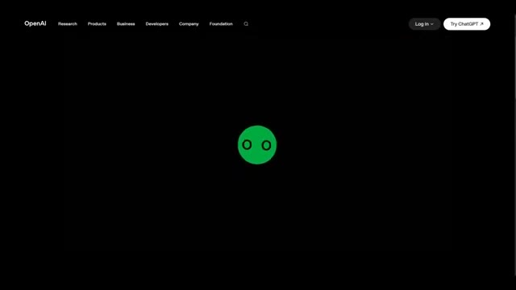
*Page d'accueil du site d'OpenAI avec un logo animé vert en forme de visage.*

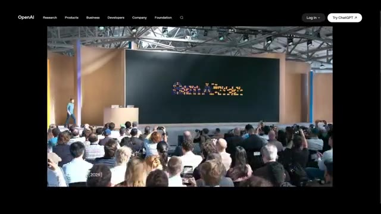
*Extrait vidéo montrant la scène d'une conférence DevDay avec un public et une grande estrade.*

---

### ⏱️ `[00:00:19 - 00:00:39]` | Segment #02

**🔊 Audio (Transcription Intégrale Mot pour Mot en Français) :**
> Et j'ai parcouru toute la liste des annonces officielles. Analysons donc tout ce qu'OpenAI a annoncé lors de la DevDay. Commençons par la plus importante. OpenAI a introduit les dots. Ce sont des agents IA permanents conçus pour prendre en charge le travail en cours. Au lieu de solliciter constamment une IA, vous donnez un objectif à un dot et il peut continuer à travailler pour vous.

**👁️ Analyse Visuelle d'Écran (gemini-3.5-flash-lite) :**
**Interface & Outils** : Présentation visuelle en images et animation vidéo du produit 'dots' d'OpenAI.

**Contenu textuel & Code** : Texte affiché 'Multiple Folders', plusieurs encadrés de style tweets/messages utilisateurs sur des fonctionnalités de Codex, et le logo lumineux 'dots'.

**Action / Démonstration** : Transition visuelle entre une présentation de scène avec des retours utilisateurs et l'introduction animée de la nouvelle fonctionnalité 'dots'.

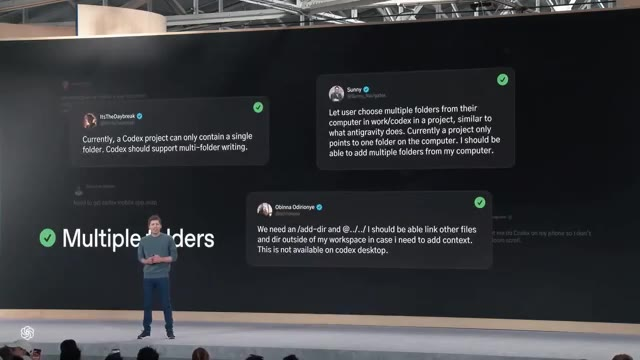
*Capture d'écran d'une présentation sur scène montrant des messages d'utilisateurs sur fond noir à côté du texte 'Multiple Folders'.*

*Animation textuelle affichant le mot 'dots' en lettres lumineuses multicolores sur fond sombre.*

*Vue de dos d'une personne assise à un bureau de contrôle avec des écrans de surveillance.*

---

### ⏱️ `[00:00:40 - 00:01:02]` | Segment #03

**🔊 Audio (Transcription Intégrale Mot pour Mot en Français) :**
> OpenAI les décrit comme des agents qui apprennent à connaître ce qui compte pour vous et qui vous soulagent des tâches importantes. Les Dots sont actuellement disponibles pour les utilisateurs Pro et Business Premium dans les marchés éligibles, tandis que les utilisateurs Enterprise, Education et Healthcare peuvent accéder à une bêta lorsque leur administrateur l'active. C'est la plus grande avancée d'OpenAI à ce jour vers une IA qui ne se contente pas de vous répondre, mais qui travaille réellement pour vous.

**👁️ Analyse Visuelle d'Écran (gemini-3.5-flash-lite) :**
**Interface & Outils** : Site web officiel d'OpenAI (page de présentation de "Dots").

**Contenu textuel & Code** : Texte descriptif de la fonctionnalité "Dots" : "Dots are remarkably capable, always-on agents built to handle everything...", options de navigation (Research, Products, Business, Developers, Company, Foundation) et menus contextuels.

**Action / Démonstration** : Navigation et défilement sur la page web du site d'OpenAI présentant la nouvelle fonctionnalité des agents "Dots".

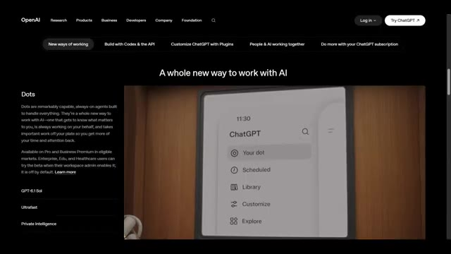
*Page web officielle d'OpenAI présentant la section "Dots" avec l'interface ChatGPT et le menu "Your dot".*

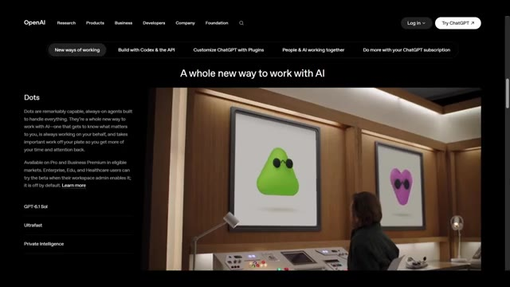
*Page web officielle d'OpenAI montrant une visualisation des agents "Dots" sous forme de formes colorées avec des lunettes de soleil.*

---

### ⏱️ `[00:01:03 - 00:01:27]` | Segment #04

**🔊 Audio (Transcription Intégrale Mot pour Mot en Français) :**
> 2. OpenAI a également lancé GPT-6.1 SOL. C'est une mise à niveau majeure de GPT-6 SOL avec un accent sur le codage agentique, l'utilisation de l'ordinateur et le travail professionnel. OpenAI affirme qu'il offre une intelligence proche d'Astra pour un cinquième des prix standard des tokens d'entrée et de sortie d'Astra. Et il est disponible via l'API ainsi que dans Plus, Pro, Business, Enterprise et Education.

**👁️ Analyse Visuelle d'Écran (gemini-3.5-flash-lite) :**
**Interface & Outils** : Site web officiel d'OpenAI présentant les nouveaux modèles de langage.

**Contenu textuel & Code** : Textes visibles : "OpenAI", "GPT-6.1 Sol", "Near-Astra intelligence for a fifth of the price", ainsi que les trois cartes des modèles : Astra, Sol, et Luna.

**Action / Démonstration** : Défilement de la page web officielle d'OpenAI présentant les caractéristiques techniques et tarifaires du nouveau modèle GPT-6.1 Sol.

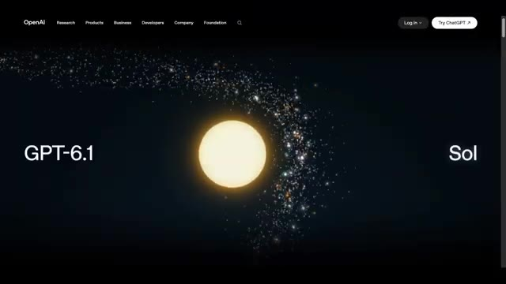
*Page d'accueil du site d'OpenAI présentant le nouveau modèle GPT-6.1 Sol avec une animation cosmique.*

*Gros plan sur le texte de présentation "GPT-6.1 Sol" sur fond étoilé.*

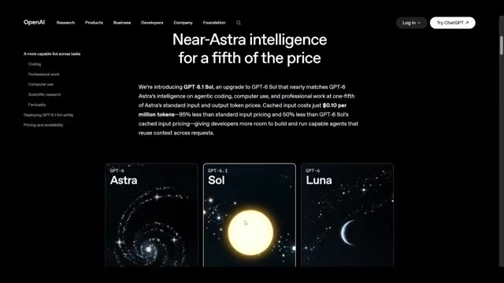
*Page web d'OpenAI détaillant les performances de GPT-6.1 Sol avec une comparaison des modèles Astra, Sol et Luna.*

---

### ⏱️ `[00:01:27 - 00:01:51]` | Segment #05

**🔊 Audio (Transcription Intégrale Mot pour Mot en Français) :**
> Donc OpenAI ne se contente pas de rendre ses modèles plus intelligents, il essaie de rendre les flux de travail agentiques puissants nettement moins chers. 3. UltraFast Ensuite, il y a UltraFast. C'est un niveau de vitesse supérieur pour les personnes qui se soucient le plus de la latence. OpenAI affirme qu'UltraFast peut offrir une génération de jetons et de codecs jusqu'à 8 fois plus rapide, atteignant 300 jetons par seconde, et une génération jusqu'à 6 fois plus rapide dans l'API.

**👁️ Analyse Visuelle d'Écran (gemini-3.5-flash-lite) :**
**Interface & Outils** : Site web officiel d'OpenAI et interface de démonstration interactive de simulation 3D.

**Contenu textuel & Code** : Titres de pages, descriptions tarifaires des jetons ("$0.10 per million tokens"), caractéristiques techniques d'Ultrafast ("300 tokens par second"), et affichage tête haute d'un jeu de simulation avec compteur de vitesse.

**Action / Démonstration** : Présentation des nouvelles offres de modèles d'OpenAI et démonstration comparative de la réactivité entre le mode Standard et le mode Ultrafast.

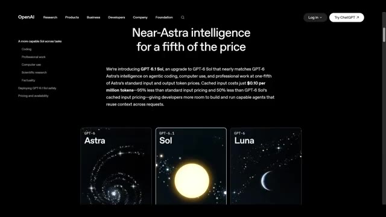
*Page web d'OpenAI présentant GPT-6.1 Sol sous le titre "Near-Astra intelligence for a fifth of the price".*

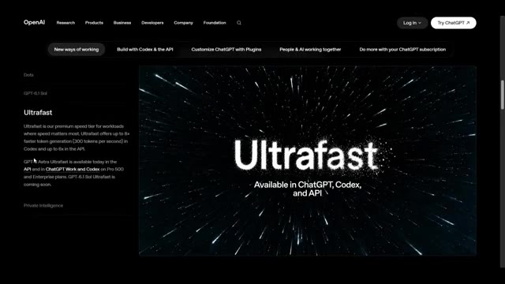
*Page web d'OpenAI détaillant le mode "Ultrafast" avec ses performances de vitesse et de latence.*

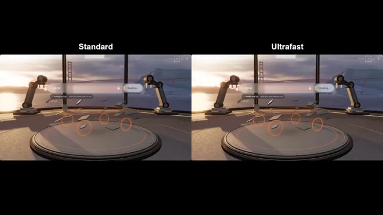
*Comparatif en écran partagé entre les modes "Standard" et "Ultrafast" sur une interface de simulation 3D.*

*Capture d'écran d'une simulation de course en 3D avec un personnage à vélo sur une route côtière.*

---

### ⏱️ `[00:01:51 - 00:02:10]` | Segment #06

**🔊 Audio (Transcription Intégrale Mot pour Mot en Français) :**
> GPT-6 Astra Ultrafast est disponible dès maintenant dans l'API et dans ChatGPT Work et les codecs pour Pro500 et Enterprise. GPT-6.1 Sol Ultrafast arrive bientôt. 4. Private Intelligence. OpenAI a également annoncé une intelligence privée pour les entreprises.

**👁️ Analyse Visuelle d'Écran (gemini-3.5-flash-lite) :**
**Interface & Outils** : Interface de démonstration comparative (écrans côte à côte) et site web officiel d'OpenAI.

**Contenu textuel & Code** : Texte affiché : "Standard" (30.3s) vs "Ultrafast" (6.4s), maquette de fusée en phase d'assemblage par des bras robotisés face à une fusée en vol propulsé. Sur l'image 3 : titre "Private Intelligence", texte explicatif sur la politique "Zero Data Retention with Private Safety Processing" et tableau de gestion de projet ("Project specific policy", "Production", "Zero Data Retention with Private Safety Processing", "customer-records-prod AWS S3 - us-east-2", statut "Validated").

**Action / Démonstration** : Comparaison côte à côte des vitesses de génération/rendu (Standard vs Ultrafast) suivie de la présentation de l'interface web de la fonctionnalité Private Intelligence d'OpenAI.

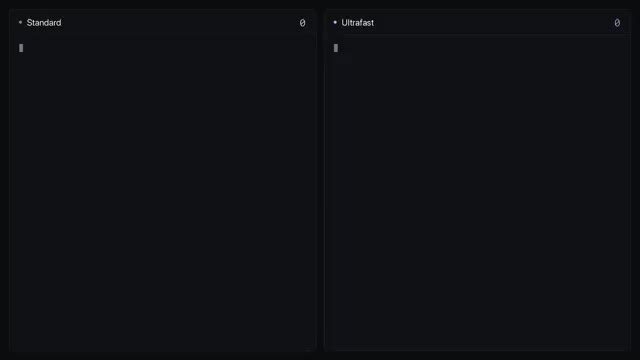
*Écran de comparaison montrant deux fenêtres noires vides aux titres "Standard" et "Ultrafast" prêtes pour le chargement.*

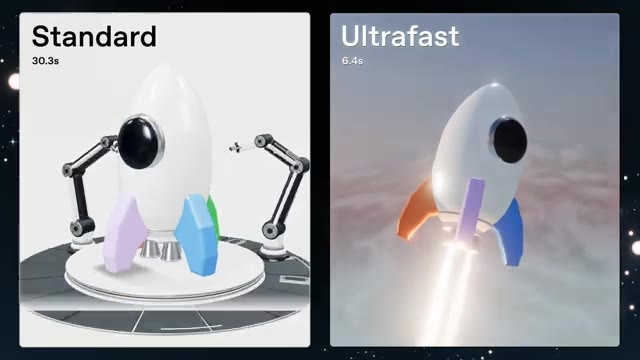
*Écran comparatif divisé en deux montrant un rendu 3D d'une fusée blanche : "Standard" en 30,3s (montage en atelier) et "Ultrafast" en 6,4s (fusée en vol).*

*Page web officielle d'OpenAI présentant la section "Private Intelligence" avec les détails sur la politique de rétention des données et le stockage externe AWS.*

---

### ⏱️ `[00:02:10 - 00:02:32]` | Segment #07

**🔊 Audio (Transcription Intégrale Mot pour Mot en Français) :**
> L'objectif est de permettre aux entreprises d'utiliser l'IA de pointe tout en ajoutant des protections renforcées autour des données sensibles. Un aspect concerne la conservation zéro des données avec un traitement de sécurité privé, qui permet des examens de sécurité automatisés sans donner au personnel d'OpenAI accès au contenu sous-jacent. OpenAI a également présenté en avant-première l'inférence privée à venir cet automne, combinant l'informatique confidentielle avec des contrôles stricts.

**👁️ Analyse Visuelle d'Écran (gemini-3.5-flash-lite) :**
**Interface & Outils** : Interface de site web d'OpenAI et affichage sur écran géant de conférence.

**Contenu textuel & Code** : "Private Intelligence", "Project specific policy", "Production", "Zero Data Retention with Private Safety Processing", "customer-records-prod", "AWS S3 - us-east-2", "Validated", ainsi que des sous-titres en anglais et chinois sur les images de conférence.

**Action / Démonstration** : Navigation sur le site web d'OpenAI présentant les fonctionnalités de sécurité et de confidentialité des données, et présentation sur scène devant un public avec des vidéos de démonstration.

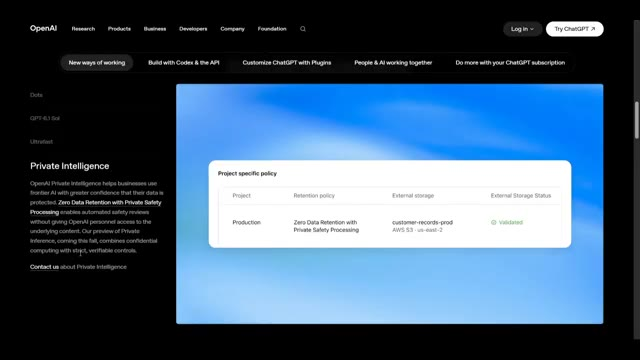
*Interface web d'OpenAI montrant la section "Private Intelligence" avec un tableau sur les politiques spécifiques aux projets ("Project specific policy").*

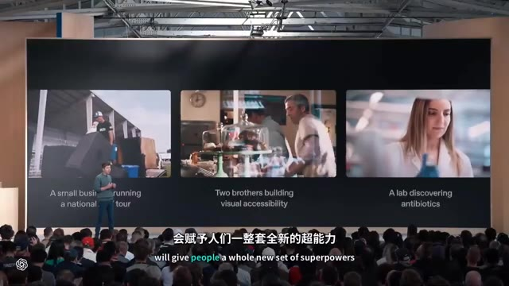
*Scène de conférence montrant un grand écran avec trois vidéos d'illustration et du texte en bas ("will give people a whole new set of superpowers").*

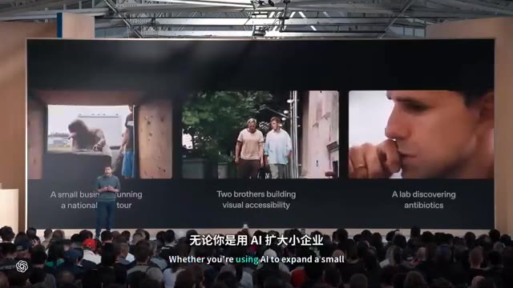
*Scène de conférence similaire montrant un grand écran avec d'autres extraits vidéo d'illustration et du texte en anglais et chinois en bas ("Whether you're using AI to expand a small...").*

---

### ⏱️ `[00:02:32 - 00:02:59]` | Segment #08

**🔊 Audio (Transcription Intégrale Mot pour Mot en Français) :**
> Maintenant passons à Codex. Et cette section est énorme. 5. Codex dans le cloud. Codex peut désormais tourner dans le cloud. Les développeurs peuvent commencer à travailler depuis un ordinateur, à distance depuis un téléphone, ou depuis pratiquement n'importe quel appareil. OpenAI introduit également des environnements de développement réutilisables pour que les équipes puissent démarrer des tâches rapidement en utilisant des paramètres et des autorisations partagés. Ainsi, votre agent de code IA n'a pas besoin de dépendre de votre ordinateur portable qui reste ouvert.

**👁️ Analyse Visuelle d'Écran (gemini-3.5-flash-lite) :**
**Interface & Outils** : Site web OpenAI et application mobile de chat/code cloud.

**Contenu textuel & Code** : Texte affiché : "Private Intelligence", "Project specific policy", "Production", "Zero Data Retention with Private Safety Processing", "And because this already feels like science fiction, why don't you have the laser, you know, animate the answer to life?", "Working for 12s", "Thinking", "And the universe", "+ Follow up".

**Action / Démonstration** : Navigation sur le site d'OpenAI puis affichage d'une interface mobile sur laquelle le présentateur interagit avec un agent cloud pour coder ou animer.

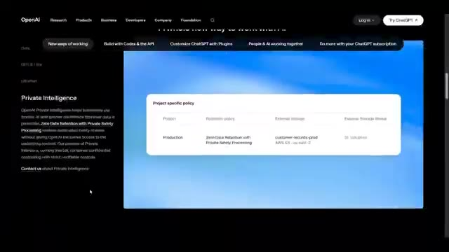
*Interface du site web d'OpenAI montrant la section "Private Intelligence" et une table des politiques spécifiques aux projets.*

*Interface mobile montrant une conversation avec un agent de code cloud (lasercube • Cloud) avec des messages textuels et un champ de saisie de suivi.*

---

### ⏱️ `[00:02:59 - 00:03:18]` | Segment #09

**🔊 Audio (Transcription Intégrale Mot pour Mot en Français) :**
> Le sixième, le Codex CLI actualisé. Le Codex CLI bénéficie d'une mise à jour majeure. Vous pouvez désormais lancer et piloter des tâches en utilisant votre voix. Il y a aussi une nouvelle vue slash agents pour déléguer le travail et suivre plusieurs tâches. OpenAI a également amélioré l'édition de prompts, la reprise de sessions, les arborescences de travail et l'interface du terminal.

**👁️ Analyse Visuelle d'Écran (gemini-3.5-flash-lite) :**
**Interface & Outils** : Site web OpenAI et interface de démonstration en direct (Fort Mason live demo) avec un panneau de chat interactif et des agents conversationnels.

**Contenu textuel & Code** : Textes : "New tools for developers in Codex & the API", "A refreshed Codex CLI", "OpenAI Codex v0.157.0", "Fort Mason live demo", "Get the Fort Mason demo ready now in a fresh in-app browser tab. Follow AGENTS.md launch-only". Sous-titres en surimpression en anglais et en chinois.

**Action / Démonstration** : Présentation de la documentation du Codex CLI sur le site web d'OpenAI, puis démonstration visuelle d'un environnement 3D piloté par des agents avec un panneau de discussion textuelle et vocale.

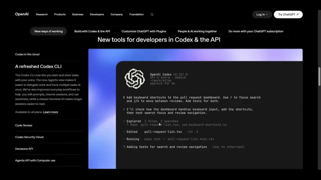
*Page web d'OpenAI présentant le nouveau Codex CLI et ses fonctionnalités dans le cloud.*

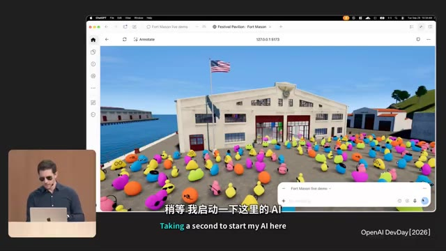
*Interface de démonstration en direct (Fort Mason live demo) montrant un environnement virtuel en 3D avec des personnages colorés et un encadré de chat.*

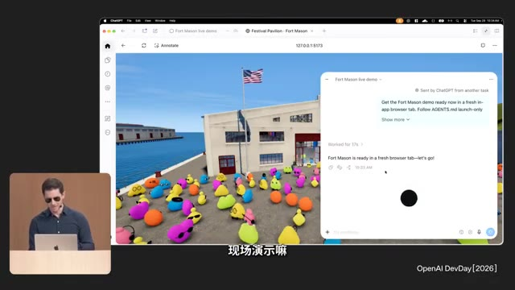
*Interface de l'application de démonstration avec un panneau de chat affichant l'historique des requêtes et des tâches terminées par l'agent.*

---

### ⏱️ `[00:03:18 - 00:03:40]` | Segment #10

**🔊 Audio (Transcription Intégrale Mot pour Mot en Français) :**
> 7. Revue de code. OpenAI a introduit une nouvelle expérience de revue de code dans l'application de bureau ChatGPT. Vous pouvez examiner les modifications entre les projets, inspecter les différences, lire des résumés et demander à Codex de détecter d'éventuels problèmes. Il peut également effectuer des examens automatiques dans le cloud pendant votre absence. Ainsi, Codex ne se contente pas d'aider à écrire le code, il aide également à le relire.

**👁️ Analyse Visuelle d'Écran (gemini-3.5-flash-lite) :**
**Interface & Outils** : Navigateur web affichant le site officiel d'OpenAI, section "New tools for developers in Codex & the API", avec la rubrique "Code Review" sélectionnée.

**Contenu textuel & Code** : En-tête du site OpenAI (Research, Products, Business, Developers, Company, Foundation, Log in, Try ChatGPT). Titre : "New tools for developers in Codex & the API". Menu latéral : Codex in the cloud, A refreshed Codex CLI, Code Review, Codex Security Cloud, Decisions API, Agents API with Computer use. Sur l'image 2, description de la fonctionnalité Code Review : "The new code review experience in the ChatGPT desktop app makes it easier to review changes across projects. You can read summaries, explore diffs, and ask Codex about potential issues before sharing feedback on GitHub pull requests or GitLab merge requests. With automatic reviews, Codex can also take a first pass in the cloud while you're away." Bouton "Learn more" et interface de l'application de bureau montrant un panneau d'activité avec des modifications de code (`nav-menu.tsx`) et un panneau de discussion à droite ("Refine merge conflict UI").

**Action / Démonstration** : Navigation sur la page web du site d'OpenAI présentant les nouveautés de Codex et de l'API pour les développeurs, mettant en avant la section Code Review.

*Page web officielle d'OpenAI présentant les nouveaux outils pour développeurs avec l'interface CLI de Codex.*

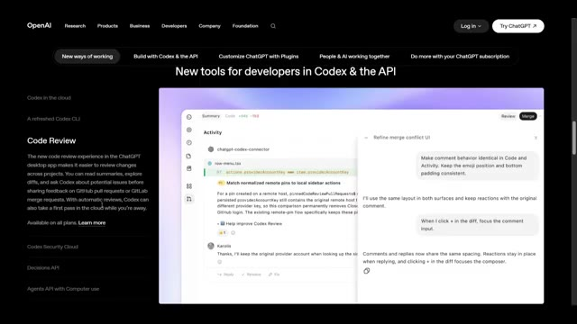
*Page web d'OpenAI montrant la section Code Review avec l'interface de l'application de bureau ChatGPT affichant l'activité et les commentaires sur le code.*

---

### ⏱️ `[00:03:40 - 00:04:01]` | Segment #11

**🔊 Audio (Transcription Intégrale Mot pour Mot en Français) :**
> Ensuite, OpenAI a introduit Codex Security Cloud. Il peut analyser des référentiels GitHub entiers, soit à la demande, soit selon un calendrier. Il peut vérifier en continu les nouveaux commits, étudier les résultats, supprimer les doublons et préparer des correctifs dans le cloud. Et OpenAI affirme qu'il inclut l'accès aux modèles proposés via Daybreak Blue sans nécessiter d'application Daybreak séparée.

**👁️ Analyse Visuelle d'Écran (gemini-3.5-flash-lite) :**
**Interface & Outils** : Interface Web d'OpenAI et tableau de bord de Codex Security Cloud.

**Contenu textuel & Code** : Texte descriptif sur le Codex Security Cloud, interface sombre avec des graphiques de pipeline de sécurité, des options de recherche, de filtrage et des menus (Overview, Findings, Repositories, Scene, Configure).

**Action / Démonstration** : Présentation des fonctionnalités de sécurité de Codex et zoom sur l'interface de gestion des vulnérabilités et des flux de remédiation.

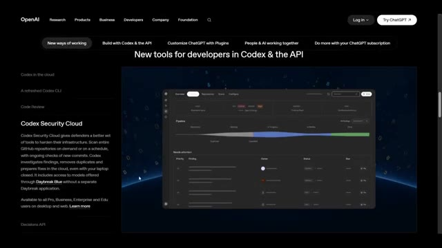
*Page Web d'OpenAI présentant Codex Security Cloud avec une capture d'interface de l'outil de sécurité.*

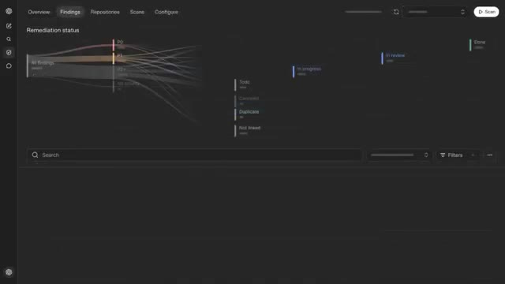
*Interface détaillée de l'outil Codex Security Cloud affichant les onglets de navigation, les résultats (Findings) et le statut de remédiation sous forme de graphique de flux.*

---

### ⏱️ `[00:04:01 - 00:04:24]` | Segment #12

**🔊 Audio (Transcription Intégrale Mot pour Mot en Français) :**
> 9. API de Décision. OpenAI a lancé l'API de Décision. Au lieu de poser une question ouverte à un modèle, les développeurs peuvent définir un ensemble spécifique de questions avec des réponses finies. Le modèle peut utiliser du texte ou des images comme contexte et renvoyer la décision appropriée. Cela peut être utilisé pour des tâches telles que la classification, le routage de requêtes ou la décision de ce qu'un agent doit faire ensuite.

**👁️ Analyse Visuelle d'Écran (gemini-3.5-flash-lite) :**
**Interface & Outils** : Page web de documentation/présentation d'OpenAI et interface de test d'API.

**Contenu textuel & Code** : Texte à l'écran : "OpenAI", "New tools for developers in Codex & the API", "Decisions API - Take action in near real-time", "customer_requests.csv", "Route these 10,000 customer requests", "Billing", "Technical", "Sales", "Responses API", "Decisions API", "~10x faster decisions", "1.6s/request", "150ms/request".

**Action / Démonstration** : Présentation de la documentation de l'API de Décision d'OpenAI, d'un exemple d'utilisation avec des requêtes clients, et d'un graphique de performance comparatif démontrant la vitesse de traitement.

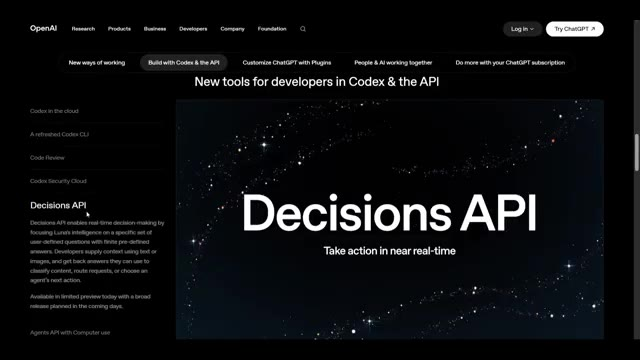
*Page web d'OpenAI présentant la nouvelle "Decisions API" pour les développeurs.*

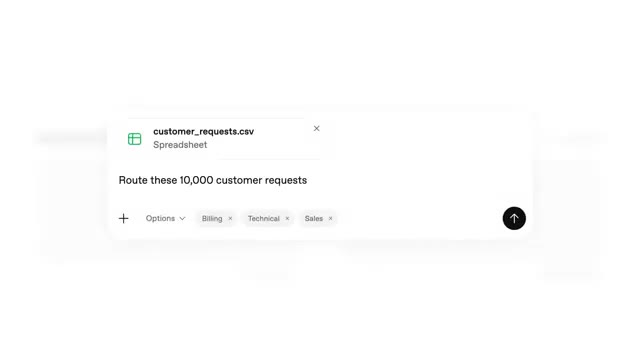
*Interface de saisie montrant un fichier CSV de requêtes clients avec un prompt de routage.*

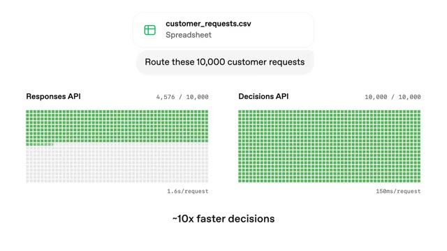
*Graphique comparatif des performances montrant que l'API de Décision est environ 10 fois plus rapide que l'API de Réponses.*

---

### ⏱️ `[00:04:24 - 00:04:48]` | Segment #13

**🔊 Audio (Transcription Intégrale Mot pour Mot en Français) :**
> Il est actuellement en version préliminaire limitée. 10. Agents API avec utilisation de l'ordinateur. L'API Agents prend désormais en charge l'utilisation de l'ordinateur. Cela signifie que les développeurs peuvent créer des agents capables d'interagir avec des logiciels pour accomplir des tâches. OpenAI intègre également dans l'API des fonctionnalités issues de Codecs, notamment des capacités multi-agents, la recherche d'outils, l'appel d'outils et la compaction du contexte.

**👁️ Analyse Visuelle d'Écran (gemini-3.5-flash-lite) :**
**Interface & Outils** : Diapositives de présentation de conférence technique OpenAI DevDay et documentation web.

**Contenu textuel & Code** : Textes visibles : "The builder stack", "Codex Harness", "Codex Cloud", "Codex Security Cloud", "Agents API", "Bedrock Managed Agents", "Private Intelligence", "Now with GPT-6 Astra computer use", et un extrait de code montrant une requête d'API de session d'agent avec "computer_use".

**Action / Démonstration** : Présentation sur scène des nouvelles fonctionnalités de l'API Agents et de son écosystème par un intervenant lors d'une conférence.

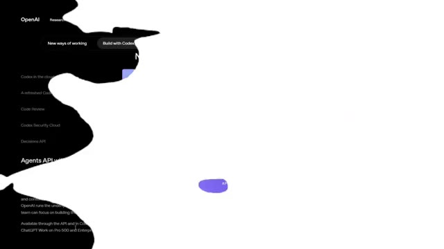
*Capture d'écran partielle de la documentation d'OpenAI montrant le titre et les détails concernant l'Agents API.*

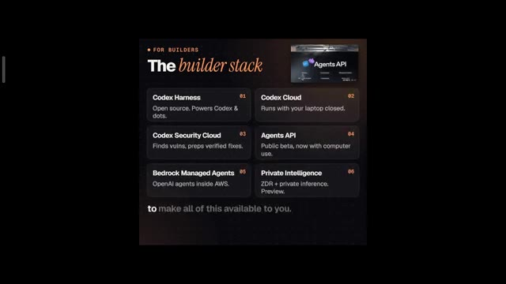
*Diapositive de présentation montrant "The builder stack" avec 6 éléments numérotés liés à l'infrastructure Codex et Agents API.*

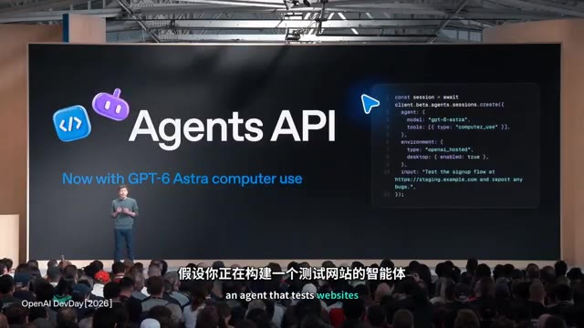
*Diapositive de présentation montrant le logo "Agents API" aux côtés d'un extrait de code affichant l'utilisation de l'API avec des outils d'IA.*

---

### ⏱️ `[00:04:48 - 00:05:09]` | Segment #14

**🔊 Audio (Transcription Intégrale Mot pour Mot en Français) :**
> OpenAI gère l'infrastructure sous-jacente afin que les développeurs puissent se concentrer sur leurs applications. 11. Bedrock Managed Agents. OpenAI s'est également associé à Amazon pour Bedrock Managed Agents. L'objectif est d'intégrer les fonctionnalités principales de l'API des agents dans AWS. Ces agents peuvent s'exécuter entièrement au sein d'AWS et s'intégrer aux ressources AWS.

**👁️ Analyse Visuelle d'Écran (gemini-3.5-flash-lite) :**
**Interface & Outils** : Présentation de conférence et site web de documentation/actualités d'OpenAI.

**Contenu textuel & Code** : Texte à l'écran : « Agents API », « Now with GPT-6 Astra computer use », extrait de code de configuration de session avec l'API, page web « Bedrock Managed Agents, powered by OpenAI », et liste des fonctionnalités avec Bedrock Managed Agents, GPT-6 Astra and Ultrafast, Codex and ChatGPT Work.

**Action / Démonstration** : Le conférencier présente les nouvelles fonctionnalités et partenariats sur une scène devant un public lors d'une conférence, tandis que les diapositives et pages web défilent.

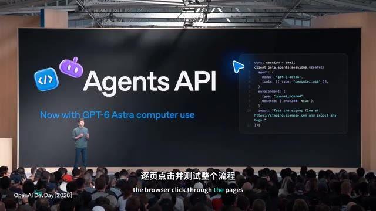
*Diapositive de conférence présentant l'Agents API d'OpenAI avec un extrait de code à droite et le conférencier sur scène.*

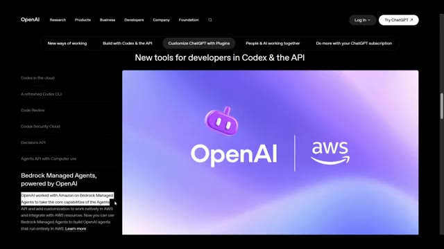
*Capture d'écran d'un site web montrant l'annonce du partenariat entre OpenAI et AWS pour Bedrock Managed Agents.*

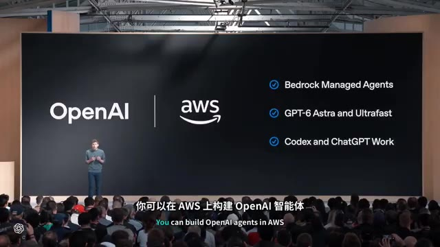
*Diapositive de conférence affichant les logos d'OpenAI et d'AWS ainsi que les points clés : Bedrock Managed Agents, GPT-6 Astra and Ultrafast, Codex and ChatGPT Work.*

---

### ⏱️ `[00:05:09 - 00:05:32]` | Segment #15

**🔊 Audio (Transcription Intégrale Mot pour Mot en Français) :**
> Ainsi, la plateforme d'agents d'OpenAI n'est pas limitée à sa propre infrastructure. 12. Extensions de plugins OpenAI ouvre la plateforme qu'elle utilise pour créer les fonctionnalités de ChatGPT afin que les développeurs puissent créer leurs propres expériences au sein de ChatGPT. Les extensions de plugins peuvent trouver leur place dans la barre latérale, créer des panneaux interactifs à côté des conversations, et les développeurs peuvent même créer des visualiseurs pour les types de fichiers pris en charge.

**👁️ Analyse Visuelle d'Écran (gemini-3.5-flash-lite) :**
**Interface & Outils** : Site web OpenAI et interface de conférence (OpenAI DevDay).

**Contenu textuel & Code** : Texte affiché : "More customization in ChatGPT with plugins", "Plugin extensions", "What will you design today?", interface DevDay [Duck], sous-titres en chinois/anglais sur la vidéo.

**Action / Démonstration** : Un conférencier présente sur grand écran les nouvelles fonctionnalités de personnalisation de ChatGPT avec les plugins, tandis que le site web d'OpenAI détaille les extensions de plugins.

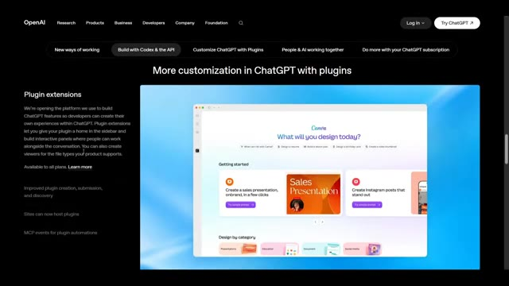
*Capture d'écran du site web officiel d'OpenAI présentant les extensions de plugins ChatGPT avec une interface de démonstration Canva.*

![Présentation en direct sur grand écran lors d'une conférence OpenAI DevDay montrant l'interface DevDay [Duck] avec des photos générées.](screenshots/YT-ixDclukqjkM/frame_040_00-05-25.jpg)
*Présentation en direct sur grand écran lors d'une conférence OpenAI DevDay montrant l'interface DevDay [Duck] avec des photos générées.*

![Vue similaire de la démonstration en direct sur grand écran lors de l'OpenAI DevDay montrant l'interface DevDay [Duck] avec des photos générées.](screenshots/YT-ixDclukqjkM/frame_041_00-05-30.jpg)
*Vue similaire de la démonstration en direct sur grand écran lors de l'OpenAI DevDay montrant l'interface DevDay [Duck] avec des photos générées.*

---

### ⏱️ `[00:05:33 - 00:05:58]` | Segment #16

**🔊 Audio (Transcription Intégrale Mot pour Mot en Français) :**
> 13. Amélioration de la création, de la soumission et de la découverte de plugins. OpenAI a également amélioré l'ensemble de l'écosystème de plugins. Un nouveau créateur de plugins est disponible pour aider à concevoir des plugins, le processus de soumission a été repensé et OpenAI améliore le classement et les recommandations pour que les utilisateurs puissent réellement découvrir des plugins pertinents. Surtout, les utilisateurs choisissent quels plugins ils utilisent et approuvent l'accès accordé à chaque plugin.

**👁️ Analyse Visuelle d'Écran (gemini-3.5-flash-lite) :**
**Interface & Outils** : Interface web d'OpenAI et interface de l'application mobile Dottie (ChatGPT plugins).

**Contenu textuel & Code** : Texte à l'écran : "More customization in ChatGPT with plugins", "Sites can now host plugins", "See beyond the numbers", avec des graphiques financiers et des aperçus d'applications. Sur l'image 3, interface de messagerie mobile avec le contact "dottie" et le message "Go build it!".

**Action / Démonstration** : Présentation des nouvelles fonctionnalités de création et d'hébergement de plugins pour ChatGPT lors d'une conférence, avec illustration à l'écran.

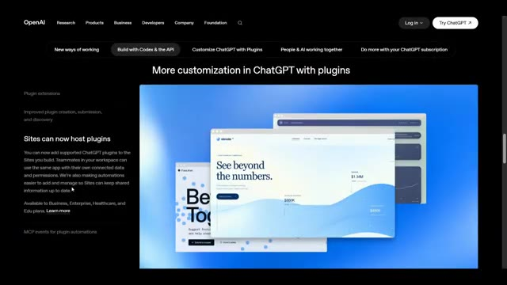
*Page web officielle d'OpenAI montrant la section sur la personnalisation de ChatGPT avec des plugins et l'hébergement de plugins sur les sites web.*

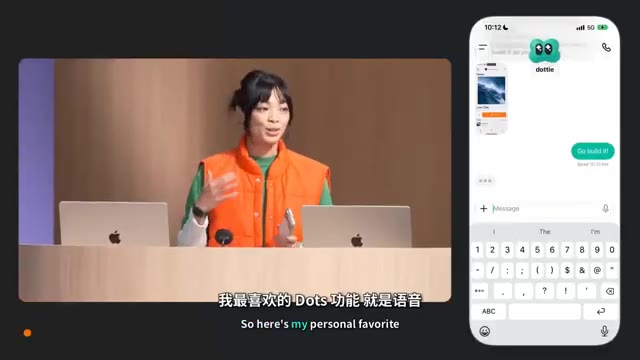
*Présentation en double affichage montrant la conférencière sur scène à gauche et l'interface mobile de l'application Dottie à droite.*

---

### ⏱️ `[00:05:58 - 00:06:19]` | Segment #17

**🔊 Audio (Transcription Intégrale Mot pour Mot en Français) :**
> 14. Les sites peuvent héberger des plugins. Les sites d'OpenAI peuvent désormais héberger des plugins ChatGPT pris en charge. Cela signifie que les équipes peuvent créer un site et donner aux coéquipiers accès à la même application tout en conservant leurs propres données connectées et autorisations. OpenAI facilite également l'ajout et la gestion des automatisations. 15. Événements MCP pour les automatisations de plugins.

**👁️ Analyse Visuelle d'Écran (gemini-3.5-flash-lite) :**
**Interface & Outils** : Navigateur web affichant une page d'information du site officiel d'OpenAI concernant les plugins ChatGPT et les fonctionnalités de personnalisation.

**Contenu textuel & Code** : Titres et texte visible sur la page : "More customization in ChatGPT with plugins", "Sites can now host plugins", "MCP events for plugin automations", avec des visuels graphiques d'interfaces d'applications et des icônes explicatives.

**Action / Démonstration** : Affichage de la documentation et des nouveautés sur le site web d'OpenAI concernant l'intégration de plugins et d'automatisations.

*Page web d'OpenAI présentant la personnalisation dans ChatGPT avec les plugins et l'hébergement de plugins sur les sites.*

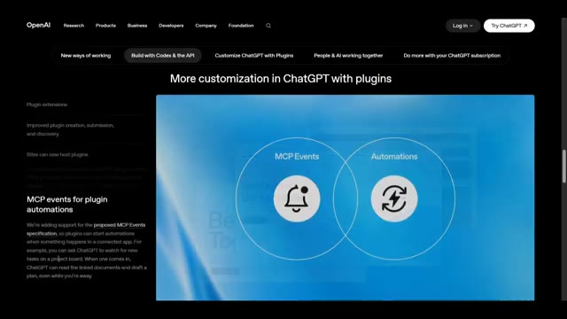
*Page web d'OpenAI illustrant les événements MCP pour les automatisations de plugins avec deux cercles représentant MCP Events et Automations.*

---

### ⏱️ `[00:06:19 - 00:06:52]` | Segment #18

**🔊 Audio (Transcription Intégrale Mot pour Mot en Français) :**
> Celle-ci est particulièrement intéressante pour les développeurs. OpenAI ajoute le support de la spécification d'événements MCP proposée, qui permet aux plugins de déclencher des automatisations lorsqu'un événement se produit dans une application connectée. Par exemple, une nouvelle tâche apparaît sur votre tableau de bord de projet. ChatGPT le remarque. Il lit les documents liés et peut rédiger un plan automatiquement, même pendant votre absence. C'est une étape majeure vers les agents IA pilotés par événements. Maintenant, OpenAI change la façon dont les gens travaillent avec l'IA. 16. Espace ChatGPT.

**👁️ Analyse Visuelle d'Écran (gemini-3.5-flash-lite) :**
**Interface & Outils** : Interface logicielle de type espace de travail collaboratif ou "ChatGPT space" (Codex / application web de gestion de projet et de notes).

**Contenu textuel & Code** : Texte affiché à l'écran : "Codec", "Blossom Music", "Low Tide", "FAQ", "Customer Feedback", ainsi que des options de menu contextuel ("Visualize", "Page", "Image", "File", "Heading 1", etc.) et des sous-titres incrustés en chinois et en anglais.

**Action / Démonstration** : Navigation et démonstration d'un espace de travail collaboratif permettant de rédiger et d'interagir avec des documents et des agents IA.

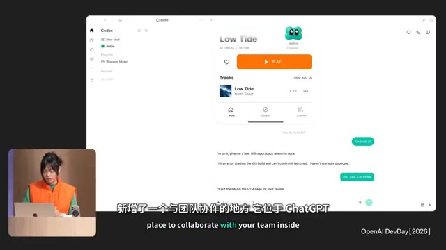
*Interface d'une application de type espace de travail de projet (Codec / ChatGPT space) affichant un lecteur audio et des fenêtres de discussion textuelle.*

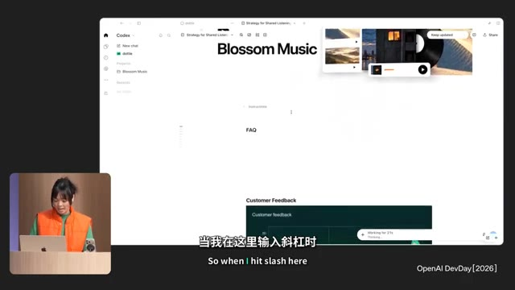
*Interface du document "Blossom Music" dans l'espace de travail avec des sections FAQ et Customer Feedback.*

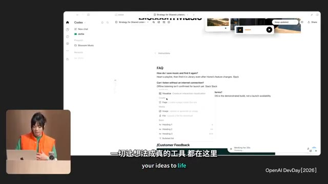
*Menu contextuel affiché dans l'éditeur de texte lors de l'utilisation d'une commande textuelle (slash command).*

---

### ⏱️ `[00:06:52 - 00:07:11]` | Segment #19

**🔊 Audio (Transcription Intégrale Mot pour Mot en Français) :**
> Considérez-le comme un espace de travail partagé où votre équipe, ChatGPT et votre DOT peuvent travailler ensemble. Il utilise des connaissances partagées et peut maintenir l'espace de travail organisé selon vos instructions. Ainsi, au lieu que l'IA ne soit qu'une conversation parmi des centaines, vous obtenez un environnement persistant pour un projet. 17. Pages Ensuite, il y a les pages.

**👁️ Analyse Visuelle d'Écran (gemini-3.5-flash-lite) :**
**Interface & Outils** : Interface logicielle de type tableau de bord ou espace de travail ("ChatGPT Space" / "Dispatch beta tracker") affichant des données et graphiques.

**Contenu textuel & Code** : Texte affiché à l'écran : "Dispatch beta tracker", "September traffic review", graphiques à barres, rubriques de menu à droite incluant "Living Pages", "Work with dots", "Manage Pages", et "Presentations".

**Action / Démonstration** : Le conférencier présente l'interface de gestion des pages et des espaces de travail persistants devant un public assis.

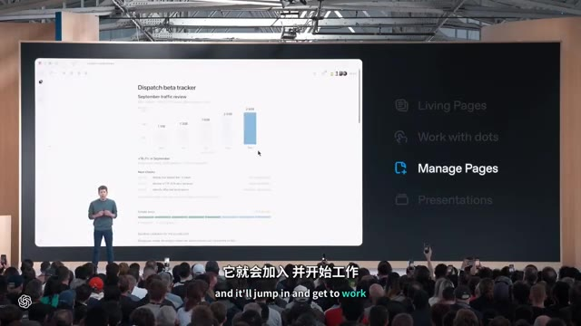
*Présentation sur grand écran affichant l'interface logicielle "Manage Pages" avec des graphiques de suivi de trafic et le conférencier sur scène devant le public.*

---

### ⏱️ `[00:07:11 - 00:07:31]` | Segment #20

**🔊 Audio (Transcription Intégrale Mot pour Mot en Français) :**
> Les pages sont des documents conçus spécifiquement pour la collaboration entre les humains et les agents d'IA. Vous pouvez écrire dessus, faire des recherches, générer des graphiques, créer des images, visualiser des informations et inviter votre équipe à y contribuer. En gros, OpenAI transforme ChatGPT en espace de travail collaboratif plutôt qu'en simple interface de chat.

**👁️ Analyse Visuelle d'Écran (gemini-3.5-flash-lite) :**
**Interface & Outils** : Interface de présentation d'OpenAI DevDay montrant un espace de travail collaboratif (Pages et Presentations).

**Contenu textuel & Code** : Texte affiché sur l'écran principal : "Living Pages", "Work with dots", "Manage Pages", "Presentations" avec le texte "Help me keep this page up to date." sur l'image 1, et "Relay Dispatch", "Monthly operating review", "September 2026" sur l'image 2.

**Action / Démonstration** : Le présentateur est sur scène devant un grand écran affichant des démonstrations de fonctionnalités logicielles d'OpenAI.

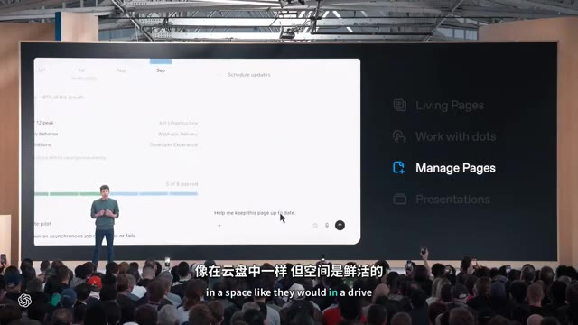
*Présentation sur grand écran montrant l'interface des pages de ChatGPT avec des graphiques et des options de gestion.*

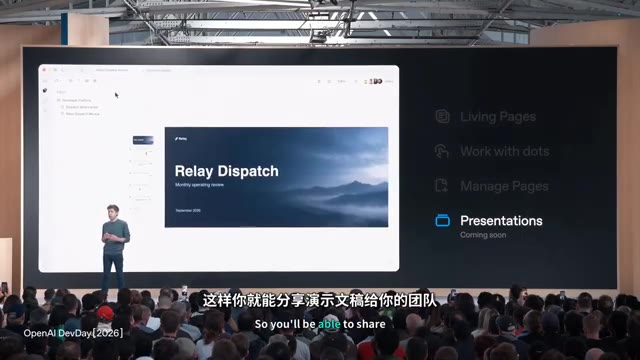
*Présentation sur grand écran montrant une interface de présentation intitulée "Relay Dispatch" avec des options de collaboration.*

---

### ⏱️ `[00:07:31 - 00:07:50]` | Segment #21

**🔊 Audio (Transcription Intégrale Mot pour Mot en Français) :**
> 1-N-N-17. Diapositives collaboratives. OpenAI a également présenté un aperçu des diapositives collaboratives. Les équipes et les agents IA pourront modifier des présentations en même temps. Les gens peuvent laisser des commentaires. Vous pouvez présenter directement dans ChatGPT, et vous pouvez exporter le diaporama final vers PowerPoint ou Google Slides tout en conservant la mise en forme.

**👁️ Analyse Visuelle d'Écran (gemini-3.5-flash-lite) :**
**Interface & Outils** : Interface de présentation de diapositives d'OpenAI sur écran géant (type ChatGPT / outil de présentation).

**Contenu textuel & Code** : Texte à l'écran : "API requests grew 18.2% in September", graphiques de croissance mensuelle, "2.40B", sections latérales : "Living Pages", "Work with dots", "Manage Pages", "Presentations - Coming soon".

**Action / Démonstration** : Le conférencier présente les nouvelles fonctionnalités de diapositives collaboratives sur scène devant un public.

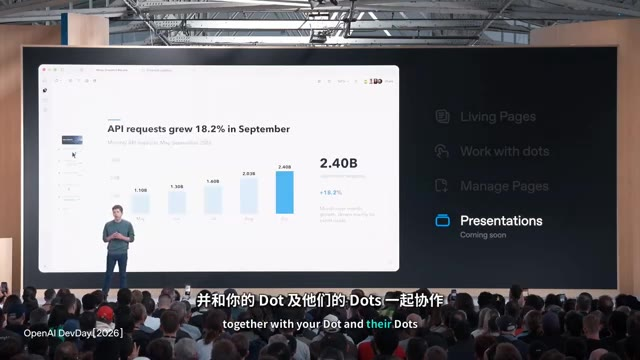
*Vue d'ensemble de la scène lors de la présentation avec un grand écran affichant l'interface des diapositives collaboratives et le conférencier sur scène.*

---

### ⏱️ `[00:07:50 - 00:08:09]` | Segment #22

**🔊 Audio (Transcription Intégrale Mot pour Mot en Français) :**
> Cela arrive dans les semaines à venir. 19. Créez des équipes et partagez des tâches. Les entreprises peuvent désormais créer des équipes à l'intérieur de ChatGPT. Les équipes peuvent partager des pages, des diapositives, des plugins et des feuilles de calcul. Vous pouvez également déléguer du travail récurrent. Par exemple, créer notre point de situation sur le projet chaque lundi.

**👁️ Analyse Visuelle d'Écran (gemini-3.5-flash-lite) :**
**Interface & Outils** : Navigateur web affichant une page officielle d'OpenAI et interface de messagerie professionnelle.

**Contenu textuel & Code** : Texte à l'écran : "Improving how people and AI work together", "Create teams and share tasks", ainsi qu'une interface simulant une vue d'équipe planifiée avec des graphiques de ventes et des messages de chat.

**Action / Démonstration** : Présentation de la nouvelle fonctionnalité professionnelle de ChatGPT permettant de travailler en équipe, de partager des outils et de déléguer des tâches récurrentes.

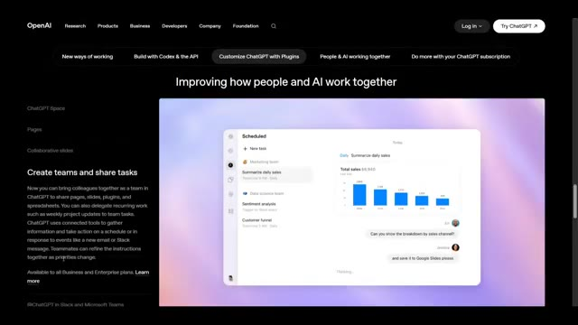
*Page web d'OpenAI présentant la fonctionnalité de création d'équipes et de partage de tâches dans ChatGPT avec une illustration interactive.*

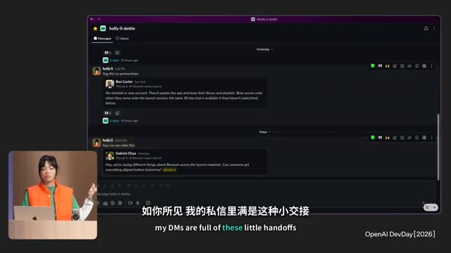
*Interface d'une application de messagerie (type Slack) montrant des fils de discussion avec un encadré vidéo (PiP) d'une intervenante sur scène.*

---

### ⏱️ `[00:08:09 - 00:08:27]` | Segment #23

**🔊 Audio (Transcription Intégrale Mot pour Mot en Français) :**
> ChatGPT peut utiliser des outils connectés pour rassembler des informations et agir selon un calendrier ou des événements tels qu'un nouvel e-mail ou un message Slack. 20 chez OpenAI intègre ChatGPT directement dans les conversations de travail. Vous pouvez mentionner @ChatGPT dans un canal Slack ou Microsoft Teams, un fil de discussion ou un message direct.

**👁️ Analyse Visuelle d'Écran (gemini-3.5-flash-lite) :**
**Interface & Outils** : Interface de Slack (mode sombre) avec la présentation d'une conférencière en incrustation (PiP) dans le coin inférieur gauche.

**Contenu textuel & Code** : On peut lire des messages de discussion dans un canal Slack nommé « 29 Sep - Launch », incluant des messages d'utilisateurs et de l'agent ChatGPT, ainsi que des sous-titres en anglais et en chinois.

**Action / Démonstration** : L'écran présente une démonstration de l'intégration de ChatGPT dans l'application de messagerie professionnelle Slack.

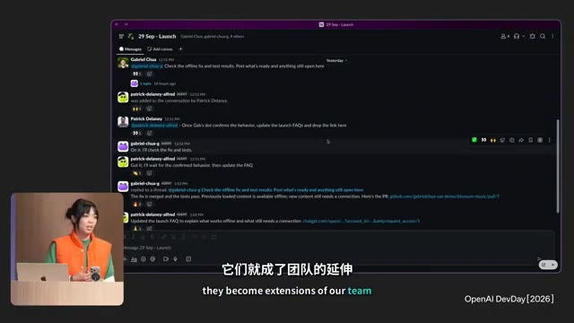
*Interface de Slack montrant une conversation d'équipe où ChatGPT est intégré et interagit avec les utilisateurs.*

---

### ⏱️ `[00:08:28 - 00:08:36]` | Segment #24

**🔊 Audio (Transcription Intégrale Mot pour Mot en Français) :**
> Il peut utiliser des outils connectés par votre administrateur ou vos propres outils autorisés. Et les coéquipiers peuvent continuer à affiner le résultat directement dans la conversation.

**👁️ Analyse Visuelle d'Écran (gemini-3.5-flash-lite) :**
**Interface & Outils** : Application de messagerie collaborative ou fil de discussion d'équipe (type Slack / Canvas / ChatGPT Space).

**Contenu textuel & Code** : Fil de discussion de groupe nommé "29 Sep - Launch" avec des interventions de Gabriel Chua, Patrick Delaney et des agents IA, incluant des liens vers GitHub (`github.com/gabriel-chua-oai-demo/blossom-music/pull/7`) et des statuts de messages. Sous-titres bilingues en bas de l'écran (chinois et anglais : "this one step further"). Mention "OpenAI DevDay [2026]" en bas à droite.

**Action / Démonstration** : Affichage d'une interface de travail collaborative en ligne montrant les échanges entre membres d'une équipe et agents d'intelligence artificielle.

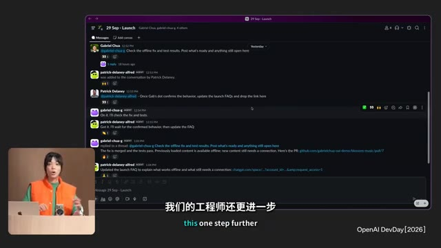
*Interface de collaboration textuelle (type Slack ou plateforme de discussion d'équipe) affichée en grand écran, avec un encadré vidéo du présentateur en bas à gauche.*

---
