# 🎬 Gemini 4 Argon est bien plus puissant qu'on ne le pensait

> **Chaîne** : [Pursuing AI](https://www.youtube.com/@PursuingAi)  
> **Titre original** : `Gemini 4 Argon Is Way More Powerful Than We Thought`  
> **Lien YouTube** : [https://www.youtube.com/watch?v=gLSsLtIYMG4](https://www.youtube.com/watch?v=gLSsLtIYMG4)  
> **Date de publication** : 2026-10-02  
> **Durée** : 11m 00s (`660s`)  
> **Identifiant vidéo** : `gLSsLtIYMG4`  
> **Fiche Web Interactive** : [2026-10-02_YT-gLSsLtIYMG4_Gemini 4 Argon est bien plus puissant qu'on ne le pensait_by-whisper-v3-large-turbo+gemini-3.5-flash-lite.html](2026-10-02_YT-gLSsLtIYMG4_Gemini 4 Argon est bien plus puissant qu'on ne le pensait_by-whisper-v3-large-turbo+gemini-3.5-flash-lite.html)  
> **Captures de démonstration clés** : `61 captures réelles (anti-talking-head)`  
> **Modèles utilisés** : Audio: `large-v3-turbo` (Faster-Whisper int8 VPS) | Vision: `gemini-3.5-flash-lite` (Google AI Studio API)  

---

## 📌 Synthèse Exécutive & Outils

### 📌 Résumé
La vidéo de Pursuing AI décrypte l'émergence et les capacités impressionnantes des points de contrôle (checkpoints) fuis de « Gemini 4 Argon », le prochain grand modèle de Google. Loin des simples artefacts textuels ou des pages HTML basiques, Argon démontre une aptitude remarquable à concevoir des environnements interactifs complexes, des simulations physiques et des interfaces fonctionnelles à la volée. Le créateur mène une analyse comparative rigoureuse de plusieurs cas d'usage — d'un monde inspiré de Minecraft à une simulation optique de lentilles, en passant par une manette Xbox interactive en SVG et un modèle de dynamique des fluides.

Pour structurer son analyse, le vidéaste adopte une méthode étape par étape : il commence par évaluer l'échelle spatiale des environnements générés (en vérifiant la cohérence globale et les transitions de caméra), puis il teste la profondeur logique du modèle face à des problèmes scientifiques et techniques (comme le traçage de rayons ou la physique de l'eau), avant d'examiner l'utilité pratique des interfaces générées. Cette approche permet de distinguer le battage médiatique des capacités réelles de l'IA.

Pour les créateurs de vidéo et les concepteurs d'expériences numériques, les enseignements sont majeurs. Argon illustre le passage d'une IA générative visuellement passive à un outil de prototypage interactif capable de fusionner code, design 3D et logique comportementale. Bien que ces démos ne remplissent pas des fonctions physiques parfaites à ce stade, elles redéfinissent la manière dont les créateurs peuvent imaginer la visualisation de données complexes, la fabrication d'interfaces et l'immersion spatiale pour leurs productions futures.

### 🛠️ Outils, Modèles & Logiciels Présentés
* **Gemini 4 Argon** : Modèle de pointe (points de contrôle fuis) de Google, capable de générer des environnements interactifs complexes, des simulations physiques et du code vectoriel dynamique.
* **Seedance 2.5** : Solution de génération et de manipulation vidéo par IA mentionnée dans le contexte global de l'écosystème.
* **Kling 3.0** : Modèle avancé de génération vidéo par IA utilisé pour le rendu et le mouvement de caméra.
* **Midjourney** : Outil de référence pour la création d'images statiques et de concepts visuels initiaux.

### 🔑 Points Clés & Enseignements Stratégiques
* **Dépassement du HTML basique** : Argon ne se contente pas de cracher des lignes de code statiques, il conçoit des écosystèmes visuels et logiques complets à partir d'un simple prompt.
* **Évaluation de l'échelle spatiale** : Dans la démo style Minecraft, l'intérêt réside dans la capacité du modèle à connecter des environnements variés (plages, forêts, montagnes) de manière cohérente à l'échelle globale.
* **Gestion des mouvements de caméra** : Le recul de la caméra pour observer le monde généré d'en haut prouve une structuration spatiale tridimensionnelle solide, malgré quelques défauts de rendu sur les bords.
* **Simulation physique contenue** : La démo de la lentille montre qu'Argon peut matérialiser visuellement des flux (chemins de rayons lumineux) et intégrer des contrôles interactifs au sein de la même scène.
* **Génération de vecteurs fonctionnels (SVG)** : Le modèle est capable de produire des objets complexes, comme une manette Xbox, intégrant du code vectoriel et des options de personnalisation colorimétrique en temps réel.
* **Interactivité prioritaire sur les graphismes** : Pour des cas d'usage comme la simulation de fluides, l'intérêt d'Argon réside dans sa capacité à lier une animation continue à des paramètres modifiables par l'utilisateur.
* **Prototypage pour l'ingénierie** : Argon transforme des manuels techniques et des diagrammes complexes en modèles 3D interactifs où l'on peut isoler et inspecter chaque composant spatialement.
* **Nuance face au battage médiatique** : L'analyste rappelle qu'il ne faut pas crier au « système physique parfait » : ces démos relèvent du prototypage intermédiaire et nécessitent un recul critique sur l'exactitude des calculs.
* **Gain de productivité narrative** : Remplacer l'explication textuelle par un environnement 3D interactif réduit drastiquement la friction cognitive pour comprendre des systèmes de fabrication ardus.
* **Workflow de validation par checkpoints** : L'examen des fuites de points de contrôle permet d'anticiper les futurs standards de l'industrie, où l'IA générera des applications fonctionnelles et non plus de simples images.
* **Piège à éviter dans les prompts** : Ne pas se limiter à demander une belle image ; il faut pousser le modèle à structurer l'interactivité, l'ergonomie et la logique comportementale de l'objet créé.

---

## ⏱️ Chronologie & Transcription Complète Audio & Visuelle (Mot pour Mot)

### ⏱️ `[00:00:00 - 00:00:23]` | Segment #01

**🔊 Audio (Transcription Intégrale Mot pour Mot en Français) :**
> Gemini 4 Argon est un dragon. Et non, je ne plaisante pas. Parce qu'aujourd'hui, je vais vous montrer des points de contrôle (checkpoints) fuites de Gemini 4 Argon qui pourraient bien vous faire croire que cette chose est un dragon. Et ça devient encore plus fou car Argon répare bizarrement ce mème exact. J'ai parcouru ces points de contrôle, examiné ce qu'ils peuvent réellement faire, et certains des résultats sont sérieusement bizarres.

**👁️ Analyse Visuelle d'Écran (gemini-3.5-flash-lite) :**
**Interface & Outils** : Mèmes animés illustrant des modèles d'IA, suivis d'une interface de simulation 3D (AquaLab).

**Contenu textuel & Code** : Textes des étiquettes des têtes du dragon : 'Opus 5.5', 'SONNET 5.5', 'GPT-6 SOL', 'Gemini'. Panneau latéral d'AquaLab affichant 'SIMULATION PARAMETERS' et divers curseurs de contrôle de fluides et d'éclairage.

**Action / Démonstration** : Présentation visuelle de mèmes humoristiques sur les IA, transition vers une animation texturée, puis démonstration d'une interface de simulation de fluides 3D.

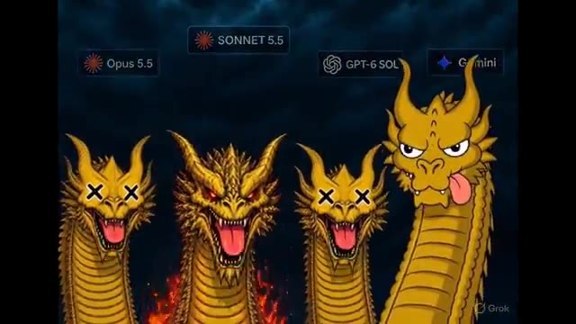
*Mème animé représentant un dragon à quatre têtes associé à différents modèles d'IA (Opus 5.5, Sonnet 5.5, GPT-6 SOL, Gemini) dont la tête de Gemini apparaît loufoque.*

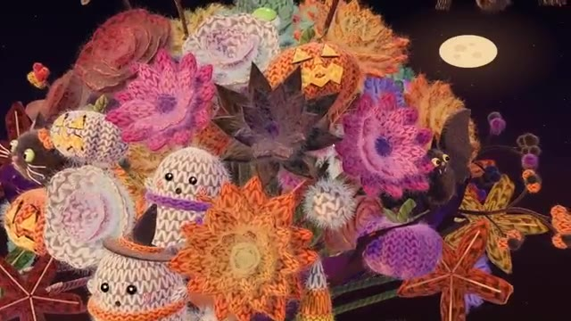
*Animation colorée et texturée ressemblant à des fleurs en tricot ou en laine sous un ciel étoilé avec une lune.*

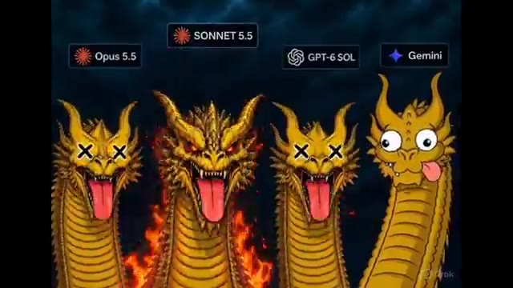
*Mème animé du dragon à quatre têtes montrant la tête de Gemini avec une expression idiote et la langue tirée.*

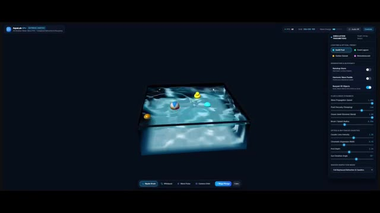
*Interface logicielle de simulation physique 3D nommée AquaLab affichant un bassin d'eau avec des objets flottants et divers paramètres ajustables sur le panneau latéral.*

---

### ⏱️ `[00:00:23 - 00:00:56]` | Segment #02

**🔊 Audio (Transcription Intégrale Mot pour Mot en Français) :**
> Donc, dans cette vidéo, nous allons voir ce qu'est réellement Gemini 4 Argon, pourquoi les gens l'appellent un dragon et ce que ces points de contrôle pourraient révéler sur le prochain grand modèle de Google. Entrons dans le vif du sujet. C'est Pursuing AI et vous regardez The Research Report. Maintenant, l'une des premières démos que j'ai rencontrées était cet environnement de style Minecraft. Et honnêtement, si vous suivez les modèles de codage par IA, vous avez probablement déjà vu ce genre de démo une douzaine de fois. Je ne vais donc pas m'asseoir ici pour vous dire, les gars, l'IA peut créer Minecraft maintenant. Nous le savons déjà. Ce que je voulais réellement

**👁️ Analyse Visuelle d'Écran (gemini-3.5-flash-lite) :**
**Interface & Outils** : Interface de publication sur le réseau social X (anciennement Twitter) et interface graphique d'un jeu style Minecraft affiché en plein écran.

**Contenu textuel & Code** : Texte visible : "Gemini 4 Argon: Minecraft in a single html. credit: @Inmerson", profil de tweet "@dummerspast39" avec le texte "anti ai lobby china shill big hater", interface utilisateur du jeu Minecraft en bas (barre d'inventaire) et panneaux d'information textuelle en haut.

**Action / Démonstration** : Le créateur présente un tweet illustrant la démo de Minecraft générée par Gemini 4 Argon, puis bascule sur un aperçu en jeu montrant des animaux cubiques se déplaçant près de l'eau.

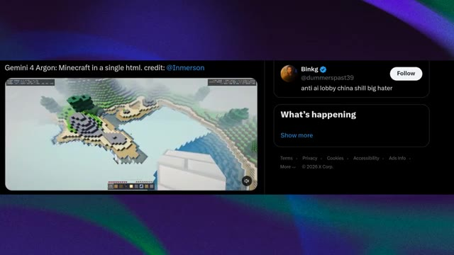
*Capture d'écran montrant une publication sur X (Twitter) titrée « Gemini 4 Argon: Minecraft in a single html » avec un tweet associé de Binkg.*

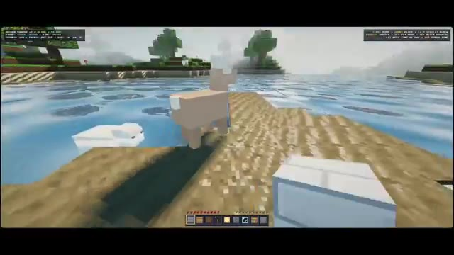
*Démonstration à l'écran d'un environnement de type Minecraft en 3D avec des animaux cubiques au bord de l'eau.*

---

### ⏱️ `[00:00:56 - 00:01:27]` | Segment #03

**🔊 Audio (Transcription Intégrale Mot pour Mot en Français) :**
> de voir à quel point Argon est doué pour construire l'expérience elle-même. Et en regardant cette démo, il y a plusieurs choses qui sautent immédiatement aux yeux. D'abord, le monde n'est pas juste une toute petite scène. Vous pouvez passer sous l'eau pour aller sur la plage, à travers les forêts, à travers le terrain, et soudain vous regardez ces immenses montagnes enneigées. Et puis la partie vraiment intéressante, c'est quand la caméra recule. On peut réellement voir tout cet environnement d'en haut, les îles, l'eau, les montagnes, les différentes couches de terrain, toutes connectées ensemble.

**👁️ Analyse Visuelle d'Écran (gemini-3.5-flash-lite) :**
**Interface & Outils** : Interface de démonstration du moteur Argon (visuellement similaire à l'interface de type Minecraft avec HUD, inventaire et superpositions de débogage textuelles en haut à gauche et à droite).

**Contenu textuel & Code** : Superpositions textuelles incluant des données de performance (FPS, coordonnées x/y/z, faces, etc.) et des commandes de contrôle en haut à droite (ex: [1] [C] CLASSIFY ROAD, [2] [V] SMOOTH SPLINE). Barre d'outils/inventaire visible au bas de l'écran.

**Action / Démonstration** : Le créateur démontre la navigation fluide à travers différents biomes (plage, forêt, montagnes enneigées) avant d'effectuer un dézoom global pour montrer l'ensemble de l'environnement connecté vu du ciel.

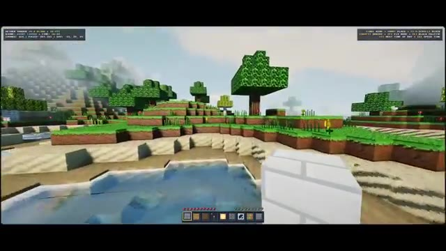
*Vue d'un paysage de type Minecraft avec plage, arbres et eau, affichant des informations de débogage en haut et une barre d'inventaire en bas.*

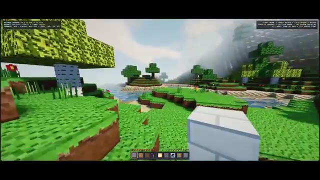
*Navigation à travers la forêt et le terrain ensoleillé avec des montagnes brumeuses en arrière-plan.*

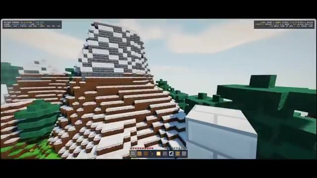
*Vue rapprochée de montagnes enneigées et rocheuses générées dans le moteur d'Argon.*

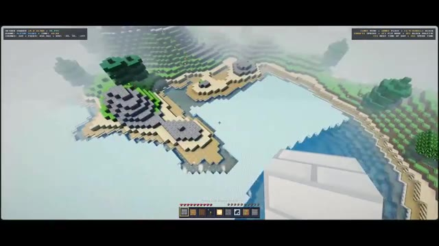
*Vue aérienne globale dézoomée montrant l'ensemble de l'environnement avec les îles, l'eau et les couches de terrain connectées.*

---

### ⏱️ `[00:01:27 - 00:02:00]` | Segment #04

**🔊 Audio (Transcription Intégrale Mot pour Mot en Français) :**
> Maintenant, est-ce parfait ? Absolument pas. Vous pouvez voir des problèmes de rendu assez évidents, en particulier autour des bords du monde et de certains terrains. Mais honnêtement, ce n'est pas sur cela que je jugerais cette démo. Pour moi, la question intéressante est : quelle part de tout cela Argonne a-t-il réellement dû concevoir par lui-même ? Parce que lorsque vous examinez ces modèles, c'est la partie qui m'importe, pas seulement de savoir s'il peut produire quelque chose d'impressionnant, mais combien de travail j'ai réellement dû fournir pour y arriver ? Et d'après ce que nous voyons ici, Argon fait clairement beaucoup plus que simplement cracher une page HTML de base. Et c'est exactement pour cela que je voulais creuser

**👁️ Analyse Visuelle d'Écran (gemini-3.5-flash-lite) :**
**Interface & Outils** : Interface de jeu inspirée de Minecraft affichée en plein écran avec des informations de débogage textuelles en haut (FPS, coordonnées) et une barre d'inventaire en bas, puis interface d'un réseau social (X/Twitter) affichant une publication.

**Contenu textuel & Code** : Textes visibles à l'écran : "NETHER SHADOW v0.2 ULTRA • 100 FPS", "CHUNKS: 144 | FACES: 251,732 | XYZ: -39, 91, -100", "CLICKS MOUSE | SHIFT+S: SPRINT | [F]: FLY MODE | [G]: BLACK PALETTE", "Gemini 4 Argon: Minecraft in a single html. credit: @Inmerson", et le tweet de @dummerspast39 "anti ai lobby china shill big hater".

**Action / Démonstration** : Le créateur navigue et zoome sur le monde généré en 3D pour mettre en évidence les problèmes de rendu et de bordure du terrain, avant de montrer une publication sur les réseaux sociaux commentant la démo.

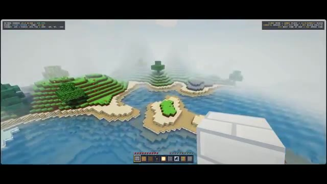
*Vue aérienne du jeu inspiré de Minecraft avec des problèmes de rendu visibles sur les bords du terrain et des îles.*

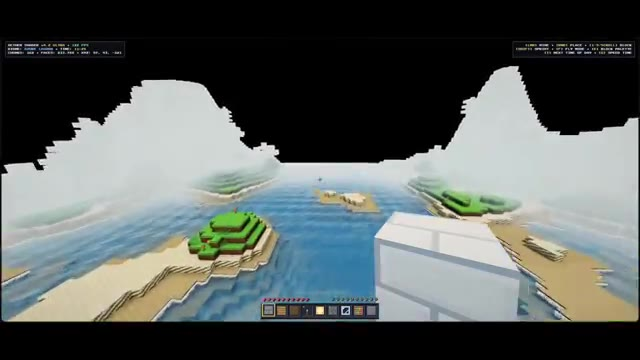
*Affichage du rendu avec des zones noires et des défauts sur les montagnes en arrière-plan.*

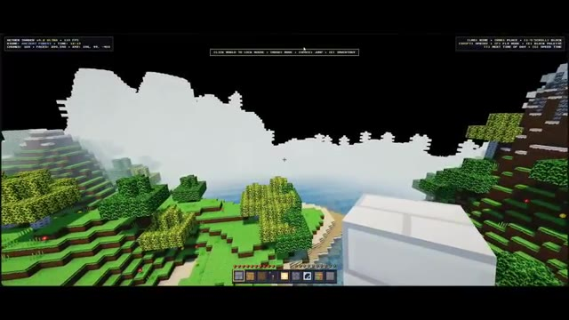
*Gros plan sur le monde de type Minecraft montrant l'interface du jeu et les graphismes en blocs.*

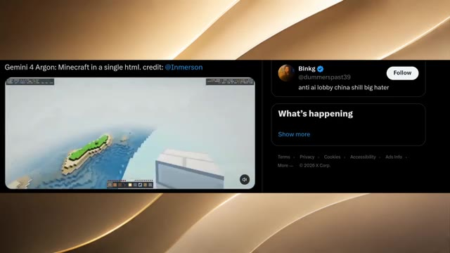
*Capture d'écran d'un tweet montrant la vidéo du projet "Gemini 4 Argon: Minecraft in a single html" avec un commentaire sur les réseaux sociaux.*

---

### ⏱️ `[00:02:00 - 00:02:29]` | Segment #05

**🔊 Audio (Transcription Intégrale Mot pour Mot en Français) :**
> ces points de contrôle un peu plus en profondeur. Parce que la démo de Minecraft est sympa, mais ce n'est même pas la chose la plus intéressante que j'ai trouvée. Et cela nous amène à quelque chose de complètement différent. Cette fois, au lieu de demander à Argon de créer quelque chose qui ressemble à un jeu, quelqu'un lui a demandé de construire une simulation physique d'une lentille. Et on peut réellement voir ce qui se passe ici. Il y a une source lumineuse d'un côté, les rayons sont visualisés au fur et à mesure qu'ils traversent la scène, ils passent à travers ces éléments de lentille, et ensuite on peut voir où ces rayons finissent de l'autre côté.

**👁️ Analyse Visuelle d'Écran (gemini-3.5-flash-lite) :**
**Interface & Outils** : Application web interactive OptiRay 3D (Mountain & Waterfall Lens Lab) et interface de publication type réseau social.

**Contenu textuel & Code** : Textes visibles : "Gemini 4 Argon: Minecraft in a single html. credit: @Inmerson", "gemini 4 argon: physics demonstation of lens. single html. cc: @Inmerson", "OptiRay 3D: Mountain & Waterfall Lens Lab", "LIVE CMOS SENSOR PROJECTION", "OPTICAL BENCH CONTROLS".
[CONTENU_SUITE] Commandes de réglage optique (Focus Ring, Aperture Stop, Lens Focal Length, Mountain Scene Distance), boutons de navigation et graphiques de traçage de rayons lumineux.

**Action / Démonstration** : Navigation et explication visuelle d'une simulation physique interactive générée par IA représentant le parcours de rayons lumineux à travers un système de lentilles optiques.

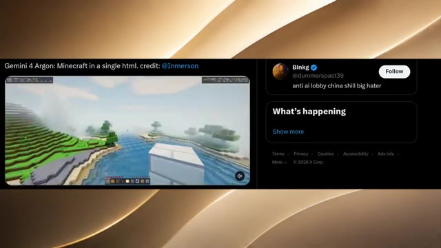
*Capture d'écran montrant l'interface d'une application de jeu Minecraft générée via Gemini 4 Argon, partagée sur les réseaux sociaux.*

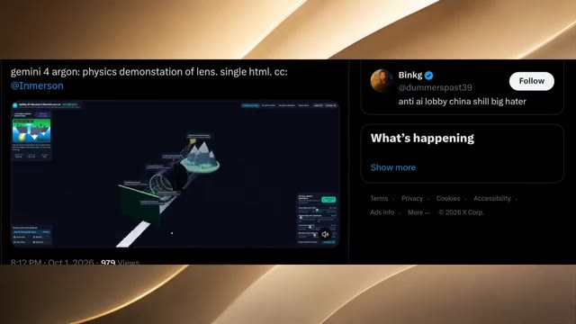
*Capture d'écran montrant une publication de simulation physique de lentille optique sur interface web, partagée sur un réseau social.*

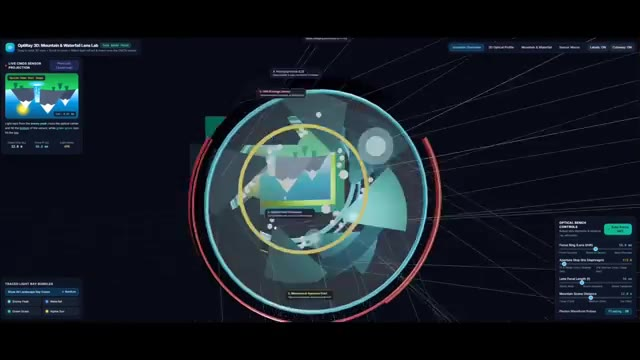
*Vue rapprochée et interactive de la simulation physique 3D d'une lentille optique (OptiRay 3D), montrant les éléments internes et les faisceaux lumineux.*

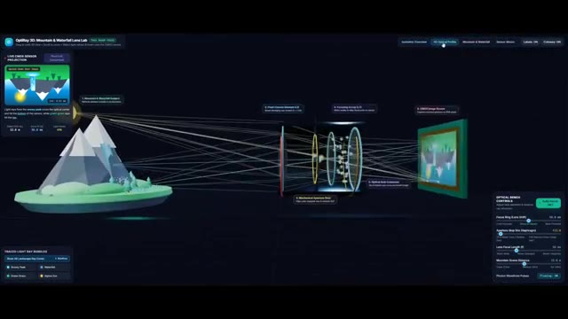
*Vue d'ensemble de la simulation OptiRay 3D illustrant la source lumineuse (montagne), les éléments de la lentille et le capteur CMOS.*

---

### ⏱️ `[00:02:29 - 00:03:04]` | Segment #06

**🔊 Audio (Transcription Intégrale Mot pour Mot en Français) :**
> Ce que j'aime vraiment dans cette démo, c'est que ce n'est pas seulement une jolie animation. Vous pouvez réellement vous déplacer dans la scène et inspecter les différentes parties de l'installation. Vous avez la lentille, les rayons lumineux, l'écran, les commandes sur le côté, et tout est présenté comme un environnement 3D interactif. Et si vous regardez de près, Argon visualise en fait les chemins de rayons individuels à travers le système. Donc, plutôt que de simplement dire, voici ce que fait une lentille, le modèle génère un petit environnement où l'on peut réellement voir la physique représentée. Maintenant, évidemment, je ne regarderais pas cela en me disant que Google a résolu la physique. Ce serait exagéré de manière excessive.

**👁️ Analyse Visuelle d'Écran (gemini-3.5-flash-lite) :**
**Interface & Outils** : Interface web interactive 'OptiRay 3D: Mountain & Waterfall Lens Lab' avec des panneaux de contrôle latéraux (Optical Bench Controls, Live CMOS Sensor Projection) et des options de navigation en haut de l'écran.

**Contenu textuel & Code** : Textes visibles : 'OptiRay 3D: Mountain & Waterfall Lens Lab', 'LIVE CMOS SENSOR PROJECTION', 'TRACES LIGHT RAY BUNDLES', 'OPTICAL BENCH CONTROLS', ainsi que des curseurs de réglage et des boutons de sélection de scènes (Snowy Peak, Waterfall, Green Grass, Alpine Sun).

**Action / Démonstration** : Exploration interactive d'un environnement 3D simulant la physique optique, avec affichage des chemins de rayons lumineux traversant un système de lentilles et frappant un capteur CMOS.

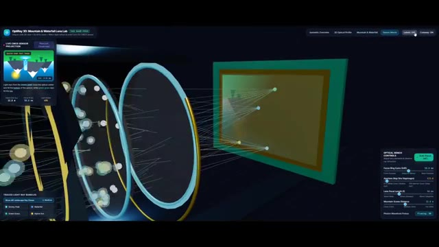
*Interface 3D interactive 'OptiRay 3D: Mountain & Waterfall Lens Lab' montrant des lentilles optiques et des faisceaux de rayons lumineux se propageant vers un écran.*

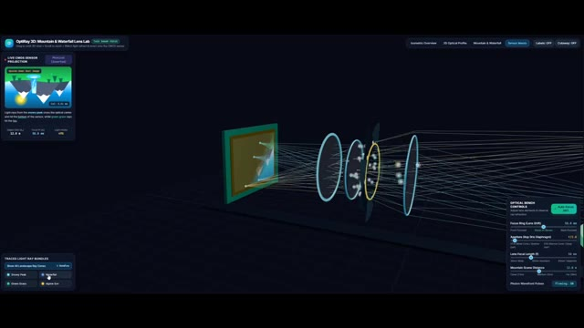
*Vue d'ensemble de l'environnement 3D interactif 'OptiRay 3D' montrant le système optique complet avec les lentilles, les rayons lumineux et l'écran de projection.*

---

### ⏱️ `[00:03:04 - 00:03:26]` | Segment #07

**🔊 Audio (Transcription Intégrale Mot pour Mot en Français) :**
> Il s'agit d'une simulation relativement contenue, et nous n'avons pas assez d'informations à partir de la seule démo pour savoir à quel point chaque calcul est physiquement précis. Mais ce n'est pas vraiment le sujet. Ce qui est intéressant, c'est qu'Argon ne se contente pas de générer une visualisation statique. Il crée la scène, les objets, les interactions et la représentation visuelle du système en un seul ensemble.

**👁️ Analyse Visuelle d'Écran (gemini-3.5-flash-lite) :**
**Interface & Outils** : Interface web de type réseau social (X / Twitter) affichant une publication avec une vidéo intégrée et des panneaux de contrôle de simulation physique.

**Contenu textuel & Code** : Texte du tweet : "gemini 4 argon: physics demonstration of lens. single html. cc: @Inmerson". Profil visible : "Binkg @dummerspast39".

**Action / Démonstration** : Présentation d'une simulation interactive en 3D d'un système optique avec des paramètres de contrôle physiques affichés à l'écran.

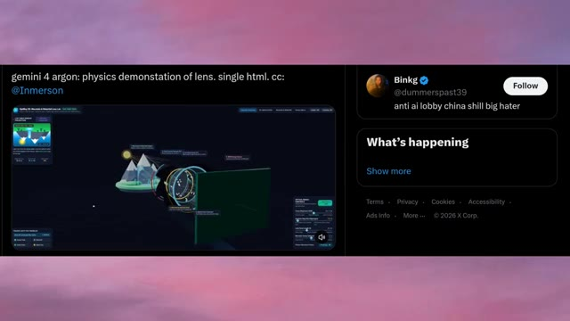
*Capture d'écran d'un tweet et d'une vidéo de démonstration montrant une simulation physique 3D d'une lentille optique avec l'interface d'Argon.*

---

### ⏱️ `[00:03:26 - 00:03:47]` | Segment #08

**🔊 Audio (Transcription Intégrale Mot pour Mot en Français) :**
> Et quand vous mettez cela à côté de cette démo de Minecraft, vous commencez à voir un schéma. Argon semble être particulièrement intéressant quand on lui donne quelque chose qui n'est pas seulement du texte ou du code, mais quelque chose qui doit exister et se comporter comme un environnement interactif réel. Et honnêtement, c'est la partie qui m'a donné envie de regarder les autres points de contrôle. Parce que le suivant adopte une approche complètement différente.

**👁️ Analyse Visuelle d'Écran (gemini-3.5-flash-lite) :**
**Interface & Outils** : Interface logicielle de démonstration 3D et écran de jeu Minecraft côte à côte sur fond violet.

**Contenu textuel & Code** : Fenêtres de visualisation 3D avec nœuds interconnectés, panneaux de configuration des paramètres à droite, et interface de jeu Minecraft avec barre d'inventaire et paysage en blocs.

**Action / Démonstration** : Visualisation comparative d'un modèle 3D abstrait et d'une simulation interactive de type Minecraft en temps réel.

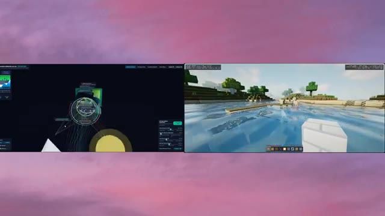
*Double affichage montrant à gauche une interface de visualisation 3D en réseau et à droite une session de jeu Minecraft en cours.*

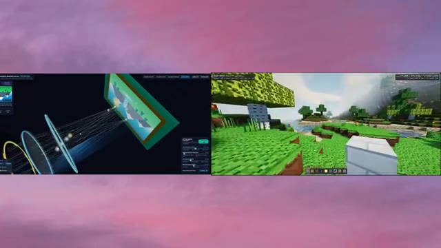
*Double affichage montrant à gauche une rotation de la visualisation 3D et à droite la progression de la caméra dans le monde Minecraft.*

---

### ⏱️ `[00:03:47 - 00:04:07]` | Segment #09

**🔊 Audio (Transcription Intégrale Mot pour Mot en Français) :**
> Ici, on ne demande pas du tout à Argon de simuler de la physique. On lui demande de recréer un vrai produit sous forme de SVG. Il s'agit d'une manette sans fil Xbox, et la page la décrit littéralement comme une étude vectorielle, avec une manette dessinée en code plutôt que simplement insérée comme une image normale. Et il y a quelques détails que j'aime vraiment ici.

**👁️ Analyse Visuelle d'Écran (gemini-3.5-flash-lite) :**
**Interface & Outils** : Navigateur web affichant un fil d'actualité X (Twitter) et une page web interactive de test vectoriel.

**Contenu textuel & Code** : Texte du tweet : "Xbox Controller SVG Gemini 4 Argon Checkpoint 1:". Sur la page web : "XBOX", "A VECTOR STUDY", "Xbox Wireless Controller", "Familiar form. Every detail, drawn in code.", "Download SVG".

**Action / Démonstration** : Présentation à l'écran d'une étude de cas vectorielle montrant une manette Xbox générée et dessinée en code SVG.

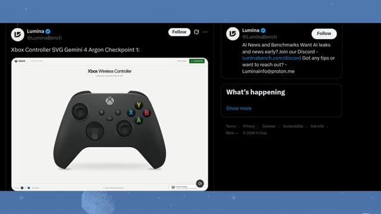
*Capture d'écran d'un tweet de LuminaBench présentant un test de manette Xbox SVG avec le modèle Gemini 4 Argon.*

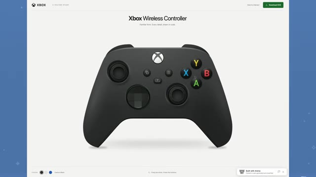
*Gros plan sur la page web montrant le rendu vectoriel d'une manette Xbox sans fil généré par code avec le texte "A Vector Study".*

---

### ⏱️ `[00:04:07 - 00:04:26]` | Segment #10

**🔊 Audio (Transcription Intégrale Mot pour Mot en Français) :**
> Vous pouvez voir le contrôleur rendu proprement sur la page, les boutons individuels et les sticks sont représentés, et tout en bas vous pouvez basculer entre différentes options de couleur, noir et blanc, et tout le contrôleur se met à jour avec. Il y a aussi un bouton de téléchargement SVG tout en haut. Ce n'est donc pas seulement qu'Argon génère une image d'une manette Xbox et en reste là.

**👁️ Analyse Visuelle d'Écran (gemini-3.5-flash-lite) :**
**Interface & Outils** : Interface web de présentation d'un modèle vectoriel Xbox et flux du réseau social X (Twitter).

**Contenu textuel & Code** : Texte affichant "Xbox Wireless Controller", "Download SVG", options de couleurs en bas ("Robot White", noir), et publication de @LuminaBench "Xbox Controller SVG Gemini 4 Argon Checkpoint 1:".

**Action / Démonstration** : Visualisation de la manette Xbox rendue avec précision avec ses boutons et options de changement de couleur.

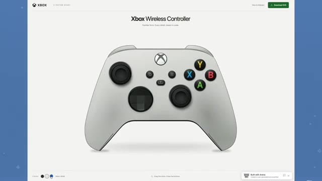
*Interface web montrant un rendu vectoriel détaillé d'une manette sans fil Xbox blanche avec des options de couleurs en bas et un bouton de téléchargement SVG en haut à droite.*

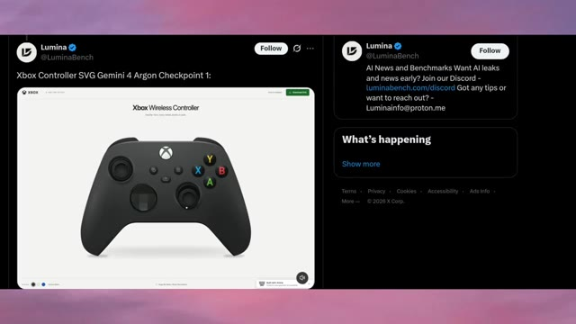
*Publication sur le réseau social X par LuminaBench montrant la manette Xbox en version noire générée via Gemini 4 Argon Checkpoint 1.*

---

### ⏱️ `[00:04:26 - 00:04:46]` | Segment #11

**🔊 Audio (Transcription Intégrale Mot pour Mot en Français) :**
> Il génère une véritable représentation web basée sur des vecteurs de l'objet avec laquelle vous pouvez interagir. Et c'est là que les points de contrôle commencent à devenir intéressants pour moi. Et honnêtement, nous n'en sommes toujours pas au point de contrôle le plus fou, car ce prochain est probablement la démonstration à laquelle je prêterais le plus d'attention. Ici, Argon est essentiellement utilisé pour construire un terrain de jeu pour la physique de l'eau.

**👁️ Analyse Visuelle d'Écran (gemini-3.5-flash-lite) :**
**Interface & Outils** : Navigateur web affichant un flux X (Twitter) avec des publications intégrant des captures d'écran de démonstrations techniques d'intelligence artificielle (manette Xbox SVG et simulation de physique de l'eau).

**Contenu textuel & Code** : Texte du tweet de Lumina : "Xbox Controller SVG Gemini 4 Argon Checkpoint 1:". Interface de simulation interactive montrant une manette Xbox sans fil vectorielle et une interface de simulation de physique de l'eau avec des panneaux de configuration latéraux.

**Action / Démonstration** : Le présentateur commente des exemples de publications sur les réseaux sociaux montrant les capacités de génération de vecteurs et de physique de l'eau d'Argon.

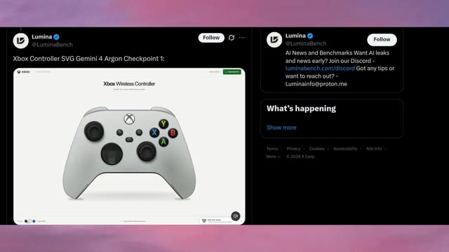
*Capture d'écran montrant un tweet du compte Lumina (@LuminaBench) présentant une manette Xbox en SVG générée avec Gemini 4 Argon Checkpoint 1.*

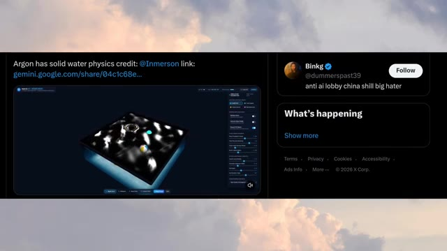
*Capture d'écran montrant un tweet présentant une simulation de physique de l'eau avec Argon, montrant une interface interactive de type terrain de jeu aquatique.*

---

### ⏱️ `[00:04:46 - 00:05:08]` | Segment #12

**🔊 Audio (Transcription Intégrale Mot pour Mot en Français) :**
> Vous avez ce réservoir transparent, avec plusieurs objets qui flottent à l'intérieur, et ensuite vous pouvez réellement modifier la simulation grâce aux commandes situées sur la droite. Et la partie géniale, c'est que la vidéo ne montre pas juste un seul préréglage. Vous pouvez voir l'eau se comporter différemment à mesure que la scène change. La caméra se déplace autour du réservoir, les objets interagissent avec la surface, et la simulation continue de tourner pendant que les paramètres sont ajustés.

**👁️ Analyse Visuelle d'Écran (gemini-3.5-flash-lite) :**
**Interface & Outils** : Logiciel de simulation 3D de fluides (AquaLab GPU) doté d'un panneau de contrôle latéral pour les paramètres de simulation, d'éclairage et de dynamique des vagues.

**Contenu textuel & Code** : Panneau latéral « SIMULATION PARAMETERS », préréglages d'éclairage (Tivoli Pool, Coral Lagoon, Golden Sunset, Bioluminescent), curseurs pour la vitesse de propagation des vagues, la viscosité, l'intensité des caustiques, et boutons de contrôle en bas (Ripple Brush, Whirlpool, Wave Pulse, Camera Orbit, Mega Plunge, Calm).

**Action / Démonstration** : Visualisation d'une simulation en temps réel d'un bac d'eau avec des objets flottants colorés, dont la surface est agitée par des vagues.

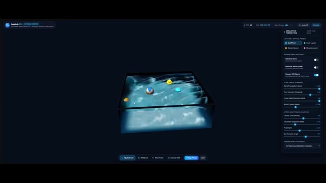
*Interface de simulation 3D montrant un réservoir d'eau transparent avec des objets flottants et un panneau de configuration des paramètres sur la droite.*

---

### ⏱️ `[00:05:08 - 00:05:31]` | Segment #13

**🔊 Audio (Transcription Intégrale Mot pour Mot en Français) :**
> Et à un moment donné, il change même la visualisation pour que vous puissiez voir l'eau d'une manière complètement différente, ce qui rend beaucoup plus facile de voir ce qui se passe sous la surface. Et c'est le genre de démo où je pense que l'interactivité importe plus que les graphismes. Parce qu'Argon ne génère pas seulement une jolie animation d'eau, il génère la simulation et les contrôles autour, vous donnant fondamentalement quelque chose avec lequel vous pouvez expérimenter.

**👁️ Analyse Visuelle d'Écran (gemini-3.5-flash-lite) :**
**Interface & Outils** : Interface de simulation Argon (Aquat.lab GPU) avec panneau de contrôle latéral et outils de manipulation.

**Contenu textuel & Code** : Panneau latéral affichant les paramètres de simulation (« SIMULATION PARAMETERS »), des préréglages d'éclairage (« LIGHTING & OPTICAL PRESET » : Gulf Pool, Coral Lagoon, Golden Sunset, Bioluminescent), des options de vagues (« Wave Propagation Speed », « Fluid Viscosity Damping », « Ocean Swell Direction Slick »), ainsi que des boutons de contrôle interactifs en bas (Route Brush, Whirlpool, Wave Pulse, Camera Orbit, Mega Plunge, Calm).

**Action / Démonstration** : Visualisation d'une simulation 3D interactive d'un plan d'eau rectangulaire contenant des objets flottants (canards en plastique et sphères colorées), avec affichage de la structure sous-surface.

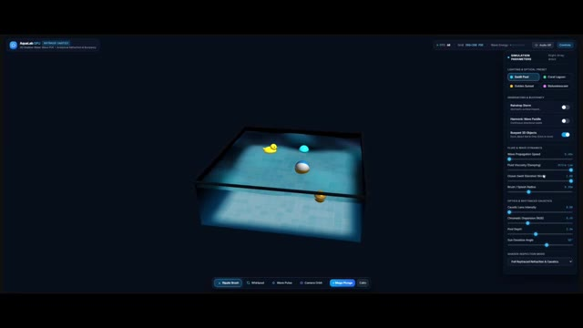
*Interface du logiciel de simulation d'eau Argon montrant un bassin 3D avec des objets flottants et des paramètres de simulation ajustables.*

---

### ⏱️ `[00:05:31 - 00:05:56]` | Segment #14

**🔊 Audio (Transcription Intégrale Mot pour Mot en Français) :**
> Et c'est un problème bien plus difficile que de simplement générer une image d'eau. Maintenant, je ne prendrais pas cette démo comme la preuve qu'Argon possède un simulateur de fluides parfait et physiquement exact. Nous n'avons pas assez de précisions ici pour l'affirmer. Mais en tant que démonstration intermédiaire, c'est plutôt intéressant. Parce que nous avons maintenant vu Argon générer un environnement 3D semblable à un jeu, une simulation de lentille, une étude de produit au format SVG, et enfin une simulation interactive de fluides.

**👁️ Analyse Visuelle d'Écran (gemini-3.5-flash-lite) :**
**Interface & Outils** : Interface logicielle d'Argon montrant différents modules de démonstration : simulation de fluides (AquasLab), environnement 3D interactif et outils de développement.

**Contenu textuel & Code** : Paramètres de simulation (vitesse de propagation des ondes, viscosité), interfaces graphiques de jeu 3D, page produit de manette Xbox, et outils de rendu.

**Action / Démonstration** : Présentation des différentes capacités d'Argon à travers des démonstrations visuelles successives de simulations physiques et d'environnements 3D.

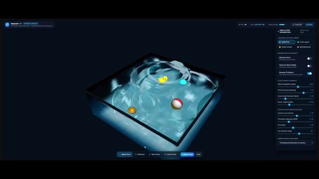
*Simulation interactive de fluides 3D avec des objets flottants (canard, balles) et un panneau de paramètres à droite.*

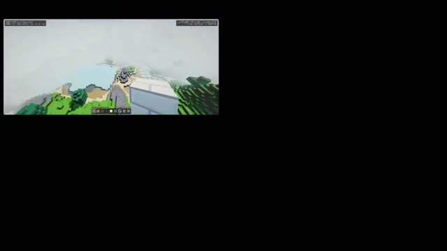
*Environnement 3D interactif semblable à un jeu vidéo inspiré de Minecraft affiché en haut à gauche.*

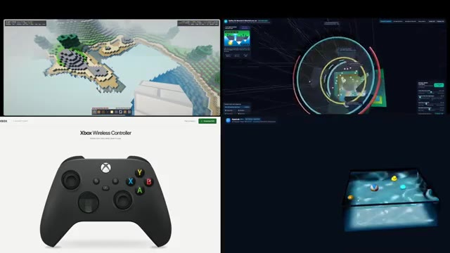
*Vue en mosaïque présentant plusieurs démos d'Argon : un jeu 3D, une interface de nœuds/lentille, une manette Xbox et la simulation de fluides.*

---

### ⏱️ `[00:05:56 - 00:06:29]` | Segment #15

**🔊 Audio (Transcription Intégrale Mot pour Mot en Français) :**
> Et à ce stade, je commence à comprendre pourquoi les gens s'enthousiasment pour ces points de contrôle. Ils ne font pas tous le même tour de passe-passe. montrant Argon gérant des types de problèmes visuels interactifs complètement différents. Et cela nous amène en fait à quelque chose qui, à mon avis, est encore plus intéressant, parce que nous nous éloignons maintenant des jeux et de la physique pour entrer dans l'ingénierie. Regardez ce qui se passe ici. Ce n'est pas une autre démo de jeu, et ce n'est pas juste une animation 3D tape-à-l'œil. Nous examinons un environnement d'ingénierie assez compliqué, et le modèle transforme toutes ces informations en quelque chose que vous pouvez réellement regarder

**👁️ Analyse Visuelle d'Écran (gemini-3.5-flash-lite) :**
**Interface & Outils** : Logiciel de simulation 3D Apex Fab (Daylight Precision) et interface de contrôle avec navigation 3D, barres d'échelle (Scale Continuum) et fenêtres d'infrastructure.

**Contenu textuel & Code** : Textes visibles : "APEX FAB", "DAYLIGHT PRECISION", "Campus & Fab Facilities", "Tools & Lithography", "Scale Continuum (10¹ to 10⁻¹² m)", "Automated Overhead Hoist Transport (OHT / AMHS)", "Physical Equation / Principle : WIP = TH \times CT", "Gemini-4.0-Pro".

**Action / Démonstration** : Le modèle 3D interactif d'une usine de fabrication de semi-conducteurs s'affiche avec des options de navigation et d'exploration en vue éclatée.

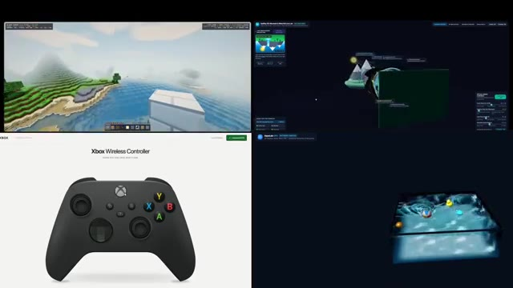
*Interface multi-fenêtres montrant une simulation de jeu interactive, un modèle 3D vectoriel et une manette Xbox sans fil.*

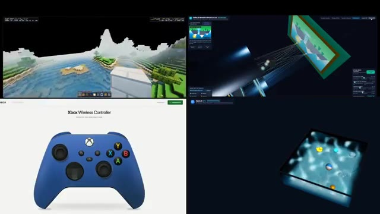
*Interface multi-fenêtres avec une vue interactive de type Minecraft et une manette Xbox bleue.*

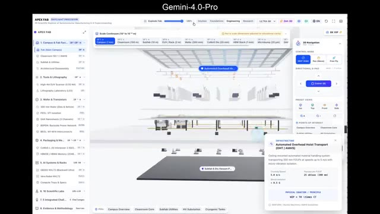
*Interface logicielle Apex Fab montrant une vue éclatée 3D complexe d'un environnement d'ingénierie (salle blanche/semi-conducteurs).*

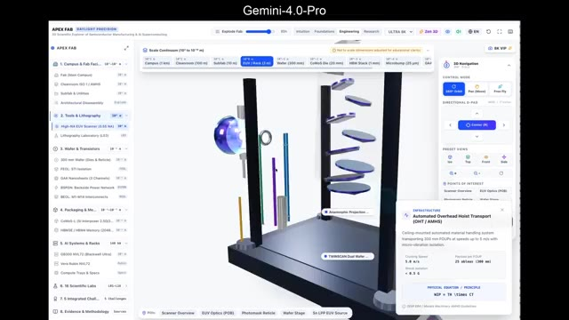
*Interface Apex Fab montrant une vue 3D détaillée et éclatée des équipements de fabrication de semi-conducteurs.*

---

### ⏱️ `[00:06:29 - 00:06:58]` | Segment #16

**🔊 Audio (Transcription Intégrale Mot pour Mot en Français) :**
> à, faire pivoter, inspecter et comprendre de manière spatiale. Vous pouvez voir différents composants mis en surbrillance, des informations qui apparaissent à côté d'eux, et l'ensemble du système présenté presque comme un modèle interactif de la réalité. Et honnêtement, c'est là que je pense qu'il y a une histoire beaucoup plus importante. Parce qu'imaginez essayer de comprendre un système de fabrication compliqué, F, à partir d'un manuel. Vous avez des diagrammes, des paragraphes, des flèches pointant partout, et vous essayez fondamentalement de construire le tout dans votre tête.

**👁️ Analyse Visuelle d'Écran (gemini-3.5-flash-lite) :**
**Interface & Outils** : Logiciel de visualisation 3D et d'ingénierie nommé "APEX FAB" affichant des structures de fabrication de semi-conducteurs, avec des menus de navigation latérale et des panneaux d'information détaillés.

**Contenu textuel & Code** : Menus de navigation (Campus & Fab Facilities, Tools & Lithography, High-NA EUV Scanner, Wafer & Transistors, Packaging & Memory, AI Systems & Racks), commandes de navigation 3D à droite (Control Mode, Directional D-Pad, Preset Views, Points of Interest), et une infobulle sur l'infrastructure ("Automated Overhead Hoist Transport").

**Action / Démonstration** : Le modèle 3D d'un système de fabrication de semi-conducteurs est présenté avec des éléments éclatés, des infobulles informatives et des composants mis en surbrillance pour une inspection spatiale.

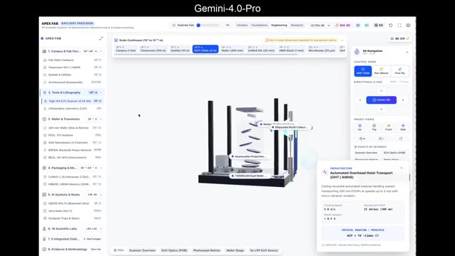
*Interface interactive d'un modèle 3D de fabrication de semi-conducteurs montrant des composants de lithographie en cours d'inspection spatiale.*

---

### ⏱️ `[00:06:58 - 00:07:20]` | Segment #17

**🔊 Audio (Transcription Intégrale Mot pour Mot en Français) :**
> Mais avec un environnement interactif comme celui-ci, vous pouvez réellement voir les composants les uns par rapport aux autres. Vous pouvez pivoter le modèle, vous pouvez isoler différentes pièces, vous pouvez consulter les informations attachées à un composant spécifique, et soudain, quelque chose qui n'était qu'un tas de termes techniques devient quelque chose que vous pouvez réellement explorer. Maintenant, je ne veux pas exagérer et dire qu'Argon a complètement réinventé l'éducation.

**👁️ Analyse Visuelle d'Écran (gemini-3.5-flash-lite) :**
**Interface & Outils** : Application web interactive APEX FAB (Explorateur 3D scientifique de fabrication de semi-conducteurs et superinformatique).

**Contenu textuel & Code** : Menus de navigation latérale (Lithography Laboratories, Wafer & Transistors, AI Systems & Racks, 3D Navigation), curseur d'échelle (Scale Continuum), informations contextuelles sur la "Coolant Distribution Unit (CDU)" et l'"Automated Overhead Hoist Transport (OHT / AMHS)", équations physiques et spécifications techniques.

**Action / Démonstration** : Navigation interactive et exploration 3D des composants d'une installation de haute technologie, avec affichage des fiches d'information associées.

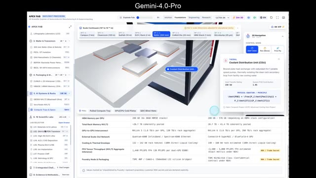
*Interface 3D interactive APEX FAB montrant les détails techniques des composants de serveurs et des informations de refroidissement.*

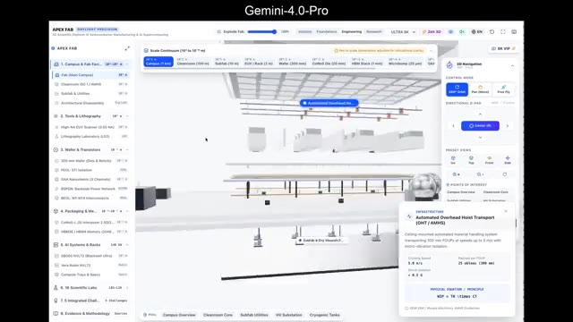
*Vue éclatée du modèle 3D sur APEX FAB illustrant la navigation et l'isolation des différents niveaux d'infrastructure.*

---

### ⏱️ `[00:07:20 - 00:07:42]` | Segment #18

**🔊 Audio (Transcription Intégrale Mot pour Mot en Français) :**
> Nous n'avons pas assez de preuves pour cela. Mais je pense que cela pointe vers une direction vraiment intéressante. Et si, au lieu que l'intelligence artificielle se contente de vous expliquer un concept compliqué, elle pouvait construire une version interactive de ce concept et vous laisser apprendre en l'explorant ? Et c'est une façon très différente de penser à un tuteur IA. Parce que vous ne lisez pas seulement l'explication, vous interagissez avec l'explication.

**👁️ Analyse Visuelle d'Écran (gemini-3.5-flash-lite) :**
**Interface & Outils** : Apex Fab (Explorateur 3D scientifique de fabrication de semi-conducteurs et d'IA)

**Contenu textuel & Code** : Menus de navigation de l'interface incluant 'Campus & Fab', 'Tools & Lithography', 'Wafer & Transistors', 'Packaging & M...', 'AI Systems & Racks', ainsi que des panneaux de spécifications physiques avec équations et métriques (ex: 'Ellipsoidal Mo/Si Collector Mirror', 'Gate-All-Around (GAA) Nanosheet Channels', '12/16-High HBM4 Memory Stack').

**Action / Démonstration** : Navigation et exploration interactive de modèles 3D complexes de fabrication de semi-conducteurs à différentes échelles.

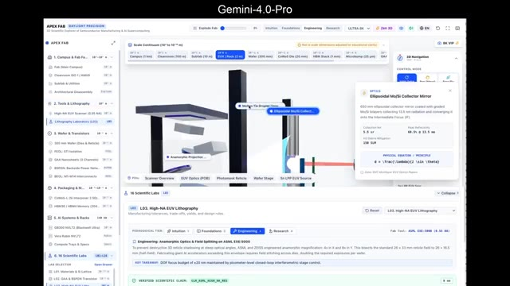
*Interface interactive d'Apex Fab montrant une vue 3D détaillée de la lithographie EUV avec des fiches d'information scientifiques.*

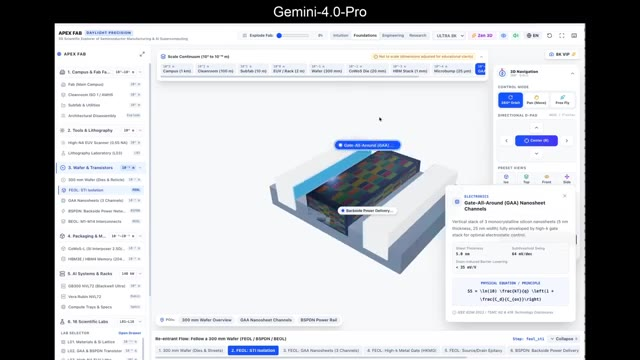
*Navigation 3D sur l'interface Apex Fab affichant les détails d'un transistor Gate-All-Around (GAA) Nanosheet.*

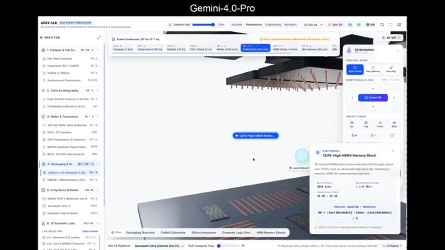
*Visualisation 3D interactive dans Apex Fab montrant l'empilement de mémoire HBM4 et les spécifications techniques associées.*

---

### ⏱️ `[00:07:42 - 00:08:02]` | Segment #19

**🔊 Audio (Transcription Intégrale Mot pour Mot en Français) :**
> Et cette idée devient encore plus intéressante avec la prochaine démo. Parce que maintenant, nous parlons d'apprendre réellement l'anatomie. Cette démo est fondamentalement un laboratoire d'anatomie vétérinaire interactif. Vous pouvez basculer entre les animaux, retirer différentes couches anatomiques, isoler les organes et les muscles, faire pivoter le modèle et même obtenir des étiquettes et des explications pour chaque structure individuelle.

**👁️ Analyse Visuelle d'Écran (gemini-3.5-flash-lite) :**
**Interface & Outils** : Apex Fab (logiciel d'exploration 3D) et VetAnat (application interactive d'anatomie vétérinaire).

**Contenu textuel & Code** : Menus de navigation de structures 3D, barres d'outils de contrôle de caméra, échelles de magnitude, descriptions textuelles détaillées de structures anatomiques et de composants matériels.
[Vues 3D interactives, manipulation de modèles anatomiques et techniques avec sélection de couches et affichage d'informations détaillées.]

**Action / Démonstration** : Démonstration pédagogique et présentation du workflow.

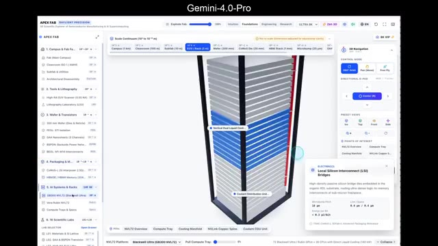
*Interface logicielle Apex Fab montrant l'explorateur scientifique 3D d'une fabrication de semi-conducteurs et superinformatique IA.*

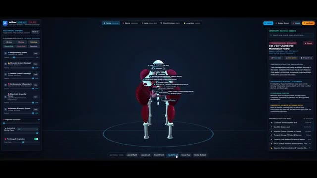
*Interface interactive de laboratoire d'anatomie vétérinaire VetAnat montrant un modèle 3D annoté avec des couches anatomiques et des étiquettes descriptives.*

---

### ⏱️ `[00:08:02 - 00:08:21]` | Segment #20

**🔊 Audio (Transcription Intégrale Mot pour Mot en Français) :**
> Et j'ai vérifié les explications affichées dans la vidéo, et ce n'est manifestement pas absurde. Par exemple, la section sur les oiseaux reflète correctement certaines différences aviaires importantes, comme le cœur à quatre cavités et l'arc aortique droit, et elle note que les oiseaux n'ont pas de diaphragme de style mammalien. Maintenant, le modèle 3D lui-même est clairement stylisé pour l'enseignement.

**👁️ Analyse Visuelle d'Écran (gemini-3.5-flash-lite) :**
**Interface & Outils** : VetAnat (logiciel d'anatomie vétérinaire 3D) affichant un modèle interactif avec des menus latéraux pour les systèmes anatomiques, les couches, et un panneau d'examen textuel.

**Contenu textuel & Code** : On observe le titre "VetAnat" en haut à gauche, des onglets de sélection d'espèces (Canine, Equine, Avian, etc.), un modèle 3D central transparent montrant le système circulatoire et respiratoire, et des blocs de texte descriptifs sur les structures anatomiques et les fonctions physiologiques dans le panneau de droite.

**Action / Démonstration** : Le modèle 3D est affiché à l'écran, démontrant l'anatomie interne d'un animal (probablement un oiseau selon le contexte audio) avec des explications textuelles interactives.

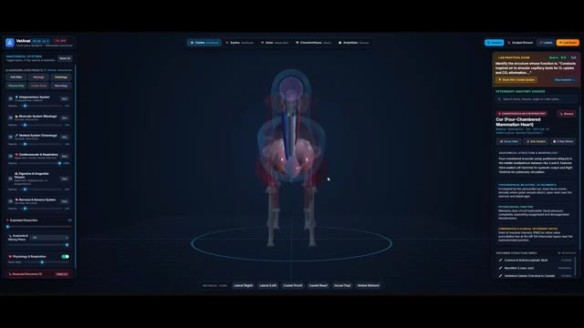
*Interface du logiciel de modélisation anatomique VetAnat montrant un modèle 3D d'animal avec des panneaux d'information détaillés sur l'anatomie et la physiologie.*

---

### ⏱️ `[00:08:21 - 00:08:49]` | Segment #21

**🔊 Audio (Transcription Intégrale Mot pour Mot en Français) :**
> Certaines structures sont exagérées, simplifiées ou séparées de leur position anatomique normale pour que vous puissiez réellement les voir. Je n'utiliserais donc pas cela comme un remplacement d'un véritable atlas anatomique ou d'une dissection, mais comme interface d'apprentissage, c'est vraiment intéressant. Car au lieu de regarder un schéma plat et d'essayer de se souvenir, d'accord, où exactement est ce muscle déjà, vous pouvez littéralement faire pivoter l'animal, isoler le système, cliquer sur une structure et demander au modèle d'expliquer ce que vous regardez.

**👁️ Analyse Visuelle d'Écran (gemini-3.5-flash-lite) :**
**Interface & Outils** : VetAnat (logiciel d'anatomie vétérinaire 3D basé sur l'IA)

**Contenu textuel & Code** : Modèle 3D interactif d'un oiseau avec les systèmes anatomiques listés dans le panneau de gauche (Integumentary System, Muscular System, Skeletal System, Cardiovascular & Respiratory, etc.) et des informations textuelles détaillées dans le panneau de droite.

**Action / Démonstration** : Le curseur de la souris survole et sélectionne différentes vues de l'anatomie aviaire dans l'interface interactive du logiciel.

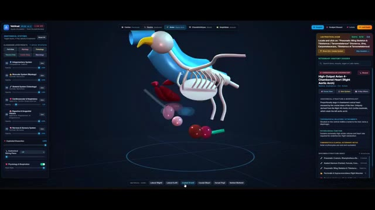
*Interface du logiciel VetAnat montrant un modèle 3D simplifié de l'anatomie d'un oiseau avec des options de sélection des systèmes anatomiques.*

---

### ⏱️ `[00:08:49 - 00:09:14]` | Segment #22

**🔊 Audio (Transcription Intégrale Mot pour Mot en Français) :**
> Et c'est ce que je voulais dire quand je disais qu'Argon pouvait nous offrir une nouvelle façon d'apprendre des choses complexes. Il ne se contente pas de répondre à votre question, il construit quelque chose à partir duquel vous pouvez apprendre. Et après avoir vu tous ces exemples, nous arrivons enfin à la partie qui semble absolument insensée. Mais c'est aussi là que je ralentirais un peu. Il y a une publication qui circule affirmant que Gemini 4 Argon a trouvé une faille de sécurité grave dans un logiciel hospitalier que d'autres modèles ont manquée.

**👁️ Analyse Visuelle d'Écran (gemini-3.5-flash-lite) :**
**Interface & Outils** : Logiciel VetAnat (interface sombre avec menus de couches anatomiques et panneaux latéraux) et interface Argon Console affichant des données et graphiques 3D.

**Contenu textuel & Code** : Texte à l'écran : "Before launch, Google put it to work internally too -rewrote 800,000+ lines of its own OS... Context window jumped to 1 million tokens... On DeepSWE... posted a state of the art 77.9%... Disclaimer: this footage may be staged, edited, or AI-generated, its origin is unconfirmed". Interface VetAnat avec options (Full Axis, Myology, Osteology, etc.) et informations sur le système cardiorespiratoire.

**Action / Démonstration** : Navigation et visualisation interactive d'un modèle anatomique 3D d'un animal, puis affichage d'un panneau textuel listant des statistiques de performance d'un modèle d'IA aux côtés d'une console d'analyse.

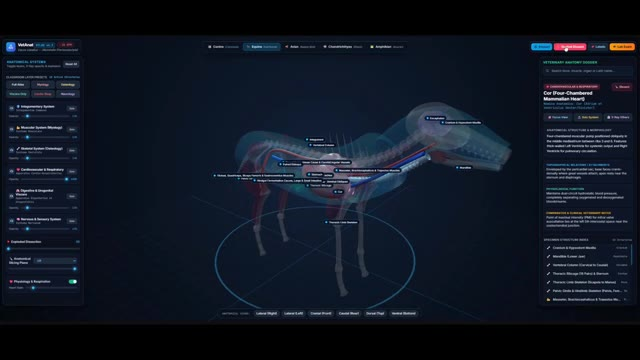
*Interface interactive d'anatomie vétérinaire 3D (VetAnat) montrant un modèle transparent de cheval avec des structures organiques et des étiquettes descriptives.*

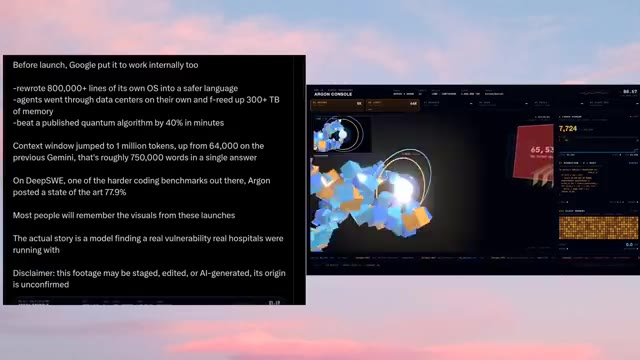
*Vue combinée montrant un texte listant les performances internes de Google et une console de visualisation 3D (Argon Console).*

---

### ⏱️ `[00:09:14 - 00:09:36]` | Segment #23

**🔊 Audio (Transcription Intégrale Mot pour Mot en Français) :**
> Et la publication va encore plus loin, affirmant des choses comme plus de 800 000 lignes de code réécrites, plus de 300 téraoctets de mémoire explorés, une amélioration de 40 % par rapport à un algorithme quantique, une fenêtre contextuelle d'un million de jetons, et un score Deep STUBWE de 77,9 %. Ces chiffres semblent fous, mais il y a un détail très important tout au bas de cette publication.

**👁️ Analyse Visuelle d'Écran (gemini-3.5-flash-lite) :**
**Interface & Outils** : Interface logicielle nommée "Argon Console" affichée en parallèle d'un texte descriptif sur fond noir.

**Contenu textuel & Code** : Texte de gauche listant : "-rewrote 800,000+ lines of its own OS", "300+ TB of memory", "40% improvement over a quantum algorithm", "1 million token context window", "77.9% deep STUBWE score". Interface Argo Console avec graphiques de données et visualisations en 3D.

**Action / Démonstration** : Affichage simultané d'un texte détaillant des statistiques techniques impressionnantes et d'une interface console futuriste avec des animations de données.

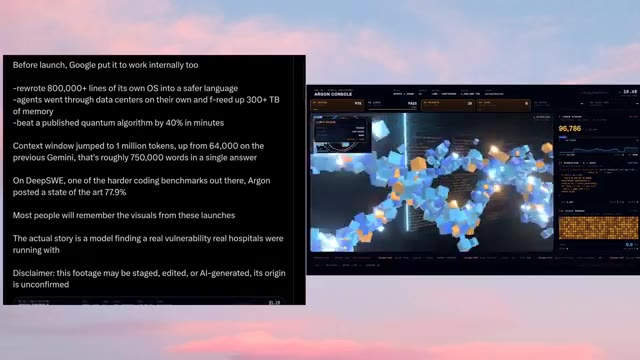
*Capture d'écran montrant à gauche un texte listant les performances d'un modèle et à droite l'interface "Argon Console" avec des visualisations 3D de blocs de données.*

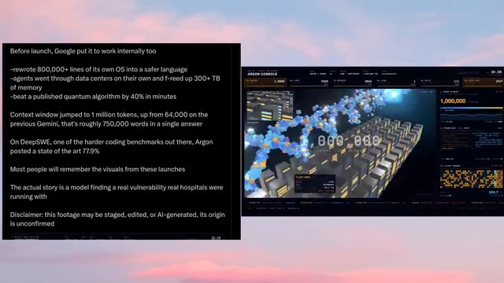
*Capture d'écran montrant à gauche le même texte descriptif et à droite l'interface "Argon Console" affichant "1,000,000" au cœur d'une représentation graphique de serveurs et de données.*

---

### ⏱️ `[00:09:36 - 00:10:07]` | Segment #24

**🔊 Audio (Transcription Intégrale Mot pour Mot en Français) :**
> La séquence vidéo est explicitement décrite comme potentiellement mise en scène, éditée ou générée par IA, et son origine n'est pas confirmée. Je ne présenterais donc pas la vulnérabilité de l'hôpital ou ces chiffres de référence comme des faits confirmés sur la seule base de cette publication. Mais il y a tout de même quelque chose d'intéressant ici, car si Argon peut réellement fonctionner à ce niveau, en particulier lorsqu'il s'agit d'analyser d'immenses bases de code, de trouver des problèmes de sécurité et d'évoluer dans des environnements techniques complexes, cela relèverait d'une catégorie de capacités complètement différente des démonstrations visuelles que nous venons de voir.

**👁️ Analyse Visuelle d'Écran (gemini-3.5-flash-lite) :**
**Interface & Outils** : Interface logicielle futuriste nommée « Argon Console » avec graphiques 3D de données, flux de code, panneaux de métriques (Token Stream, Fleet Memory) et affichage de texte superposé.

**Contenu textuel & Code** : Texte à gauche listant des statistiques sur Argon (réécriture de lignes de code, augmentation de la fenêtre contextuelle à 1 million de jetons, benchmarks DeepSWE). Sur la console : « RUN #1 : SINGLE TRAJECTORY », « MODEL: GEMINI 4 ARGON », « 65,536 MAX OUTPUT TOKENS », « TOKEN STREAM », « FLEET MEMORY », « DISCLAIMER: this footage may be staged, edited, or AI-generated ».

**Action / Démonstration** : Visualisation interactive d'un flux de données et de code au sein d'une interface de console de modélisation ou d'IA sophistiquée.

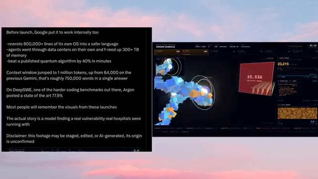
*Affichage simultané d'un bloc de texte listant les performances d'Argon et d'une interface de console futuriste en 3D (« Argon Console »).*

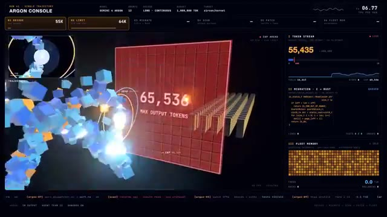
*Gros plan sur l'interface « Argon Console » montrant des visualisations de données 3D avec des blocs et des métriques de jetons (65,536 max output tokens).*

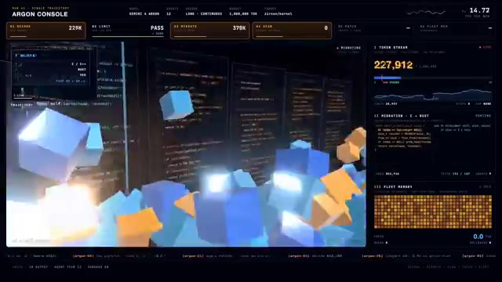
*L'interface « Argon Console » en action affichant des flux de code en arrière-plan et des visualisations de flux de jetons.*

---

### ⏱️ `[00:10:07 - 00:10:29]` | Segment #25

**🔊 Audio (Transcription Intégrale Mot pour Mot en Français) :**
> Et c'est en fait ce que je veux examiner ensuite, car nous avons vu Argon construire des mondes interactifs, simuler de la physique, reconstruire des objets et créer des environnements éducatifs. Maintenant, nous voyons des affirmations concernant l'ingénierie logicielle et la recherche en sécurité dans le monde réel, et si ne serait-ce qu'une partie de ces affirmations s'avère légitime, alors Argon en tant que dragon ne semble soudain plus aussi ridicule qu'au début.

**👁️ Analyse Visuelle d'Écran (gemini-3.5-flash-lite) :**
**Interface & Outils** : Console de développement Argon et interfaces de simulation de mondes virtuels interactifs en 3D.

**Contenu textuel & Code** : Texte à l'écran : "ARGON CONSOLE", "RUN 41 - SINGLE TRAJECTORY", "MODEL: GEMINI 4 ARGON", "FINDING: CRITICAL - DATA: PATIENT RECORDS - STATUS: OPEN", lignes de code source et indicateurs de performance (18.72 TPS).

**Action / Démonstration** : Démonstration visuelle des capacités d'Argon à travers des interfaces de code et des environnements virtuels interactifs générés, appuyant le discours sur l'ingénierie logicielle et la simulation de mondes.

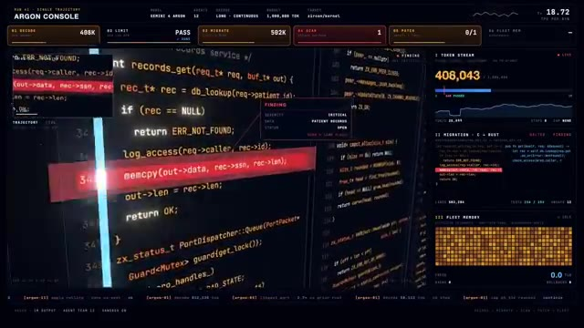
*Interface de la console Argon affichant des lignes de code, des alertes de sécurité et des métriques de performance en temps réel.*

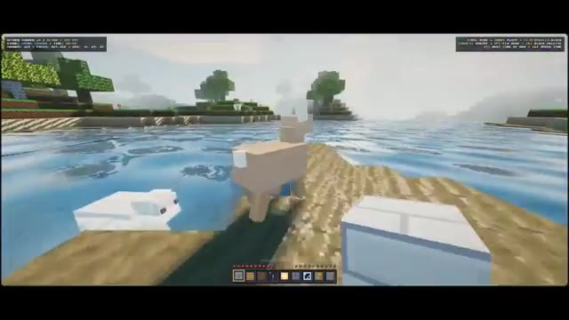
*Vue subjective interactive d'un monde virtuel de style Minecraft généré par IA, montrant des animaux et des blocs.*

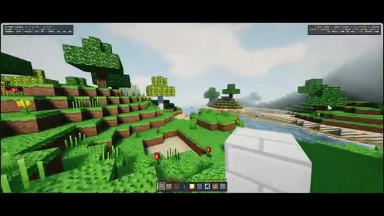
*Vue panoramique d'un environnement virtuel interactif en monde ouvert de type jeu vidéo avec végétation et relief.*

*Illustration humoristique montrant le mème du dragon à trois têtes (le fameux dragon mal dessiné), illustrant métaphoriquement le sujet.*

---

### ⏱️ `[00:10:29 - 00:10:48]` | Segment #26

**🔊 Audio (Transcription Intégrale Mot pour Mot en Français) :**
> Nous attendons toujours de voir à quoi ressemblera le modèle public final, à quel point il est fiable, et si ces points de contrôle fuite se traduisent par des performances dans le monde réel. Mais si Google peut intégrer ne serait-ce qu'une grande partie de cette capacité dans la version finale, Gemini 4 va être très, très intéressant. Quoi qu'il en soit, c'est ce que j'ai trouvé dans ces points de contrôle d'Argon.

**👁️ Analyse Visuelle d'Écran (gemini-3.5-flash-lite) :**
**Interface & Outils** : Logiciel de simulation 3D de fluides (AquatLab GPU) avec des panneaux de contrôle des paramètres de simulation à droite et des outils de brosse en bas.

**Contenu textuel & Code** : On peut lire des libellés de paramètres tels que "Simulation Parameters", "Lighting & Optical Preset", "Fluid & Wave Dynamics", "Wave Propagation Speed", "Fluid Viscosity Damping", ainsi que des options de préréglages comme "Snell Pool", "Coral Lagoon", "Golden Sunset", etc. Au centre, un rendu 3D d'un bassin carré contenant de l'eau et plusieurs petits objets (balles, canard).

**Action / Démonstration** : Le créateur montre une interface de simulation visuelle en 3D avec des réglages de dynamique des fluides et de réfraction de la lumière.

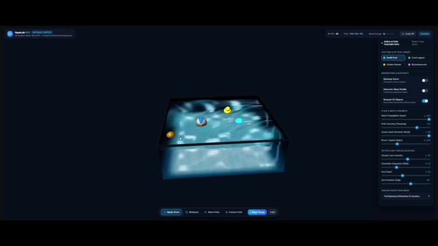
*Interface d'un logiciel de simulation 3D montrant un bassin d'eau avec des objets flottants et des paramètres de réglage à droite.*

---

### ⏱️ `[00:10:48 - 00:10:59]` | Segment #27

**🔊 Audio (Transcription Intégrale Mot pour Mot en Français) :**
> Si vous avez apprécié ce genre d'analyse approfondie, abonnez-vous à Pursuing AI car dès que Argon sera accessible au public, je vais le tester correctement, pas seulement regarder les démos tape-à-l'œil. Je vous dis à la prochaine.

**👁️ Analyse Visuelle d'Écran (gemini-3.5-flash-lite) :**
**Interface & Outils** : Logiciel de simulation 3D OptiRay 3D (Mountain & Waterfall Lens Lab), affichant un espace de travail en trois dimensions avec des graphiques vectoriels et des panneaux de contrôle latéraux.

**Contenu textuel & Code** : On observe le titre "OptiRay 3D: Mountain & Waterfall Lens Lab" en haut à gauche, un panneau "LIVE CMOS SENSOR PROJECTION" avec des graphiques de montagnes et de soleil, ainsi qu'un panneau latéral à droite "OPTICAL BENCH CONTROLS" comprenant des curseurs et des boutons de réglage (Focus Ring Gain, Aperture Stop, etc.). Des lignes géométriques blanches et des cercles concentriques colorés (bleu, jaune, rouge) modélisent la trajectoire des rayons lumineux au centre de l'écran.

**Action / Démonstration** : Visualisation d'une simulation optique tridimensionnelle complexe montrant le comportement des rayons lumineux à travers différents plans et capteurs virtuels.

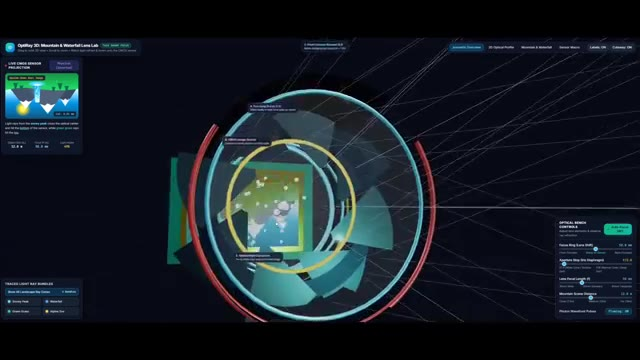
*Interface 3D interactive d'OptiRay 3D illustrant une simulation de lancer de rayons (ray tracing) avec des cercles concentriques et des contrôles optiques.*

---
